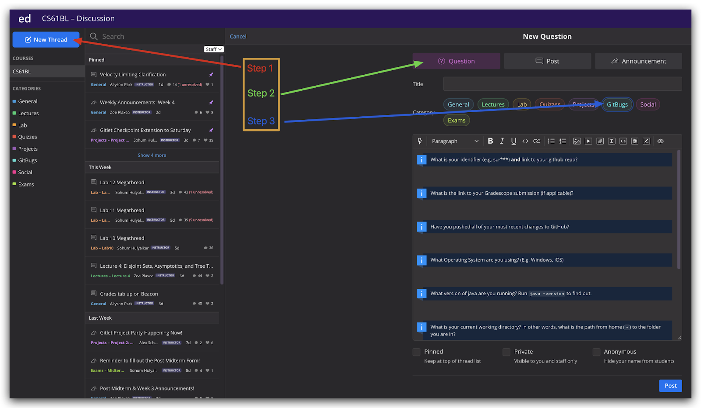
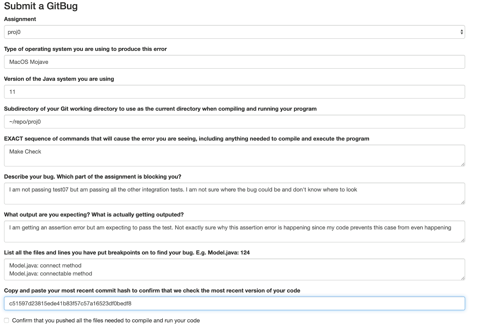
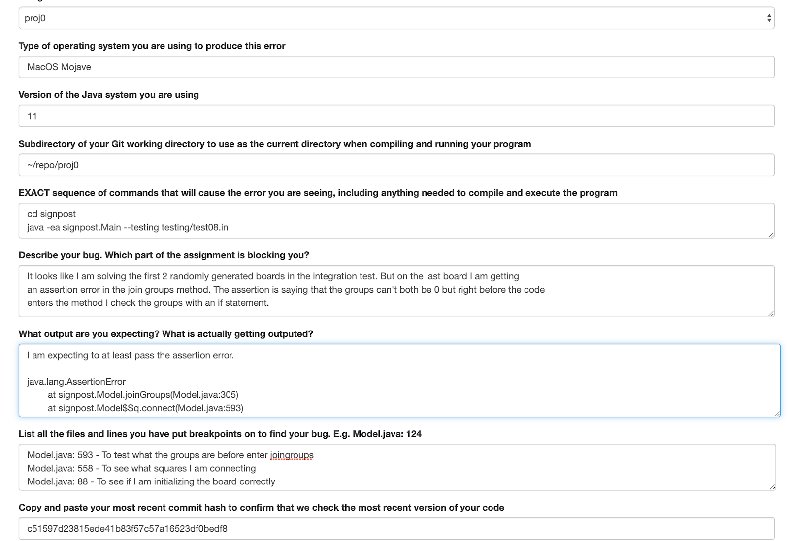

# GitBugs Student Guide
## Why do we need GitBugs
Every now and then, you will inevitably run into a problem with an assignment that you can't figure out. If it is simply a matter of not understanding some aspect of Java or some quirk of our support software, you can ask a question on Ed. But when it involves the code you have written for an assignment or project, general public Ed posts are just not the way to go. First, you'll be posting information (such as your answers) that is intended to be kept to yourself. Second, we need several pieces of information in a format anyone can understand.

In addition, there is the question of just what constitutes a proper bug report. Here, for example, is a (redacted) Ed post from a student:

*I'm trying to use LAB0 for my java file and class name but it seems like I cannot compile (I know how to get to this point and I've passed tests using other names). I'm wondering why LAB0.java with a class named LAB0 did not work.*

Well, we can tell that the student had a compilation problem of some sort, but we can't tell from this:
1. What precisely was in LAB0.java.
2. What command was used to compile it.
3. From what directory that command was issued.
4. What error message(s) resulted.
5. Where LAB0.java was relative to that directory.

In short, no rational person would ever expect anyone to be able to answer this question! In fact, the issues listed above are not exhaustive. One might need to know.
1. What version of Java was being used.
2. On what operating system.
3. What the CLASSPATH was.
and so on.

Nor is this example the worst we've seen. There are many reports that amount simply to "Why does my program not work?" where we can't even tell what "doesn't work" means (Doesn't compile? Gets an exception when executed? Produces the wrong answer?).
Well, how should students decide between submitting a GitBug and asking for help in lab, posting on Ed, or going to Instructor office hours? The latter 3 resources are for conceptual help, for issues like: 
- “Even after looking at the spec and examples, I don’t understand ‘x’ about what this method is supposed to do.”
- “I know I want this function to do x but I’m not sure how to write it cleanly.”
- “Is there a better way to organize my code so that it’s more readable?”

GitBugs are for issues where students strictly just need debugging help:

- “I know this function is supposed to be doing x, y, and z, and I’m passing the unit tests for it. However, when trying to debug my integration tests, it seems like this function is still causing issues. I’m stuck, could I get some help?

## What are GitBugs and How to Submit a GitBug
To make the process of bug reporting more productive, we've developed a procedure that (we hope) makes it easy to get us all the information we need to address your problems with labs and projects. GitBugs is a way for students to compactly deliver important information about their bugs to the course staff. After a student submits a GitBug, the staff will claim and read the student’s GitBug, view their code, and reply with pinpointed and precise suggestions on how to proceed. Here are a couple of guidelines to follow when submitting a GitBug

1. You need to commit and push all the files in the most recent version of your code to git if you want the staff to see the correct code
2. The staff will not reply with advice if we notice that you have not taken any steps to debug your code. Implementing a method and seeing that it does not work is not a sufficient reason to submit a GitBug
3. If you do not provide enough information about your bug, we will not be able to debug it. We try to make this easier for you by having you fill out a form, but we still get GitBugs which do not give enough information
4. If you solve your bug before staff has gotten to it, please mark your git bug as resolved or delete it.

If a student does not follow the rules above, the staff reserves the right to decline your GitBug, **at which point your new GitBug will be put at the back of the queue.** 

## Submitting a GitBug Online
Navigate to the discussion page of our course’s EdStem. Select make post, select type question, select category GitBugs, and mark the question as private.
If you prefer a visual:

Don’t forget to make your GitBug Private by checking the box below (EdStem won’t allow you to submit it otherwise).

Then, you can use the provided template to submit a form with the following fields
1. What is your identifier (e.g. 2-s\*\*\*) and link to your github repo?
	* Make sure to provide a clickable link to your repo! You have just one, but we have access to every single repo, and it can take a while to load and track down what we want! This saves us SO much time so we can get right to looking at your code and getting you rollin’ again!
2. Assignment
	* Specify which assignment is blocking you
3. What is the link to your Gradescope submission (if applicable)?
4. Have you pushed all of your most recent changes to GitHub? 
	* Verify that you have commited the most recent version of your code to make sure that the staff pulls the most recent version of your code
	* Confirm that you pushed the most recent version of all the files needed to compile and run your code to make sure that the staff pulls the most recent version of your code.
5. Type of Operating System
	* Are you using Windows, MacOS, Linux, iOS
	Example: Windows10, MacOS Mojave
Version of Java
6. Which version of Java are you using.
	* You can find this with `java -- version` in terminal or “File > Project Structure > Project > Project SDK” in IntelliJ. If they are different, please send both.
7. What is your current working directory? In other words, what is the path from home (~) to the folder you are in?
	* Specify the file path you are running your program from, e.g. “~/repo/proj0/testing”
	* If you are failing unit tests please also include which test you are running and how you are running it
	* If you are failing integration tests, enter the file path from which you are running the integration test and how you are running it
8. EXACT sequence of commands that will cause the error you are seeing, including anything needed to compile and execute the program
	* Please be as explicit as possible here. If we are unable to reproduce your error, then we will not be able to help you
9. Describe your bug. Which part of the assignment is blocking you?
	* Give us a high level overview of what you think your bug is. Explain why you think your code should be working.
10. What output are you expecting? What is actually getting outputted?
	* On the first line please enter what you think your code should be outputting
	* On another line, please copy and paste what your code is actually outputting
	* This information is vital for both you and the course staff in order to debug your code
11. List all the files and lines you have put breakpoints on to find your bug. E.g. Model.java: 124
	* Demonstrate how you have debugged your code. If we see that you are putting breakpoints in inconsequential positions, then we will reply with solid advice.

## Examples of Bad GitBugs and Good GitBugs

This is an example of a GitBug which will be asked to resubmit with a better response. All we can gather from this GitBug is that the student is not passing test07 integration test due to an assertion error. We don’t even know what the assertion error is since the student did not copy and paste it in. It is also clear that minimal debugging efforts were made since he doesn’t explain his debugging efforts, only claiming that he put breakpoints in connect and connectable

This GitBug is dealing with a similar bug as the one before but it does more to prove to the staff that you have actually tried to debug your code. First they at least prove to us that they know what is happening in the integration test. They also provide multiple breakpoints with valid reasons explaining the reasoning behind each break point.
