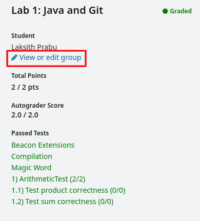
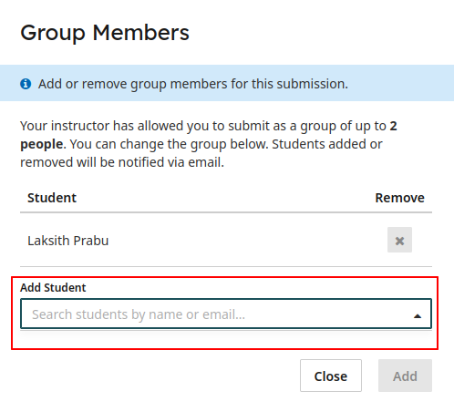

CS 61BL is run in a [lab-centric format](https://people.eecs.berkeley.edu/~clancy/ucwise/fecs07_lab_centric_2col.pdf) during the summer because active learning is better than passive learning. This will better prepare
you for the large-scale team projects that lie ahead in upper-division EECS courses,
and you'll also be prepared to contribute effectively to your team in industry.
Further, you learn more than you would on your own through collaboration.
- Explaining a concept to someone helps you understand it better.
- Having a concept explained to you might provide you with different and more productive ways of understanding the concept.
- Explaining a program to someone else can help you find its bugs.
- Working with someone else helps you identify your own strengths and weaknesses.

Finally, collaboration not only can be helpful to learning, but fun! You can make new friends who will make good partners in future courses and supporters both on campus and beyond.

## Establishing a partnership

1. Go to [https://beacon.datastructur.es/partnerships/](https://beacon.datastructur.es/partnerships/) and select "Add a partner".
2. Read the *whole* partnership collaboration guide (this guide!!)
3. Get your partners CS61BL github id (for example, if your partner's github repository is at su24-s1, the id is `s1`).
4. Generate and share the magic link with the partner.
5. This will create a new repository `su24-p***` (Notice the p for partner!) that both partners have access to. Set it up the same way you set up your individual repository in [lab01](../labs/lab01), and collaborate together.
6. Add your partner on gradescope for any submissions you make.

## Where are partners allowed?

Project 2 and Project 3.

## What is the best way to collaborate?

The exact work style you use with your partner is up to you. There are several
ways that pairs can work together. Here are some possible strategies, along
with our opinion about the effectiveness of each.

> Experiment with each of these styles on your own to determine what works and
> which situations are most effective for each style.

### Write the code together

> Strongly recommended, especially for solving more complex problems with many
> small details and interactions between different parts of a program.

In this work style, you would sit next to each other at the same computer and
collaborate to write the code. One person would type for a while, then the
other, and back again. You can decide the interval for switching who controls
the computer (the "driver"). Some people recommend switching roughly every
15-20 minutes, to make sure that each person gets to drive. Even if one of you
is a faster typer, letting both people drive for equal time is good to avoid
having one person dominate the work.

### Work together using online tools

In this work style, the two of you would be physically apart but would
collaborate by communicating online and sharing code using git.

### Do the assignment individually, and then compare solutions

> Somewhat recommended, but we suggest one of the others above instead.

In this work style, each of you would complete the assignment on your own, then
the two of you would have a meeting and compare solutions. You would then merge
the solution into a best combined solution that you would submit together. This
work style doesn't have as many benefits as working on the solution together,
but it is still good to see how another student solved the problem and learn
from the strengths and weaknesses of each others' code.

There are some work styles that we do NOT recommend because we do not think
they follow the spirit of working in pairs, and do not allow both students to
effectively learn the material. For example:

Splitting up the parts of the assignment
: In this work style, each of you would complete parts of the assignment
individually, then submit them together. For example, if the assignment has a
"Part A" and a "Part B", one of you would do Part A and the other would do Part
B. We do not recommend doing this because each of you will only learn part of
the material for that assignment. This will leave you less prepared on exams
and future assignments.

One person does all of the work
: You should not do this, since each partner is expected to make a significant
contribution toward solving each assignment. You should not claim to be part of
a pair submission if you did not contribute significantly to help solve that
problem. By doing this the other person will not
learn the material well and will be grossly under prepared to do well on exams
and future assignments. The assignments are by far the best vehicle for you to
learn how to program effectively and truly come to understand the course
material.

Our suggested partnership workflow
-----------------------------------------------------

For all projects, we recommend doing pair programming for as much as possible. This means that you and your partner should work togeather in person (or be on a Zoom call),
where one person is typing and both are collectively deciding what to write. Some benefits
of pair programming are:
* Both partners are on the same page and understand all parts of the project
* You are much more likely to catch bugs or mistakes when there are two sets of eyes
* You can discuss how to proceed, so you won't get stuck as often
* You avoid merge conflicts.

The point about merge conflicts is especially important to avoid hassle with Git! To avoid merge conflicts, we recommend that you always clearly communicate with your partner what parts of the project you are working on, and avoid working on the same thing on each of your local computers. An example of a good workflow might be:

1. Both partners hop on a Zoom call
2. Partner1 pulls the skeleton code.
3. Both partners start thinking about what to write for the project. Partner1 types it down, acting as the scribe.
4. After working for an hour, Partner1 has to go to dinner. Partner1 pushes the code to the remote partner repository (nicknamed origin) and leaves the Zoom call.
5. Partner2 is bored and wants to keep working, so they pull from the partner repository (nicknamed origin). This gets Partner2 all the work that they just did on the Zoom call.
6. Partner2 works on the tests for a while, and lets Partner1 know.
7. After dinner, Partner1 also wants to work. They know Partner2 is currently making changes to the tests, so they decide to avoid making changes there to prevent merge conflicts. Instead, Partner1 works on the implementation.
8. Partner2 decides to go to bed. They push their changes to the remote.
9. Partner1 also finishes working. They try to push to the remote, but realize that the remote has changes they don't have, so they must pull first. Partner1 pulls, and Git is able to automatically merge. Now, Partner1's computer has the most up-to-date changes to the tests from Partner2, as well as Partner1's changes to the implementation. Partner1 can push to the remote, and now the remote is fully up to date!

If you get some sort of error, STOP and either figure it out by carefully
reading the [git guide](../../guides/using-git) or seek help at Lab or Ed. You'll potentially save
yourself a lot of trouble vs. guess-and-check with git commands. If you find
yourself trying to use commands recommended by Google like
`force push`,
[don't](https://twitter.com/heathercmiller/status/526770571728531456). **Don't
use force push, even if a post you found on Stack Overflow says to do it!**

## Logistics

### Are there any constraints about whom I can work with?

No, but we highly recommend it is someone in your lab section, as then you can both ask your TA questions about the project, and work together when we give time in labs to work on the projects.

### How can I find a partner?

Find someone in your lab section to partner with. You can also post on Edstem looking for a partner, or ask your Lab TA for help finding a partner.

### How do we submit/get grades as a pair?

One partner submits via the Gradescope UI and then selects their partner for the submission. Note that, the submitting partner **must** add their partner to the final submission for every assignment, as partnerships do not carry over between submission in Gradescope. **Please do not make seperate individual submissions on gradescope with the same partner repo as you'll be flagged for misconduct but our auto-grading system.**

### Can I dissolve my partnership?
Yes, you can! If you're having difficulty working with your partner please talk to your TA about it and they will guide you on how you can dissolve a partnership to either work alone or setup a new one. 
Barring extreme circumstances, you cannot be assigned a new partner during a project. Each partner project lasts only a couple weeks, so time is of the essence.
Hopefully, even if there is some dissatisfaction with your partner, the two of you
can still complete the work and learn.
If you are having trouble working
with your partner, please talk to your TA as soon as possible; we want to make things right in the best
way possible.

Dissolving a partnership will result in each partner needing to submit their own individual submission. 

### May I work alone?
Yes you may choose to work alone! However, remember that CS61BL is a class designed for partner-based work and you might find some of the later assignments more time consuming than intended when working alone. 

### May we work in a group of three?
No.

## My partner was a bad partner...

> They didn't do any work, or didn't do their share of the work, or didn't
> communicate or meet with me, etc. What can I do?

Have you tried speaking to your partner to let them know that you expect them
to do more? Remind your partner of the expectations of each member of a pair.
Many group issues can be resolved by better communication and setting
expectations.

If talking to your partner does not resolve the situation, speak to your
TA and explain the details of what has happened. We will help you resolve the issue.

**NOTE**: If you agree verbally or in writing (email, Ed, text message, etc.) to work with a given partner on
a given assignment, you are expected to work through that assignment with that
partner to completion. You shouldn't abandon your partner in the middle of an
assignment. Please be
considerate for your partner and don't leave them hanging without an easy way
to find a new partner for upcoming assignments. Please communicate with your partner.
Again, this is a valuable life skill!

> Not because they didn't do enough work; they did too much! They hogged the
> keyboard, or they did the whole assignment without waiting for me, or they
> didn't communicate with me, etc. I feel that I didn't get a real chance to
> help in writing the code and solving the assignment. What can I do?

The answer is similar to the previous question. Have you tried speaking to your
partner to let them know that you expect them to let you contribute? Remind
your partner of the expectations of each member of a pair. Many group issues
can be resolved by better communication and setting expectations.

If talking to your partner does not resolve the situation, speak to your
TA and explain the details of what has happened. We will help you resolve the issue.

