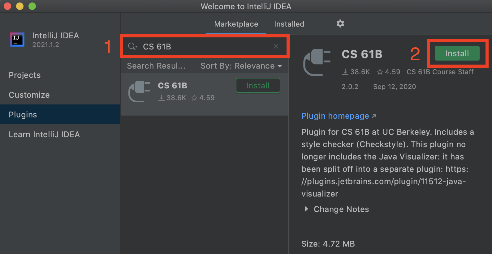
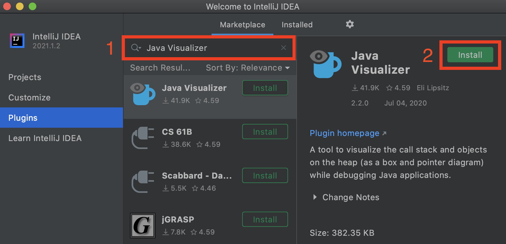
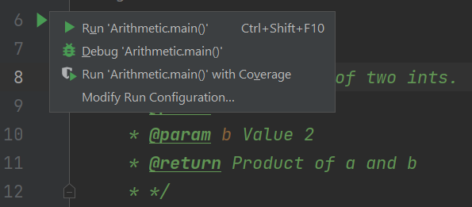

## [FAQ](faq.md)

Each assignment will have an FAQ linked at the top. You can also access it by
adding "/faq" to the end of the URL. The FAQ for Lab 1 is located
[here](faq.md). 
**The FAQ (frequently asked questions) is a list of compiled questions and errors that students often run into, so refer to this page first before reaching out to staff.**

## Learning Goals

In this lab, we will set up the software that we will use throughout the
course: the terminal, git, java, IntelliJ, etc. We will also look at a small
Java program and learn a little bit about Java syntax.

To see what you need to complete for full credit on this lab, skip to the [Deliverables section](#deliverables) below.

## Before You Begin

**Welcome to CS 61BL!**
We have a wonderful summer planned for y'all, and we're so excited that you'll
be joining us!

First things first: setup! In this class, you'll be using real-world tools, and
that means that you'll likely run into real-world problems with configuration
and setup these first few days. **Don't be discouraged**, and make sure to ask
for help if you're stuck! The best place to ask for help is during your actual
lab time. If you attempt to do this outside of that time and run into any
problems, please ask them on Ed. For more information on using Ed in this course, 
read through our [Ed Policies and Guidelines](../../resources/guides/ed/).


If ever something isn't working, or a screen that should show up isn't showing
up, make sure you ask for help -- **do not** keep going because this might
make it more difficult for us to identify the problem later on if you do hit
a dead-end.



## Personal Computer Setup

### Task: Configure Your Computer

Depending on your operating system, there are a few things we need to do to set
your computer up for 61B(L).

The precise steps to take depend on your operating system.

- [Windows instructions](windows.md)
- [macOS instructions](mac.md)
- [Linux instructions](linux.md)



## The Terminal

### Learn to use the Terminal

In CS 61BL we will be using the terminal extensively, even more than you likely
did in previous classes. Bash commands can be pretty powerful and will allow you
to create folders or files, navigate through your file system, etc. To jump
start your knowledge we have included a short guide of the most essential
commands that you will be using in this class. Please carefully read this and
try to familiarize yourself with the commands. We will help you as you get
started, but by the end of the class we hope that you will have become a
proficient user of the bash terminal!

-   `pwd`: present working directory

    ```shell
    pwd
    ```

    This command will tell you the full absolute path for the current
     directory you are in if you are not sure where you are.

-   `ls`: list files/folders in directory

    ```shell
    ls
    ```

    This command will list all the files and folders in your current
    directory.

    ```shell
    ls -l
    ```

    This command will list all the files and folders in your current
    directory with timestamps and file permissions. This can help you
    double-check if your file updated correctly or change the read-write-
    execute permissions for your files.

-   `mkdir`: make a directory

    ```shell
    mkdir dirname
    ```

    This command will make a directory within the current directory called
    `dirname`.

-   `cd`: change your working directory

    ```shell
    cd hw
    ```

    This command will change your directory to `hw`.

-   `.`: means your current directory

    ```shell
    cd .
    ```

    This command will change your directory to the current directory (aka,
    do nothing).

-   `..`: means one parent directory above your current directory

    ```shell
    cd ..
    ```

    This command will change your directory to its parent. If you are in
    `/workspace/day1/`, the command will place you in `/workspace/`.

-   `rm`: remove a file

    ```shell
    rm file1
    ```

    This command will remove file1 from the current directory. It will not
    work if `file1` does not exist.

    ```shell
    rm -r dir1
    ```

    This command will remove the `dir1` directory recursively. In other
    words, it will delete all the files and directories in `dir1` in addition
    to `dir1` itself. Be very careful with this command!

-   `cp`: copy a file

    ```shell
    cp lab1/original lab2/duplicate
    ```

    This command will copy the `original` file in the `lab1` directory and
    and create a `duplicate` file in the `lab2` directory.

-   `mv`: move or rename a file

    ```shell
    mv lab1/original lab2/original
    ```

    This command moves `original` from `lab1` to `lab2`. Unlike `cp`, mv
    does not leave original in the `lab1` directory.

    ```shell
    mv lab1/original lab1/newname
    ```

    This command does not move the file but rather renames it from `original`
    to `newname`.
    
-   `touch` : create a file if it doesn't exist
    
    ```shell 
    touch lab1/newFile
    ```
    
    This command will create a new empty file called `newFile` in the `lab1`
    directory. 
    
    ```shell
    touch existingFile
    ```
    
    This command will leave the contents of `existingFile` unchanged.
    
 
 - `cat` : catenate file(s) to output
    
    ```shell
    cat file1 
    ```
    
    This command will print out the contents of `file1` to the terminal. 
    
    ```shell
    cat file1 file2
    ```
    
    This command will print out the contents of `file1` followed by `file2` to
    the terminal. 

    There are some other useful tricks when navigating on a command line:

-   Your shell can complete file names and directory names for you with
    *tab completion*.
    When you have an incomplete name (for something that already exists), try
    pressing the `tab` key for autocomplete or a list of possible names.

-   If you want to retype the same instruction used recently, press the `up`
    key on your keyboard until you see the correct instruction.
    This saves typing time if you are doing repetitive instructions.

## GitHub and Beacon

Instead of bCourses, CS 61BL uses an in-house system for centralizing your
grades and student information called Beacon.

In this section, we'll set up your Beacon account as well as your CS 61B GitHub
repository ("repo"), which you will need to submit all coding assignments.

### Task: Account Setup

1.  Create an account at [GitHub.com](https://github.com/). If you already have
    an account, you do not need to create a new one.
1.  Go to
    [the Beacon website](https://beacon.datastructur.es/)
    and you'll be guided through a few steps to complete your GitHub repository
    registration. Please follow them carefully! You must be logged in to your
    Berkeley account to complete the Google Form quiz. If any errors occur while
    you're working through the steps, please let your TA know immediately.
1.  After completing all of the steps, you should receive an email inviting you
    to collaborate on your course GitHub repository.
    This email will be sent to the **email that you used to create your GitHub account, which may not
    necessarily be your Berkeley email**.

    

    

### Your Repository

Your repository will have a name containing a number that is unique to you!
For instance, if your repo is called "`su25-s12`", you'll be able to visit your
private repository at <https://github.com/Berkeley-CS61B-Student/su25-s12>
(when logged into GitHub). **If your repo number is not "12" this link will not
work for you.** Replace "12" with your own to see your repo on Github.

Additionally, the instructors, TAs, and tutors will be able to view your
repository. This means you can (and should!) link to your code when creating
gitbugs posts on Ed. No other students will be
able to view your repository.



## Git

In this course, you'll be required to use the Git version control system, which
is wildly popular out in the real world. Since the abstractions behind
it are fairly tricky to understand, don't be worried if you encounter
significant frustration as you learn to use git. Towards the middle of the
semester, we'll be learning the inner workings of git
in much greater detail but, for now, let's just get a working knowledge of how
to use git.

Before you proceed, **read sections up to the Remote Repositories section of
the [Using Git Guide](../../resources/guides/git.md)**.




### Setting Up Git

Before we use git, we have some short commands to configure it appropriately.

First, set the name and email that git will use with these two commands:

```shell
git config --global user.name "<your name>"
git config --global user.email "<your email>"
```

Set git's default branch name:

```shell
git config --global init.defaultBranch main
```

Set the "merge strategy":

```shell
git config --global pull.rebase false
```

We'll also change the text editor associated with git. Sometimes, git needs
your help when inputting things like commit messages, so it will open a text
editor for you. The default editor is `vim`, which is notoriously difficult to use.

**Follow the instructions
[here](https://git-scm.com/book/en/v2/Appendix-C%3A-Git-Commands-Setup-and-Config)**.
This will configure Git's default editor (make sure that you follow the correct
instructions for your operating system). If you've worked with a text editor like VSCode, 
Sublime Text or Atom before, we suggest setting whatever you're most familiar with as the default
editor. If not we suggest using Notepad for Windows, TextEdit for MacOS and Nano for Linux. 



### Task: Git Exercise

Now that you've read the first 3 sections of the
[Using Git Guide](../../guides/using-git.md), you're ready to start using git!
As part of your lab checkoff, you will be working through a small git workflow
by setting up a git repository and making a couple commits to the repository.

If you need help with creating directories, creating files, changing
directories, etc., refer back to
*[Learn to use the Terminal](#learn-to-use-the-terminal)*.


1.  Create a directory called `lab01-checkoff` (`mkdir`). You can put this directory
    anywhere on your computer (unless you have already cloned your `su25-s***`
    repository, in which case, you **should not put this directory inside of
    your `su25-s***` repo)**.
2.  Move into the `lab01-checkoff` directory (`cd`), and initialize a git repository
    in this directory (`git init`).
3.  Create a file called `61b.txt` in any way you'd like (`touch`). In this text file,
    add the text "61b version 1" into it.
4.  Create another file called `61bl.txt` in any way you'd like. In this text
    file, add the text "61bl version 1" into it.
5.  Begin tracking **only** `61b.txt`, and create a new commit containing just
    this file, with the following commit message: "Add 61b.txt".
6.  Make a modification in `61b.txt` by changing the text in the file to: "61b
    changed to version 2".
7.  Make another commit, this time containing both `61b.txt` and `61bl.txt`.
    The commit message should be: "Update 61b.txt and add 61bl.txt".
8.  Make one more modification to `61b.txt` by changing the text in
    the file to: "61b changed to version 3". Don’t commit this version.

At this point, if you were to type in `git status` and `git log`, something like this should
show:

 <script
        id="asciicast-r8KSJ9xba9m2PvL2hxrJMO39Y"
        src="https://asciinema.org/a/r8KSJ9xba9m2PvL2hxrJMO39Y.js"
        async
    ></script>


9. **Using git only**, restore `61b.txt` to the version in the first commit.
10.  **Using git only**, restore `61b.txt` to the version in the most recent commit.


Be sure to save this repository and directory until you complete the
[asynchronous checkoff form on beacon](https://beacon.datastructur.es/) and
obtain a **magic word**. We'll be using this magic word later in the lab. 



### Git and Remote Repos

First, read the **Remote Repositories** section of the
**[Using Git Guide](../../guides/using-git#remote-repositories)**.

In this course, you'll be required to submit your code using Git to your course
GitHub repository that you created in [Account Setup](#task-account-setup).
This is for several reasons:

-   To spare you the incredible agony of losing your files.
-   To submit your work for grading and to get results back from the autograder.
-   To save you from the tremendous anguish of making unknown changes to your
    files that break everything.
-   To ensure that we have easy access to your code so that we can help if
    you're stuck.
-   **To dissuade you from posting your solutions on the web in a public GitHub
    repository**. This is a major violation of course policy!
-   To expose you to a realistic workflow that is common on every major project
    you'll ever work on in the future.

### Task: Setting up your Git Repository

#### Authenticate With Github

First, run the following command in your terminal. It will print out any SSH keys you have 
and generate a new one if none exists: 

```shell
curl -sS https://cs61bl.org/su25/labs/lab01/get-ssh-key.sh | bash 
```



With the location that is provided, go ahead and run the following 
command, ensuring to replace `<path_to_ssh_key>` with the location of the SSH key
and **appending with the `.pub` suffix**. 

```shell
cat <path_to_ssh_key>.pub
```

The result of running the above command should produce something similar to the format below: 

```shell
ssh-ed25519 AAAAC3NzaC1lZDI1N6jpH3Bnbebi7Xz7wMr20LxZCKi3U8UQTE5AAAAIBTc2HwlbOi8T [some-comment-here]
```
Then, copy the output from your terminal. The `[some-comment-here]` will be system 
dependent and may vary for individuals. Taking the output, go to 
[Github, Settings, SSH, GPG Keys, New SSH Key](https://github.com/settings/ssh/new) (or click the link)
and paste the output into the Key section. **Name the key, so it's memorable what device 
the key is on or so you recognize what it's for and select 
the Key type as Authentication Key**. Then, add the key to your account. 

In your terminal, run the following command to connect with Github using SSH: 

```shell
ssh -T git@github.com
```

If all went well, you should see something like this:

```shell
Hi USERNAME! You've successfully authenticated, but GitHub does not provide shell access.
```

You should now be successfully authenticated with Github and good to go!

#### Clone your `su25-s***` Git Repository

Navigate to the spot in your folders on your computer that you'd like to start
your repository. In the example below, we're assuming you want all your stuff
in a folder named `cs61bl`, but you can pick a different name if you'd like.

```shell
cd cs61bl
```

Enter the following command to clone your GitHub repo. Make sure to replace the
`***` with your class repository number (this should be the repo number you
were assigned through Beacon, not your lab section number).

```shell
git clone git@github.com:Berkeley-CS61B-Student/su25-s***.git
```


After cloning your terminal will report "`warning: You appear to have cloned
an empty repository.`" This is not an issue, it is just git letting you know
that there are no files in the repo, which is what we expect here.



Move into your newly created repo!

```shell
cd su25-s***
```

Make sure that we're working with the branch name we expect, `main`:

```shell
git branch -M main
```

Now, we will add the `skeleton` remote repository. You will pull from this
remote repository to get starter code for assignments. (Make sure that you are
within the newly created repository folder when you continue with these
commands.) Enter the following command to add the `skeleton` remote.

```shell
git remote add skeleton https://github.com/cs61bl/skeleton-su25.git
```

Listing the remotes should now show both the `origin` and `skeleton` remotes.

```shell
git remote -v
```



### Getting the Skeleton





### Pushing to GitHub



Open the file `lab01/magic_word.txt` in a text editor, and edit it to contain
the **magic word** obtained during the [git exercise][].

[git exercise]: #task-git-exercise

Now stage and commit `magic_word.txt` (make sure you're in your repo!).

```shell
git add lab01/magic_word.txt
git commit -m "Added Magic Word"
```

Right now, the modified `magic_word.txt` is only on your computer. We want to
push these changes to the GitHub repository so that your changes can be seen by
us and Gradescope. Push these changes to the `main` branch on the `origin`
remote repo.

```shell
git push origin main
```

You can verify that this was successful by checking your repository online on
GitHub's website. It should contain the updated `magic_word.txt` file. If it
doesn't, make sure that your `add` and `commit` were successful. In particular,
make sure that you are in your repo, `su25-***`.



Our work is now on GitHub, and ready to submit!

## Submitting to Gradescope

Although we use GitHub to store our programming work, we use **Gradescope** to
actually grade it. The last step is to submit your work with [Gradescope][],
which we use to autograde programming assignments.








At this point, Gradescope should show you something similar to the following:

{: style="max-height: 400;" }


In CS 61BL, we use automated tests to check that your code is written correctly.
In your first submission, you:

- Should be **passing** "Magic Word", if you received the magic word
- Should be **passing** "Test product correctness"
- Should **not be passing** "Test sum correctness"

We'll now show you how you can work on and check your code locally, which is
much easier than checking on Gradescope every time.

## Setting Up Java Libraries

Like in Python, we sometimes want to use libraries that others wrote. Java
dependency management is a bit of a mess, so we instead provide a
git repo that contains all the dependencies that we will use in this course.



Then, run:

```shell
git clone https://github.com/cs61bl/library-su25
```

Below is shown the directory structure of `library-su25`. Look inside the
folder using `ls library-su25` and make sure you see the `.jar` files
listed below. There are many more, but we only list the first few. If you're
using your operating system's file explorer, the `jar` part might not show up
in the filenames, and that's OK.

```console
library-su25
├── algs4.jar
├── animated-gif-lib-1.4.jar
├── antlr4-runtime-4.11.1.jar
├── apiguardian-api-1.1.2.jar
└── ...
```



## IntelliJ Setup

IntelliJ is an Integrated Development Environment or IDE. An IDE is a single
program which combines typically a source code editor, tools to compile and run
code, and a debugger. Some IDEs like IntelliJ contain even more features such
as an integrated terminal and a graphical interface for git commands. Finally,
IDEs also have tools like code completion which will help you write Java faster.

We *highly* recommend using IntelliJ. Our tests are written to run
in IntelliJ, and we will explicitly use its debugger in later labs.
Additionally, IntelliJ is an industry-standard tool that you will almost
certainly encounter if you work with Java again in the future.

We will assume that you are using IntelliJ, and will not offer support for
other editors, including VSCode.



**Before continuing, make sure that you have completed all above tasks besides
the git exercise:**

1.  You have successfully created your local repo for the class on your own
    machine. This is the `su25-s***` repository you earlier.
2.  You have pulled from the skeleton, and you have a `lab01` directory.

### Installing IntelliJ

1.  Download the Community Edition of IntelliJ from the
    [JetBrains](https://www.jetbrains.com/idea/download/#:~:text=free%20to%20use-,IntelliJ%20IDEA%20Community%20Edition,-The%20IDE%20for) website.
    As a student you can actually get a student license for the Ultimate
    version, but there are not any additional features that we will use for this
    class. **It is recommended and assumed that you proceed with the Community
    Edition.**

    
    

{:start="2"}

1.  After selecting the appropriate version for your OS, click download and wait
    a few minutes for the file to finish downloading.

1.  Run the installer. If you have an older version of IntelliJ, you should
    uninstall it at this time and replace it with this newer version.



### Installing Plugins

Open IntelliJ. Then follow the steps below.

**Make sure you're running IntelliJ Version 2021.2 or later before
continuing.** This is because we will use Java 17.
We are using **IntelliJ Version 2023.2**. Older versions may
also work but we haven't tried them ourselves.

1.  In the *Welcome* window, click the **"Plugins"** button in the menu on the
    left.

    {: style="max-height: 325;" }

1.  On the window that appears, click "Marketplace" and enter "CS 61B" in the
    search bar at the top.
    The CS 61B plugin entry should appear.
    If you click the autocomplete suggestion, a slightly different window
    from what is shown below may appear -- this is okay.

1.  Click the green **Install** button, and wait for the plugin to download and
    install.

    {: style="max-height: 250;" }

    If you have the plugin installed from a prior term, make sure to update it.

1.  Now, search for "Java Visualizer", and click the green **Install** button to
    install the plugin.

    {: style="max-height: 250;" }

1.  Restart (close and reopen) IntelliJ.

For more information on using the plugins, read
[the plugin guide](../../guides/plugin.md).
You don't have to read this right now.

### Installing Java

With IntelliJ and the plugins installed, we can install the JDK. Follow the steps below: 

1. Start up IntelliJ. If you have no projects open, click the “Open” button. If you have a project currently open,
   navigate to “File –> Open”.
2. Find and choose the directory of your current assignment. For example, for Lab 1, you would select the 
   lab01 directory inside your `su25-s***`. 
3. Navigate to the “File -> Project Structure” menu, and make sure you are in the Project tab. Then, follow 
   the instructions [Set up the project JDK](https://www.jetbrains.com/help/idea/sdk.html#set-up-jdk)
   to download your JDK version. **Choose a version that is 17 or greater!** Depending on which
   version you choose, make sure that it is compatible with the language level (e.g. if you
   choose SDK 18, choose your language level to be 18). 

### Task: Terminal Test Run

Let's ensure that everything is working.



1.  First open up your terminal.
    Check that git is a recognized command by typing the following command:

    ```shell
    git --version
    ```

    The version number for git should be printed. If you see "git: command not
    found", or similar, try opening a new terminal window, restarting your
    computer, or installing git again.

2.  Second, let's check that `javac` and `java` are working.
    `javac` and `java` allow *Command Line Compilation*, or in other words,
    the ability to run Java programs directly from the command line.
    In practice, most developers run Java programs through an IDE like IntelliJ,
    so we won't be using command line compilation for much this semester other
    than testing your setup.
    Start by running the following commands at your terminal.

    ```shell
    mkdir ~/temp
    cd ~/temp
    ```


    1.  In this newly created directory, create an empty file `HelloWorld.java`.
        
        ```shell
        touch HelloWorld.java
        ```
        
        
    2.  Then, open the file using your operating system's text editor.
        You can do this from the command line:

        - Mac: `open -e ./HelloWorld.java`
        - Windows: `notepad ./HelloWorld.java`
        - Linux: `xdg-open ./HelloWorld.java`


    3. Copy paste the following code block into the editor, then save and close. 

        ```java
        public class HelloWorld {
            public static void main(String[] args) {
                System.out.println("Hello world!");
            }
        }
        ```

    4. In your terminal, type `cat HelloWorld.java`. You should see the contents of 
       the file we just created. 
     
    5. In your terminal, enter `ls` (list the files/folders in this directory).
        You should only see `HelloWorld.java` listed.
        
    6.  Run `javac HelloWorld.java`. If this produces any output, then something
        may be wrong with your setup. Try opening a new terminal window or
        restarting your computer. If that still doesn't work, see the
        Troubleshooting section under the directions for your operating system.

    7.  Type `ls`, you should see both `HelloWorld.java`
        and a freshly created `HelloWorld.class` (the `javac` command created
        this file).

    8.  Run `java HelloWorld`. It should print out "Hello world!" for you.
        If it didn't, something is wrong with your setup!

    9.  You're done! You can also delete the "temp" folder and its contents as
        you please.

    The video below shows what we're hoping for when we run through the steps above.
    If you see something similar to this, your java setup is complete.


    <script id="asciicast-i4kqX0gnASof89lIdE6JzMCyC" src="https://asciinema.org/a/i4kqX0gnASof89lIdE6JzMCyC.js" async ></script> 

### Creating Projects



Once you've done this, you should see at least these three files in the left
pane:

-   `magic_word.txt`, which should contain the magic word you added.
-   `src/Arithmetic`, a Java file which contains your first programming
    exercise.
-   `tests/ArithmeticTest`, another Java file which will check that
    `Arithmetic` is implemented correctly.

{: style="max-height: 250;" }

When you open `Arithmetic` and `ArithmeticTest`, you should not see any red
text or red squiggles.

### IntelliJ Test

To test if everything is working correctly, run the `Arithmetic` class by
opening the file, clicking on the green triangle next to
`public class Arithmetic`, then clicking "Run 'Arithmetic.main()'".

{: style="max-height: 250;" }

You should see a console pop up, prompting you to enter a number:

{: style="max-height: 250;" }

If you follow the prompts, you will (probably) see something wrong! **Don't fix
it yet.**

### Testing Your Code

While we could run the `Arithmetic` file again and again to check that our
code works correctly, it would take a lot of time to type into the program each
time, and manually check that the output is correct. Instead, we use **tests**.

Open `ArithmeticTest`, and click the green triangle(s) next to the
`public class ArithmeticTest`. This will run the tests that we have provided
in this assignment. At this point, you will see the following:

{: style="max-height: 200;" }


The green checkmark indicates tests that you have passed, while the yellow X indicates tests 
that you have failed. Don't worry about the doubled output; this is a strange quirk of
IntelliJ.





## Saving Your Work using Git and GitHub

As you are making changes to your code, it is good practice to save your work
often. We have briefly discussed the commands, but now we will explain how they
should be used in practice. In the case that you ever want to go back to
another version of your code, it is better to have more options to roll back
to. The next set of instructions will talk you through git's version of saving
work through snapshots of your file system called commits.

1.  After you have made some changes to the code within our local repository,
    git will take notice of these changes. To see the current state
    of your local repository, use the command `git status`. Run this and try to
    interpret the results. Do they make sense to you or do they match your
    intuition? It is a good habit to run this before running other git commands
    to know what the state of things are.

2.  To save work that we have completed on a file, we first stage the file, and
    then we can commit it. We stage a file with the command `git add`. This
    does not save the file, but it marks it to be saved the next time you
    commit. The two below commands show what saving work looks like in a git
    repository. For `git add` depending on what directory you are in, the path
    to the file you are adding might differ (use `git status` to see the path).

    The `-m "Completed Arithmetic.java"` part of the commit command specifies a
    message to be attached to this snapshot. You should always have a commit
    message to identify what exactly happened in this commit. As an example
    workflow:

    ```shell
    git add lab01/src/Arithmetic.java
    git commit -m "lab01: Completed Arithmetic.java"
    ```

    If you run `git status`, you will see that
    `Your branch is ahead of 'origin/main'`. You will also see that the
    staged changes are no longer staged, and are instead committed. If you
    haven't edited since staging, you shouldn't have any changes not staged
    for commit.

3.  We want to push these changes to the GitHub repository so that
    your changes can be seen by us and Gradescope. Your changes will also be
    available to `pull`ed if you had your repo initialized in other places or
    other computers.

    ```shell
    git push origin main
    ```

    `git status` will now show that
    `Your branch is up to date with 'origin/main'.`



Basically, right when you sit down to work in your repository, first `git pull`
to make sure you are starting with the most recent code. While you are working,
frequently commit. When you are finished, `git push` so all your changes are
uploaded and ready for you to pull again next time.



## Deliverables

As a reminder, this assignment has an [FAQ page](faq.md).
There are two required files, all inside the `lab01` directory:

`magic_word.txt`
:   You should have received the correct magic word from completing the git
    checkoff.

`Arithmetic.java`
:   You should have fixed the bug so that the tests pass. We check this file
    with an autograder! For this lab, the autograder tests are the same as the
    ones you have on your computer.

Be sure to submit **again** according to the
[submission section](#submitting-to-gradescope), so that you submit your
completed lab. Congratulations on finishing your first CS 61BL lab!
