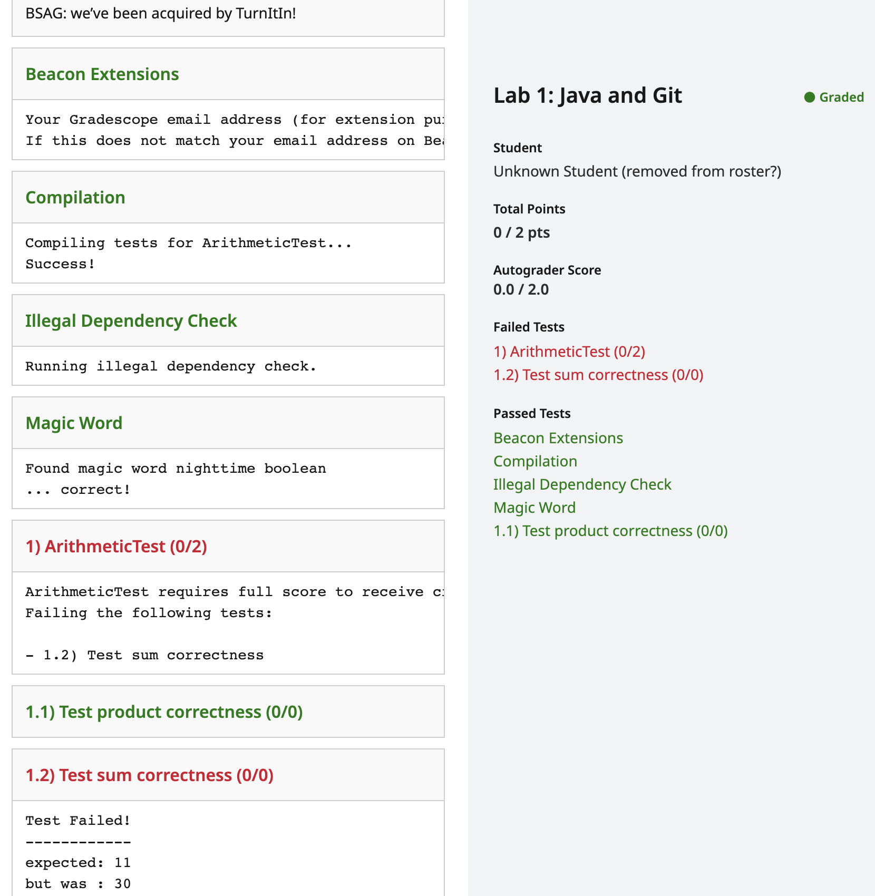
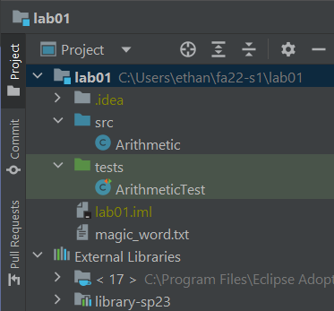
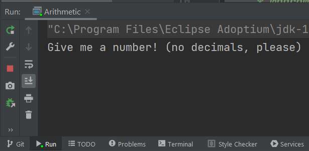
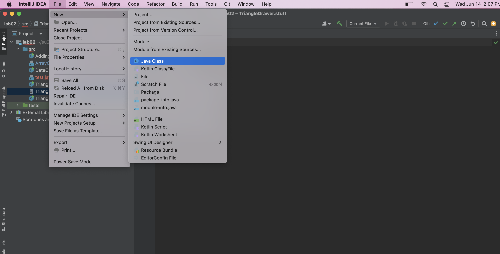

## [FAQ](faq.md)

Each assignment will have an FAQ linked at the top. You can also access it by
adding "/faq" to the end of the URL. The FAQ for Lab 1 is located
[here](faq.md).

## Learning Goals

In this lab, we will set up the software that we will use throughout the
course: the terminal, git, java, IntelliJ, etc. We will also look at a small
Java program and learn a little bit about Java syntax.

## Before You Begin

**Welcome to CS 61BL!**
We have a wonderful summer planned for y'all, and we're so excited that you'll
be joining us!

First things first: setup! In this class, you'll be using real-world tools, and
that means that you'll likely run into real-world problems with configuration
and setup these first few days. **Don't be discouraged**, and make sure to ask
for help if you're stuck! The best place to ask for help is during your actual
lab time. If you attempt to do this outside of that time and run into any
problems, please ask them on Ed. For more information on using Ed in this course, 
read through our [Ed Policies and Guidelines](../../guides/ed/).


If ever something isn't working, or a screen that should show up isn't showing
up, make sure you ask for help -- **do not** keep going because this might
make it more difficult for us to identify the problem later on if you do hit
a dead-end.



## Personal Computer Setup

### Task: Configure Your Computer

Depending on your operating system, there are a few things we need to do to set
your computer up for 61B(L).

The precise steps to take depend on your operating system.

- [Windows instructions](windows.md)
- [macOS instructions](mac.md)
- [Linux instructions](linux.md)



## The Terminal

### Learn to use the Terminal

In CS 61BL we will be using the terminal extensively, even more than you likely
did in previous classes. Bash commands can be pretty powerful and will allow you
to create folders or files, navigate through your file system, etc. To jump
start your knowledge we have included a short guide of the most essential
commands that you will be using in this class. Please carefully read this and
try to familiarize yourself with the commands. We will help you as you get
started, but by the end of the class we hope that you will have become a
proficient user of the bash terminal!

-   `pwd`: present working directory

    ```shell
    pwd
    ```

    This command will tell you the full absolute path for the current
     directory you are in if you are not sure where you are.

-   `ls`: list files/folders in directory

    ```shell
    ls
    ```

    This command will list all the files and folders in your current
    directory.

    ```shell
    ls -l
    ```

    This command will list all the files and folders in your current
    directory with timestamps and file permissions. This can help you
    double-check if your file updated correctly or change the read-write-
    execute permissions for your files.

-   `mkdir`: make a directory

    ```shell
    mkdir dirname
    ```

    This command will make a directory within the current directory called
    `dirname`.

-   `cd`: change your working directory

    ```shell
    cd hw
    ```

    This command will change your directory to `hw`.

-   `.`: means your current directory

    ```shell
    cd .
    ```

    This command will change your directory to the current directory (aka.
    do nothing).

-   `..`: means one parent directory above your current directory

    ```shell
    cd ..
    ```

    This command will change your directory to its parent. If you are in
    `/workspace/day1/`, the command will place you in `/workspace/`.

-   `rm`: remove a file

    ```shell
    rm file1
    ```

    This command will remove file1 from the current directory. It will not
    work if `file1` does not exist.

    ```shell
    rm -r dir1
    ```

    This command will remove the `dir1` directory recursively. In other
    words, it will delete all the files and directories in `dir1` in addition
    to `dir1` itself. Be very careful with this command!

-   `cp`: copy a file

    ```shell
    cp lab1/original lab2/duplicate
    ```

    This command will copy the `original` file in the `lab1` directory and
    and create a `duplicate` file in the `lab2` directory.

-   `mv`: move or rename a file

    ```shell
    mv lab1/original lab2/original
    ```

    This command moves `original` from `lab1` to `lab2`. Unlike `cp`, mv
    does not leave original in the `lab1` directory.

    ```shell
    mv lab1/original lab1/newname
    ```

    This command does not move the file but rather renames it from `original`
    to `newname`.
    
-   `touch` : create a file if it doesn't exist
    
    ```shell 
    touch lab1/newFile
    ```
    
    This command will create a new empty file called `newFile` in the `lab1`
    directory. 
    
    ```shell
    touch existingFile
    ```
    
    This command will leave the contents of `existingFile` unchanged.
    
 
 - `cat` : catenate file(s) to output
    
    ```shell
    cat file1 
    ```
    
    This command will print out the contents of `file1` to the terminal. 
    
    ```shell
    cat file1 file2
    ```
    
    This command will print out the contents of `file1` followed by `file2` to
    the terminal. 

    There are some other useful tricks when navigating on a command line:

-   Your shell can complete file names and directory names for you with
    *tab completion*.
    When you have an incomplete name (for something that already exists), try
    pressing the `tab` key for autocomplete or a list of possible names.

-   If you want to retype the same instruction used recently, press the `up`
    key on your keyboard until you see the correct instruction.
    This saves typing time if you are doing repetitive instructions.

### Task: Terminal Test Run

Let's ensure that everything is working.



1.  First open up your terminal.
    Check that git is a recognized command by typing the following command:

    ```shell
    git --version
    ```

    The version number for git should be printed. If you see "git: command not
    found", or similar, try opening a new terminal window, restarting your
    computer, or installing git again.

2.  Second, let's check that `javac` and `java` are working.
    `javac` and `java` allow *Command Line Compilation*, or in other words,
    the ability to run Java programs directly from the command line.
    In practice, most developers run Java programs through an IDE like IntelliJ,
    so we won't be using command line compilation for much this semester other
    than testing your setup.
    Start by running the following commands at your terminal.

    ```shell
    mkdir ~/temp
    cd ~/temp
    ```


    1.  In this newly created directory, create an empty file `HelloWorld.java`.
        
        ```shell
        touch HelloWorld.java
        ```
        
        
    2.  Then, open the file using your operating system's text editor.
        You can do this from the command line:

        - Mac: `open -e ./HelloWorld.java`
        - Windows: `notepad ./HelloWorld.java`
        - Linux: `xdg-open ./HelloWorld.java`


    3. Copy paste the following code block into the editor, then save and close. 

        ```java
        public class HelloWorld {
            public static void main(String[] args) {
                System.out.println("Hello world!");
            }
        }
        ```

    4. In your terminal, type `cat HelloWorld.java`. You should see the contents of 
       the file we just created. 
     
    5. In your terminal, enter `ls` (list the files/folders in this directory).
        You should only see `HelloWorld.java` listed.
        
    6.  Run `javac HelloWorld.java`. If this produces any output, then something
        may be wrong with your setup. Try opening a new terminal window or
        restarting your computer. If that still doesn't work, see the
        Troubleshooting section under the directions for your operating system.

    7.  Type `ls`, you should see both `HelloWorld.java`
        and a freshly created `HelloWorld.class` (the `javac` command created
        this file).

    8.  Run `java HelloWorld`. It should print out "Hello world!" for you.
        If it didn't, something is wrong with your setup!

    9.  You're done! You can also delete the "temp" folder and its contents as
        you please.

    The video below shows what we're hoping for when we run through the steps above.
    If you see something similar to this, your java setup is complete.


    <script id="asciicast-i4kqX0gnASof89lIdE6JzMCyC" src="https://asciinema.org/a/i4kqX0gnASof89lIdE6JzMCyC.js" async ></script> 

## GitHub and Beacon

Instead of bCourses, CS 61BL uses an in-house system for centralizing your
grades and student information called Beacon.

In this section, we'll set up your Beacon account as well as your CS 61B GitHub
repository ("repo"), which you will need to submit all coding assignments.

### Task: Account Setup

1.  Create an account at [GitHub.com](https://github.com/). If you already have
    an account, you do not need to create a new one.
1.  Go to
    [the Beacon website](https://su23.beacon.datastructur.es/register/)
    and you'll be guided through a few steps to complete your GitHub repository
    registration. Please follow them carefully! You must be logged in to your
    Berkeley account to complete the Google Form quiz. If any errors occur while
    you're working through the steps, please let your TA know immediately.
1.  After completing all of the steps, you should receive an email inviting you
    to collaborate on your course GitHub repository.
    This email will be sent to the **email that you used to create your GitHub account, which may not
    necessarily be your Berkeley email**.

    

    

### Your Repository

Your repository will have a name containing a number that is unique to you!
For instance, if your repo is called "`su23-s42`", you'll be able to visit your
private repository at <https://github.com/Berkeley-CS61B-Student/su23-s42>
(when logged into GitHub). **If your repo number is not "42" this link will not
work for you.** Replace "42" with your own to see your repo on Github.

Additionally, the instructors, TAs, and tutors will be able to view your
repository. This means you can (and should!) link to your code when creating
gitbugs posts on Ed. No other students will be
able to view your repository.



## Git

In this course, you'll be required to use the Git version control system, which
is wildly popular out in the real world. Since the abstractions behind
it are fairly tricky to understand, don't be worried if you encounter
significant frustration as you learn to use git. Towards the middle of the
semester, we'll be learning the inner workings of git
in much greater detail but, for now, let's just get a working knowledge of how
to use git.

Before you proceed, **read sections up to the Remote Repositories section of
the [Using Git Guide](../../guides/using-git.md)**.




### Setting Up Git

Before we use git, we have some short commands to configure it appropriately.

First, set the name and email that git will use with these two commands:

```shell
git config --global user.name "<your name>"
git config --global user.email "<your email>"
```

Set git's default branch name:

```shell
git config --global init.defaultBranch main
```

Set the "merge strategy":

```shell
git config --global pull.rebase false
```

We'll also change the text editor associated with git. Sometimes, git needs
your help when inputting things like commit messages, so it will open a text
editor for you. The default editor is `vim`, which is notoriously difficult to use.

**Follow the instructions
[here](https://git-scm.com/book/en/v2/Appendix-C%3A-Git-Commands-Setup-and-Config)**.
This will configure Git's default editor (make sure that you follow the correct
instructions for your operating system). If you've worked with a text editor like VSCode, 
Sublime Text or Atom before, we suggest setting whatever you're most familiar with as the default
editor. If not we suggest using Notepad for Windows, TextEdit for MacOS and Nano for Linux. 



### Task: Git Exercise

Now that you've read the first 3 sections of the
[Using Git Guide](../../guides/using-git.md), you're ready to start using git!
As part of your lab checkoff, you will be working through a small git workflow
by setting up a git repository and making a couple commits to the repository.
An academic intern or staff member will look at your git repository during
checkoff to ensure that it is in a good state.

If you need help with creating directories, creating files, changing
directories, etc., refer back to
*[Learn to use the Terminal](#learn-to-use-the-terminal)*.


1.  Create a directory called `lab01-checkoff`. You can put this directory
    anywhere on your computer (unless you have already cloned your `su23-s***`
    repository, in which case, you **should not put this directory inside of
    your `su23-s***` repo)**.
2.  Move into the `lab01-checkoff` directory, and initialize a git repository
    in this directory.
3.  Create a file called `61b.txt` in any way you'd like. In this text file,
    add the text "61b version 1" into it.
4.  Create another file called `61bl.txt` in any way you'd like. In this text
    file, add the text "61bl version 1" into it.
5.  Begin tracking **only** `61b.txt`, and create a new commit containing just
    this file, with the following commit message: "Add 61b.txt".
6.  Make a modification in `61b.txt` by changing the text in the file to: "61b
    changed to version 2".
7.  Make another commit, this time containing both `61b.txt` and `61bl.txt`.
    The commit message should be: "Update 61b.txt and add 61bl.txt".
8.  Make one more modification to `61b.txt` by changing the text in
    the file to: "61b changed to version 3". Don’t commit this version.

At this point, if you were to type in `git status` and `git log`, something like this should
show:

 <script
        id="asciicast-r8KSJ9xba9m2PvL2hxrJMO39Y"
        src="https://asciinema.org/a/r8KSJ9xba9m2PvL2hxrJMO39Y.js"
        async
    ></script>


9. **Using git only**, restore `61b.txt` to the version in the first commit.
10.  **Using git only**, restore `61b.txt` to the version in the most recent commit.


Be sure to save this repository and directory until you complete the
[asynchronous checkoff form on beacon](https://beacon.datastructur.es/) and
obtain a **magic word**. We'll be using this magic word later in the lab. 



### Git and Remote Repos

First, read the **Remote Repositories** section of the
**[Using Git Guide](../../guides/using-git#remote-repositories)**.

In this course, you'll be required to submit your code using Git to your course
GitHub repository that you created in [Account Setup](#task-account-setup).
This is for several reasons:

-   To spare you the incredible agony of losing your files.
-   To submit your work for grading and to get results back from the autograder.
-   To save you from the tremendous anguish of making unknown changes to your
    files that break everything.
-   To ensure that we have easy access to your code so that we can help if
    you're stuck.
-   **To dissuade you from posting your solutions on the web in a public GitHub
    repository**. This is a major violation of course policy!
-   To expose you to a realistic workflow that is common on every major project
    you'll ever work on in the future.

### Task: Setting up your Git Repository

#### Clone your `su23-s***` Git Repository

Navigate to the spot in your folders on your computer that you'd like to start
your repository. In the example below, we're assuming you want all your stuff
in a folder named `cs61bl`, but you can pick a different name if you'd like.

```shell
cd cs61bl
```

Before you can clone your repo we need to login to GitHub. Verify that you have 
the GitHub package.

```shell
gh --version
```

You should see a version number displayed. If you instead see a command not found
error, please install GitHub cli again by following you OS specific instructions
and restarting your computer. 

Next login with your account. 

```shell
gh auth login
```

You'll be asked a few questions with some options to select from. You don't have to worry
about them, simply select the first options for all of them and proceed. You'll be provided
with a one time code, and prompted to open the browser. 

Enter the code in the browser window and select authorize github. You should now be logged in!



Verify that you have correctly logged in using

```shell
gh auth status
```

The entire process should look like this video:

<script async id="asciicast-rzokme4d9MDHMkmzIRxdnFfyG" src="https://asciinema.org/a/rzokme4d9MDHMkmzIRxdnFfyG.js"></script>

Enter the following command to clone your GitHub repo. Make sure to replace the
`***` with your class repository number (this should be the repo number you
were assigned through Beacon, not your lab section number).

```shell
git clone https://github.com/Berkeley-CS61B-Student/su23-s***.git
```


After cloning your terminal will report "`warning: You appear to have cloned
an empty repository.`" This is not an issue, it is just git letting you know
that there are no files in the repo, which is what we expect here.



Move into your newly created repo!

```shell
cd su23-s***
```

Now we will add the `skeleton` remote repository. You will pull from this
remote repository to get starter code for assignments. (Make sure that you are
within the newly created repository folder when you continue with these
commands.) Enter the following command to add the `skeleton` remote.

```shell
git remote add skeleton https://github.com/cs61bl/skeleton-su23.git
```

Listing the remotes should now show both the `origin` and `skeleton` remotes.

```shell
git remote -v
```



### Getting the Skeleton





### Pushing to GitHub



Open the file `lab01/magic_word.txt` in a text editor, and edit it to contain
the **magic word** obtained during the [git exercise][].

[git exercise]: #task-git-exercise

Now stage and commit `magic_word.txt` (make sure you're in your repo!).

```shell
git add lab01/magic_word.txt
git commit -m "Added Magic Word"
```

Right now, the modified `magic_word.txt` is only on your computer. We want to
push these changes to the GitHub repository so that your changes can be seen by
us and Gradescope. Push these changes to the `main` branch on the `origin`
remote repo.

```shell
git push origin main
```

You can verify that this was successful by checking your repository online on
GitHub's website. It should contain the updated `magic_word.txt` file. If it
doesn't, make sure that your `add` and `commit` were successful. In particular,
make sure that you are in your repo, `su23-***`.



Our work is now on GitHub, and ready to submit!

## Submitting to Gradescope

Although we use GitHub to store our programming work, we use **Gradescope** to
actually grade it. The last step is to submit your work with [Gradescope][],
which we use to autograde programming assignments.








At this point, Gradescope should show you something similar to the following:

{: style="max-height: 400;" }


In CS 61BL, we use automated tests to check that your code is written correctly.
In your first submission, you:

- Should be **passing** "Magic Word", if you received the magic word
- Should be **passing** "Test product correctness"
- Should **not be passing** "Test sum correctness"

We'll now show you how you can work on and check your code locally, which is
much easier than checking on Gradescope every time.

## Setting Up Java Libraries

Like in Python, we sometimes want to use libraries that others wrote. Java
dependency management is a bit of a mess, so we instead provide a
git repo that contains all the dependencies that we will use in this course.



Then, run:

```shell
git clone https://github.com/cs61bl/library-su23
```

Below is shown the directory structure of `library-su23`. Look inside the
folder using `ls library-su23` and make sure you see the `.jar` files
listed below. There are many more, but we only list the first few. If you're
using your operating system's file explorer, the `jar` part might not show up
in the filenames, and that's OK.

```console
library-su23
├── algs4.jar
├── animated-gif-lib-1.4.jar
├── antlr4-runtime-4.11.1.jar
├── apiguardian-api-1.1.2.jar
└── ...
```



## IntelliJ Setup

IntelliJ is an Integrated Development Environment or IDE. An IDE is a single
program which combines typically a source code editor, tools to compile and run
code, and a debugger. Some IDEs like IntelliJ contain even more features such
as an integrated terminal and a graphical interface for git commands. Finally,
IDEs also have tools like code completion which will help you write Java faster.

We *highly* recommend using IntelliJ. Our tests are written to run
in IntelliJ, and we will explicitly use its debugger in later labs.
Additionally, IntelliJ is an industry-standard tool that you will almost
certainly encounter if you work with Java again in the future.

We will assume that you are using IntelliJ, and will not offer support for
other editors, including VSCode.



**Before continuing, make sure that you have completed all above tasks besides
the git exercise:**

1.  You have installed Java 17 or higher.
1.  You have successfully created your local repo for the class on your own
    machine. This is the `su23-s***` repository you earlier.
1.  You have pulled from the skeleton, and you have a `lab01` directory.

### Installing IntelliJ

1.  Download the Community Edition of IntelliJ from the
    [JetBrains](https://www.jetbrains.com/idea/download/) website.
    As a student you can actually get a student license for the Ultimate
    version, but there are not any additional features that we will use for this
    class. **It is recommended and assumed that you proceed with the Community
    Edition.**

    
    

{:start="2"}

1.  After selecting the appropriate version for your OS, click download and wait
    a few minutes for the file to finish downloading.

1.  Run the installer. If you have an older version of IntelliJ, you should
    uninstall it at this time and replace it with this newer version.



### Installing Plugins

Open IntelliJ. Then follow the steps below.

**Make sure you're running IntelliJ Version 2021.2 or later before
continuing.** This is because we will use Java 17.
We are using **IntelliJ Version 2022.3**. Older versions may
also work but we haven't tried them ourselves.

1.  In the *Welcome* window, click the **"Plugins"** button in the menu on the
    left.

    {: style="max-height: 325;" }

1.  On the window that appears, click "Marketplace" and enter "CS 61B" in the
    search bar at the top.
    The CS 61B plugin entry should appear.
    If you click the autocomplete suggestion, a slightly different window
    from what is shown below may appear -- this is okay.

1.  Click the green **Install** button, and wait for the plugin to download and
    install.

    {: style="max-height: 250;" }

    If you have the plugin installed from a prior term, make sure to update it.

1.  Now, search for "Java Visualizer", and click the green **Install** button to
    install the plugin.

    {: style="max-height: 250;" }

1.  Restart (close and reopen) IntelliJ.

For more information on using the plugins, read
[the plugin guide](../../guides/plugin.md).
You don't have to read this right now.

### Creating Projects



Once you've done this, you should see at least these three files in the left
pane:

-   `magic_word.txt`, which should contain the magic word you added.
-   `src/Arithmetic`, a Java file which contains your first programming
    exercise.
-   `tests/ArithmeticTest`, another Java file which will check that
    `Arithmetic` is implemented correctly.

{: style="max-height: 250;" }

When you open `Arithmetic` and `ArithmeticTest`, you should not see any red
text or red squiggles.

### IntelliJ Test

To test if everything is working correctly, run the `Arithmetic` class by
opening the file, clicking on the green triangle next to
`public class Arithmetic`, then clicking "Run 'Arithmetic.main()'".

{: style="max-height: 250;" }

You should see a console pop up, prompting you to enter a number:

{: style="max-height: 250;" }

If you follow the prompts, you will (probably) see something wrong! **Don't fix
it yet.**

### Testing Your Code

While we could run the `Arithmetic` file again and again to check that our
code works correctly, it would take a lot of time to type into the program each
time, and manually check that the output is correct. Instead, we use **tests**.

Open `ArithmeticTest`, and click the green triangle(s) next to the
`public class ArithmeticTest`. This will run the tests that we have provided
in this assignment. At this point, you will see the following:

{: style="max-height: 200;" }


The green checkmark indicates tests that you have passed, while the yellow X indicates tests 
that you have failed. Don't worry about the doubled output; this is a strange quirk of
IntelliJ.





## Saving Your Work using Git and GitHub

As you are making changes to your code, it is good practice to save your work
often. We have briefly discussed the commands, but now we will explain how they
should be used in practice. In the case that you ever want to go back to
another version of your code, it is better to have more options to roll back
to. The next set of instructions will talk you through git's version of saving
work through snapshots of your file system called commits.

1.  After you have made some changes to the code within our local repository,
    git will take notice of these changes. To see the current state
    of your local repository, use the command `git status`. Run this and try to
    interpret the results. Do they make sense to you or do they match your
    intuition? It is a good habit to run this before running other git commands
    to know what the state of things are.

2.  To save work that we have completed on a file, we first stage the file, and
    then we can commit it. We stage a file with the command `git add`. This
    does not save the file, but it marks it to be saved the next time you
    commit. The two below commands show what saving work looks like in a git
    repository. For `git add` depending on what directory you are in, the path
    to the file you are adding might differ (use `git status` to see the path).

    The `-m "Completed Arithmetic.java"` part of the commit command specifies a
    message to be attached to this snapshot. You should always have a commit
    message to identify what exactly happened in this commit. As an example
    workflow:

    ```shell
    git add lab01/src/Arithmetic.java
    git commit -m "lab01: Completed Arithmetic.java"
    ```

    If you run `git status`, you will see that
    `Your branch is ahead of 'origin/main'`. You will also see that the
    staged changes are no longer staged, and are instead committed. If you
    haven't edited since staging, you shouldn't have any changes not staged
    for commit.

3.  We want to push these changes to the GitHub repository so that
    your changes can be seen by us and Gradescope. Your changes will also be
    available to `pull`ed if you had your repo initialized in other places or
    other computers.

    ```shell
    git push origin main
    ```

    `git status` will now show that
    `Your branch is up to date with 'origin/main'.`



Basically, right when you sit down to work in your repository, first `git pull`
to make sure you are starting with the most recent code. While you are working,
frequently commit. When you are finished, `git push` so all your changes are
uploaded and ready for you to pull again next time.



## (Optional) Java: Conditionals, Loops, and Arrays


This section is **ungraded** and contains a significant amount of content. We recommend revisiting the topics and exercises presented here throughout the semester. To see what you need to complete for full credit on this lab, skip to the [Deliverables section](#deliverables) below.



This section will provide an introduction to Java loops and conditionals (the if, while and for statements), followed by a brief explanation of Java Arrays. We assume no prior experience with any of these topics in Java, but we do assume some prior knowledge of these concepts from an earlier course (like Python control flow and lists as taught in CS61A).

Because of this, there is a lot of information presented here, but hopefully most of it will be review that can be skimmed through quickly.

This course strives to teach you how to “program”, and this includes not just teaching you how to write code, but how to do a variety of activities. We have included a few optional exercises for you to practice writing, analyzing, and testing code.

### How `if` and `if ... else` Work

An `if` statement starts with the word `if`. It is followed by a *condition*
statement **in parentheses** that is either true or false (a *boolean
expression*). There is then a sequence of statements surrounded by braces,
which is called the *body*. For example:

```java
if (year % 4 == 0) {
    System.out.println (year + " might be a leap year.");
}
```

> Note: like in Python, the `%` symbol above is called *mod*, and it takes the
> remainder after division. The above statement is checking if `year` has no
> remainder when divided by 4). The behavior of the `%` operator in Java
> annoyingly differs slightly from how it functions in Python, particularly
> with respect to negative numbers.
>
> For example in Python `-5 % 4` evaluates to `3` whereas in Java `-5 % 4`
> evaluates to `-1`. If you want the behavior to match what you might expect 
> in Python, you should use the Math.floorMod function in Java. If you do this 
> then Math.floorMod(-5, 4) evaluates to 3.

The braces after an `if` statement aren't technically necessary if there is
only one statement in the sequence; however, it is good practice to always
include them since it makes it easier to add lines to the body later.

Unlike other languages (Python in particular), the condition of the `if`
statement *must* be a boolean statement or a statement that reduces to a
boolean expression. `if (5):` is a legal statement in Python, but `if (5) {`
will not compile in Java.

Boolean expressions often involve comparisons. The comparison operators in Java
are `==` and `!=` for equality and inequality testing, and `>`, `>=`, `<`, and
`<=` for comparison of magnitudes. Multiple comparisons can be chained together
with the logical operators `&&` (and) and `||` (or). If instead you wish to
negate an expression, you can prefix your expression with `!`, the Java
negation operator.

The block of statements following the `if` statement above will not execute if
`year`'s value is not divisible by 4. If you wanted something to happen when
the test fails, use the `else` keyword. Here's an example:

```java
if (year % 4 == 0) {
    System.out.println (year + " might be a leap year.");
} else {
    System.out.println (year + " is definitely not a leap year.");
}
```

You can also add further tests that are executed only if above boolean
expressions evaluate to false, similarly to `elif` in Python. For example:

```java
if (year % 4 != 0) {
    System.out.println (year + " is not a leap year.");
} else if (year % 100 != 0) {
    System.out.println (year + " is a leap year.");
} else if (year % 400 != 0) {
    System.out.println (year + " is not a leap year.");
} else {
    System.out.println (year + " is a leap year.");
}
```

Note that only one body section, the one corresponding to the first true
boolean expression (or `else` if none are true), will execute. After that,
your program will continue on, skipping all the remaining code in this `if`
structure. This implies that none of the conditions below the first true
boolean expression will be evaluated.

One consequence of conditions becomes apparent in non-void methods. Recall that in Java,
you must return something of the return type. Consider the following code snippet:

```java
public int relu(int x) {
    if (x < 0) {
        return 0;
    }
}
```

As the code is, it will not compile. That is because currently, a value is only
returned when `x` is less than 0. What happens when that's not the case? Java
must be assured that `relu()` *always* returns an int, and thus will not allow
you to compile your code.

A correct version looks like this:

```java
public int relu(int x) {
    if (x < 0) {
        return 0;
    } else {
        return x;
    }
}
```

### How `while` Works

The `while` statement is used to repeat a sequence of statements. It consists
of the word `while`, followed by a continuation *test* in parentheses, also
called the *condition*. It is then followed by a sequence of statements to
repeat enclosed in braces, called the *loop body*.

The `while` statement works by evaluating the condition. If the condition is
true (the test succeeds), the entire loop body is executed, and the condition
is checked again. If it succeeds again, the entire loop body is executed again.
This continues, possibly infinitely.

A common mistake when first learning a Java-like language is to think that the
behavior of `while` is to stop as soon as the test becomes false, possibly in
the middle of the loop. This is not the case. The test is checked only at the
end of a complete iteration, and so this is the only time the loop can stop.

Here's an example that implements the remainder operation `dividend % divisor`,
and produces some output. We assume all variables have already been declared,
and that `divisor` and `dividend` have already been assigned positive values.

```java
while (dividend >= divisor) {
    dividend = dividend - divisor;
    System.out.println ("loop is executed");
}
remainder = dividend;
```

All statements of the loop body are executed, even if one of them affects the
truth value of the test. In the example above, values of 9 for `dividend` and
4 for `divisor` result in two lines of output. We show a representation with
values of 13 for `dividend` and 4 for `divisor` and initially 0 for
`remainder`. This results in 3 lines of output.

When debugging `while` loop code, sometimes it's useful to make charts like the
one below to keep track of the value of each variable.


### How `for` Works

The `for` statement provides another way in Java to repeat a sequence of
statements, similar to `while` but slightly different. It starts with `for`,
continues with *loop information* inside parentheses, and ends with the *loop
body* (the segment to be repeated) enclosed in curly braces.

```java
for (loop-information) {
    loop-body;
}
```

<!-- TODO: I know Oracle docs refer to these as "increments",
but that's weird because it's arbitrary. "update" might be better. -->
Loop information consists of *initializations*, a *test* (condition), and
*increments*. If the test succeeds, the loop continues and then increments. These refer to the creation of variables, boolean conditions that dictates when the loop should and should not be entered, 
and the equation we use to update our position between loops. 
These three sections are separated by semicolons, and any of
these may be blank. If there is more than one initialization or increment,
they are separated by commas.
```java
for (initialization; test; increment) {
    loop-body;
}
```

Loop execution proceeds as follows:

1.  Initializations are performed.
2.  The test is evaluated.
    -   If the condition is false, the loop is finished and execution continues
        with the code following the for loop.
    -   If the condition is true, the loop body is executed, increments are
        performed, and we loop back to the top of step 2 where the test is
        evaluated again. (Note: We never re-initialize.)

Note that, in fact, all of these sections of the for loop are optional. The code
`for (;;)` is in fact valid Java code. It never terminates!


The following loops are several equivalent ways to compute `n` factorial
(the product of all the positive integers up through `n`).

-   Two initializations in loop-information

    ```java
    for (int k = n, product = 1; k > 0; k = k - 1) {
        product = product * k;
    }
    ```

-   Product initialized outside for loop

    ```java
    int product = 1;
    for (int k = n; k > 0; k = k - 1) {
        product = product * k;
    }
    ```

-   Decrement performed inside the loop-body

    ```java
    int product = 1;
    for (int k = n; k > 0; ) {
        product = product * k;
        k = k - 1;
    }
    ```

-   While loop equivalent

    ```java
    int product = 1;
    int k = n;
    while (k > 0) {
        product = product * k;
        k = k - 1;
    }
    ```

As the last loop demonstrates, the `for` loop is basically a
repackaged `while` loop that puts all the information about how long the
loop should continue in one place. Thus, a `for` loop is generally easier
to understand than an equivalent `while` loop.

### Shortcuts for Incrementing / Decrementing

Let `k` be an integer variable. Then the three following statements are
equivalent in that they all increment `k`.

```java
k = k + 1;
k += 1;
k++;
```

Similarly, these three statements all decrement `k` by 1.

```java
k = k - 1;
k -= 1;
k--;
```

Note: The motivation for this shorthand notation is that the operations of
incrementing and decrementing by 1 are very common. While it is legal to
increment or decrement variables within larger expressions like

```java
System.out.println(values[k++]);
```

this is a risky practice very susceptible to off-by-one errors. In general,
we suggest starting with more verbose syntax. Therefore, we ask that you
only use the `++` or `--` operations on lines **by themselves**.

### The `break` Statement

The `break` statement "breaks out of" a loop (both for and while loops). In
other words, it stops the execution of the loop body, and continues with the
statement immediately following the loop. An example of its use would be a
program segment that searches an array named `values` for a given `value`,
setting the variable found to true if the value is found and to false if it
is not in the array.

```java
boolean found = false;
for (int k = 0; k < values.length; k++) {
    if (values[k] == value) {
        found = true;
        break;
    }
}
```

This `break` statement allows us to save computation time. If we find the value within
the array before the end, we don't waste more time looping through the rest
of the array.

However, the `break` statement is not always necessary, and code with a lot
of `break`s can be confusing. Abusing the break statement is often considered
poor style. When using `break`, first consider if instead it would be more
appropriate to put another condition in the test.

### The `continue` Statement

The `continue` statement skips the current iteration of the loop body,
increments the variables in the loop information, then evaluates the loop
test. This example checks how many 0's there are in array `values`:

```java
int count = 0;
for (int i = 0; i < values.length; i++) {
    if (values[i] != 0) {
        continue;
    }
    count += 1;
}
System.out.println("Number of 0s in values array: " + count);
```

Similar to the `break` statement, the `continue` allows us to save time by
skipping sections of the loop. In this case, the `continue` allows us to add
to the `count` only when there is a 0 in the array. Removing continue will
give an incorrect output.

The difference between `break` and `continue` is that `break` immediately stops
the loop and moves on to the code directly following it. In comparison,
`continue` stops going through the current iteration of the loop body and
immediately continues on to the next iteration as given by the loop information.

Like with `break`, abusing `continue` is often considered poor style. Try not
to go crazy with nested `break`s and `continue`s.

Both `break` and `continue` apply to only the closest loop it is enclosed in.
For instance, in the case of the following nested loop, the `break` will only
exit out of the inner for loop, not the outer one.

```java
for (int i = 0; i < values.length; i++) {
    for (int j = i + 1; j < values.length; j++) {
        if (values[i] == value[j]) {
            break;
        }
    }
}
```

### Array Definition and Use

 An array is an indexed sequence of elements, all of the same type. Real-life
 examples of arrays include the following:

- ducks in a row
- slices of bread
- words in this sentence
- book pages
- egg cartons
- chessboards / checkerboards

We declare an array variable by giving the type of its elements, a pair of
square brackets, and the variable name, for example:

```java
int[] values;
```

Note that we don't specify the length of the array in its declaration.

Arrays are basically objects with some special syntax. To initialize an array,
we use the `new` operator as we do with objects; the argument to `new` is the type
of the array, which includes the length. For example, the statement

```java
values = new int[7];
```

stores a reference to a 7-element integer array in the variable `values`. This
initializes the array variable itself. If we want to declare and initialize the
array at the same time, we can:

```java
int[] values = new int[7];
```

The elements of the array are indexed from `0` to `(array length) - 1` and the
element at a particular index can be changed with an assignment statement. For
example, to set the second element to `4` we write:

```java
values[1] = 4;
```

For an `int` array, Java will (by default) set all of the elements to `0`.
Similarly, `double` arrays will be filled with `0.0`, `boolean` with `false`,
etc. For arrays of references to non-primitive objects (whose precise definition we will
cover in lab 4), the array will be initialized with `null`.

If you know what every value in your array should be at initialization time,
you can use this simplified syntax to directly initialize the array to the
desired values. Note that you don't have to provide the array length because
you're explicitly telling Java how long your array should be.

```java
int[] oneThroughFive = new int[]{1, 2, 3, 4, 5};
// This also works but only if you declare and initialize in the same line
int[] oneThroughFive = {1, 2, 3, 4, 5};
```

To access an array element, we first give the name of the array, and then
supply an index expression for the element we want in square brackets. For
example, if we want to access the `k`th element of values (0-indexed), we can
write:

```java
values[k]
```

If the value of the index expression is negative or greater than/equal to the
length of the array, an exception is thrown (negative indexing is not allowed).

Every array has an instance variable named `length` that stores the number of
elements that array can hold. For the `values` array just defined,
`values.length` is 7. The length variable can't be changed; once we create an
array of a given length, we can't shrink or expand that array.

### `for` Statements with Arrays

`for` statements work well with arrays. Consider, for example, an array named
`values`. It is very common to see code like the following:

```java
for (int k = 0; k < values.length; k += 1) {
    // do something with values[k]
}
```

### Multidimensional Arrays

Having an array of objects is very useful, but often you will want to have an
array *of arrays* of objects. Java does this in a very natural way. We've
already learned that to declare an array, we do:

```java
int[] array;
```

Similarly, to declare an array of arrays, we do:

```java
int[][] arrayOfArrays;
```

When constructing an array of arrays, you *must* declare how many arrays it
contains (because this is the actual array you are constructing), but you don't
have to declare the length of each array. To declare an array of 10 arrays, you
do this:

```java
int[][] arrayOfArrays = new int[10][];
```

To construct the first array in the array of arrays, you could do:

```java
arrayOfArrays[0] = new int[5];
```

And you could access the first index of the first array as:

```java
arrayOfArrays[0][0] = 1;
```

Hopefully this all makes sense. Alternatively, you can fix the length of each
array in the array of arrays as the same length like this:

```java
int[][] tenByTenArray = new int[10][10];
```

You can also directly instantiate an array of arrays with prefilled elements,
such as:

```java

int[][] oneThroughTen = {{1, 2, 3}, {4, 5, 6}, {7, 8, 9}};

```

An array of arrays, when the different sub-arrays can be of different sizes, is
called a *jagged array*. If they are all the same size, it is often convenient
to forget altogether that you have an array of arrays, and instead to simply
imagine you had a multi-dimensional array. For instance, you could create a
3-dimensional array (to represent points in space, for example) like this:

```java
int[][][] threeDimensionalArray = new int[100][100][100];
```

This 3D array has 100x100x100 = 1,000,000 different values. Multidimensional
arrays are extremely useful, and you'll be encountering them a lot.

### (Optional) Exercise: A Jigsaw Puzzle - Drawing a Triangle

The file `TriangleDrawer.stuff` contains a collection of statements. Some of
the statements, together with some extra right braces, form the body of a main
method that, when executed, will print the triangle:

    *
    **
    ***
    ****
    *****
    ******
    *******
    ********
    *********
    **********

(Each line has one more asterisk than its predecessor; the number of asterisks
in the last line is the value of the `SIZE` variable. `SIZE` has a hard-coded value,
which you should experiment with. Feel free to make `SIZE` controlled by a command-line argument!
However, when you turn it in, make sure that it will run with `SIZE = 10`!)

At the top of IntelliJ, you should see "File". Click on it, and then hover over "New"
and then click on "Java Class". See this reference screenshot:


You will then be prompted to give a name, which in this case you should write `TriangleDrawer.java`. 
Now, you've learned how to create a new Java class, and are ready to continue on to the 
next part of the lab! 

Next, let us add a main method to the class. As a reminder, the structure of a main method is as follows:
```java 
public static void main(String[] args) {
    // statements go here
}
```

Copy and paste statements from the `TriangleDrawer.stuff` file into the main method of 
`TriangleDrawer.java`. You'll have to add some right braces in addition to the copied lines 
that you've chosen and rearranged. (You won't need all the statements. You shouldn't need to use 
any statement more than once.)

Many students encounter infinite loops in their first solutions to this
problem. If you get an infinite loop, be sure to hit `CTRL+C` in your terminal to halt
execution.

> Hint: So far, we have mostly used the well-named function System.out.println
> to conduct our printing. However, this function always outputs a new line at the
> end of its provided string. There is a variant of this function, System.out.print,
> which does not output a new line. You may find it helpful in this exercise!

### (Optional) Exercise: Another Jigsaw Puzzle

Make a new Java file called `TriangleDrawer2.java` (you might want to copy and
paste from `TriangleDrawer.java`). In this file, rewrite the program so that it
produces the exact same output, but using `for` loops and no `while` loops. If
you have having trouble, re-read the parts above describing how to convert a
`while` loop to a `for` loop.

<details markdown="block">
  <summary markdown="block">
#### Hint: When do we define variables?
{: .no_toc}
  </summary>
When working with loops, we have to consider scope. In other words, we have to consider when our variables are being created,
when they are being modified, and when they are inaccessible. Which variables do we want to define within the loop (either in the
header or the body) and which variables do we want to define outside of the loop (either before or after the loop)?

For example, consider the `SIZE` variable. When is it being modified? Based on that, where should it be defined?

</details>

### (Optional) Exercise: An Adding Machine Simulator

Consider a program that simulates an old-fashioned adding machine. The user
types integers as input, one per line. Input should be handled as follows:

-   A nonzero value should be added into a subtotal.

-   A zero value should print the subtotal and reset it to zero.

-   Two consecutive zeroes should print the total of all values inputted, then
    print out every value that was inputted in sequence (*not* including zeroes)
    then terminate the program.

Open the associated file `AddingMachine.java` that holds the implementation of
the above described program. Read through the TODO in the comments provided in the `AddingMachine.java` file.
For this exercise, you will be asked to "complete" AddingMachine so that it executes as specified in this spec.

Here's an example of how the program should behave.

| *User input* | *Printed output* |
|:------------:|:----------------:|
| 0            | subtotal 0       |
| 5            |                  |
| 6            |                  |
| 0            | subtotal 11      |
| -5           |                  |
| 5            |                  |
| 0            | subtotal 0       |
| 13           |                  |
| -8           |                  |
| 0            | subtotal 5       |
| 0            | total 16         |
|              | 5                |
|              | 6                |
|              | -5               |
|              | 5                |
|              | 13               |
|              | -8               |

There are several things to note. First, look at how the project description
leads to the implementation. Try testing the implementation with the inputs and
outputs listed above. Do the steps make sense?

Second, does this program work with all inputs?
In programming, the person who writes the code can, intentionally or not,
introduce their own ideas and assumption in the code, some of which can lead to
problems. Specifically, for the class `AddingMachine.java` we assumed that the
user will never enter more than `MAXIMUM_NUMBER_OF_INPUTS` non-zero values during
any run of the program.

Is this usually a fair assumption to make? Try
running the code and supply input that violates this assumption. Does the code
tell you that you have made an error or does it just crash? This touches on a
new idea of programming: **robustness**. This refers to code's ability to
handle incorrect user input. In real life, you'll never have a guarantee like
this, but you haven't been taught the proper Java to handle an arbitrarily long
sequence of inputs (yet!).

A few things to take away from this code:

-   Always consider what will happen if your user interacts incorrectly with
    your data.

-   To exit the `main` method, execute a `return;` statement somewhere inside
    the method. Because the `main` method is of type `void`, it can't return a
    value. Therefore, the appropriate `return` statement doesn't have an
    argument.

-   This code introduces the `Scanner` class. A `Scanner` can be used to read
    user input. Here the `Scanner` is created with `System.in` as an argument,
    which means that it is expecting input from the command line.

    -   You can do a variety of things with a `Scanner`, but in this exercise
        you'll find it most useful to use code like this:

        ```java
        int k;
        k = scanner.nextInt();
        ```

    -   Here, `scanner` reads everything it can from its input and stores the
        result in an integer `k`. Because `scanner`'s input is the command line,
        the program will actually stop and wait at this part of the code until
        the user types in something at the command line and hits enter. For
        example, if the user types `100`, then the program will store the value
        `100` in `k` before continuing on.

### (Optional) Exercise: `insert` & `delete`

Look at the files `ArrayOperations.java` and `ArrayOperationsTest.java`.

Fill in the blanks in the `ArrayOperations` class. Your methods should pass
the associated tests in `ArrayOperationsTest`.

Note: Before trying to program an algorithm, you should usually try a small
case by hand. For each of the exercises today, demo
each algorithm by hand before writing any code.

-   The `insert` method takes three arguments: an `int` array, a position in the
    array, and an `int` to put into that position. All the subsequent elements
    in the array are moved over by one position to make room for the new element.
    The last value in the array is lost.

For example, let `values` be the array {1, 2, 3, 4, 5}. Calling

```java
insert(values, 2, 7)
```

would result in `values` becoming {1, 2, 7, 3, 4}.

-   The `delete` method takes two arguments: an `int` array and a position in
    the array. The subsequent elements are moved down one position, and the
    value 0 is assigned to the last array element.

For example, let `values` be the array {1, 2, 3, 4, 5}. Calling

```java
delete(values, 2)
```

would result in `values` becoming {1, 2, 4, 5, 0}.

For today don't worry about the methods being called with incorrect input.

### (Optional) Exercise: Catenate

Again, look at the files `ArrayOperations.java` and `ArrayOperationsTest.java`.

Note that, with the provided starter code, the tests specific to this exercise 
will not pass. This is expected! Implement the related method as described below
and in the comments and the tests will pass!

Complete the Java function `catenate` so that it
performs as indicated below and in the comments. Remember that some
arrays can have zero elements!

Note: Again, before trying to program an algorithm, you should usually try a small
case by hand.

You may find `System.arraycopy` useful for this problem, but you are not
required to use it. If you are not sure how to use this method, try Googling it!

-   The `catenate` method takes in two arguments: integer arrays `A` and `B`.
    You should return a new array with all of the elements of `A` directly
    followed by all of the elements in `B`.

For example, let `A` be the array `{1, 2, 3}` and `B` be the array `{4, 5}`.
Calling

```java
int[] values = catenate(A, B);
```

would result in `values` becoming `{1, 2, 3, 4, 5}`.

Again, for today, don't worry about the method being called with incorrect input.
When you finish this function, all tests in `ArrayOperationsTest.java` should
compile and pass.

## Deliverables

As a reminder, this assignment has an [FAQ page](faq.md).
There are two required files, all inside the `lab01` directory:

`magic_word.txt`
:   You should have received the correct magic word from completing the git
    checkoff.

`Arithmetic.java`
:   You should have fixed the bug so that the tests pass. We check this file
    with an autograder! For this lab, the autograder tests are the same as the
    ones you have on your computer.

Be sure to submit **again** according to the
[submission section](#submitting-to-gradescope), so that you submit your
completed lab. Congratulations on finishing your first CS 61BL lab!
