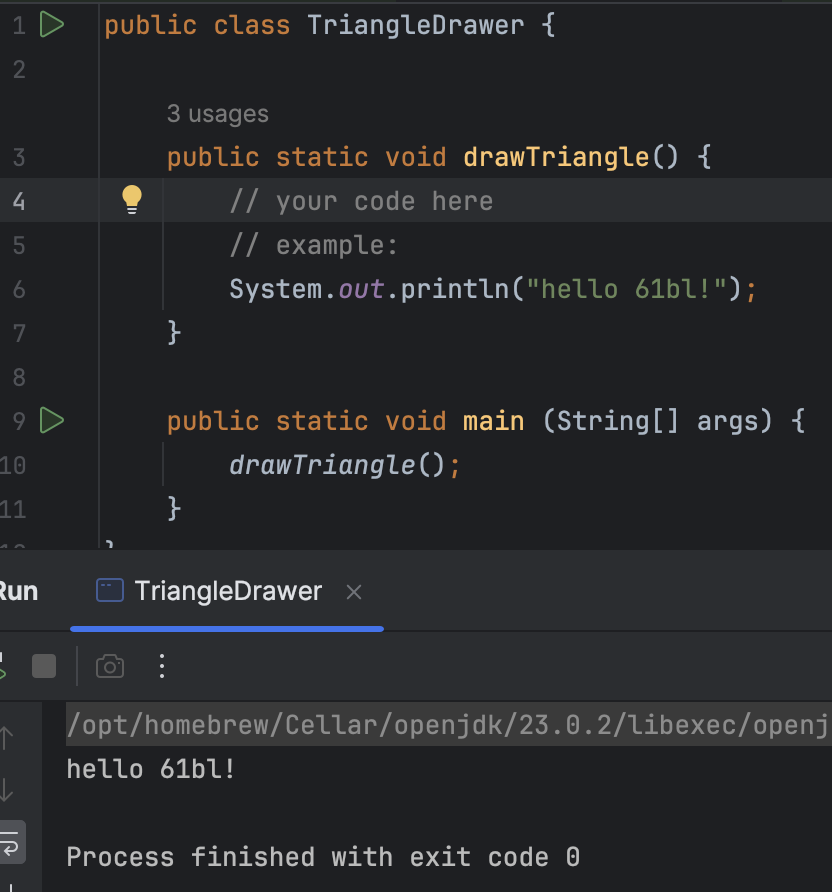

## [FAQ](faq)

Each assignment will have an FAQ linked at the top. You can also access it by
adding "/faq" to the end of the URL. The FAQ for Lab 2 is located
[here](faq). 
**The FAQ (frequently asked questions) is a list of compiled questions and errors that students often run into, so refer to this page first before reaching out to staff.**

## Learning Goals

In this lab, we will learn more about Java syntax and get some more practice with programming in Java.

To see what you need to complete for full credit on this lab, skip to the [Deliverables section](#deliverables) below.

## Java: Conditionals, Loops, and Arrays

This section will provide an introduction to Java loops and conditionals (the `if`, `while` and `for` statements), followed by a brief explanation of Java Arrays. We assume no prior experience with any of these topics in Java, but we do assume some prior knowledge of these concepts from an earlier course (like Python control flow and lists as taught in CS61A).

Because of this, there is a lot of information presented here. Hopefully most of it will be review that can be skimmed through quickly, but please don't hesitate to ask us if you have any questions!

This course strives to teach you how to “program”, and this includes not just teaching you how to write code, but how to do a variety of activities. We have included a few exercises for you to practice writing, analyzing, and testing code.

### How `if` and `if ... else` Work

An `if` statement starts with the word `if`. It is followed by a *condition*
statement **in parentheses** that is either true or false (a *boolean
expression*). There is then a sequence of statements surrounded by braces,
which is called the *body*. For example:

```java
if (year % 4 == 0) {
    System.out.println (year + " might be a leap year.");
}
```

> Note: like in Python, the `%` symbol above is called *mod*, and it takes the
> remainder after division. The above statement is checking if `year` has no
> remainder when divided by 4). The behavior of the `%` operator in Java
> annoyingly differs slightly from how it functions in Python, particularly
> with respect to negative numbers.
>
> For example in Python `-5 % 4` evaluates to `3` whereas in Java `-5 % 4`
> evaluates to `-1`. If you want the behavior to match what you might expect 
> in Python, you should use the Math.floorMod function in Java. If you do this 
> then Math.floorMod(-5, 4) evaluates to 3.

The braces after an `if` statement aren't technically necessary if there is
only one statement in the sequence; however, it is good practice to always
include them since it makes it easier to add lines to the body later.

Unlike other languages (Python in particular), the condition of the `if`
statement *must* be a boolean statement or a statement that reduces to a
boolean expression. `if (5):` is a legal statement in Python, but `if (5) {`
will not compile in Java.

Boolean expressions often involve comparisons. The comparison operators in Java
are `==` and `!=` for equality and inequality testing, and `>`, `>=`, `<`, and
`<=` for comparison of magnitudes. Multiple comparisons can be chained together
with the logical operators `&&` (and) and `||` (or). If instead you wish to
negate an expression, you can prefix your expression with `!`, the Java
negation operator.

The block of statements following the `if` statement above will not execute if
`year`'s value is not divisible by 4. If you wanted something to happen when
the test fails, use the `else` keyword. Here's an example:

```java
if (year % 4 == 0) {
    System.out.println (year + " might be a leap year.");
} else {
    System.out.println (year + " is definitely not a leap year.");
}
```

You can also add further tests that are executed only if above boolean
expressions evaluate to false, similarly to `elif` in Python. For example:

```java
if (year % 4 != 0) {
    System.out.println (year + " is not a leap year.");
} else if (year % 100 != 0) {
    System.out.println (year + " is a leap year.");
} else if (year % 400 != 0) {
    System.out.println (year + " is not a leap year.");
} else {
    System.out.println (year + " is a leap year.");
}
```

Note that only one body section, the one corresponding to the first true
boolean expression (or `else` if none are true), will execute. After that,
your program will continue on, skipping all the remaining code in this `if`
structure. This implies that none of the conditions below the first true
boolean expression will be evaluated.

One consequence of conditions becomes apparent in non-void methods. Recall that in Java,
you must return something of the return type. Consider the following code snippet:

```java
public int relu(int x) {
    if (x < 0) {
        return 0;
    }
}
```

As the code is, it will not compile. That is because currently, a value is only
returned when `x` is less than 0. What happens when that's not the case? Java
must be assured that `relu()` *always* returns an int, and thus will not allow
you to compile your code.

A correct version looks like this:

```java
public int relu(int x) {
    if (x < 0) {
        return 0;
    } else {
        return x;
    }
}
```

### How `while` Works

The `while` statement is used to repeat a sequence of statements. It consists
of the word `while`, followed by a continuation *test* in parentheses, also
called the *condition*. It is then followed by a sequence of statements to
repeat enclosed in braces, called the *loop body*.

The `while` statement works by evaluating the condition. If the condition is
true (the test succeeds), the entire loop body is executed, and the condition
is checked again. If it succeeds again, the entire loop body is executed again.
This continues, possibly infinitely.

A common mistake when first learning a Java-like language is to think that the
behavior of `while` is to stop as soon as the test becomes false, possibly in
the middle of the loop. This is not the case. The test is checked only at the
end of a complete iteration, and so this is the only time the loop can stop.

Here's an example that implements the remainder operation `dividend % divisor`,
and produces some output. We assume all variables have already been declared,
and that `divisor` and `dividend` have already been assigned positive values.

```java
while (dividend >= divisor) {
    dividend = dividend - divisor;
    System.out.println ("loop is executed");
}
remainder = dividend;
```

For the code above, if we set `dividend = 9` and `divisor = 4`, we will get two lines of output. If we set `dividend = 13`, `divisor = 4`, and `remainder = 0` initially, we will get three lines of output:


When debugging `while` loop code, sometimes it's useful to make charts like the
one below to keep track of the value of each variable.

### How `for` Works

The `for` statement provides another way in Java to repeat a sequence of
statements, similar to `while` but slightly different. It starts with `for`,
continues with *loop information* inside parentheses, and ends with the *loop
body* (the segment to be repeated) enclosed in curly braces.

```java
for (loop-information) {
    loop-body;
}
```

<!-- TODO: I know Oracle docs refer to these as "increments",
but that's weird because it's arbitrary. "update" might be better. -->
<!-- UPDATE: changed increments to updates because I agree "increments" is weird-->
Loop information consists of *initializations*, a *test* (condition), and
*updates*. If the test succeeds, the loop continues and then updates. These refer to the creation of variables, boolean conditions that dictates when the loop should and should not be entered, 
and the equation we use to update our variable between loops. 
These three sections are separated by semicolons, and any of
these may be blank. If there is more than one initialization or update,
they are separated by commas.
```java
for (initialization; test; update) {
    loop-body;
}
```

Loop execution proceeds as follows:

1.  Initializations are performed.
2.  The test is evaluated.
    -   If the condition is false, the loop is finished and execution continues
        with the code following the for loop.
    -   If the condition is true, the loop body is executed, updates are
        performed, and we loop back to the top of step 2 where the test is
        evaluated again. (Note: We never re-initialize.)

Note that the code `for (;;)` is in fact valid Java code. It never terminates!


The following loops are several equivalent ways to compute `n` factorial
(the product of all the positive integers up through `n`).

-   Two initializations in loop-information

    ```java
    for (int k = n, product = 1; k > 0; k = k - 1) {
        product = product * k;
    }
    ```

-   Product initialized outside for loop

    ```java
    int product = 1;
    for (int k = n; k > 0; k = k - 1) {
        product = product * k;
    }
    ```

-   Decrement performed inside the loop-body

    ```java
    int product = 1;
    for (int k = n; k > 0; ) {
        product = product * k;
        k = k - 1;
    }
    ```

-   While loop equivalent

    ```java
    int product = 1;
    int k = n;
    while (k > 0) {
        product = product * k;
        k = k - 1;
    }
    ```

As the last loop demonstrates, the `for` loop is basically a
repackaged `while` loop that puts all the information about how long the
loop should continue in one place. Thus, a `for` loop is generally easier
to understand than an equivalent `while` loop.

### Shortcuts for Incrementing / Decrementing

Let `k` be an integer variable. Then the three following statements all increment `k` by 1:

```java
k = k + 1;
k += 1;
k++;
```

Similarly, these three statements all decrement `k` by 1.

```java
k = k - 1;
k -= 1;
k--;
```

Note: The motivation for this shorthand notation is that the operations of
incrementing and decrementing by 1 are very common. While it is legal to
increment or decrement variables within larger expressions like

```java
System.out.println(values[k++]);
```

this is a risky practice very susceptible to off-by-one errors. In general,
we suggest starting with more verbose syntax. Therefore, we ask that you
only use the `++` or `--` operations on lines **by themselves**.

### The `break` Statement

The `break` statement "breaks out of" a loop (both for and while loops). In
other words, it stops the execution of the loop body, and continues with the
statement immediately following the loop. An example of its use would be a
program segment that searches an array named `values` for a given `value`,
setting the variable found to true if the value is found and to false if it
is not in the array.

```java
boolean found = false;
for (int k = 0; k < values.length; k++) {
    if (values[k] == value) {
        found = true;
        break;
    }
}
```

This `break` statement allows us to save computation time. If we find the value within
the array before the end, we don't waste more time looping through the rest
of the array.

However, the `break` statement is not always necessary, and code with a lot
of `break`s can be confusing. Abusing the break statement is often considered
poor style. When using `break`, first consider if instead it would be more
appropriate to put another condition in the test.

### The `continue` Statement

The `continue` statement skips the current iteration of the loop body,
increments the variables in the loop information, then evaluates the loop
test. This example checks how many 0's there are in array `values`:

```java
int count = 0;
for (int i = 0; i < values.length; i++) {
    if (values[i] != 0) {
        continue;
    }
    count += 1;
}
System.out.println("Number of 0s in values array: " + count);
```

Similar to the `break` statement, the `continue` allows us to save time by
skipping sections of the loop. In this case, the `continue` allows us to add
to the `count` only when there is a 0 in the array. Removing continue will
give an incorrect output.

The difference between `break` and `continue` is that `break` immediately stops
the loop and moves on to the code directly following it. In comparison,
`continue` stops going through the current iteration of the loop body and
immediately continues on to the next iteration as given by the loop information.

Like with `break`, abusing `continue` is often considered poor style. Try not
to go crazy with nested `break`s and `continue`s.

Both `break` and `continue` apply to only the closest loop it is enclosed in.
For instance, in the case of the following nested loop, the `break` will only
exit out of the inner for loop, not the outer one.

```java
for (int i = 0; i < values.length; i++) {
    for (int j = i + 1; j < values.length; j++) {
        if (values[i] == value[j]) {
            break;
        }
    }
}
```

### Array Definition and Use

 An array is an indexed sequence of elements, all of the same type. Real-life
 examples of arrays include the following:

- ducks in a row
- slices of bread
- words in this sentence
- book pages
- egg cartons
- chessboards / checkerboards

We **declare** an array variable by giving the type of its elements, a pair of
square brackets, and the variable name, for example:

```java
int[] values;
```

Note that we don't specify the length of the array in its declaration.

Arrays are basically objects with some special syntax. To **initialize** an array,
we use the `new` operator as we do with objects; the argument to `new` is the type
of the array, which includes the length. For example, the statement

```java
values = new int[7];
```

stores a reference to a 7-element integer array in the variable `values`. This
initializes the array variable itself. If we want to **declare and initialize** the
array at the same time, we can:

```java
int[] values = new int[7];
```

The elements of the array are indexed from `0` to `(array length) - 1` and the
element at a particular index can be changed with an assignment statement. For
example, to set the second element to `4` we write:

```java
values[1] = 4;
```

For an `int` array, Java will (by default) set all of the elements to `0`.
Similarly, `double` arrays will be filled with `0.0`, `boolean` with `false`,
etc. For arrays of references to non-primitive objects (whose precise definition we will
cover in lab 3), the array will be initialized with `null`.

If you know what every value in your array should be at initialization time,
you can use this simplified syntax to directly initialize the array to the
desired values. Note that you don't have to provide the array length because
you're explicitly telling Java how long your array should be.

```java
int[] oneThroughFive = new int[]{1, 2, 3, 4, 5};
// This also works but only if you declare and initialize in the same line
int[] oneThroughFive = {1, 2, 3, 4, 5};
```

To access an array element, we first give the name of the array, and then
supply an index expression for the element we want in square brackets. For
example, if we want to access the `k`th element of values (0-indexed), we can
write:

```java
values[k]
```

If the value of the index expression is negative or greater than/equal to the
length of the array, an exception is thrown (negative indexing is not allowed).

Every array has an **instance variable** named `length` that stores the number of
elements that array can hold. For the `values` array just defined,
`values.length` is 7. The length variable can't be changed; once we create an
array of a given length, we can't shrink or expand that array.

### `for` Statements with Arrays

`for` statements work well with arrays. Consider, for example, an array named
`values`. It is very common to see code like the following:

```java
for (int k = 0; k < values.length; k += 1) {
    // do something with values[k]
}
```

### Multidimensional Arrays

Having an array of objects is very useful, but often you will want to have an
array *of arrays* of objects. Java does this in a very natural way. We've
already learned that to declare an array, we do:

```java
int[] array;
```

Similarly, to declare an array of arrays, we do:

```java
int[][] arrayOfArrays;
```

When constructing an array of arrays, you *must* declare how many arrays it
contains (because this is the actual array you are constructing), but you don't
have to declare the length of each array. To declare an array of 10 arrays, you
do this:

```java
int[][] arrayOfArrays = new int[10][];
```

To construct the first array in the array of arrays, you could do:

```java
arrayOfArrays[0] = new int[5];
```

And you could access the first index of the first array as:

```java
arrayOfArrays[0][0] = 1;
```

Alternatively, you can fix the length of each
array in the array of arrays as the same length like this:

```java
int[][] tenByTenArray = new int[10][10];
```

You can also directly instantiate an array of arrays with prefilled elements,
such as:

```java

int[][] oneThroughTen = {{1, 2, 3}, {4, 5, 6}, {7, 8, 9}};

```

An array of arrays, when the different sub-arrays can be of different sizes, is
called a *jagged array*. If they are all the same size, it is often convenient
to forget altogether that you have an array of arrays, and instead to simply
imagine you had a multi-dimensional array. For instance, you could create a
3-dimensional array (to represent points in space, for example) like this:

```java
int[][][] threeDimensionalArray = new int[100][100][100];
```

This 3D array has 100x100x100 = 1,000,000 different values. Multidimensional
arrays are extremely useful, and you'll likely be encountering them a lot.

## Task: A Jigsaw Puzzle - Drawing a Triangle

The file `TriangleDrawer.stuff` contains a collection of statements. Some of
the statements, together with some extra right braces, form the body of a main
method that, when executed, will print the triangle:

    *
    **
    ***
    ****
    *****

(Each line has one more asterisk than its predecessor; the number of asterisks
in the last line is the value of the `SIZE` variable. `SIZE` has a hard-coded value,
which you should experiment with. Feel free to make `SIZE` controlled by a command-line argument!
However, when you turn it in, **make sure that it will run with `SIZE = 5`**!)

At the top of IntelliJ, you should see "File". Click on it, and then hover over "New"
and then click on "Java Class". See this reference screenshot:


You will then be prompted to give a name, which in this case you should write `TriangleDrawer.java`. 
Now, you've learned how to create a new Java class, and are ready to continue on to the 
next part of the lab! 

Next, let us add a `drawTriangle` method to the class, as such:
```java 
public static void drawTriangle() {
    // your code here
}
```

Let's add a main method to the class:
```java 
public static void main(String[] args) {
    // your code here
}
```

Inside the main method, let's add a line to call the `drawTriangle` method:
```java 
public static void main(String[] args) {
    drawTriangle();
}
```

Now, you should be able to see a green arrow pop up on the `public static void main` line. Clicking this green arrow will allow you to run the main method, which in turn calls the `drawTriangle` method. In the below example, the `drawTriangle` prints out `"hello cs61bl!`, which we can see is outputted in the console when we run main. \n


You can visually check the output of your `drawTriangle` method by running main like above. Tests are also provided in the tests/ folder; you can run TriangleDrawerTest.java in Intellij to check the correctness of your code. For this particular question, the given tests aren't as useful (since it asks you to visually check your code output), but the test files will be much more relevant in future labs and other assignments.

In the `TriangleDrawer.stuff` file, you will find some provided statements. Feel free to use these in your `drawTriangle` method in `TriangleDrawer.java`, adding braces and rearranging statements as you deem necessary. You won't need all the statements, and you shouldn't need to use any statement more than once.

Many students encounter infinite loops in their first solutions to this
problem. If you get an infinite loop, be sure to hit `CTRL+C` in your terminal to halt
execution.

> Hint: So far, we have mostly used the well-named function System.out.println
> to conduct our printing. However, this function always outputs a new line at the
> end of its provided string. There is a variant of this function, System.out.print,
> which does not output a new line. You may find it helpful in this exercise!

{: .task}
>Make the `TriangleDrawer.java` file and fill out the `drawTriangle` method, visually checking your output for correctness.

## Task: Another Jigsaw Puzzle

Make a new Java file called `TriangleDrawer2.java` (you might want to copy and
paste from `TriangleDrawer.java`). In this file, rewrite the program so that it
produces the exact same output, but using `for` loops and no `while` loops. If
you have having trouble, re-read the parts above describing how to convert a
`while` loop to a `for` loop.

<details markdown="block">
  <summary markdown="block">
#### Hint: When do we define variables?
{: .no_toc}
  </summary>
When working with loops, we have to consider scope. In other words, we have to consider when our variables are being created,
when they are being modified, and when they are inaccessible. Which variables do we want to define within the loop (either in the
header or the body) and which variables do we want to define outside of the loop (either before or after the loop)?

For example, consider the `SIZE` variable. When is it being modified? Based on that, where should it be defined?

</details>

{: .task}
>Make and fill out `TriangleDrawer2.java` as described above.

## Task: Array Exercises

Your task is to complete the two exercises in `ArrayExercises.java`.

- `makeDice`: This method returns a _new_ `array` of integers `[1, 2, 3, 4, 5, 6]`.
- `findMinMax`: This method takes an `int[] array` and returns the the positive difference between the maximum element and minimum element of the given array. You may assume the input array is nonempty.

In the `tests` folder, there is a file called `ArrayExercisesTest.java`, which you can use to check your code. As a refresher for how to run these tests, see the [Testing Your Code](../lab01/#testing-your-code) section of Lab 01.

{: .task}
>Fill out `ArrayExercises.java`.

## Task: Array Operations

Look at the files `ArrayOperations.java` and `ArrayOperationsTest.java`.

Fill in the blanks in the `ArrayOperations` class. Your methods should pass
the associated tests in `ArrayOperationsTest`.

Note: Before trying to program an algorithm, it may help to try a small
case by hand. Feel free to try this for each of the remaining exercises in this lab.

### `insert` & `delete`

-   The `insert` method takes three arguments: an `int` array, a position (zero-indexed) in the
    array, and an `int` to put into that position. All the subsequent elements
    in the array are moved over by one position to make room for the new element.
    The last value in the array is lost.

For example, let `values` be the array {1, 2, 3, 4, 5}. Calling

```java
insert(values, 2, 7)
```

would result in `values` becoming {1, 2, 7, 3, 4}.

-   The `delete` method takes two arguments: an `int` array and a position (zero-indexed) in
    the array. The subsequent elements are moved down one position, and the
    value 0 is assigned to the last array element.

For example, let `values` be the array {1, 2, 3, 4, 5}. Calling

```java
delete(values, 2)
```

would result in `values` becoming {1, 2, 4, 5, 0}.

You do not need to worry about the methods being called with incorrect input.

### `catenate`

Complete the Java function `catenate` so that it
performs as indicated below and in the comments. Remember that some
arrays can have zero elements!

Note: Again, before trying to program an algorithm, you should usually try a small
case by hand.

You may find `System.arraycopy` useful for this problem, but you are not
required to use it. If you are not sure how to use this method, try Googling it!

-   The `catenate` method takes in two arguments: integer arrays `A` and `B`.
    You should return a new array with all of the elements of `A` directly
    followed by all of the elements in `B`.

For example, let `A` be the array `{1, 2, 3}` and `B` be the array `{4, 5}`.
Calling

```java
int[] values = catenate(A, B);
```

would result in `values` becoming `{1, 2, 3, 4, 5}`.

Again, for today, don't worry about the method being called with incorrect input.
When you finish this function, all tests in `ArrayOperationsTest.java` should
compile and pass.

{: .task}
>Fill out `ArrayOperations.java`.

## Deliverables

As a reminder, this assignment has an [FAQ page](faq).
These are the required files, all inside the `lab01` directory:

`TriangleDrawer.java`
:   You should have created this class and implemented it such that `TriangleDrawerTest.java` passes.

`TriangleDrawer2.java`
:   This should function the same as `TriangleDrawer.java`, except using only for loops.

`ArrayExercises.java`
:   Implement `ArrayExercises.java` such that `ArrayExercisesTest.java` passes.

`ArrayOperations.java`
:   Implement `ArrayOperations.java` such that `ArrayOperationsTest.java` passes.

Don't forget to submit your work to Gradescope!

{: .info}
>After completing this lab, you now have the tools to go ahead and work on Project 0! Please take a moment to read the [Project 0 Spec](../../projects/proj0/) and start on the project if you have already - this is a fast-paced course and we want you to stay on track!