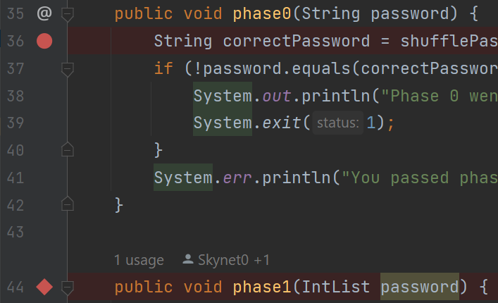
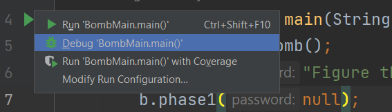
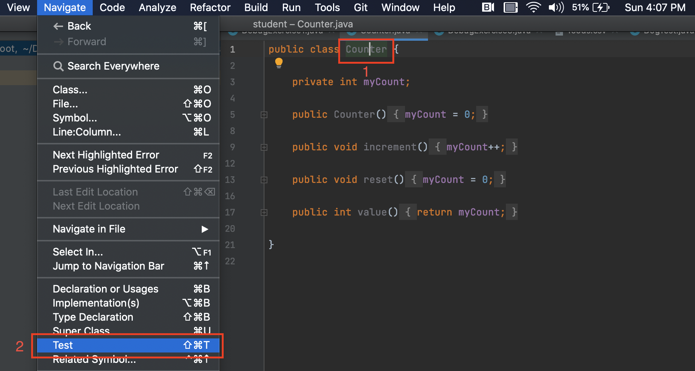

## [FAQ](faq.md)

Each assignment will have an FAQ linked at the top. You can also access it by
adding "/faq" to the end of the URL. The FAQ for Lab 03 is located
[here](faq.md).

## Introduction

To debug a program, you must first know what's wrong. In this lab, you'll get
some experience with using the debugger to see program state. There are 3 types of bugs that you can encounter in code:
1. Compiler error: There is some compilation issue (ie. IntelliJ underlines the code in red).
2. Runtime: There is an exception that occurs while running the program.
3. Correctness: The program runs without error, but it produces incorrect results.

When you run into a runtime bug, the error is accompanied by a "stack trace" that details the method
calls that caused the error in the first place. One of the focuses of this lab
will be to get you used to reading these stack traces, because they can be
**super** helpful in debugging your own code.

After you've gotten practice debugging, you'll explore TDD (test-driven development), 
a good practice industry-standard approach in which you design and write test cases before 
writing the actual code they test.

### Setup

Follow the
[assignment workflow instructions](../../guides/assignment-workflow#getting-the-skeleton)
to get the assignment and open it in IntelliJ.

### Goals and Outcomes

In this lab, you will enhance your code debugging and testing abilities by defusing a
(programmatic) bomb and practicing test-driven development. We’ll guide
you through this process, but the intention is to make this a realistic
debugging and testing experience.

By the end of this lab, you will…

- Be able to use the debugger and visualizer to inspect program state.
- Be able to interpret stack traces.
- Be better able to approach debugging code.
- Have learned about some common Java bugs and errors.
- Have better testing practices when developing.

## `Bomb`

The `BombMain` class calls the various `phase` methods of the `Bomb` class.
Your job is to figure out what the passwords to each of these phrases is by
*using the IntelliJ debugger*.



### Interactive Debugging vs. Print Debugging

So far, you might have practiced debugging by using print statements to
see the values of certain variables as a program runs. When placed
strategically, the output from printing might help make the bugs obvious or
narrow down their cause. This method is called **print debugging**. While print
debugging can be very useful, it has a few disadvantages:

- It requires you to modify your code, and clean it up after.
- It's tedious to decide and write out exactly what you want to print.
- Printing isn't always formatted nicely.

In this lab, we'll show you a new technique, **interactive debugging** --
debugging by using an interactive tool, or a debugger. We'll focus on IntelliJ's
built-in debugger.

### Debugger Overview

#### Breakpoints

Before starting the IntelliJ debugger, you should set a few **breakpoints**.
Breakpoints mark places in your code where you can *suspend* the program while
debugging and examine its state. This:

-   Doesn't require you to modify your code or clean it up after, since
    breakpoints are ignored in normal execution.
-   Lets you see *all* the variables without needing to write print statements.
-   Lets IntelliJ display everything in a structured manner

To set a breakpoint, click the area just to the right of the line number.

{: style="max-height: 325px;" }

A red circle or diamond should appear where you clicked. If nothing appears,
make sure that you click next to a line with code. When the debugger reaches
this point in the program, it will pause **before** the execution of the line or
method. Click the breakpoint again to remove it.

#### Running the Debugger

Once you've set some breakpoints, you're ready to start a debugging session!
Click on the green triangle next to the class or test you want to debug (in test
files there may be two green triangles). Instead of clicking the green triangle
to run, click the
{: .inline } debug option:

{: style="max-height: 325px;" }

The selected program should run until it hits its first breakpoint. A debugger
window should also appear on the bottom of the interface, where the console was.

{: style="max-height: 325px;" }

On the left, you will be able to see all current method calls and on the right,
you will be able to see the values of instantiated variables at this point in
the program (they will also be shown in gray text in the editor). For instances
of classes, you can click the dropdown to expand them and look at their fields.

In the debugger, you have a few options:

-   Learn something from the displayed values, identify what's wrong, and fix
    your bug! Click the stop button {: .inline } to stop the debug session.
-   Click the resume button {: .inline } to resume the program (until it
    hits another breakpoint or terminates).
-   Click the step over button {: .inline } to advance the program by
    one line of code.
    -   The step into button {: .inline } does something similar, but
        it will step into any method called in the current line, while
        the step over button {: .inline } will step over it.
    -   The step out button {: .inline } will advance the program until
        after it returns from the current method.
-   If you accidentally step too far and want to start the session over, click the rerun button
    {: .inline }.

To see the console output (and type into the console) while debugging, click
the "Console" tab next to "Debugger" in the top left of the debug window,
just above the frames. If you want to see everything simultaneously (while
being more compressed), you can drag the console tab to the far right of the
bottom panel. 

### Reading Stack Traces

When a *runtime error* occurs in Java, a stack trace is printed to the console
to provide information on where the error occurred and what steps the program
took to get there. When running `Bomb` for the first time, your stack
trace will look something like this:

{: style="max-height: 325;" }

The first thing to note is what kind of error occurred; this is shown at the
first line of the stack trace. In this case, our code threw a
`NullPointerException`.

For some exceptions, including `NullPointerException`s, Java will give you an
explanation. Here, `password` is `null`, so we can't invoke (call) a method on
it.

The lines beneath it represent the sequence of methods the program took to
arrive at the error: the first line in the list is where the error occurred
and the line beneath it represents the line of code that called the method
which threw the error, and so on.

You can click on **`blue text`**{: .blue} to navigate to that file and line.

### `Bomb` Introduction (Phase 0)





 Once you've found the correct password, running the code (not in debug mode)
 should output "You passed phase 0 with the password \<password\>!" instead of
 "Phase 0 went BOOM!"

<details markdown="block">
<summary markdown="block">

**`phase0` Method Breakdown**

</summary>

The `phase0` method first generates a secret String `correctPassword` (you don't
need to understand how `shufflePassword` works). The `password` passed in from
`BombMain` is then compared against `correctPassword`. The goal of this phase is
to use the debugger to find the value of `correctPassword` and pass in a
`password` that matches that value!

</details>

### Visualizer (Phase 1)

While being able to see variable values is great, sometimes we have data that's
not the easiest to inspect. The Java Visualizer shows a box-and-pointer diagram of
the variables in your program, which is much better suited for large objects with a lot of data. 
To use the visualizer, run the debugger until you stop at a breakpoint, then click
the "Java Visualizer" tab.

The password for phase 1 is an `int[]`, not a `String`.



<details markdown="block">
<summary markdown="block">

**`phase1` Method Breakdown**

</summary>

The `phase1` method generates a secret `int[]` called `correctArrPassword`
(similar to the previous phase, you don't need to understand how
`shufflePasswordArr` works). The `password` (in the form of an `int[]`)
passed in from `BombMain` is then compared against the `correctArrPassword`
for equality. The goal of this phase is to use the debugger's Java Visualizer to
find the structure and value of the `correctArrPassword`'s `int[]` and pass
in a `password` that matches it!

</details>

### Optional Challenge: Conditional Breakpoints (Phase 2)



Sometimes you may want to have your program pause only on certain conditions.
To do so, create a breakpoint at the line of interest and open the
"Edit breakpoint" menu by right-clicking the breakpoint icon itself. There,
you can enter a boolean condition such that the program will only pause at this
breakpoint if the condition is true.

Another thing you can do is to set breakpoints for exceptions in Java. If your
program is crashing, you can have the debugger pause where the exception is
thrown and display the state of your program. To do so, click
{: .inline }
in the debugger window and press the plus icon to create a "Java Exception
Breakpoint". In the window that should appear, enter the name of the exception
that your program is throwing.

{% include alert.html type="task" content="
**Task**: Set a breakpoint at `phase2` and use the debugger to find the password
for `phase2` and replace the `phase2` argument accordingly in
`bomb/BombMain.java`. Remember, don't edit `Bomb.java`!

***

**Note**: The password isn't given explicitly like in the previous phases.
Rather, your task is to construct an input so that the `boolean correct`
variable is set to `true` after `phase2` is run.

***

**Tip**: After you pass phase 0 and phase 1, before you change anything else for phase 2,
try running `BombMain.java`. You'll see that the program  will exit with an `ArrayIndexOutOfBoundsException`,
and resultant stack trace, which means that the code is trying to access an array at an index that does not fit within
the bounds of the array. Revisit the [Reading Stack Traces](./#reading-stack-traces) section if you need a refresher on 
stack traces.
" %}

<details markdown="block">
<summary markdown="block">

**Hint 1**

</summary>

You may want to look up Java's `split` method for `String`s if you're unsure
of what it does.

</details>

<details markdown="block">
<summary markdown="block">

**Hint 2**

</summary>

You don't necessarily need to construct the password in one line of code.

</details>

<details markdown="block">
<summary markdown="block">

**Hint 3**

</summary>

You'll need to build the password in pieces so that the `split` method will cause
the correct number be in the right spot. 

</details>

<details markdown="block">
<summary markdown="block">

**Hint 4**

</summary>

After you've constructed a sufficiently long `String` so that `1337` is a valid
index, set a conditional breakpoint inside the for loop that pauses the program
when `i` is close to `1337`. Then step until you find the password.

</details>

<details markdown="block">
<summary markdown="block">

**`phase2` Method Breakdown**

</summary>

The `phase2` method takes in your `password` from `BombMain` and splits it by
spaces into the `passwordPieces` array. For example, if your password is `"1 2
3"`, then `passwordPieces` will be equivalent to `{"1", "2", "3"}`.

The method then adds 100,000 random integers to a `Set` called `numbers`. It
then loops through them using a for-each loop, incrementing a variable `i` as it
goes along. On the 1338th iteration (because Java is zero-indexed, `i == 1337`
on iteration 1338), we check whether the integer at the 1337th index of the
`passwordPieces` array is equal to the current `number`.
</details>

***

At this point, you should be able to run the tests in `tests/bomb/BombTest.java`
and have all of them pass with a green checkmark.

### Recap: Debugging

By this point you should understand the following tools:

- Breakpoints
- Step Over
- Step Into
- Step Out (though you might not have actually used it in this lab)
- Resume
- Conditional breakpoints

However, this is simply scratching the surface of the features of the debugger!
Feel free to experiment and search around online for more help.

Some useful features include:

-   Remember that
    [**Watches**](https://www.jetbrains.com/help/idea/examining-suspended-program.html#watches)
    tab? Why not read into what that does?
-   Or try out the incredibly handy
    [**Evaluate Expressions**](https://www.jetbrains.com/help/idea/examining-suspended-program.html#evaluating-expressions)
    calculator button (the last button on the row of step into/over/out buttons)?
-   Or perhaps look deeper into breakpoints, and
    [**Exception Breakpoints**](https://www.jetbrains.com/help/idea/using-breakpoints.html#exception-breakpoints)
    which can pause the debugger right _before_ your program is about to crash.

We won't always use all of these tools, but knowing that they exist and making
the debugger part of your toolkit is incredibly useful.

## Testing Your Code with Truth

In the rest of the lab, you will be officially introduced to Google's [Truth](https://truth.dev/) 
assertions library. It provides an intuitive way to write repeatable tests, which substantially reduces the tedium of testing
your code. Many of your lab submissions for the rest of the course will include
a Truth testing file and all of our autograders are written using Truth or JUnit.

You may already be familiar with JUnit, a common Java testing framework. Both
Truth and JUnit make easy an approach to programming called test-driven development
(TDD). TDD is a popular approach in industry in which you design and write test cases
before writing the code they test. We will encourage it in the remainder of CS
61BL, starting by leading you through the steps of the construction of a class
representing measurements (feet, yards, inches).

In 61BL, we will use Truth assertions inside JUnit framework tests instead of JUnit assertions for the following reasons:

- Better failure messages for lists.
- Easier to read and write tests.
- Larger assertions library out of the box.

We often write tests using the Arrange-Act-Assert pattern:

1.  **Arrange** the test case, such as instantiating the data structure or
    filling it with elements.
2.  **Act** by performing the behavior you want to test.
3.  **Assert** the result of the action in (2).

We will often have multiple "act" and "assert" steps in a single test method
to reduce the amount of boilerplate (repeated) code.


#### Truth Assertions

A Truth assertion takes the following format:

```java
assertThat(actual).isEqualTo(expected);
```

To add a message to the assertion that displays upon failure, we can instead use:

```java
assertWithMessage("actual is not expected")
    .that(actual)
    .isEqualTo(expected);
```

We can use things other than `isEqualTo`, depending on the type of `actual`.
For example, if `actual` is a `List`, we could do the following to check its
contents without constructing a new `List`:

```java
assertThat(actualList)
    .containsExactly(0, 1, 2, 3)
    .inOrder();
```

If we had a `List` or other reference object, we could use:

```java
assertThat(actualList)
    .containsExactlyElementsIn(expected)  // `expected` is a List
    .inOrder();
```

Truth has many assertions, including `isNull` and `isNotNull`; and
`isTrue` and `isFalse` for `boolean`s. IntelliJ's autocomplete will often give
you suggestions for which assertion you can use.

#### Example Test

Let's break down an example test:

```java
@Test
/** In this test, we use only one assertThat statement. 
    *  In other words, the tedious work of adding the extra assertThat statements isn't worth it. */
public void arrTest() {
    int[] arr = new int[3]; // arr is [0, 0, 0] because elements of int[] are initially set to 0
    
    arr[0] = 42; // after this we expect: [42, 0, 0]
    arr[1] = 27; // after this we expect: [42, 27, 0]
    arr[2] = 961; // after this we expect: [42, 27, 961]
        
    assertThat(arr).asList().containsExactly(42, 27, 961).inOrder();
}
```

-   `@Test` tells Java that this is method is a *test*, and should be run when
    we run tests.
-   **Arrange**: We construct a new `int[]` called `arr`, and set 3 elements in it at indices 0, 1, and 2.
-   **Act**: We call `asList` on the result of `assertThat(arr)`, which turns the assertion object into a list and implicitly depends on the
      earlier sets to the array.
-   **Assert**: We use a Truth assertion to check that the object created from `asList` contains
    specific elements in a specific order.


### Task: Using IntelliJ to Write Tests

{% include alert.html type="warning" content="
Similar to the debugging exercises, this section will not be graded, but it is
recommended that you complete this exercise either now or sometime over the
next few days. Testing is an equally important skill to learn as it will
be used extensively throughout the rest of our class (in labs, projects, and
exams).

Past that, in industry, testing your code is a huge part of what you will do as
a software engineer. Writing code is incomplete without a solid set of tests to
verify its fault tolerance and accuracy.

**Untested code is broken code.**
" %}

One of the many great features about IntelliJ is that it can be used to start
generating JUnit tests, which we will use as a skeleton for our Truth assertions. We will illustrate how it can be used with the
following example. Follow along each of the steps in IntelliJ.

1.  Navigate to `Counter.java`. In it, you will see an instance variable `myCount`, some instance methods (`increment()`, `reset()`, `value()`),
    and the constructor, defined as `public Counter() { myCount = 0; }`.
    As a quick refresher, the constructor creates an instance of the `Counter` class and initializes
    its `myCount` instance variable (attribute) to 0. We'll talk more about objects in depth next week; for now, 
    we just want you to pay attention to the flow of how tests are generated, and for which methods.

2.  Make a new JUnit Test Case:

    -   **Click** on the class name in the `Counter.java` file and select
        **"Navigate -> Test"**. Alternatively, you can use
        <kbd>CTRL</kbd> / <kbd>CMD</kbd> + <kbd>Shift</kbd> + <kbd>T</kbd>.

        

    -   Click **"Create New Test..."**. If you are asked to create test in the
        same source root, click **"Ok"**.

        

    -   Name the JUnit Test Case `CounterTest`. Select "JUnit 4" as the testing
        library. Next check the boxes for the `increment()` and `reset()`
        functions.

        

    -   You should see a file similar to the following:

        ```java
        import org.junit.Test;

        import static org.junit.Assert.*;

        public class CounterTest {

            @Test
            public void increment() {
            }

            @Test
            public void reset() {
            }
        }
        ```
    -   **At this point, we have a nice skeleton testing setup, but we don't want to use
        JUnit assertions. Replace the `import static org.junit.Assert.*;` line at the 
        top with `import static com.google.common.truth.Truth.assertWithMessage;` so that we 
        can use Truth assertions.**

    -   Edit your `CounterTest.java` as follows:

        -   In `testIncrement`, put the code

            ```java
            Counter c = new Counter();
            c.increment();
            assertWithMessage("Counter value is not 1.").that(c.value()).isEqualTo(1);
            c.increment();
            assertWithMessage("Counter value is not 2.").that(c.value()).isEqualTo(2);
            ```

        -   In `testReset`, put the code

            ```java
            Counter c = new Counter();
            c.increment();
            c.reset();
            assertWithMessage("Counter value is not 0 after reset.").that(c.value()).isEqualTo(0);
            ```

        -   IntelliJ doesn't generate constructor tests. Add one:

            ```java
            @Test
            public void testConstructor() {
                Counter c = new Counter();
                assertWithMessage("Counter value is not 0 upon instantiation.").that(c.value()).isEqualTo(0);
            }
            ```

3.  Run your tests individually; they should all pass. You should also be able to run your full
    test file (test case) and see that all tests pass.

4.  We have shown you what it looks like to pass a test, but what happens if
    you fail? Intentionally introduce an error into one of the `CounterTest`
    methods, asserting for example that the value of a freshly-built `Counter`
    object should be 7. Run the test again and observe the error messages
    that result.

## Testing Principles

### Test-Driven Development

_Test-driven development_ is a development process that involves designing test
cases for program features before designing the code that implements those
features. The work flow is:

1.  Write test cases that demonstrate what you want your program to be
    able to do. As the code isn't written yet, most tests should fail.
2.  Write as little code as possible so that all the tests are passed.
3.  Clean up the code as necessary. Recheck that all tests still pass.

### Test Effectiveness

Unsurprisingly, there are effective tests and ineffective tests. The presence
of tests alone does not mean that those tests are doing anything:

```java
@Test
public static void uselessTest() {
    assertThat(true).isEqualTo(true);
}
```

Given a codebase, and tests for that codebase, how can we evaluate how "good"
the tests are? In other words, how much confidence do our tests give us that
our code is completely, fully correct?

#### Statement Coverage

One testing principle you can imagine is that test values should exercise every
statement in the program, since any statement that's not tested may contain a
bug. Below is a program that checks whether a given year is a leap year:

```java
public static boolean isLeapYear(int year) {
    if (year % 400 == 0) {
        return true;
    } else if (year % 100 == 0) {
        return false;
    } else if (year % 4 == 0) {
        return true;
    } else {
        return false;
    }
}
```

The code contains four cases, exactly one of which is executed for any
particular value of year. Thus we must test this code with at least one year
value per case, so at least four values of year are needed for testing:

- a year that's divisible by 400;
- a year that's divisible by 100 but not by 400;
- a year that's divisible by 4 but not by 100;
- a year that's not divisible by 4.

This approach by itself is insufficient as we will see below.

#### Path Coverage

To augment this first principle, we'll say we need to test various _paths_
through the program. For example, suppose our program had two consecutive `if`
statements:

```java
if ( ... ) {
    ...
}
if ( ... ) {
    ...
}
```

There are two possibilities for each if case: `true` or `false`.
Thus there are four paths through the two statements, corresponding to the four
possibilities

- `true`, `true`
- `true`, `false`
- `false`, `true`
- `false`, `false`

The following example shows why statement coverage is not a guarantee of
correctness:

{% include alert.html content="
A `year` value of 2000 causes all the statements in the below program segment
to be executed, giving 100% statement coverage. However, there may be a bug in
this code it will not catch.
" %}

<!-- TODO: see https://cs61bl.org/su17/materials/lab/lab08/lab08.html#testing-principle-1
and bring the bug introduction exercise back.
 -->

```java
public static boolean isLeapYear(int year) {
    isLeapYear = true;
    if (year % 4 == 0) {
        isLeapYear = true;
    }
    if (year % 100 == 0) {
        isLeapYear = false;
    }
    if (year % 400 == 0) {
        isLeapYear = true;
    }
    return isLeapYear;
}
```

From the previous discussion, it looks like we need _eight_ tests,
corresponding to the eight paths through the three `if` statements. They are listed below.

```java
    year % 4 == 0, year % 100 == 0, and year % 400 == 0  // (which just means that year % 400 == 0)
    year % 4 == 0, year % 100 == 0, and year % 400 != 0
    year % 4 == 0, year % 100 != 0, and year % 400 == 0  // (not possible)
    year % 4 == 0, year % 100 != 0, and year % 400 != 0
    year % 4 != 0, year % 100 == 0, and year % 400 == 0  // (not possible)
    year % 4 != 0, year % 100 == 0, and year % 400 != 0  // (not possible)
    year % 4 != 0, year % 100 != 0, and year % 400 == 0  // (not possible)
    year % 4 != 0, year % 100 != 0, and year % 400 != 0  // (equivalently, year % 4 != 0)
```

Notice that some of the tests are logically impossible, and so we don't need to
use them. This leaves the _four_ tests we needed to write.

### Testing Loops

Loops can vastly increase the number of logical paths through the code, making
it impractical to test all paths. Here are some guidelines for testing loops,
drawn from _Program Development in Java_ by Barbara Liskov and John Guttag, a
book used in previous CS 61B offerings.

-   For loops with a fixed amount of iteration, we use two iterations. We choose
    to go through the loop twice rather than once because failing to
    reinitialize after the first time through a loop is a common programming
    error. We also make certain to include among our tests all possible ways
    to terminate the loop.
-   For loops with a variable amount of iteration, we include zero, one, and
    two iterations, and in addition, we include test cases for all possible
    ways to terminate the loop. The zero iteration case is another situation
    that is likely to be a source of program error.

> Liskov and Guttag also say: This approximation to path-complete testing is, of
> course, far from fail-safe. Like engineers' induction "One, two, three—that's
> good enough for me," it frequently uncovers errors but offers no guarantees.

### Black-box Testing

All the testing principles discussed so far focused on testing features of the
code. Since they assume that we can see into the program, these techniques are
collectively referred to as _glass-box_ testing, as if our code is transparent.

Another testing approach is called _black-box_ testing. It involves generating
test cases based only on the problem specification, not on the code itself.
There are several big advantages of this approach:

-   The test generation is not biased by knowledge of the code. For instance, a
    program author might mistakenly conclude that a given situation is
    logically impossible and fail to include tests for that situation; a
    black-box tester would be less likely to fall into this trap.

-   Since black-box tests are generated from the problem specification, they
    can be used without change when the program implementation is modified.

-   The results of a black-box test should make sense to someone unfamiliar
    with the code.

-   Black-box tests can be easily designed before the program is written, so
    they go hand-in-hand with test-driven development.

In black-box testing as in glass-box testing, we try to test all possibilities
of the specification. These include typical cases as well as _boundary_ cases,
which represent situations that are extreme in some way, e.g. where a value is
as large or as small as possible.

There are often a variety of features whose "boundaries" should be considered.
For example, in the `DateConverter` program, boundary cases would include not
only dates in the first and last months of the year, but also the first and
last dates of each month, etc.


Whenever you write a program, try to think of any boundary cases. These cases,
although potentially rare, are a common source of error. The safest thing to do
is brainstorm as many unique ones as you can then write tests which test each
unique boundary case.




### Parting Advice on Testing

As you progress through the course, you will hopefully improve your testing
skills! Here are some last bits of advice for now.

-   Write tests as if you were testing your _worst enemy's_ code. You're
    generally too familiar with your own code and might read a given line as
    containing what you meant to write rather than what you did write. Don't
    fall into the trap of hoping not to find bugs in your own code.

-   Test your program with values that are as simple as possible. If the
    program is supposed to work for a set of 1000 data values, make sure it
    works on a set of 3 values first.

-   Wrapping a loop around your code may allow you to test it with multiple
    values in a single run.

-   Make sure you know how your program is _supposed_ to behave on a given set
    of test data. Often lazy programmers try a test and just scan through it
    thinking that it "looks right". Such a programmer might later be
    embarrassed to find out that they computed a product cost that's greater
    than the national debt or a quantity that's greater than the number of
    atoms in the universe.

-   Make sure to cover _both_ the common cases and the extreme, edge or
    boundary cases. Forgetting one or the other (or both!) can cause you to
    miss critical bugs in your code.

## Exercise: Testing a Triangle Class



Now, you're going to be writing the code and a whole file of
tests with Truth assertions for the `Triangle` class. Your goal is to write comprehensive tests
that pass on a correct implementation of the `Triangle` methods, but fail on incorrect implementations of `Triangle`
methods. 

You'll notice that `Triangle.java` and `TriangleTest.java` use the `abstract` keyword. You don't need to know 
what this is right now because we'll cover it later in the course, but in `TriangleTest.java`,
when you are testing the `Triangle` methods, you must call them on a `Triangle` object returned by `getNewTriangle()`.
The skeleton code has more on this.

You should follow this process for this exercise:

1.  Read over the `Triangle.java` class throughly. The comments above each of the methods explain what
    the expected behavior of this class will be. 
2.  Write tests with Truth assertions in the `TriangleTest.java` file. You should write tests
    which allow you to test all of the methods and behavior in the class. You should think of edge
    cases that buggy implementations of `Triangle.java` methods are likely to fail. 
3.  Though you won't exactly be practicing TDD here because you're only writing the tests and not filling
    in the `Triangle.java` class after, still think about how you would implement the methods. Do your
    tests poke holes in your first instinctual implementations? Do you see how writing tests before writing the code
    can be beneficial?


## Recap

In this lab, we discussed:

- Effectively using the IntelliJ debugger.
- Truth assertions and the JUnit Testing Framework.
- Test-driven development and good testing principles.


## Deliverables and Scoring

The lab is out of 2 points. There are no hidden tests on Gradescope. If you
pass all the local required tests (not including the optional ones) and write comprehensive tests in `TriangleTest.java`, 
you will receive full credit on the lab.

- Find the first 2 passwords in `BombMain.java`. 
- (Optional) Find the 3rd password in `BombMain.java`. 
- Write tests in `TriangleTest.java` that pass on the correct `Triangle.java` implementation and fail on buggy `Triangle.java` implementations. 


## Submission

Just as you did in Lab 1, add, commit, then push your Lab 3 code to GitHub.
Then, submit to Gradescope to test your code. If you need a refresher, check
out the instructions in the
[Lab 1 spec](../lab01/index.md#saving-your-work-using-git-and-github) and the
[Assignment Workflow Guide](../../guides/assignment-workflow#submitting-to-gradescope).

If you worked with a partner, remember each of you need a separate submission on Gradescope.


## Acknowledgements

This assignment is adapted from Adam Blank and previous iterations of CS 61B.
