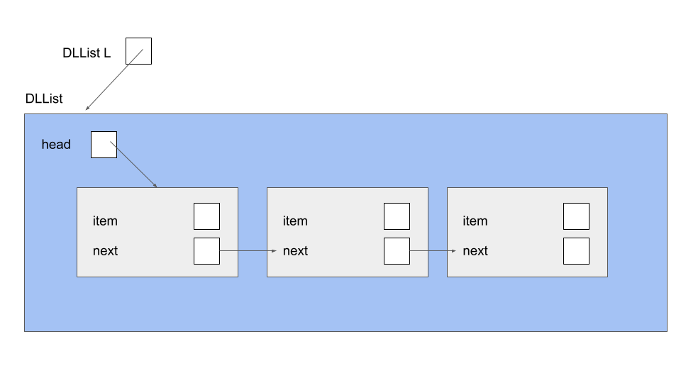
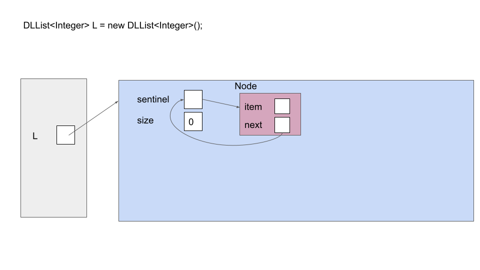
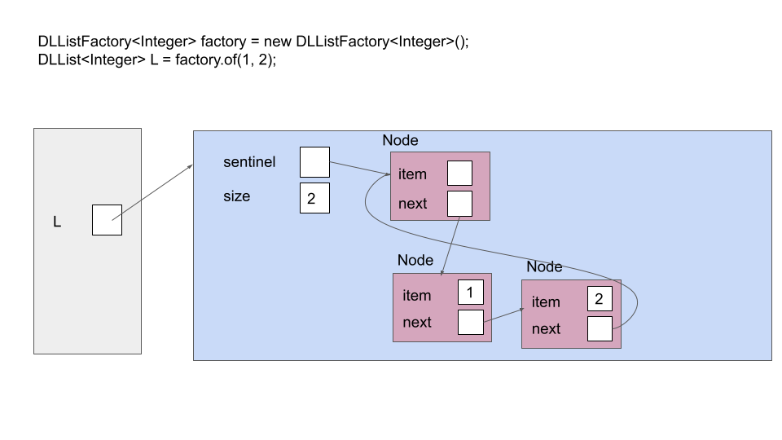
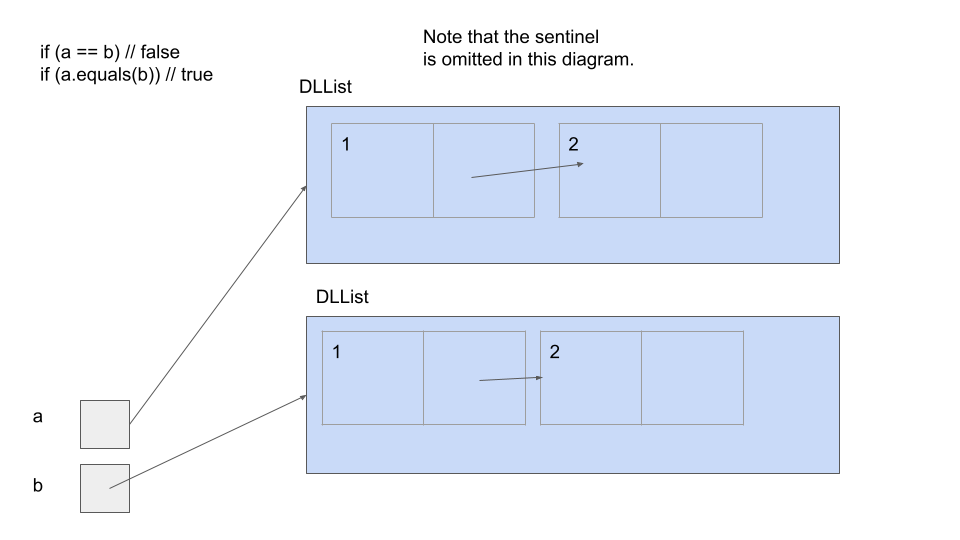
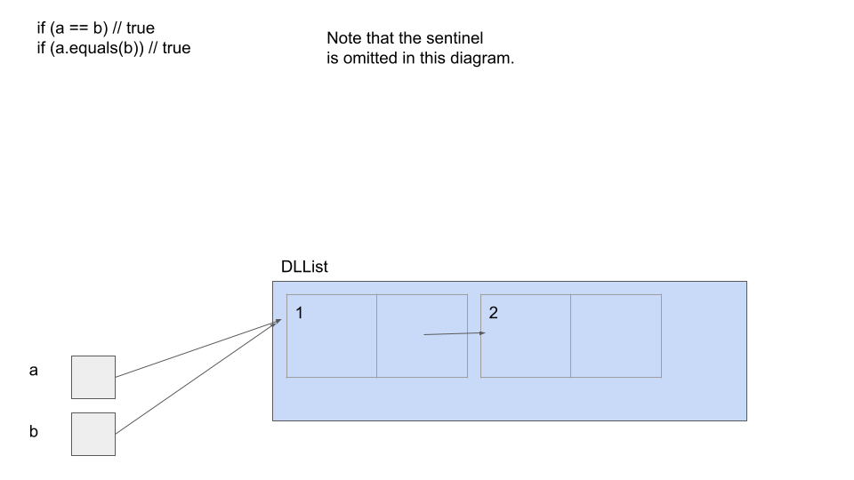

## [FAQ](faq.md)

Each assignment will have an FAQ linked at the top. You can also access it by
adding "/faq" to the end of the URL. The FAQ for Lab 5 is located
[here](faq.md).


## Before You Begin

Reference the [Git WTFS guide](https://cs61bl.org/su23/guides/git-wtfs) and [lecture one](https://docs.google.com/presentation/d/1Eose6fZRqWK9GWS7sfHMBDK97-QKx39bBZktZshoZUc/edit) for any git confusions!

### Learning Goals for Today

This lab introduces you to the _linked list_, a data structure you may remember from [CS 61A](http://composingprograms.com/pages/29-recursive-objects.html). This is one of the fundamental data structures. In some sense, linked lists and arrays are the only two real data structures, and all others fall from different usages of them. Much like an array, a linked list stores sequential data. However, linked lists use _nodes_; each node stores one item and a reference to the next node. The last node in a linked list has no next node, so it stores a `null` reference instead.

As with arrays, we would like to store any generic data type. Thankfully, Java provides an aptly-named feature, generics, to support such functionality. This lab begins with a lesson about generics, and then dives into using this to create a general Linked List. Then, we will implement some basic functional methods. Finally, we will make a number of observations, and from these observations we will enhance our linked list.

Along the way, we'll also talk about testing and debugging software engineering principles.


## Generics

Suppose we have a class which we would like to support storing any general data type. How might we accomplish this? Consider the implementation of the Box class, which simply stores an object of generic type:
```
public class Box<T> {
    T storedObject;
}
```

There are two key details we must have. The first is that, after the class definition, we have included a `<T>`, which declares that this class has a generic data type T. The second detail is that, whenever we wish to declare an object of that generic data type, we use T as the type. And that's all there is to generics. Pretty convenient syntax!

There is one final detail we must know before we can move on. The way to instantiate an object that uses generics is as follows:

`Box<String> box = new Box<String>();`

In the declaration, we must use the `<>` symbols, and in the construction we must specify the precise type of data that the generic will be. For example, in the above code we created a Box for type String. Note that this precise type is specific to this particular instance of Box. We could make a new instance of Box following this that has a different data type in its generic. 

One final thing you should know about generics that won't come up in this lab (but will later in this course!): it is possible for classes to have more than one type of generic. We could have something like the following:

```
public class MapItem<K, V> {
    K key;
    V value;
}
```

We would then have to specify two generic types when instantiating a member of this class. 

## Introduction to Linked Lists

A linked list is similar to an array in that it also stores sequential data, but different operations have different runtimes between linked lists and arrays. Since different problems call for different efficient operations, choosing the right data structure is an important design choice for an engineer, and we'll study this as we go through the course.

Here's a picture of a simple implementation of a linked list that contains the items "A", "B", and "C" (can you draw the corresponding picture for an array that stores these items?). A linked list consists of _nodes_ that are chained together. Here we represent nodes with a generic class `ListNode`. Each node contains some _item_ called `item`. As you can see, the items form a sequence. In this example, the linked list items are `String`s, though the linked list we will be building later will be able to contain any type of object.


## SLList
### A Straightforward Implementation of a Linked List

Here's an implementation of an `SLList`, whose naming we will explain later. Notice how it stores an item `item` and a reference to another node `next`.

```java
public class SLList<T> {
    public T item;
    public SLList<T> next;
}
```

### SLList Box and Pointer Diagram

Draw out the box and pointer diagram that would result after the following code has been executed.
When you and your partner have compared diagrams, check your accuracy using the Java Visualizer below.


public class SLList<T> {
    public T item;
    public SLList<T> next;

    public static void main(String[] args) {
        SLList<Integer> L = new SLList<Integer>();
        L.item = 5;
        L.next = null;

        L.next = new SLList<Integer>();
        L.next.item = 10;
        SLList<Integer> p1 = L.next;

        L.next.next = new SLList<Integer>();
        L.next.next.item = 15;
        SLList<Integer> p2 = p1.next;
        p1.next = null;
    }
}



> If it's hard to see what's going on in the Java Visualizer, enable the
> following two **options** from the code editor.
>
> - **Prefer non-nesting and vertical layouts**
> - **Force linked lists to display vertically**


### SLList JUnit

For this part of the lab, we've written JUnit tests for you in `tests/SLListTest.java`.
Open it up and read through it. The first thing you'll notice are the imports at the top. These imports are
what give you easy access to the JUnit methods and functionality that you'll
need to run JUnit tests. If you want to read more about JUnit, refer to [Lab 3](../lab03/).

### Exercise: The `get` Method

Fill in the `get` method in the `SLList` class. `get` takes an `int` position as an argument, and returns the list element at the given (zero-indexed) position in the list.

For example, lets say you have an `SLList` for Integers with items 44, 79, and 109. If `get(1)` is called, you should return 79. If the position is out of range, `get` should throw `IllegalArgumentException` with an appropriate error message (just type in `throw new IllegalArgumentException("YOUR MESSAGE HERE")`). Assume `get` is always called on the first node in the list. For now, do not worry too much about the details of exceptions - we will cover them in more depth next week.

```java
public class SLList<T> {
    public T get(int position) {
        ....
    }
}
```

Once you have something, **test your code** by running `SLListTest.java`.
If your implementation is correct, you should pass the `get` method tests.

### Exercise: `toString` and `equals`

In [Lab 4](../lab04/#exercise-pursuit-curves), we introduced you to the `toString` and `equals` methods and you worked with a `Point` class for your pursuit curves that implemented these methods.

Implement the standard Java methods, `toString` and `equals`, in the `SLList`
class.

> Once you're done, test your code using the provided JUnit tester in `SLListTest.java`.

`toString`
: The `toString` method for `SLList` returns the `String` representation of
this list, namely:

    1. The `String` representation of the first element, followed by a space,
    2. The `String` representation of the second element, followed by a space,
    3. ...
    4. The `String` representation of the last element.

    The list containing the integers 1, 3, and 5 is represented by the string
`1 3 5`.

<details markdown="block">
  <summary markdown="block">
#### Hint: How would you convert an object to a string in Java?
{: .no_toc}
  </summary>
Try looking at the documentation for the [Object class](https://docs.oracle.com/javase/8/docs/api/java/lang/Object.html), and see if there is a method that would be helpful.
</details>


`equals`
: Given an `Object` as argument, this method returns `true` if this list and
the argument list are the same length and store equal items in corresponding
positions (determined by using the elements' `equals` method).

You will note that we have given you some starter code for this section. You will see a new keyword there - `instanceof`! You should investigate this keyword in online documentation, but essentially it checks if a variable is of the provided type. You might also notice a new piece of syntax in the following line of code: `SLList<T> otherLst = (SLList<T>) obj;`, with `(SLList<T>)`. This is called casting, and we will study it in more depth later. For now, you should understand that it tells Java to treat the casted, object, in this case `obj`, as of being of the type provided in the cast.

Keep these new features in mind - it may be useful in a project coming soon!

### Exercise: `add`

Fill in the `add` method, which accepts an `T` as an argument and appends an
`SLList` with that argument at the end of the list. For an Integer list `1 2 3 4 5`,
calling `add` with `8` would result in the same list modified to `1 2 3 4 5 8`.

Hint: You may be wondering from which node in the list do we call the method from. As it turns out, it does not matter. You should think about why.

```java
public void add(int value) {
    // TODO
}
```

### SLList Utilities

You may have noticed that there are a few other files pertinent to SLLists in the `src` directory. The first one of note is `SLListFactory.java`. This is a separate file from SLList that also includes a generic T and contains various utility methods for SLLists. The most useful one is the `of` method, which takes in a series of values of type T and creates an SLList that contains those values in the provivded order. Here is a code example of how to use it:
```java
SLListFactory<String> factory = new SLListFactory<String>();
SLList<String> list = factory.of("Cat", "Dog", "Hamster", "Bunny", "Fox");
// One line of using factory.of() can do the job of four lines!
```
This is much easier than having to create each node and set the links by hand!

The other utility we should learn about now is `FunctionContainer.java`. This is actually not a class like we've been working with for the previous few labs. This is an interface, which we'll learn about in the next lab. In Java, unlike other languages like Python, it is not possible to directly pass in functions as arguments to other functions. Instead, what we can do is have an instance of a class that contains a function, i.e. the FunctionContainer, and pass that in as an argument. Then, the function that's being called can invoke the function contained in the FunctionContainer.

Here is an example of an implementation of FunctionContainer:
```java
public class SquareFunctionContainer implements FunctionContainer<Integer> {
        public Integer func(Integer num) {
            return num * num;
        }
    }
```
Do not worry about how this was implemented or any new keywords you see - you'll learn about all this very soon!

Now, we have all the tools we need to begin examining the remainder of the utility methods in `SLListFactory.java`!

## Destructive vs. Non-Destructive

Suppose you have an `SLList` representing the list of integers `1 2 3 4`. You
want to find the list that results from squaring every integer in your list, `1
4 9 16`.

There are two ways we could go about solving this problem. The first way is to
traverse your existing initial `SLList` and actually change the items stored in your
nodes. Such a method is called **destructive** because it can change (*mutate*
or *destroy*) the original list. Here is how we would implement this, using the utilities we just learned about:

```java
SLListFactory<Integer> factory = new SLListFactory<Integer>();
SquareFunctionContainer funcContainer = new SquareFunctionContainer();
SLList<Integer> myList = factory.of(1, 2, 3, 4);
SLList<Integer> squaredList = factory.dFuncList(myList, funcContainer);
System.out.println(myList);
System.out.println(squaredList);
```

Running the above, destructive program would print,

    1 4 9 16
    1 4 9 16

The second way is called **non-destructive**, because it allows you to access
both the original and returned lists after execution. This method returns a list containing
new `SLList` nodes such that the original list is left unchanged.

```java
SLListFactory<Integer> factory = new SLListFactory<Integer>();
SquareFunctionContainer funcContainer = new SquareFuncContainer();
SLList<Integer> myList = factory.of(1, 2, 3, 4);
SLList<Integer> squaredList = factory.funcList(myList);
System.out.println(myList);
System.out.println(squaredList);
```

Running the above, non-destructive program would print,

    1 2 3 4
    1 4 9 16

In practice, one approach may be preferred over the other depending on the
problem you are trying to solve and the specifications of the program. We will talk about such
trade-offs throughout the rest of the semester!

### `dFuncList` Implementation

We now turn to implementing a set of functions that take in a SLList and a FunctionContainer containing a function, and execute that function across all of the elements in the SLList. First, we will implement the destructive version of this method, `dFuncList`.

Here is one possible implementation of `dFuncList`, along with a call to
`dFuncList`.

```java
public static void dFuncList(SLList<T> L, FuncContainer funcContainer) {
    while (L != null) {
        L.item = funcContainer.func(L.item);
        L = L.next;
    }
}
```

```java
SLListFactory<Integer> factory = new SLListFactory<Integer>();
SquareFunctionContainer funcContainer = new SquareFunctionContainer();
SLList<Integer> origL = factory.of(1, 2, 3)
dFuncList(origL, funcContainer);
// origL is now (1, 4, 9)
```

The reason that `dFuncList` is destructive is because we change the values of
the **original input** `SLList<T> L`. As we go along, we square each value, and the
action of changing the internal data persists.

It is also important to observe that the bits in the `origL` box do not change. Objects
are saved by reference, meaning the value tied to the variable will point to a memory address
rather than the integer values in our list. Thus, though this method is destructive, it is changing
the value saved in the memory location referred to by `origL`, not the value within `origL` itself. 
For more about this, refer to [Lab 4](../lab04/).

#### Testing `dFuncList`

The `dFuncList` implementation above is provided to you in your skeleton file as well.

**Use the [Java Visualizer plugin in IntelliJ][] to visualize the SLList** and to understand how the `dFuncList` method works, discussing with your
partner as you do so. [Pointers and SLLists might seem confusing at first, but it's
important that you understand these concepts!](https://www.youtube.com/watch?v=Gu8YiTeU9XU)

Note: The choice to return void rather than a pointer to `L` was an arbitrary
decision. Different languages and libraries use different conventions ([and
people get quite grumpy about which is the "right" one](https://en.wikipedia.org/wiki/Lilliput_and_Blefuscu)). We have the flexibility to decide
when writing destructive methods when mutating objects passed in as arguments. Talk to your
partner about why this is and try to think of settings where one would be preferable over the other.

[java visualizer plugin]: {{ site.baseurl }}/guides/plugin#java-visualizer

### Non-Destructive Function Transformations

`funcListIterative()` and `funcListRecursive()` are both *non-destructive*.
That is, the underlying `SLList` passed into the methods does **not** get
modified, and instead a fresh new copy is modified and returned.

```java
public SLList<T> funcListIterative(SLList<T> L, FunctionContainer funcContainer) {
    if (L == null) {
        return null;
    }
    SLList<T> res = new SLList<>(funcContainer.func(L.item), null);
    SLList<T> ptr = res;
    L = L.next;
    while (L != null) {
        ptr.next = new SLList<>(funcContainer.func(L.item), null);
        L = L.next;
        ptr = ptr.next;
    }
    return res;
}
```

```java
public SLList<T> funcListRecursive(SLList<T> L, FunctionContainer funcContainer) {
    if (L == null) {
        return null;
    }
    return new SLList<T>(funcContainer.func(L.item), funcListRecursive(L.next, funcContainer));
}
```

Ideally, you should spend some time trying to really understand them, including
possibly using the visualizer. However, if you don't have time, note that the
iterative version is much messier.

The iterative versions of non-destructive `SLList` methods are often (but not
always) quite a bit messier than the recursive versions, since it takes some
careful pointer action to create a new `SLList`, build it up, and return it.

### Exercise: Concatenation

To complete the lab, implement `dcatenate` and `catenate` in `SLListFactory` as described below.

```java
public SLList<T> dcatenate(SLList<T> A, SLList<T> B) {
    // TODO
}
```

```java
public SLList<T> catenate(SLList<T.> A, SLList<T> B) {
    // TODO
}
```

Both methods take in two `SLList`s and concatenate them together, so
`catenate(SLList<T> A, SLList<T> B)` and `dcatenate(SLList<T> A, SLList<T> B)` both
result in an `SLList` which contains the elements of `A` followed by the
elements of `B`. The only difference between these two methods is that
`dcatenate` modifies the original `SLList A` (it's destructive) and `catenate`
does not.

As an example, if you call either of the methods with two SLLists containing [0, 1, 2] and [3, 4], both `catenate` and `dcatenate` will result in an `SLList` containing [0, 1, 2, 3, 4]. However, while catenate will leave the original lists untouched, dcatenate will result in A looking like [0, 1, 2, 3, 4]. In other words, A is a pointer to the output!

To complete this part of the lab:

- Fill in one of `dcatenate()` or `catenate()`, and run them against our tests.
  Revise your code until it passes our tests.
- Repeat for the method you haven't yet completed. (We recommend you do one
  first and finish it before you start the next, because then you'll be able to
  take advantage of the similar logic).

`SLList` problems can be tricky to think about, and there are always several
approaches which can work. Don't be afraid to pull out pen and paper or go to
the whiteboard and work out some examples! If you get stuck, drawing out the
pointers can probably steer you back onto the path of progress. And, as always,
the debugger is a great option!

Feel free to use either recursion or iteration. For extra practice, try both!

It's also often useful to first think about base cases, such as when `A` is
`null`, for example. This works especially well for building up a recursive
solution. In other words, write up a solution that would work for the base
case, then stop and think about how to expand this solution into something that
works for other bigger cases.

For this problem, it is okay for `dcatenate` to return one or the other list if
one or both of `A` and `B` are `null`. For `catenate`, it is okay to attach `B`
to the end of `A` without making a full copy of `B`. However, think about and
discuss the following two questions with your partner:

- Why does this still produce a 'correct' program?
- What kinds of problems could this decision cause?

## True Linked Lists
We have now finished a basic implementation of a linked list, and built a few useful factory methods for generating and modifying them. One of the main questions we will be asking ourselves repeatedly in this course is: can we do better? The answer, as you might expect by us asking this question, is yes. In fact, we can do better on several fronts. Let us make a number of observations about our current SLList.

### Observation #1: Unprotected Abstraction Barriers
Abstraction is key to good code! However, our SLList does not protect them at all. The intended way to interact with the SLList is to use its various instance methods, i.e. `add`, `get`, etc. However, a user could also just directly change `.item` or `.next`. In other words, currently there is no distinction between the actual list object, and the nodes that it is composed of. This would mean that any user has to be extremely careful about using this data structure, which would make it difficut to scale in larger codebases. 

The trick to solving this is _encapsulation_, or to have a separate list structure that encapsulates the individual nodes.

We want to separate the idea of the list as an entity from an entry in the
list, much like an [*abstraction barrier*](http://composingprograms.com/pages/22-data-abstraction.html#abstraction-barriers). We'll
see that this design philosophy of encapsulation will come up over and over
again for each of the data structures we study in the coming weeks.

Let's update our `SLList` with encapsulation, which we will now call
a `DLList` (again, we will explain this name in due time).
Note that in order to emphasize the encapsulation in box-and-pointer diagrams, we
will be breaking the normal box-and-pointer rule that we don't put Objects
inside other Objects.

> Note that throughout the lab, some of the images do not depict the `size` variable for simplicity. This variable is an instance variable for all `DLList`s even if it is not shown in our illustrations.



All operations on the list are handled through an instance of a `DLList` object, which keeps a single instance variable `head` in order to track the first node in the linked list. The `DLList` object operates directly on the `Node`s that make up the `DLList`. Note that `Node` does not need any methods (other than some utility methods such as `toString()` and `equals()`, which you will use later). The main effect of using encapsulation, by using a reference to the `head` of a list, is allowing users that wants to interact with the `DLList` to know nothing about the internal representation of the list or how the operations will take place. Instead, users could simply operate on the list as a whole and the `DLList` representation itself will take care of the operations, including any null checks, size checks, or further operations.

### Observation #2: Dealing with Null is Annoying

Although encapsulation shields users of our data structure from having to deal with
cumbersome null checks, we as the implementors of our linked list class still have to handle them.
However, we can eliminate null checks and simplify our code greatly with usage of a _sentinel node_ instead of a just the `head` pointer. The sentinel node always exists (even when our list is empty), and does not represent an actual node in the list. Its `next` field represents the front of the list, unless the list is empty. The sentinel's `item` is some meaningless value, but it doesn't matter what its value is; **a sentinel's item should never be accessed**). The last node in the list should have its `next` pointing back at the `sentinel`, and an empty list is represented by just a `sentinel` node whose `next` points back to itself. In a box-and-pointer diagram, an empty singly-linked list with a sentinel looks like this:



and a 2-item singly-linked list with a sentinel looks like this:



This has many benefits. When iterating through the list, we do not need to worry about reaching a null pointer at any point; when our moving pointer reaches the sentinel, it's the end of the list. When inserting and removing nodes, we don't need to manually handle being near the end or the beginning of the list, or inserting/removing the first/last element of the list. The code can be written with disregard for null-checking edge cases and it will still work properly because of the sentinel!

In code, an implementation might look like this:

```java
public class DLList<T> {

    /**
     * Node is a nested class that represents a single node in the
     * SLList, storing an item and a reference to the next Node.
     */
    private class Node {
        /**
         * The access modifiers inside a private nested class are irrelevant:
         * both the inner class and the outer class can access these instance
         * variables and methods.
         */
        public int item;
        public Node next;

        public Node(int item, Node next) {
            this.item = item;
            this.next = next;
        }
    }

    /**
    *  sentinel is a dummy node that points to the first real node. That is,
    *  sentinel.item is a dummy value, while sentinel.next.item is our true
    *  first item.
    */
    private Node sentinel;
    private int size;

    /* ... more methods to operate on ... */
}
```

### `toString` and `equals`

Just like with SLList, we will want a `toString` method so that our linked lists will be displayed
in a more readable format when using the debugger or if using print lines, and we will also want
an `equals` method so that our calls to `assertEquals` in our tests will verify whether two lists
contain the same items. Overriding `equals()` allows us to
define how two objects should be considered equal. Recall that checking equality
of two objects `a` and `b` with `a == b` defines equality as whether or not `a` and `b` are the
same reference. Here is an illustration of this difference:




If you want to brush up on `==` versus `.equals`, we suggest you look at the "Identity and Equality" section of the [Java Crash Course](https://cs61bl.org/su23/java/).

These implementations have been provided for you this time. Take a brief look at the implementations of `toString` and `equals` in the DLList class (not just the Node class!) in
your skeleton file `DLList.java` to understand what we've changed.


### Exercise: `add`

As a bit of practice working with these improved lists, implement the `add` method in
`DLList.java`, which adds the `int x` to the list at the specified `int index`. Be
sure to look at and utilize the given completed methods. We suggest you read the entire class before starting coding this problem.

In the case that `index` is greater than or equal to the current size of the list,
`x` should just be added to the end of the list. For example, inserting into index
10 of an empty list should result in a list of size 1 with the inserted item in position 0.

```java
public void add(int index, int x) {
    // TODO
}
```

Check your solution with the tests provided in `DLListTest.java`. As always, feel free to add more testing methods!

### Exercise: `reverse`

Over the next few steps, we're going to be completing the method `reverse` in
`DLList` using our current `DLList` implementation.

```java
/* Reverses a linked list destructively and assigns sentinel.next to the head of the reversed
linked list.*/
public void reverse() {
    // TODO
}
```

We will assume the restriction that the reversal is to be done in place,
*destructively*, without creating any new nodes.

**However, don't implement the method just yet!**

#### Testing `reverse`

Once again, we're going to write the test *before* we write `reverse`, as part of our ongoing crusade of **test-driven development** (TDD).

Especially for tricky problems like this, thinking about test cases before writing code can help us write better code
more quickly. This foresight hopefully will lead to a better outcome when compared to rushing ahead and trying to solve the problem without
first having considered all the different scenarios.

Add JUnit tests in `DLListTest.java` to cover at least the following three situations:

- General case: That the function returns a reversed list (for lists of size $$\ge 2$$).
- Base case: That the function "reverses" a list of size 1 by completing without erroring.
- Base case: That the function "reverses" a list of size 0 by completing without erroring.

Note that, much like with SLList, we have provided a DLListFactory class that provides an `of` utility method. Use it to help with your testing!

#### Implementing `reverse`

```java
public void reverse() {
    // TODO
}
```

Try running the test you just wrote; it should fail. *This is a good sign
because it means our tests are working as expected.*

Implement `reverse` *recursively*, and rerun the tests until all of them pass. A
helper method that accepts an `Node` will be helpful.

*Hint*: This is a challenging problem. The following diagrams show the progression
of reversing a linked list recursively using a helper method called `reverseHelper`.

Note: The following diagrams refer to Nodes as IntListNodes. 

Initial call to helper function


Given a reference to the true first node in our linked list, we will take the
recursive leap of faith on the rest of the linked list as shown below.


Hit a base case(the end of the list)


Trusting our recursive leap of faith, we assign a `temp` variable to the returned
value of our recursive call, which should have reversed the current frame's L tail.


Set the end of the returned list to the current frame's L.


Since the current frame is the "end" of our the reversed linked list so far, we set
the current frame's L tail to be the sentinel.


Return the front of the reversed list.


Update sentinel to point to the front of the reversed linked list.


Now hopefully you are feeling more comfortable writing your own JUnit code! How are you liking it?
Does it build more confidence than just writing code and not testing it?
Some people find the rush of TDD addictive. You basically set up a little game
for yourself to solve. Some people hate it. Your mileage may vary. Whether you
personally enjoy the TDD flow or not, writing tests will be one of the most
important skills you learn here at Berkeley, and getting *[test-infected][]*
will save you and your future colleagues an enormous amount of time and misery.

[test-infected]: http://c2.com/cgi/wiki?TestInfected

> If you find the concept of test-driven development interesting, or just want
> to learn more about testing philosophy and the conversation around TDD, here
> are a couple interesting leisure readings:
>
> - [TDD is dead. Long live testing.](https://dhh.dk/2014/tdd-is-dead-long-live-testing.html)
> - [Why Most Unit Testing is Waste](https://rbcs-us.com/documents/Why-Most-Unit-Testing-is-Waste.pdf)
> - [A Response to "Why Most Unit Testing is Waste"](https://henrikwarne.com/2014/09/04/a-response-to-why-most-unit-testing-is-waste/)

## Observation 3: Operations are Inefficient in Certain Cases

Please note: this section is in-scope for exams and this course in general, but it has no mandatory exercises associated with it.

There are some major issues, both efficiency-wise and code-simplicity-wise with
the linked list implementations we've been working with so far:

- It's easy to insert into the front of the list, but requires a lot more work
  to insert into the back of the list.
- If we want to remove a node in our linked list, even if we have a reference
  to the node we want to remove, we have to traverse until we find the node
before it in order to remove it.

The solution to these problems is to use a **doubly-linked list**, or DLList! On the note of names, SLList means singly-linked list. Each node keeps track of the node after and before itself. If we aren't using a sentinel, then instead of just a `head` pointer, the list object maintains both a `head` and `tail` pointer, to the front and back of the list respectively. It looks like this:


This adds a bit of complexity to the operations, but allows for constant time insertion to the front and back, and allows the user to traverse the list either forwards or backwards. Additionally, this allows the list to delete any nodes, even in the middle of the list, in constant time without traversing to the middle **as long as it has a reference to the node that needs to be deleted**.

> The notion of a constant time operation is something you might have already been introduced to in a previous class like CS 61A. We will be covering this in much more detail once we get to the asymptotics analysis lab, but will provide a quick refresher here.
>
> We will consider a constant time operation to be some piece of code or method call, whose runtime (meaning the number of steps the program takes to complete execution) does not depend on the size of the inputs to the function. For insertion, imagine that the size of the input refers to the length of the list. A constant time insertion would thus mean that, regardless of the length of this list, the runtime of an insertion at the front or back of the list would take the same amount of time.
>
> Think about how a doubly-linked list will compare to that of a singly-linked list, and discuss with your partner how the doubly-linked list improves these runtimes. Make sure you both understand this concept before continuing.

If we are using a sentinel, then it will look like this:


Note that the sentinel's item is marked with an "X", again because that value is irrelevant.
If our list is of non-primitive items, then we can make it null. If it is of primitive items (like the `int`s we've been using), then it can just be any arbitrary value (since primitives cannot be null).

With all of these enhancements, the encapsulated doubly-linked list with a sentinel node is typically used in practice as the linked list representation, like in Java's own standard library class, java.util.LinkedList.

Now, it's your turn to try and implement a doubly-linked list! Currently, the `Node` class has a `prev` instance variable that has been unused. Try making it used, such that we can implement more efficient operations as described above!

### Invariants
An invariant is a fact about a data structure that is guaranteed to be true
(assuming there are no bugs in your code). This gives us a convenient checklist
every time we add a feature to our data structure. Users are also guaranteed
certain properties that they trust will be maintained. For example, an `SLList`
with a sentinel node has at least the following invariants:

- The sentinel reference always points to a sentinel node.
- The front item (if it exists), is always at sentinel.next.item.
- The size variable is always the total number of items in the list.
- The last node's next always points back at the sentinel node.

Be sure that any invariant broken while performing an operation on a data structure
is restored by the end of the function, so that subsequent function calls can rest
assured that they are acting on a valid data structure and that all of the instance
variables hold the proper values.

## Recap

Today we talked about the `SLList` and `DLList`. Methods involving Linked Lists can be implemented
iteratively and recursively. These functions can also be destructive or non-destructive.

First, we learned about generics, and used it to make a linked list that allowed any generic type of data.

Our initial attempt at a linked list was "naked", which was difficult to use because
knowledge of implementation details were necessary in order for its use.

We solved this problem through **encapsulation**. By nesting our node class inside
another class, we can setup an abstraction barrier to shield our users from the details,
and we can provide utility functions to allow users to operate naively upon our data structure.

To eliminate the need to have if statements that protect us from `NullPointerExceptions`,
we can use a **sentinel**.

Finally, for efficiency purposes, we can introduce backwards `prev` links as well to make it **doubly-linked**.

### Deliverables

- `SLList.java`
    - `get`
    - `toString`
    - `equals`
    - `add`
-  `SLListFactory.java`
    - `catenate`
    - `dcatenate`
-  `DLList.java`
    - `add`
    - `reverse`