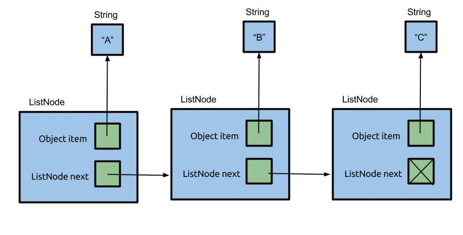

## [FAQ](faq)

Each assignment will have an FAQ linked at the top. You can also access it by
adding "/faq" to the end of the URL. The FAQ for Lab 5 is located
[here](faq).

{: .warning}
> **Warning:** this assignment is not officially released yet. This spec is subject to change until this warning disappears.

## Before You Begin

Reference the Git WTF guide and lecture one for any git confusions!

### Learning Goals for Today

This lab introduces you to the _linked list_, a data structure you may remember from [CS 61A](https://www.composingprograms.com/pages/29-recursive-objects.html). Much like an array, a linked list stores sequential data. However linked lists use _nodes_; each node stores one item and a reference to the next node. The last node in a linked list has no next node, so it stores a `null` reference instead.

It is possible to implement linked lists that store any type of data by using _generics_, which you will be learning about in detail in a later lab. For now, this lab will focus on a Linked List that stores only integers - an `IntList`, for which we have provided a template. In this lab you will implement some basic functional methods for this data structure; in the next lab you will implement some more finicky _destructive_ and _non-destructive_ methods (you'll get an introduction to these terms later today).

Along the way, we'll also talk about testing and debugging software engineering principles.

## Introduction to Linked Lists

In the next two labs we're going to be working with the _linked list_. A linked list is similar to an array in that it also stores sequential data, but different operations have different runtimes between linked lists and arrays. Since different problems call for different efficient operations, choosing the right data structure is an important design choice for an engineer, and we'll study this as we go through the course.

Here's a picture of a simple implementation of a linked list that contains the items "A", "B", and "C" (can you draw the corresponding picture for an array that stores these items?). A linked list consists of _nodes_ that are chained together. Here we represent nodes with a generic class `ListNode`. Each node contains some _item_ called `item`. As you can see, the items form a sequence. In this example, the linked list items are `String`s, though our linked list will contain `int`s instead, just like an `int[]`.



## IntList
### A Straightforward Implementation of a Linked List

Here's an implementation of an `IntList` which could easily be generalized to store different types of data. Notice how it stores an item `item` and a reference to another node `next`.

```java
public class IntList {
    public int item;
    public IntList next;
}
```

### IntList Box and Pointer Diagram

Draw out the box and pointer diagram that would result after the following code has been executed. You can visualize your code by clicking the "Visualize Code" below.


public class IntList {
    public int item;
    public IntList next;

    public static void main(String[] args) {
        IntList L = new IntList();
        L.item = 5;
        L.next = null;

        L.next = new IntList();
        L.next.item = 10;
        IntList p1 = L.next;

        L.next.next = new IntList();
        L.next.next.item = 15;
        IntList p2 = p1.next;
        p1.next = null;
    }
}

<br>

> If it's hard to see what's going on in the Java Visualizer, enable the
> following two **options** from the code editor.
>
> - **Prefer non-nesting and vertical layouts**
> - **Force linked lists to display vertically**


### IntList Tests

For this lab, we've written tests for you in `IntListTest.java` using the Google’s [Truth](https://truth.dev/) assertions library.
Open it up and read through it. The first thing you'll notice are the imports at the top. These imports are what give you easy access to the methods from the Truth library and and functionality that you'll need to run those tests. If you want to read more about Google's Truth library, refer to [Lab 4](../lab04/#testing-your-code-with-truth).

### Exercise: The `get` Method

Fill in the `get` method in the `IntList` class. `get` takes an `int` position as an argument, and returns the list element at the given (zero-indexed) position in the list.

For example, lets say you have an `Intlist` with items 44, 79, and 109. If `get(1)` is called, you should return 79. If the position is out of range, `get` should throw `IllegalArgumentException` with an appropriate error message (just type in `throw new IllegalArgumentException("YOUR MESSAGE HERE")`). Assume `get` is always called on the first node in the list.

```java
public class IntList {
    public int get(int position) {
        ....
    }
}
```

Once you have something, **test your code** by running `IntListTest.java`. If your implementation is correct, you should pass the `get` method tests.

**Tip**: Traverse the list until the specified position is reached. Throw an exception if the position is out of bounds.

{: .task}
> **Task**: Implement the `get` method.

### Exercise: `toString` and `equals`

In [Lab 3](../lab03/#tostring-and-equals), we introduced you to the `toString` and `equals` methods and you worked with a `Point` class for your Pursuit Curves that implemented these methods.

Implement the standard Java methods, `toString` and `equals`, in the `IntList` class.

> Once you're done, test your code using the provided tests in `IntListTest.java`.

`toString`
: The `toString` method for `IntList` returns the `String` representation of
this list, namely:

    1. The `String` representation of the first element, followed by a space,
    2. The `String` representation of the second element, followed by a space,
    3. ...
    4. The `String` representation of the last element.

    The list containing the integers 1, 3, and 5 is represented by the string
`1 3 5`.

<details markdown="block">
  <summary markdown="block">
  
**Hint: How would you convert an integer to a string in Java?**
{: .no_toc}
  </summary>
Try searching for the answer online! Talk to your peers! Consider referencing the official [Java Documentation](https://docs.oracle.com/en/java/)!
</details>


`equals`
: Given an `Object` as argument, this method returns `true` if this list and
the argument list are the same length and store equal items in corresponding
positions (determined by using the elements' `equals` method).

**Tip**: we recommend reading about how to use the [`instanceof` keyword](https://www.geeksforgeeks.org/java/instanceof-keyword-in-java/)! As an extra note, to use `instanceof` without the extra casting step, you can use `objectOne instanceof <ClassName> objectTwo`, which will return true if objectOne can be an instanceOf the specific object, and false otherwise. Additionally, if it returns true, it will also assign `objectTwo` to be a version of `objectOne` that is casted as a `<ClassName>`.

{: .task}
> **Task**: Implement `toString` and `equals`.

### Exercise: `add`

Fill in the `add` method, which accepts an `int` as an argument and appends an
`IntList` with that argument at the end of the list. For a list `1 2 3 4 5`,
calling `add` with `8` would result in the same list modified to `1 2 3 4 5 8`.

```java
public void add(int value) {
    // TODO
}
```

{: .task}
> **Task**: Implement the `add` method.

### Exercise: `smallest`

Implement the `smallest` method, which returns the smallest `int` that is
stored in the list. For a list `6 4 3 2 3 2 2 5 999`, a call to `smallest`
would return `2`. Feel free to use methods from the [Math class](https://docs.oracle.com/javase/8/docs/api/java/lang/Math.html).

```java
public int smallest() {
    // TODO
}
```

<details markdown="block">
  <summary markdown="block">

**Hint: How do we ask specific questions about integers in Java?**
{: .no_toc}
  </summary>
[You might find the Math Class documentation helpful.](https://docs.oracle.com/javase/8/docs/api/java/lang/Math.html)

</details>

{: .task}
> **Task**: Implement the `smallest` method.

### Exercise: `squaredSum`

Finally, implement the `squaredSum` method. As the name suggests, this method
returns the sum of the squares of all elements in the list. For a list `1 2 3`,
`squaredSum` should return `1^2 + 2^2 + 3^2 = 1 + 4 + 9 = 14`.

```java
public int squaredSum() {
    // TODO
}
```

This type of function is called a *reducer*, as it reduces the whole list down to a single value! You might remember this idea from CS61A.

{: .task}
> **Task**: Implement the `squaredSum` method.

## Destructive vs. Non-Destructive

Suppose you have an `IntList` representing the list of integers `1 2 3 4`. You
want to find the list that results from squaring every integer in your list, `1
4 9 16`.

There are two ways we could go about solving this problem. The first way is to
traverse your existing initial `IntList` and actually change the items stored in your
nodes. Such a method is called **destructive** because it can change (*mutate*
or *destroy*) the original list.

```java
IntList myList = IntList.of(1, 2, 3, 4);
IntList squaredList = IntList.dSquareList(myList);
System.out.println(myList);
System.out.println(squaredList);
```

Running the above, destructive program would print,

    1 4 9 16
    1 4 9 16

> Observe that the `IntList.of()` method makes it much easier to create
> IntLists compared to the brute force approach. This might be useful for writing your own tests...
>
> ```java
> IntList myList = new IntList(0, null);
> myList.next = new IntList(1, null);
> myList.next.next = new IntList(2, null);
> myList.next.next.next = new IntList(3, null);
> // One line of using IntList.of() can do the job of four lines!
> ```

The second way is called **non-destructive**, because it allows you to access
both the original and returned lists after execution. This method returns a list containing
enough new `IntList` nodes such that the original list is left unchanged.

```java
IntList myList = IntList.of(1, 2, 3, 4);
IntList squaredList = IntList.squareList(myList);
System.out.println(myList);
System.out.println(squaredList);
```

Running the above, non-destructive program would print,

    1 2 3 4
    1 4 9 16

In practice, one approach may be preferred over the other depending on the
problem you are trying to solve and the specifications of the program. We will talk about such
trade-offs throughout the rest of the semester!


### `dSquareList` Implementation

Here is one possible implementation of `dSquareList`, along with a call to
`dSquareList`.

```java
public static void dSquareList(IntList L) {
    while (L != null) {
        L.item = L.item * L.item;
        L = L.next;
    }
}
```

```java
IntList originalList = IntList.of(1, 2, 3)
dSquareList(originalList);
// originalList is now (1, 4, 9)
```

The reason that `dSquareList` is destructive is because we change the values of
the **original input** `IntList L`. As we go along, we square each value, and the
action of changing the internal data persists.

It is also important to observe that the bits in the `originialList` box do not change. Objects
are saved by reference, meaning the value tied to the variable will point to a memory address
rather than the integer values in our list. Thus, though this method is destructive, it is changing
the value saved in the memory location referred to by `originalList`, not the value within `originalLlist` itself. 
For more about this, refer to [Lab 3](../lab03/).

#### Testing `dSquareList`

The `dSquareList` implementation above is provided to you in your skeleton file as well.

**Use the [Java Visualizer plugin][] to visualize the IntList** and to understand how the `dSquareList` method works. Pointers and IntLists might seem confusing at first, but it's
important that you understand these concepts!

Note: The choice to return void rather than a pointer to `L` was an arbitrary
decision. Different languages and libraries use different conventions. We have the flexibility to decide
when writing destructive methods when mutating objects passed in as arguments.

[java visualizer plugin]: {{ site.baseurl }}/resources/using-intellij/#java-visualizer

### Non-Destructive Squaring

`squareListIterative()` and `squareListRecursive()` are both *non-destructive*.
That is, the underlying `IntList` passed into the methods does **not** get
modified, and instead a **new copy** is modified and returned.

```java
public static IntList squareListIterative(IntList L) {
    if (L == null) {
        return null;
    }
    IntList res = new IntList(L.item * L.item, null);
    IntList ptr = res;
    L = L.next;
    while (L != null) {
        ptr.next = new IntList(L.item * L.item, null);
        L = L.next;
        ptr = ptr.next;
    }
    return res;
}
```

```java
public static IntList squareListRecursive(IntList L) {
    if (L == null) {
        return null;
    }
    return new IntList(L.item * L.item, squareListRecursive(L.next));
}
```

Ideally, you should spend some time trying to really understand them, including
possibly using the visualizer. However, if you don't have time, note that the
iterative version is much messier.

The iterative versions of non-destructive `IntList` methods are often (but not
always) quite a bit messier than the recursive versions, since it takes some
careful pointer action to create a new `IntList`, build it up, and return it.

|           | Destructive              | Non-destructive                              |
|-----------|--------------------------|----------------------------------------------|
| What?     | Modify the original list | Return a new list                            |
| Examples: | `dSquareList`            | `squareListRecursive`, `squareListIterative` |

### Exercise: Concatenation

To complete the lab, you will need to add test for `catenate` and `dcatenate`, and then implement `catenate` and `dcatenate` as described below.

You may find the squaring methods from above to be useful as you write your
code.

You may also find [Lab 4](../lab04/#test-driven-development)'s section on Test Driven Development useful as you write your tests.

```java
@Test
public void testCatenate() {
    // TODO: Add tests
}
```

```java
public static IntList catenate(IntList A, IntList B) {
    // TODO
}
```

```java
@Test
public void testDCatenate() {
    // TODO: Add tests
}
```

```java
public static IntList dcatenate(IntList A, IntList B) {
    // TODO
}
```

Both methods take in two `IntList`s and concatenate them together, so
`catenate(IntList A, IntList B)` and `dcatenate(IntList A, IntList B)` both
result in an `IntList` which contains the elements of `A` followed by the
elements of `B`. The only difference between these two methods is that
`dcatenate` modifies the original `IntList A` (it's destructive) and `catenate`
does not.

As an example, if you call either of the methods with two IntLists containing [0, 1, 2] and [3, 4], both `catenate` and `dcatenate` will result in an `IntList` containing [0, 1, 2, 3, 4]. 

To complete the lab:

- Write tests for `catenate` and `dcatenate`
- Fill in one of `dcatenate()` or `catenate()`, and run them against your tests.
  Revise your code until it passes your tests.
- Repeat for the method you haven't yet completed. (We recommend you do one
  first and finish it before you start the next, because then you'll be able to
  take advantage of the similar logic).

**Tip:** `IntList` problems can be tricky to think about, and there are always several
approaches which can work. Don't be afraid to pull out pen and paper or go to
the whiteboard and work out some examples! If you get stuck, drawing out the
pointers can probably steer you back onto the path of progress. And, as always,
the debugger is a great option!

Feel free to use either recursion or iteration. For extra practice, try both!

**Tip:** It's also often useful to first think about base cases, such as when `A` is
`null`, for example. This works especially well for building up a recursive
solution. In other words, write up a solution that would work for the base
case, then stop and think about how to expand this solution into something that
works for other bigger cases.

{: .info}
>For this problem, it is okay for `dcatenate` to return one or the other list if
one or both of `A` and `B` are `null`. For `catenate`, it is okay to attach `B`
to the end of `A` without making a full copy of `B`. 

However, think about the following two questions:

- Why does this still produce a 'correct' program?
- What kinds of problems could this decision cause?

{: .task}
> **Task**: Implement the `catenate` and `dcatenate` methods.

## Recap

Today we talked about the `IntList`. Methods involving Linked Lists can be implemented
iteratively and recursively. These functions can also be destructive or non-destructive.

## Deliverables

- `IntList.java`
    - `get`
    - `toString`
    - `equals`
    - `add`
    - `smallest`
    - `squaredSum`
    - `catenate`
    - `dcatenate`


{: .info}
>After today's lab, you're now equipped with the knowledge to start Project 1A! 