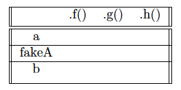

## [FAQ](faq.md)

The FAQ for Lab 6 is located [here](faq.md).

{: .warning}
> **Warning:** this assignment is not officially released yet. This spec is subject to change until this warning disappears.

## Before You Begin

Pull the skeleton code from GitHub and open it on IntelliJ like usual.

## Learning Goals

First, we'll cover inheritance in Java, which comes in three main forms: interface implementation,
abstract class extension, and concrete class extension. We will also discuss dynamic method selection (DMS),
a process that determines which functions get run upon program execution as a result of inheritance and
Java's static typing.

First, we'll look at some classes we've written so far, and identify patterns
in what we can _do_ with them. We will connect this idea to _abstract data
types_, then tie them to interfaces. This
feature allows us to make a more complicated system of class interrelations
than we have seen previously, and its correct utilization of interfaces is
key to being able to write generalizable and neat code.

Once introduced, we will use this concept to explain the workings of the
Java `Collections` Framework, which contains many of the data structures you've
encountered before. Finally, we'll write our own implementations for a
simplified abstract data type.

## Inheritance

To motivate inheritance, let us consider a hypothetical scenario. Suppose we desire to implement a program that represents an animal. We might begin to define a class like follows:

```java
public class Animal {
  public int age;
  public String name;
  public int size;
  public boolean hungry;
  public Animal() { /* Implementation not shown. */ }
  public void eat(Food food) {
    food.consume();
    hungry = false;
  }
}
```

Of course, having just a simple `Animal` class is not particularly useful to us. For example, if we wished to simulate a cat, the class below might be more useful:

```java
public class Cat {
  public int age;
  public String name;
  public int size;
  public boolean hungry;
  private int tailSize;
  public Cat() { /* Implementation not shown. */ }
  public void eat(Food food) {
    food.consume();
    hungry = false;
  }
  public String meow() { return "Meow!"; }
}
```

Observe that this class is largely the same as the `Animal` class, but with one extra instance variable, and one extra instance method. And intuitively, a cat is an animal. Is there a way we can represent this in Java? As you may have already guessed, the formalization of this relationship is known as _inheritance_. The `Cat` class written with inheritance would look like:

```java
public class Cat extends Animal {
  private int tailSize;
  public String meow() { return "Meow!"; }
}
```

Here, we introduce the new keyword `extends`. This keyword goes after the declaration of a class, and indicates that the declared class "inherits" from the following class, which we call the superclass. In this case, `Cat` inherits from `Animal`. What does inheritance actually provide? An inheriting class implicitly contains, or "inherits", all of the non-private variables and methods from its superclass.

Note that a class can only `extend`, or inherit from, one other class. This is because, if inheriting from two or more were allowed, then it would be possible to inherit conflicting definitions of a method, and impossible to resolve that (which class would get priority in having its definition utilized).

### Overriding Methods

One thing we might want to do is replace the superclass's implementation of a method. For example, suppose we preferred to have the following eat method for the Cat class:

```java
public void eat(Food food) {
  food.annihilate();
  this.throwHairBall();
  hungry = true;
}
```

How can we have Cat use this method instead? As it turns out, it is as simple as simply plopping the method down into the class:

```java
public class Cat extends Animal {
  private int tailSize;

  // Other Cat methods
  ...

  @Override
  public void eat(Food food) {
    food.annihilate(); // method implementation not shown
    this.throwHairBall(); // method implementation not shown
    hungry = true;
  }

  public String meow() { return "Meow!"; }
}
```

And that is all we need to do! Note that there is an `@Override` tag above the method. This tells the compiler to make sure that this method actually overrides a method in the superclass. Otherwise, it will not compile. Note that you do not need to have the `@Override` tag to override a method - it simply serves as a guard against human error (more details on this later).

## The `super` keyword

Suppose we added the change from the previous section and overrode the `eat` method. Can we still call the original method? The answer is yes! Consider the following code example that adds a new method to Cat:

```java
public void thoroughlyConsumeFood(Food food) {
  super.eat(food); // Animal's eat
  this.eat(food); // Cat's eat
}
```

The first call allows us to access Animal's eat method and invoke it. In some sense, `super` is like `this` but for the parent class.

In java, subclasses do not directly inherit the constructor of their
superclass. Rather, we have to directly reference the constructor of the parent class.
We do this with the keyword `super`, which is treated as an invocation of the parent
class' constructor. Thus, in the parenthesis following `super` you must supply the
correct number and type of arguments.
**This call to super must be the first line of the constructor.**
Check out the implementation of `GregorianDate.java` for an example of `super` in action.

## Exercise: `GregorianDate`

Let's start with an example of an abstract class. `Date.java` is an abstract
class used to represent calendar dates (we will **ignore** leap years). In addition,
we have included two classes that extend `Date` that are shown below.

```java
/**
 * In a nonleap year in the French Revolutionary Calendar, the first twelve
 * months have 30 days and month 13 has five days.
 */
public class FrenchRevolutionaryDate extends Date {

    public FrenchRevolutionaryDate(int year, int month, int dayOfMonth) {
        super(year, month, dayOfMonth);
    }

    @Override
    public int dayOfYear() {
        return (month - 1) * 30 + dayOfMonth;
    }

    ...
}

public class GregorianDate extends Date {

    private static final int[] MONTH_LENGTHS = {
        31, 28, 31, 30, 31, 30, 31, 31, 30, 31, 30, 31
    };

    public GregorianDate(int year, int month, int dayOfMonth) {
        super(year, month, dayOfMonth);
    }

    @Override
    public int dayOfYear() {
        int precedingMonthDays = 0;
        for (int m = 1; m < month; m += 1) {
            precedingMonthDays += getMonthLength(m);
        }
        return precedingMonthDays + dayOfMonth();
    }

    private static int getMonthLength(int m) {
        return MONTH_LENGTHS[m - 1];
    }
}
```

Read through the definition of the abstract class `Date`. Pay attension to the instance variables. 
There is an abstract method named `nextDate` in the `Date` class. `nextDate` returns
the new date that is the result of advancing this date by one day. It should
not change `this`. Modify `GregorianDate` accordingly so that it follows
the correct convention for dates. Make sure to test out your methods to be sure
that they behave as you expect them to! Check out our initial tests in `GregorianDateTest.java` for how GregorianDate is used.

## Inheritance Chains

It is completely possible for a subclass to in turn be a superclass for another class! Consider the following example:

```java
public class BritishBlue extends Cat {
  private boolean isChonky = true;
}
```

This is totally valid and legal Java. The `BritishBlue` class would inherit all non-private methods and variables from `Cat`, and therefore, by extension, `Animal`.
Specifically, a `Cat` instance would have access to all variables and methods defined in
`Animal`, which would carry over to any `BritishBlue` instance as well; then, by `BritishBlue`'s
inheritance of `Cat`, any `BritishBlue` instance would be able to access everything defined in `Cat`
with the exception of the `tailSize` instance variable, which is `private`.

## Overloading Methods

As an aside, let us talk about overloading methods. Suppose we wanted to have two variants of the method grow:

```java
public void grow() {
  this.size += 1
}

public void grow(int size) {
  this.size = size;
}
```

Would Java permit this, even though these two distinct methods have the same name? The answer is yes, thanks to method overloading! The idea behind method overloading is that we can have methods with the same name, as long as they have different method signatures. The method signature is the name combined with its list of parameters. Thus, because these two versions of `grow` have different parameters, it is possible to have both of them at the same time. We will formally cover method selection later, but for now intuitively see that, if we were to make a function call to `grow`, it would not be ambiguous which one we are referring to even at compile time because of the parameters being passed into the call.

## Interfaces

In Java, interfaces are "classes" that define a specific
set of behavior. Specifically, they provide the method signatures for all the
required methods. Generally, interfaces do not have method implementations,
because they only describe what they can do, not how they do it. This also
means that interfaces cannot be instantiated.

If we can't directly instantiate them, then you might be wondering how we might use them. When we write code, we often don't care about the implementation details of the
data types we're using, and only care about what we can do with them.
Therefore, we should write code to work with the interface!

This is the idea of **abstraction barriers**: we don't need to know how
the methods we use have been implemented, only that they exist and should
function according to their specification.

### Implementing Interfaces

<!-- I didn't write or read this big paragraph too carefully. -->
<!-- Revised and cut down -Elaine Shu -->

When a class **implements** an interface, the class guarantees that it can
perform the functionalities defined by its interface.
Using interfaces is all about _not knowing the actual implementation_, but
rather working with the defined behavior given by the interface.
Implementing an interface through a class, like you are asked for assignments
and projects, is about making sure that your class methods give the correct output as defined by the interface.

### Interfaces in Java

We'll use the following `SimpleList` interface, which represents basic functionality of a list.

```java
public interface SimpleList {

    /** Returns the integer stored at position i. */
    int get(int i);

    /** Adds k into the list at position i. */
    void add(int i, int k);

    /** Removes the item at position i. */
    void remove(int i);

    /** Returns the number of elements in this list. */
    int size();
}
```

An interface contains methods without bodies and only method signatures. To
make a class _implement_ this interface, we use the `implements` keyword:

```java
public class SLList implements SimpleList {
    @Override
    int get(int i) {
        // ...
    }
    // ...
}
```

Some things to know about interfaces and related topics:

Implementing classes must implement all method signatures from the interface
: We can't partially implement an interface, because the implementation then
does not meet all the requirements we have said it does. The one exception to this is
if the method has the `default` keyword, then the method is already filled in the interface.

`@Override`
: This method annotation is not _required_ when implementing a method from an
interface, but enforces that the method does override an interface method.
This helps prevent typos, like accidentally defining `void ad(int i, int k)`,
or `void add(int i)`, when we wanted to implement the interface method above.

Interface methods are public by default.
: Interfaces are a description of behavior (what we can do), and it doesn't
make sense to describe things that we can't do outside the class.

Interfaces cannot have fields.
: Fields imply that the interface is storing some data, which implies that
we are relying on its implementation -- which isn't allowed. The exception
to this is that interfaces can have static constants (`static final`).

Classes can implement more than one interface.
: Classes can behave like multiple things at once. To have a class implement
more than one interface, we use commas:

```java
public class SLList implements SimpleList, ComplexList {
  // ...
}
```

### Abstract Classes

Suppose for a moment that we wanted to inherit from a partial implementation of a class. Recall the Animal example from before, but slightly rewritten:

```java
public class Animal {
  private int age;
  private String name;
  private int size;
  private boolean hungry;
  public Animal() { /* Implementation not shown. */ }
  public void eat(Food food) {
    food.consume();
    hungry = false;
  }
}
```

While it was useful for us to inherit some of the functionality from Animal, it does not make sense for us to actually be able to directly instantiate an Animal. Is there any way we can prevent instantiation? The answer, as you might suspect at this point, is yes! We can declare it as an abstract class:

```java
abstract class Animal {
  private int age;
  private String name;
  private int size;
  private boolean hungry;
  public Animal() { /* Implementation not shown. */ }
  public void eat(Food food) {
    food.consume();
    hungry = false;
  }
  abstract void speak();
}
```

First, note that the class has been declared as abstract at the class declaration. Next, note that we have outlined several (private)
instance variables, and one constructor and one instance method fully implemented. Finally, note that similar to the interface, we have
provided a specification of a method to be implemented by an inheriting class, i.e. speak. We mark it as to-be-implemented with the `abstract`
keyword. Any inheriting class must also be concrete, or else it too has to be abstract. Note finally that a class that is not abstract is called a concrete class.

You might be wondering now why Java has both interfaces and abstract classes,
when they seem to serve rather similar purposes and have similar functionality.
Interfaces are particularly useful to represent blueprints for classes that may or
may not be obviously related; for example, we might have a `Fluffy` interface that can
be `implement`ed by both a `Poodle` and a `CottonBall`, which really don't have much
else in common. This stands in contrast to abstract classes, which use the `extends`
keyword and therefore strictly adheres to a superclass-subclass inheritance. Because of this,
abstract classes are helpful as representations of a common base class that can be
`extend`ed and therefore avoids a lot of repeated code.

## Dynamic Method Selection (DMS)

From the structure of inheritance and polymorphism arises a natural question:
when you possess a Java object, and you evoke a particular method signature
from it, what method will it actually run? The complexity of this question is
apparent in the following example.

```java
public class A {
    public void f() {
        System.out.println("A's method!");
    }
}

public class B extends A {
    public void f() {
        System.out.println("B's method!");
    }
}

public static void main(String[] args) {
    A objectA = new A();
    B objectB = new B();
    A mystery = new B();

    objectA.f();
    objectB.f();
}
```

Clearly, `objectA.f()` will be A’s method, and `objectB.f()` will be B’s method,
but what of `mystery`’s call? To understand this, we must learn Java’s rules for
dynamic method selection.

### Static and Dynamic Type

First, let us cover some important vocabulary we need to understand. Consider
the following variable declaration:

`Object a = new Integer(0);`

Here, we have declared a variable with name `a` of **static type** Object and
**dynamic type** Integer. The static type is in a sense the ”official” type of the object.
It is the only thing that the Java compiler considers when checking variable assignments and
method invocations. The dynamic type is what the object actually is. So, for
this object `a`, the compiler considers it as an `Object`, but in reality when the
program is run it is an `Integer`. In other words, the static type is the type on the left-hand side
of the `=` sign, and the dynamic type is the type on the right-hand side of the `=` sign.

### Compile Time

The general procedure is broken down into two phases. First, the compilation
phase.

1. Ensure that each variable assignment is valid.
2. Ensure that all method calls resolve to some method of a matching method
   signature within the calling class.
3. If no suitable method is found, throw a compiler error.

#### Variable assignments

Let us elaborate on the first point. Suppose we have a typical inheritance
structure of a superclass `Animal`, and subclasses `Cat` and `Dog`. Consider the
following assignments:

```java
Animal a = new Animal(); // valid
Animal b = new Cat(); // valid
Cat c = new Cat(); // valid
Cat d = new Animal(); // invalid
Dog e = new Cat(); // invalid
```

It is of course allowed to create an object whose static and dynamic types
match, so examples `a` and `c` are acceptable. Intuitively, an `Animal` can be an `Animal`
Likewise, we can declare a variable’s static type to be of a general class,
and then assign its dynamic type to be something more specific.
Since an object is, abstractly speaking, an
API of methods and variables, any subclasses of that object will meet the
requirements of the parent class API, and can be assigned that parent type
statically. Thus, example `b` also is acceptable. Intuitively, a `Cat` can be an `Animal`.
It is precisely for this same reason that examples `d`and`e`fail. A`Cat`object
is more specific than an`Animal`, and could have extensions to the API that an
`Animal`does not have. Thus, we cannot assign an`Animal`to be a`Cat`— an `Animal`may not be a`Cat`.
 Similarly, `Cat`and`Dog` are completely separate from each other, and could have differing
extensions to the API. Thus, we cannot assign across the inheritance tree either.

#### Method Signature Lookup

Now, onto the second and third steps. Recall that a method signature is composed
of the function’s name and parameters. At compile time, the compiler
uses the provided method signature to check whether or not there is a valid
function that matches the signature. Consider the following example:

```java
public class Animal {
    public void eat() {
        System.out.println("I am eating!");
    }
}

public class Cat extends Animal {
    public void meow() {
        System.out.println("Meow!");
    }
}

public static void main(String[] args) {
    Animal cat = new Cat();
    cat.eat(); // I am eating!
    cat.meow(); // compile error
}
```

The static type of `cat` is `Animal`, so the compiler references `Animal` when checking
method signatures. Thus, we are able to find the method `cat.eat()` and lock it in during compile time, but not
`cat.meow()` because there is no `meow()` method in `Animal`. So, despite this object
in reality being a `Cat`, we are unable to invoke one of its method. Luckily, Java
has a built-in way to get around this. Recall casting. Casting allows
us to tell the compiler that a certain object is of another type, and the compiler
will simply trust us on it as long as it could reasonably be of that other type, based on whether or not the actual type has a
direct inheritance chain relationship with the other type.
Consider the updated example:

```java
public static void main(String[] args) {
    Animal cat = new Cat();
    cat.eat(); // I am eating!
    ((Cat) cat).meow(); // Meow!
}
```

This will work, because we have told the compiler that the cat object is a `Cat`,
and so it passes the compiler check. Note that it checks at runtime whether
or not `cat` is actually of type `Cat`.

To summarize and generalize method signature lookup: given some call `foo.bar(arg)`,
we should be able to find some method `bar` in the static type of `foo`
that takes in exactly one argument with the same static type as `arg`. If such
a method is not found, we should try again and look up
some method `bar` in the static type of `foo` that takes in exactly one argument
whose static type is a superclass of `arg`. If that still does not work, repeat this
step with the parent class of the static type of `foo` until there are no parent
classes left to check. If we have exhausted all parent classes, then no method was
found, and the code throws a compiler error.

### Runtime

So, the code has passed compile time. What happens in runtime, when the code
is actually executed? Again, we have a three step sequence:

1. Check that all casts were correct (ie. that the dynamic type of the variable is actually a valid subtype of the class we cast it to)
2. If the method locked in at compile time is `static`, simply execute it. Do
   not check for overridden methods.
3. Otherwise, check for any overridden non-static methods.

#### Static Methods

Recall that when the static keyword is applied to a method, it is independent
of any particular instance of that object. In a sense, it belongs to the whole
class. It resides in its own special section of memory, and thus as a result, if the
compile phase identities a static method during its lookup, it will lock onto that
method and execute it during runtime, regardless of any overriden methods in
the dynamic type.

#### Overridden Methods

If the method identified at compile time is non-static, then in runtime there
will be a lookup based on the dynamic type for any overriding methods that
match the function signature (function name, number of arguments, argument type).
For example, consider yet again Animal and Cat.
Suppose `Animal` has a method `play` that takes in an `Animal` as parameter, and
that `Cat` has a method with the exact same name and input. Then, if we have
an object that is statically an `Animal` and dynamically a `Cat`, it will invoke
`Cat`’s `play` method rather than `Animal`’s.

Overriding methods must also have a return type that is either the same
type that is returned by the method they are trying to override, or a subtype of that
parent method's return type. For example, if `Animal` defines a method `public Animal f(String s)`,
a method defined in `Cat` as `public Cat f(String x)` would count as an override. Note that
the variable names do not matter, only the types and number of variables.

### Canonical Example

Let us now illustrate all we have learned with a simple example that covers all
cases (not including casting, which we will leave as an exercise to reader).

```java
public class A {
    public void f() { System.out.println("A.f"); }
    public static void g() { System.out.println("A.g"); }
}

public class B extends A {
    public void f() { System.out.println("B.f"); }
    public static void g() { System.out.println("B.g"); }
    public static void h() { System.out.println("B.h"); }
}

public static void main(String[] args) {
    A a = new A();
    A fakeA = new B();
    B b = new B();
}
```

As an exercise, fill out the following table, and click the Solution dropdown when you're ready to compare your answers.



<details markdown="block">
<summary markdown="block">

**Solution**

</summary>

`a.f()`: The static type is `A`, and the dynamic type is `A`, so there is no confusion
over this case. We will simply use `A`’s `f()`.

`a.g()`: The static type is `A`, so at compile time we see that `A` has a `static` `g()`
method, and lock into it. Thus, at runtime we have `A`'s `g()`.

`a.h()`: `A` has no `h()` method, so this results in a compile time error.

`fakeA.f()`: At compile time, we see that `A` has a nonstatic method `f()`. At
runtime, we see that `fakeA` is a `B`, and thus use `B`’s overridden `f()` method.

`fakeA.g()`: At compile time, we see that `A` has a `static` method `g()`, and so we
lock into it. Thus, at runtime, despite the fact that `fakeA` is dynamically a `B`,
we will run `A`'s `g()`.

`fakeA.h()`: Even though `fakeA` is dynamically a `B`, at compile time it is only
known to be an `A`, and so thus the compiler will not be able to find an `h()` method
for `A`.

`b.f()`: Statically and dynamically a `B`, we will just run `B`’s `f()` method.

`b.g()`: Statically a `B`, we find `B`’s `g()` method, and lock onto it to run in runtime.

`b.h()`: Statically a `B`, we find an appropriate `h()` method to run, and then at
runtime we run it.

</details>

## Abstract Data Types

In the previous lab, we implemented two classes that had (and with a reasonable extension, could have had) many of the same methods: `SLList` and `DLList`.

```java
public void add(int index, Item item);
public void addFirst(Item item);
public void addLast(Item item);
public Item get(int index);
public Item getFirst();
public Item getLast();
public void remove(Item item);
public Item removeFirst();
public Item removeLast();
public int size();
```

It seems like this list of methods could exist and have meaning _separate_
from any actual implementation. We call a collection of methods -- a
description of what we can do with a collection of data -- an **abstract
data type**. We often use interfaces to represent abstract data types.

`SLList` and `DLList` are particular kinds of lists, an abstract data type
that has the methods listed above. Let's say that we use someone's code that
defines another kind of list called `MysteryList`. Even though we might not
know how its implementation works, we know that it can do at least everything
a `List` can - because it's a `List`!

## ADTs in Java

We've talked about the list ADT. What other ADTs are commonly used, and in
what kinds of situations? What are their implementations in Java?

### Lists

Let's define the list ADT in a bit more detail:

A **list** is an ordered collection, or _sequence_, so the elements in a list
have _positions_. An element can appear as many times as desired, as duplicates
are allowed. Thus, they must support the following operations:

- `add`ing an element to the list at a specific index
- `remove`ing an element from the list at a specific index
- `get`ing an element at a position in the list
- `set`ting the element at a position in the list
- Checking if the list `contains` a given item
- Getting the `size` of a list

Java's [`List` interface][List] contains many more methods, but these are the minimum
methods that make Java's `List`s behave like our mental model of a list.

The `List` implementations that you will use most often is
[`ArrayList`][ArrayList]. Another common implementation is
[`LinkedList`][LinkedList], which is similar to our `DLList`.

[List]: https://docs.oracle.com/en/java/javase/17/docs/api/java.base/java/util/List.html
[LinkedList]: https://docs.oracle.com/en/java/javase/17/docs/api/java.base/java/util/LinkedList.html
[ArrayList]: https://docs.oracle.com/en/java/javase/17/docs/api/java.base/java/util/ArrayList.html

```java
List<String> = new ArrayList<>();
List<String> = new LinkedList<>();
```

### Sets

When might we want something other than a list? Consider (but don't
implement) the following problem:

> Write a program that counts the number of unique words in a large text file
> (such as the entire text of "War and Peace"). The program should output
> the number of unique words in the text file.

We could use a list, but the list ADT allows duplicate elements.
We'd like to use ADT that handles duplicate elements for us, so we can simplify
the code that we write. This is what the set ADT is for!

A **set** is a collection of _unique_ items that is not necessarily ordered.
Sets must support following operations at a minimum:

- `add`ing an element to the set
- `remove`ing an element from the set
- Checking if the set `contains` a given item
- Getting the `size` of a set

There are two implementations of the [`Set` interface][Set] in Java that you will use
often:

- [`TreeSet`][TreeSet] keeps its elements in sorted order, and is fast.
- [`HashSet`][HashSet] does not keep its elements in sorted order, and is (usually) **really** fast.

[Set]: https://docs.oracle.com/en/java/javase/17/docs/api/java.base/java/util/Set.html
[TreeSet]: https://docs.oracle.com/en/java/javase/17/docs/api/java.base/java/util/TreeSet.html
[HashSet]: https://docs.oracle.com/en/java/javase/17/docs/api/java.base/java/util/HashSet.html

This is a concrete example of why interfaces are useful -- when we're writing
a method, we may not care about whether it's a `TreeSet` or a `HashSet`.
However, the code calling that method might need the ordering of the `TreeSet`
or the speed of the `HashSet` -- we don't know how our code is going to be used!
We can allow our code to
be used by both by writing our method for the `Set` interface, instead
of for `TreeSet` or for `HashSet`.

```java
Set<String> = new HashSet<>();
Set<String> = new TreeSet<>();
```

### Maps

Let's modify the above problem slightly:

> Write a program that counts the number of unique words in a large text file
> (such as the entire text of "War and Peace", which is 1225 pages!). The program should also
> be able to take a word as input, and output how many times that word appeared
> in the book.

Here, we really want something that relates words to counts. This is where we
can use the map ADT!

A **map** is a collection of key-to-value mappings, like a dictionary from
Python. A map is not necessarily ordered. Maps must support at least the
following operations:

- Change (`put`) the _value_ that a particular _key_ maps to.
- `get` the _value_ that a particular _key_ maps to.
- `remove` the value for a given _key_
- Checking if the map `contains` a given **key**

Similar to `Set`, There are two implementations of the [`Map` interface][Map] in Java that you will use
often:

- [`TreeMap`][TreeMap] keeps its _keys_ in sorted order, and is fast.
- [`HashMap`][HashMap] does not keep its keys or values in sorted order, and is (usually) **really** fast.

[Map]: https://docs.oracle.com/en/java/javase/17/docs/api/java.base/java/util/TreeMap.html
[TreeMap]: https://docs.oracle.com/en/java/javase/17/docs/api/java.base/java/util/TreeMap.html
[HashMap]: https://docs.oracle.com/en/java/javase/17/docs/api/java.base/java/util/HashMap.html

```java
Map<String, String> = new TreeMap<>();
Map<Character, Int> = new HashMap<>();
```

#### More About Maps

- To use a Java `Map`, you must specify two types: the key type, and the value
  type. This is distinct from `List`s and `Set`s, which only need to specify
  one type.

- Maps are a mapping from keys to values, but not values to keys. They store a
  relationship in _one direction_. For example:
  consider a map which had keys as emails, and the values as peoples' names.
  Given an email, I can find out who has that email. However, given a person, I
  can't easily find out their email using that map. I would need a different map
  going in the opposite direction (keys as peoples' names mapping to values as
  emails).

## Collections

Looking at the above ADTs, it seems like they also share some behaviors. We can
_add_ elements, _remove_ elements, check if the ADT _contains_ a certain
element, and get the _size_. This looks like somewhere we can define a separate
ADT!

The collection ADT represents a _collection of data_. Most of the data
structures we will study the rest of this class are used to implement
collections. At the most general level, pretty much anything you use to store
multiple items at once is going to fulfill the requirements to be a
_collection_. Throughout this course, we will continue to
see implementations of these collections.

So, what does it mean (in Java) for a `List`, an ADT, to be a `Collection`,
another ADT? We say that interfaces can `extend` other interfaces:

```java
public interface List<Item> extends Collection<Item> {
    ...
}
```

This means that the `List` interface "inherits" all the methods in the
`Collection` interface... or that a `List` has all the behaviors
that a `Collection` has!

As seen above, the Java interface for collections is, unsurprisingly,
[`Collection`][Collection]. Typically, we'll implement the behaviors for a
particular kind of collection, rather than the `Collection` interface itself.

[Collection]: https://docs.oracle.com/en/java/javase/17/docs/api/java.base/java/util/Collection.html

### Maps and Collections

Unlike **set** and **list**, `Map` is not a direct extension of the Java
`Collection` interface. This is because `Collection` specifies collections of
a single element type, but `Map` operates on key-value pairs. Instead, from
[Java's `Map` documentation][Map], "The Map
interface provides three _collection views_, which allow a map's contents to be
viewed as a set of keys, collection of values, or set of key-value mappings."

- `keySet()`, which returns a `Set` of all the keys. The keys are unique, so a
  set is an appropriate choice here.
- `values()`, which returns a `Collection` of all the values. The values are
  not necessarily unique, which is why we prefer a more general `Collection`
  rather than a `Set`.
- `entrySet()`, which returns a `Set` of key-value pairs with a wrapper type
  called `Entry`. The entry class's job is just to hold the key and the value
  together in a single class, so you can imagine that it might look something
  like this.

  ```java
  public class Entry<Key, Value> {
      private Key key;
      private Value value;
      public Key getKey();
      public Value getValue();
      // ...
  }
  ```

These methods are vital when iterating over anything which implements the
`Map` interface.

[Map]: https://docs.oracle.com/en/java/javase/17/docs/api/java.base/java/util/Map.html

## Exercise: `CodingChallenges`

Knowing when, where, and how to use abstract data types is an important skill.

For this part, we'll be using abstract data types to help us solve small
programming challenges. These questions are similar to the kinds of questions
you might get asked to solve in a technical interview for a software
engineering position. Complete the methods outlined in `CodingChallenges.java`, and add tests in `CodingChallengesTest.java`. Review [Lab 03](../lab03) for how to write tests.


Note that the first method, `missingNumber`, the input array is **not** in order.

Hint: For `isPermutation`, use `toCharArray`. Look it up if you don't know what it is.

Hint: Some of these instantiations might be useful for these problems:
```java
Set<Integer> seen = new HashSet<>();
Map<Character, Integer> characterCounts = new HashMap<>();
```

## Exercise: Implementing Sets

We will implement two kinds of sets, with different underyling implementations.

The file `SimpleCollection.java` contains a simplified version of the
`Collection` interface which only accepts integers as members. The files
`SimpleSet.java` contains a simplified version of the `Set` interfaces.
Read both files so you can understand how interfaces and interface extension are
being used here, as well as to understand what each of the interfaces requires.

### `ListSet`

The file `ListSet.java` is an incomplete implementation of the `SimpleSet`
interface. It maintains uniqueness of a set of elements by storing
elements in an `ArrayList<Integer>`.

Implement the methods of the `ListSet.java` class, and use the
`ListSetTest.java` file to test your methods. You may use
`List` methods in your implementation. We only provide a basic test,
so feel free to add more comprehensive tests to this file.

### `BooleanSet`

The file `BooleanSet.java` is an incomplete implementation of the `SimpleSet`
interface. It maintains uniqueness of elements in the set by storing a boolean
array `contains` for a range `[0, maxElement]`. This version of the `SimpleSet`
interface only deals with positive integers and uses a boolean array to keep
track of what values are currently in the `Set`. Check the example below:


Implement the methods of the `BooleanSet.java` class, and use the
`BooleanSetTest.java` file to test your methods. We only provide a basic test,
so feel free to add more comprehensive tests to this file.

### Tradeoffs

What are the tradeoffs between these two implementations? Neither one is
strictly "better" than the other in all situations, but when might we want to
use one of them? Discuss with a partner.

## Aside: Generics and Autoboxing

As you should remember from [Lab 5](../lab05), generics allow us to
define data structures without relying on the specific type of objects it holds.
This allows us to even further generalize our code, creating reusable data structures.

Autoboxing is an automatic conversion that Java performs when presented a **wrapper class**.
A wrapper class is a class that has been "wrapped" around a primitive data type so that
the programmer can rely on object oriented interactions. You may have seen some examples already,
such as `Integer.java` and `Double.java`. Automatic conversion
is performed between wrapper classes and the primitives they represent.



[5.1]: https://joshhug.gitbooks.io/hug61b/content/chap5/chap51.html
[5.3]: https://joshhug.gitbooks.io/hug61b/content/chap5/chap53.html

## Recap

We introduced a few key topics in this lab:

Inheritance:
We learned that we can use inheritance to make the structures of our programs more efficient by taking advantage of
similarities in the different types of objects that we are using. We also learned about method overloading and overriding,
the `super` keyword, and inheritance chains.

Dynamic Method Selection
We learned how Java decides what method to actually call when a program invokes a particular method signature.
There are two phases to this process. The first is the compiler phase, where Java ensures that there is a valid method
matching the invoked signature that can be called. The second is the runtime phase, where Java looks up what method to
run based on the dynamic types of the object involved.

Abstract Data Types
: Abstract data types are defined to be some sort of data that is defined
by a set of operations rather than the **implementation** of these operations.

`List`, `Set`, `Map`, and `Collection`
: Java has interfaces for several ADTs, and several implementations for each of
these ADTs. If we want to write code using algorithms that work on ADTs,
we can write code against these Java collection types.

## Deliverables

For full credit, submit:

- Implement and test `nextDate` in `GregorianData.java`.
- Implement and test each method in `CodingChallenges.java`.
- Implement and test each method in `ListSet.java`.
- Implement and test each method in `BooleanSet.java`.
