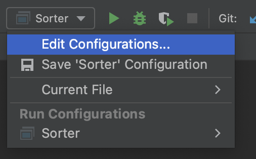
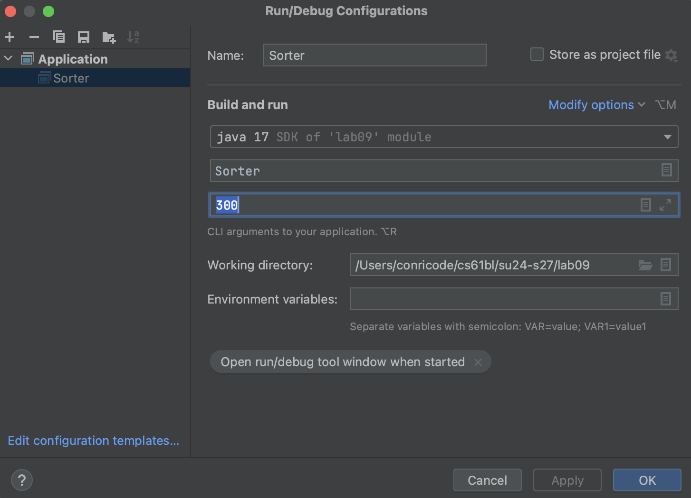

## [FAQ](faq.md)

The FAQ for Lab 9 is located [here](faq.md).

## Before You Begin

Pull the files for lab 9 from the skeleton.

> The online textbook readings in for this lab are optional. The lab covers
> the same content as Chapter [8.2][], [8.3][], and [8.4][] but more concisely
> so that there's not as much to read. You still may want to refer back to the
> textbook if you prefer watching videos or reading more about the topic. Additionally there is overlap between this lab and todays's lecture. Asymptotic analysis is both a tough topic and an important one, so this repetition is intentional and should hopefully help to reinforce the topics. However, feel free to skip around the spec if you feel like you already have a good understanding of the content. 

[8.2]: https://joshhug.gitbooks.io/hug61b/content/chap8/chap82.html
[8.3]: https://joshhug.gitbooks.io/hug61b/content/chap8/chap83.html
[8.4]: https://joshhug.gitbooks.io/hug61b/content/chap8/chap84.html


## Learning Goals

> “““““An engineer will do for a dime what any fool will do for a dollar.”
>
> --- Arthur M. Wellington”
> --- Paul Hilfinger”
> --- Zephyr Omaly”
> --- Laksith Prabu”
> --- Dominic Conricode

Efficiency comes in two flavors:

Programming cost
:   - How long does it take to develop your programs?
    - How easy is it to read or modify your code?
    - How maintainable is your code?

Execution cost
:   - **Time complexity**: How much time does your program take to execute?
    - **Space complexity**: How much memory does your program require?

We've already seen many examples of reducing programming cost. We've written
*unit tests* and employed *test-driven development* to spend a little more time
up front writing tests to save a lot of time down the line debugging programs.
And we've seen how *encapsulation* can help reduce the cognitive load that a
programmer needs to deal with by allowing them to think in terms of high-level
abstractions like lists instead of having to deal with the nitty-gritty details
of pointer manipulation. We've also discussed some elements of design for
methods and classes, like how we prefer passing arguments around over
maintaining `static` variables.

We've only just scratched the surface on methods for reducing and optimizing
programming costs, but for the coming weeks, it'll be helpful to have a working
understanding of the idea of **execution cost**.

In this lab, we consider ways of measuring the efficiency of a given code
segment. Given a function `f`, we want to find out how "quickly" that function runs.

## Algorithms

An *algorithm* is a step-by-step procedure for solving a problem, or an
abstract notion that describes an approach for solving a problem. The code we
write in this class, our programs, are implementations of algorithms. Indeed,
we've already written many algorithms: the methods we've written for `IntList`,
`SLList`, `DLList`, and `AList` are all *algorithms* that operate on data by
storing and accessing that data in different ways.

As another example, consider the problem of sorting a list of numbers. One
algorithm we might use to solve this problem is called *bubble sort*. Bubble
sort tells us we can sort a list by repeatedly looping through the list and
swapping adjacent items if they are out of order, until the entire sorting is
complete.

Another algorithm we might use to solve this problem is called *insertion
sort*. Insertion sort says to sort a list by looping through our list, taking
out each item we find, and putting it into a new list in the correct order.

Several websites like [VisuAlgo][], [Sorting Algorithms][], and
[USF][] have developed some animations that can help us visualize these sorting
algorithms.  Spend a little time playing around with these demos to get an
understanding of how much time it takes for bubble sort or insertion sort to
completely sort a list. We'll revisit sorting in more detail later in this
course, but for now, try to get a feeling of how long each algorithm takes to
sort a list. How many comparison does each sort need? And how many swaps?

[VisuAlgo]: http://visualgo.net/sorting
[Sorting Algorithms]: https://www.toptal.com/developers/sorting-algorithms/
[USF]: http://www.cs.usfca.edu/~galles/visualization/ComparisonSort.html

Since each comparison and each swap takes time, we want to know which is the
faster algorithm: bubble sort or insertion sort? And how fast can we make our
Java programs that implement them? Much of our subsequent work in this course
will involve estimating program efficiency and differentiating between fast
algorithms and slow algorithms in their specific settings.
This set of activities introduces an approach to making these estimates.

## Measuring Execution Time

One way to estimate the time an algorithm takes is to measure the time it takes
to run the program directly. Each computer has an internal clock that keeps
track of time, usually in the number of fractions of a second that have elapsed
since a given base date. The Java method that accesses the clock is
`System.currentTimeMillis`. A `Timer` class is provided in `Timer.java`.

Take some time now to find out exactly what value `System.currentTimeMillis`
returns, and how to use the `Timer` class to measure the time taken by a given
segment of code.

## Exercise: `Sorter`

The file `Sorter.java` contains a version of the insertion sort algorithm
mentioned earlier. Its `main` method uses a command-line argument to determine
how many items to sort. It fills an array of the specified size with randomly
generated values, starts a timer, sorts the array, and prints the elapsed time
when the sorting is finished.

```sh
javac Sorter.java
java Sorter 300
```

Compiling and running `Sorter` like above will tell us exactly how long it
takes to sort an array of 300 randomly chosen elements.

Alternatively, you can set command line arguments in IntelliJ by clicking on the class name next to the green run button on the top left and selecting "Edit Configurations." Next, you can enter command line arguments into the "Program arguments" field.


<details markdown="block">
  <summary markdown="block">
#### Visual guide: adding program arguments
{: .no_toc}
  </summary>





</details>

By compiling and running `Sorter.java` with different arguments, determine the size
of the smallest array that needs 1 second (1000 milliseconds) to sort.

You may notice that other students in lab end up with different timing results
and a different number of elements. What factors might contribute to these differences?

## Counting Steps

From timing the program in the previous example, we learned it isn't very
helpful in determining how good an algorithm is; different computers end up with
different results! Additionally, we won't know the runtime of our algorithm until _after_ we've run the timer - we can't make any predictions about runtime with a timer. An alternative approach is **step counting**. The number of
times a given *step*, or instruction, in a program gets executed is independent
of the computer on which the program is run and is similar for programs coded
in related languages. With step counting, we can now formally and
deterministically describe the runtime of programs.

We define a single step as the execution of a single instruction or primitive
function call. For example, the `+` operator which adds two numbers is
considered a single step. We can see that `1 + 2 + 3` can be broken down into
*two steps* where the first is `1 + 2` while the second takes that result and
adds it to 3. From here, we can combine simple steps into larger and more
complex *expressions*.

```java
(3 + 3 * 8) % 3
```

This expression takes 3 steps to complete: one for multiplication, one for
addition, and one for the modulus of the result.

From expressions, we can construct *statements*. An assignment statement, for
instance, combines an expression with one more step to assign the result of the
expression to a variable.

```java
int a = 4 * 6;
int b = 9 * (a - 24) / (9 - 7);
```

In the example above, each assignment statement takes one additional step on
top of however many steps it took to compute the right-hand side expressions.
In this case, the first assignment to `a` takes one step to compute `4 * 6` and
one more step to assign the result, 24, to the variable `a`. **How many steps
does it take to finish the assignment to `b`?**

Here are some rules about what we count as taking a single step to compute:

- Assignment and variable declaration statements
- All unary (like negation) and binary (like addition, and, or) operators
- Conditional `if` statements
- Function calls
- `return` statements

One important case to be aware of is that, while *calling* a function takes a
single step to setup, *executing* the body of the function may require us to do
**much** more than a single step of work.

### Counting Conditionals

With conditional statements like `if` statements, the total step count depends
on the outcome of the condition we are testing.

```java
if (a > b) {
    temp = a;
    a = b;
    b = temp;
}
```

The example above can take four steps to execute: one for evaluating the
conditional expression `a > b` and three steps for evaluating each line in the
body of the condition. But this is only the case if `a > b`. If the condition
is not true, then it only takes one step to check the conditional expression.

That leads us to consider two quantities: the **worst case count**, or the
maximum number of steps a program can execute, and the **best case count**, or
the minimum number of steps a program needs to execute. The worst case count
for the program segment above is 4 and the best case count is 1.

### `if ... else` Counting

Consider an `if ... else` of the form,

```java
if (A) {
    B;
} else {
    C;
}
```

where `A`, `B`, and `C` are program segments. (`A` might be a method call, for
instance.)

**How many steps does it take to evaluate the entire `if ... else`
block in terms of the number of steps it takes to evaluate `A`, `B`, and `C`?**
Think back to your practice tracing through programs to figure out which parts
of the conditional will be evaluated (given the condition is true or false),
and which parts won't be evaluated.

### Loop Counting

```java
for (int k = 0; k < N; k++) {
    sum = sum + 1;
}
```

In terms of $$N$$, how many operations are executed in this loop? Remember that
each of the actions in the for-loop header (the initialization of `k`, the exit
condition, and the increment) count too!

> It takes 1 step to execute the initialization, `int k = 0`. Then, to execute
> the loop, we have the following sequence of steps:
>
> - Check the loop condition, `k < N`
> - Add 1 to the `sum`
> - Update the value of `sum` by assignment
> - Increment the loop counter, `k`
> - Update `k` by assignment
>
> This accounts for the first $$1 + 5N$$ steps. In the very last iteration of
> the loop, after we increment `k` such that `k` now equals $$N$$, we spend one
> more step checking the loop condition again to figure out that we need to
> finally exit the loop so the final number of steps is $$1 + 5N + 1$$.

### Example: `remove`

Now consider code for the `remove` method, which removes the item at a given position of an array `values` by shifting over all the remaining elements. We notice here that things become slightly more complicated as the number of steps performed matters both on `pos` and `len`, the number of items contained in `values`. We now count the number of steps performed in terms of these two variables.

> This example assumes that you are using an array to back some kind of list. This idea is similar to Project 1, but this implementation is not circular. Also assume that the length of the underlying array is much larger than length and will not have an effect on the runtime of this program.
>
> The list will have the instance variables `values` which is the array backing the list and `len` which corresponds to the number of items actually contained in the list (not necessarily the same as `values.length`).

```java
void remove(int pos) {
    for (int k = pos + 1; k < len; k++) {
        values[k - 1] = values[k];
    }
    len -= 1;
}
```

Each column in the table below shows the total number of steps for computing each value of `pos`. These counts are written as a function of `len`. This way we can come up with total counts for the number of steps parameterized by `len` and `pos`.

| category            | pos = 0      | pos = 1       | pos = 2       | ... | pos = `len` - 1 |
|---------------------|--------------|---------------|---------------|-----|-----------------|
| `pos + 1`           | 1            | 1             | 1             |     | 1               |
| assignment to `k`   | 1            | 1             | 1             |     | 1               |
| loop conditional    | `len`        | `len` - 1     | `len` - 2     |     | 1               |
| increment to `k`    | `len` - 1    | `len` - 2     | `len` - 3     |     | 0               |
| update `k`          | `len` - 1    | `len` - 2     | `len` - 3     |     | 0               |
| array access        | `len` - 1    | `len` - 2     | `len` - 3     |     | 0               |
| array assignment    | `len` - 1    | `len` - 2     | `len` - 3     |     | 0               |
| decrement to `len`  | 1            | 1             | 1             |     | 1               |
| assignment to `len` | 1            | 1             | 1             |     | 1               |
| Total count         | 5 * `len`    | 5 * `len` - 5 | 5 * `len` - 10 |     | 5               |

We can summarize these results as follows: a call to remove with argument `pos`
requires in total:

- 1 step to calculate `pos + 1`
- 1 step to make the initial assignment to `k`
- `len - pos` loop tests
- `len - pos - 1` increments of `k`
- `len - pos - 1` reassignments to `k`
- `len - pos - 1` accesses to `values` elements
- `len - pos - 1` assignments to `values` elements
- 1 step to decrement `len`
- 1 step to reassign to `len`

If all these operations take roughly the same amount of time, the total is `5 *
(len - pos)`. Notice how we write the number of statements as a *function of the input arguments*.

> Although `len` is not a parameter of the `remove` method it is still considered to be an input as its value affects the number of steps.
>
> More formally we can also see that since `remove` is a non-static method, we are implicitly passing in the variable `this` to our `remove` method. This means that the variables `this.values` and `this.length` are also passed in.

Comparing across a fixed value of `len` we can notice that for a small value of `pos`, the number of steps executed will be *greater* than if we had a larger value of `pos` (e.g. closer to `len`). And vice versa: a larger value of `pos` will reduce the number of steps we need to execute.

### Example with Nested Loops: `removeZeroes`

Counting steps in nested loops is a little more involved. As an example, we'll
consider an implementation of the method `removeZeroes`.

```java
void removeZeroes() {
    int k = 0;
    while (k < len) {
        if (values[k] == 0) {
            remove(k);
        } else {
            k += 1;
        }
    }
}
```

Intuitively, the code should be slowest on an input where we need to do the
most work, or an array of `values` full of zeroes. Here, we can tell that there
is a worst case (removing everything) and a best case (removing nothing). To
calculate the runtime, like before, we start by creating a table to help
organize information.

| category          | best case | worst case |
|-------------------|-----------|------------|
| assignment to `k` | 1         | 1          |
| loop conditional  | `len` + 1 | `len` + 1  |
| array accesses    | `len`     | `len`      |
| comparisons       | `len`     | `len`      |
| calls to remove   | 0         | `len`      |
| k + 1             | `len`     | 0          |
| update to `k`     | `len`     | 0          |

In the best case, we never call `remove` so its runtime is simply the sum of
the rows in the "best case" column. Thus, the best-case count is `2 + 5 * len`.

The only thing left to analyze is the worst-case scenario. Remember that the
worst case makes `len` total calls to `remove`. We already approximated the
cost of a call to `remove` for a given `pos` and `len` value earlier: `5 *
(len - pos)`.

In our removals, `pos` is always 0, and only `len` is changing. The total
cost of the removals is shown below.

$$[5 \cdot \texttt{len}] + [5 \cdot (\texttt{len} - 1)] + \cdots +[5 \cdot (1)] + [5 \cdot (0)]$$

$$= 5 \cdot [(\texttt{len}) + (\texttt{len} - 1) + \cdots + (1) + (0)]$$

The challenge now is to simplify the expression. A handy summation formula to
remember is the sum of the first $$k$$ natural numbers.

$$1 + 2 + \cdots + k = \frac{k(k + 1)}{2}$$

This lets us simplify the cost of removals (note that above was exactly a multiple of this form with terms from 1 to `len`). Remembering to include the additional steps in the table, we can now express the worst-case count of
`removeZeroes` as:

$$5 \cdot \frac{\texttt{len}(\texttt{len} + 1)}{2} + 3 \cdot \texttt{len} + 2$$

We often prefer to simplify this by substituting `len` for a symbolic name like $$N$$.

$$5 \frac{N(N + 1)}{2} + 3N + 2$$

That took... a while.

## Abbreviated Estimates

> From this section onwards, we present a set of fairly precise definitions,
> and we'll be relying on the example developed in this and the previous
> part to build a solid definition for asymptotic notation. If you're
> not fully comfortable with any of the material so far, now is the perfect
> time to review it with someone in your lab or your TA!

Producing step count figures even for those relatively simple program segments took a **lot**
of work. But normally we don't actually need an exact step count but rather
just an *estimate* of how many steps will be executed.

In most cases, we only care about what happens for very large $$N$$ as that's
where the differences between algorithms and their execution time really become
limiting factors in the scalability of a program.

Why is this? Debate with someone in your lab. Then, see our thoughts below

<details markdown="block">
  <summary markdown="block">
#### Our take
{: .no_toc}
  </summary>
When our $$N$$ is really small, no reasonable function
will take a long time to execute! Imagine a program that takes $$N^{12}$$ steps
to execute. When $$N=3$$, it doesn't really matter! But when
$$N \gg 3$$ ($$N$$ much larger than 3) we might start to get really impatient (or the universe might end)!

</details>

We want to consider what
types of algorithms would best handle big amounts of data, such as in the
examples listed below:

- Simulation of billions of interacting particles
- Social network with billions of users
- Encoding billions of bytes of video data

> Here we are using a generic value of $$N$$ to represent the size of an input passed into a function. Note that we will not always use $$N$$ to represent the size of a program input (though it is common).
>
> Also notice that sometimes the program will be parameterized by more than just one input; however, for most examples in this class we will ask you to write the order of growth in terms of just one variable.

The **asymptotic behavior** of a function `f` (any one of the programs above,
for example) is a description of how the execution time of `f` changes as the
value of $$N$$ grows increasingly large towards infinity. Our goal is to come
up with a technique that can be used to compare and contrast two algorithms to
identify which algorithm scales better for large values of $$N$$.

We can then compute the **order of growth** of a program, a classification of
how the execution time of the program changes as the size of the input grows
larger and larger. For example, we say that the *order of growth* of $$2N + 3$$ is $$N$$ since, for large
values of $$N$$, $$2N + 3$$ will be less than $$3N$$ and slightly greater than
$$2N$$. As $$N$$ tends towards infinity, the $$+ 3$$ contributes less and less
to the overall runtime.

This pattern holds for higher-order terms too. Applying this estimation
technique to the `removeZeroes` method above results in the following orders of
growth.

- The order of growth for the best-case runtime of `removeZeroes`, $$5N + 2$$,
  is proportional to the `len`, $$N$$.
- The order of growth for the worst-case runtime of `removeZeroes`, $$5
  \frac{N(N + 1)}{2} + 3N + 2$$, is $$N^2$$.

The intuitive simplification being made here is that we **discard all but the
most significant term of the estimate and also any constant factor of that
term**. Later, we will see exactly why this is true with a more formal proof.

## Asymptotic Analysis

### Recap: Simplified Analysis Process

Rather than building the entire table of all the exact step counts, we can
instead follow a *simplified analysis process*.

Choose a cost function
: These are the underlying assumptions about the costs of each step or
instruction for our machine. In this course, we'll assume all of the basic
operations (Java operators, assignment statements, `return` statements, array
access) each take the same amount of time (1 unit to execute). In CS 61C, we'll see how this
fundamental assumption often isn't true.

Compute the order of growth
: Given the cost function, we can then compute the **order of growth** for a
program. In the `removeZeroes` example, we saw how we could compute an exact
count and then find the correct order of growth runtime classification for it
by simplifying the expression.

Later, we'll learn a few shortcuts and practice building intuition / inspection
to determine orders of growth, but it's helpful to remember that we're always
solving the same fundamental problem of measuring how long it takes to run a
program, and how that runtime changes as we increase the value of $$N$$.

### Big-Theta Notation

Computer scientists often use special notation to describe runtime. The first
one we'll learn is called *big-theta*, represented by the symbol $$\Theta$$.

Suppose we have a function, $$R(N)$$, with order of growth $$f(N)$$. We could
say,

> $$R(N) \in \Theta(f(N))$$, or "$$R(N)$$ is in $$\Theta(f(N))$$"

Why do we say "in" $$\Theta$$? Formally, $$\Theta(f(N))$$ is a family of
functions that all grow *proportional to* $$f$$. Here, proportional can be thought of
as roughly *equal*. Thinking back to our working
definition of **order of growth** as a method for *classification*,
$$\Theta(f(N))$$ refers to the entire set of all functions that share the same
order of growth.

The advantage of using notation like big-theta is that it provides a common
definition for *asymptotic analysis* which reduces the amount of explaining we
need to do when we want to share our ideas with others. It also makes sure
we're all on the same page with the claims we make, so long as we use them
carefully and precisely.

Learning new notation can be a little daunting, but we've actually already
been making statements in big-theta terms. The first claim about `removeZeroes`
that we made earlier,

> The order of growth for the best-case runtime of `removeZeroes`, $$5N + 2$$,
> is proportional to the length of the array, $$N$$.

is essentially equivalent to the claim: **In the best-case, `removeZeroes` is
in $$\Theta(N)$$.**

And, likewise, the second claim that we made earlier,

> The order of growth for the worst-case runtime of `removeZeroes`, $$5
> \frac{N(N + 1)}{2} + 3N + 2$$, is $$N^2$$.

has its own equivalent in big-theta notation: **In the worst-case,
`removeZeroes` is in $$\Theta(N^2)$$.**

> When we use `removeZeroes` here, we mean the *runtime of the function* rather
> than the function itself. In practice, we'll often use this English shortcut
> as long as the meaning is clearly communicated, though it would be more
> accurate to say the *runtime of the function*.

### Asymptotic Variables

You may have observed, in our analysis of `removeZeroes`, that we were careful
to make clear what the running time estimate depended on, namely the value of
`len` and `pos`.

Unfortunately, people are sometimes careless about specifying the quantity on
which an estimate depends. Don't just use $$N$$ without making clear what $$N$$
means. This distinction is important especially when we begin to touch on
sorting later in the course. It may not always be clear what $$N$$ means.

We'll often qualify our runtimes by stating, "where $$N$$ is the length of the
list", but we often also say things like, "where $$N$$ is the value of the
largest number in the list".

### Asymptotic Bounds

Formally, we say that $$R(N) \in \Theta(f(N))$$ if and only if there exist
positive constants $$k_1, k_2$$ such that $$k_1 \cdot f(N) \leq R(N) \leq k_2 \cdot
f(N)$$ for all $$N$$ greater than some $$N_0$$ (very large $$N$$).

In other words, $$R(N)$$ must be **bounded** above and below by $$f(N)$$
asymptotically. But we've already seen something like this too.

> We say that the *order of growth* of $$2N + 3$$ is $$N$$ since, for large
> values of $$N$$, $$2N + 3$$ will be less than $$3N$$ and slightly greater
> than $$2N$$. As $$N$$ tends towards infinity, the $$+ 3$$ contributes less
> and less to the overall runtime.

In this example, we chose $$k_1 = 2$$ and $$k_2 = 3$$. These two choices of
$$k$$ constitute a *tight-bound* for $$2N + 3$$ for all values of $$N \geq 3$$.

This idea of big-theta notation as a tight-bound is very useful as it allows us
to, very precisely, state *exactly* how scalable a function's runtime grows as
the size of its input ($$N$$) grows. When a $$\Theta(N)$$ function's input
size increases, we'd expect the runtime to also increase linearly.

### Big-O

But, there are many scenarios where we can't actually give a tight bound:
sometimes, it just doesn't exist. And, practically-speaking, one of the common
use scenarios for runtime in the real world is to help choose between several
different algorithms with different orders of growth. For these purposes, it's
often sufficient just to give an *upper-bound* on the runtime of a program.

There exists a very common asymptotic notation, *big-O*, represented by the
symbol, $$O$$.

If we could think of big-theta as an $$=$$ (equals) sign, then big-O is like a
$$\leq$$ sign. Likewise, the formal definition for big-O follows, $$R(N) \in
O(f(N))$$ if and only if there exists a positive constant $$k_2$$ such that
$$R(N) \leq k_2 \cdot f(N)$$ for all $$N$$ greater than some $$N_0$$ (very large
$$N$$).

Note that this is a looser condition than big-theta since big-O doesn't include the lower bound.

To see why we would prefer a theta bound consider the following simplified example. Would you know more about a person's age if they told you either 1. "I am between 30 and 40 years old" OR 2. "I am less than 40 years old"?

### Big-Omega

Sometimes it will also be useful to describe function runtimes using an $$\Omega$$ (Omega) bound, which you can think of as a lower bound. For example, if a tight $$\Theta$$ bound does not exist you could supply an $$O$$ and $$\Omega$$ bound. Practically speaking, an $$\Omega$$ bound by itself might be less useful than a $$\Theta$$ or $$O$$ bound, but in certain cases it will provide useful information.

Similar to above, if we could think of big-theta as an $$=$$ (equals) sign, then big-$$\Omega$$ is like a
$$\geq$$ sign. Likewise, the formal definition for big-Omega follows, $$R(N) \in
\Omega(f(N))$$ if and only if there exists a positive constant $$k_1$$ such that
$$R(N) \geq k_1 \cdot f(N)$$ for all $$N$$ greater than some $$N_0$$ (very large
$$N$$).

Note that this too is a looser condition than big-theta since big-Omega doesn't include
the upper bound.

We can return to our simplified example to again show why we prefer a theta bound. Would you know more about a person's age if they told you either 1. "I am between 30 and 40 years old" OR 2. "I am more than 30 years old"?

### Back to Big Theta

Now that we have learned big-Omega and big-O notation, where does big theta fall into this? We already said that big theta means *roughly equal*, but what does that mean? Given we have defined big-O as an *upper bound* and big-Omega as a *lower bound*, what happens if the tightest big-O bound
is in the same family as the tightest big-Omega bound? This means the code is both
upper bounded **AND** lower bounded by the same family of functions! This is what we mean by **equal**.

A theta bound only exists if the tightest big-O bound is equal to the tightest big-Omega bound.

## Discussion: Case Analysis

> Read the following three sections of **[Chapter 8.4 from Runtime Analysis
> Subtleties][]** all the way through **Big Omega**. You don't need to read the
> last section on *Amortized Analysis*, yet. We will see that in a few labs!

[Chapter 8.4 from Runtime Analysis Subtleties]: https://joshhug.gitbooks.io/hug61b/content/chap8/chap84.html#runtime-analysis-subtleties

Discuss with someone *why* each of the following claims are true.

- `removeZeroes` is in $$\Omega(1)$$.
- `removeZeroes` is in $$\Omega(N)$$.
- `removeZeroes` is in $$O(N^2)$$.
- A $$\Theta(\cdot)$$ bound does not exist for `removeZeroes`.
- In the best case, `removeZeroes` is in $$O(N^2)$$.
- In the best case, `removeZeroes` is in $$\Theta(N)$$.
- In the worst case, `removeZeroes` is in $$\Omega(\log N)$$.
- In the worst case, `removeZeroes` is in $$\Theta(N^2)$$.

### Limit Definition

An alternative, the calculus-based [limit definition][] is also sometimes useful,
as you can apply L'Hopital's Rule to derive asymptotic simplifications like
dropping multiplicative constants and additive lower-order terms.

We generally won't use this too often though, as the first definition provides
a more useful and intuitive visualization of the lower and upper bounds.

[limit definition]: https://ocw.mit.edu/courses/6-042j-mathematics-for-computer-science-spring-2015/resources/mit6_042js15_session24/

## Common Orders of Growth

Here are some commonly-occurring estimates listed from no growth at all to
fastest growth.

- **Constant time**, often indicated with $$1$$.
- **Logarithmic time** or proportional to $$\log N$$.
- **Linear time** or proportional to $$N$$.
- **Linearithmic time** or proportional to $$N \log N$$.
- **Polynomial time** or proportional to $$N^{k}$$ for some constant $$k$$.
- **Exponential time** or proportional to $$k^{N}$$ for some constant $$k$$.
- **Factorial time** or proportional to $$N!$$ ($$N$$ factorial).


### Logarithmic Algorithms

First, if you are shaky on the properties of logarithms, I suggest looking through
[this](https://www.khanacademy.org/math/algebra2/x2ec2f6f830c9fb89:logs/x2ec2f6f830c9fb89:log-prop/a/properties-of-logarithms) Khan academy section on log properties!

We will shortly encounter algorithms that run in time proportional to $$\log
N$$ for some suitably defined $$N$$. Recall from algebra that the base-10
logarithm of a value is the exponent to which 10 must be raised to produce the
value. It is usually abbreviated as $$\log_{10}$$. Thus

- $$\log_{10} 1000$$ is 3 because $$10^{3} = 1000$$.
- $$\log_{10} 90$$ is slightly less than 2 because $$10^{2} = 100$$.
- $$\log_{10} 1$$ is 0 because $$10^{0} = 1$$.

In algorithms, we commonly deal with the base-2 logarithm, written as $$\lg$$,
defined similarly.

- $$\lg 1024$$ is 10 because $$2^{10} = 1024$$.
- $$\lg 9$$ is slightly more than 3 because $$2^{3} = 8$$.
- $$\lg 1$$ is 0 because $$2^{0} = 1$$.

Another way to think of log is the following: $$\log_{\text{base}} N$$ is the
number of times $$N$$ must be divided by the base before it hits 1. For the
purposes of determining orders of growth, however, the log base actually
doesn't make a difference because, by the change of base formula, we know that
any logarithm of $$N$$ is within a constant factor of any other logarithm of
$$N$$. We usually express a logarithmic algorithm as simply $$\log N$$ as a
result.

Change of Base Formula
: $$\log_b x = \frac{\log_a x}{\log_a b}$$

Algorithms for which the running time is logarithmic are those where processing
discards a large proportion of values in each iterations. The binary search
algorithm is an example. We can use binary search in order to guess a number
that a person is thinking of. In each iteration, we guess a number and are told whether the number they're thinking of is higher or lower than our guess. The algorithm then discards half the
possible values for the searched-for number, repeating the process in the other half. Thus, we continually divide the size of
the problem by 2 until there is only one value left.

For example, say you started with a range of 1024 numbers in the number
guessing game. Each time you would discard half of the numbers so that each
round would have the following numbers under consideration:

| Round # | Numbers left |
|---------|--------------|
| 1       | 1024         |
| 2       | 512          |
| 3       | 256          |
| 4       | 128          |
| 5       | 64           |
| 6       | 32           |
| 7       | 16           |
| 8       | 8            |
| 9       | 4            |
| 10      | 2            |
| 11      | 1            |

We know from above that $$\lg 1024 = 10$$ which gives us an approximation of
how many rounds it will take. We will see further applications of logarithmic
behavior when we work with trees in subsequent activities.

## Analyzing Iteration

We've thus far defined the language of asymptotic analysis and developed some
simple methods based on counting the total number of steps. However, the kind
of problems we want to solve are often too complex to think of just in terms of
number iterations times however much work is done per iteration.

Consider the following function, `repeatedSum`.

```java
long repeatedSum(int[] values) {
    int N = values.length;
    long sum = 0;
    for (int i = 0; i < N; i += 1) {
        for (int j = i; j < N; j += 1) {
            sum += values[j];
        }
    }
    return sum;
}
```

In `repeatedSum`, we're given an array of `values` of length N. We want to take
the repeated sum over the array as defined by the following sequences of values `j` takes on:

- $$0, 1, 2, 3, \cdots, N - 1$$
- $$1, 2, 3, 4, \cdots, N - 1$$
- $$2, 3, 4, 5, \cdots, N - 1$$

Notice that each time, the number of elements, or the iterations of `j`, being
added is reduced by 1. While in the first iteration, we sum over all $$N$$
elements, in the second iteration, we only sum over $$N - 1$$ elements. On the
next iteration, even fewer: just $$N - 2$$ elements. This pattern continues until
the outer loop, `i`, has incremented all the way to $$N$$.

One possible approach to this problem is to draw a bar chart to visualize how
much work is being done for each iteration of `i`. We can represent this by
plotting the values of `i` across the X-axis of the chart and the number of
steps for each corresponding value of `i` across the Y-axis of the chart.


Now, let's plot the amount of work being done on the first iteration of `i`
where `i = 0`. If we examine this iteration alone, we just need to measure the
amount of work done by the `j` loop. In this case, the `j` loop does work
proportional to $$N$$ steps as the loop starts at 0, increments by 1, and only
terminates when `j = N`.

How about the next iteration of `i`? The loop starts at 1 now instead of 0 but
still terminates at $$N$$. In this case, the `j` loop is proportional to $$N -
1$$ steps. The next loop, then, is proportional to $$N - 2$$ steps.


We can start to see a pattern forming. As `i` increases by 1, the amount of
work done on each corresponding `j` loop decreases by 1. As `i` approaches
$$N$$, the number of steps in the `j` loop approaches 0. In the final
iteration, when `i = N - 1`, the `j` loop performs work proportional to 1 step.


We've now roughly measured each loop proportional to some number of steps. Each
independent bar represents the amount of work any one iteration of `i` will
perform. The runtime of the entire function `repeatedSum` then is the sum of
all the bars, or simply the area underneath the line.


The problem is now reduced to finding the area of a triangle with a base of
$$N$$ and height of also $$N$$. Thus, the runtime of `repeatedSum` is in
$$\Theta(N^{2})$$.

We can verify this result mathematically by noticing that the sequence can be
described by the following summation:

$$1 + 2 + 3 + ... + N = \frac{N(N + 1)}{2}$$ or, roughly, $$\frac{N^{2}}{2}$$
which is in $$\Theta(N^{2})$$. It's useful to know both the formula as well as
its derivation through the chart above.

## Multivariate Analysis

Sometimes we care about how the runtime of an algorithm will grow with respect to multiple variables. As an example, consider the `rectangle` function below that computes the area of a rectangle with side lengths `N` and `M`.

```java
int rectangle(int N, int M) {
    int area = 0;
    for (int i = 0; i < N; i++) {
        for (int j = 0; j < M; j++) {
            area += 1;
        }
    }
    return area;
}
```

Analyzing this algorithm we see that the outer loop runs $$N$$ times and the inner loop runs $$M$$ times per each iteration of the outer loop. Since each iteration of the inner loop only does a constant amount of work, we find the resulting runtime to be in $$\Theta(MN)$$.

## Analyzing Recursion

Now that we've learned how to use a bar chart to represent the runtime of an
iterative function, let's try the technique out on a recursive function,
`mitosis`.

```java
int mitosis(int N) {
    if (N == 1) {
        return 1;
    }
    return mitosis(N / 2) + mitosis(N / 2);
}
```

Let's start by trying to map each $$N$$ over the x-axis like we did before and
try to see how much work is done for each call to the function. The conditional
contributes a constant amount of work to each call. But notice that in our
return statement, we make two recursive calls to `mitosis`. How do we represent
the runtime for these calls? We know that each call to `mitosis` does a
constant amount of work evaluating the conditional base case but it's much more
difficult to model exactly how much work each recursive call will do. While a
bar chart is a very useful way of representing the runtime of iterative
functions, it's not always the right tool for recursive functions.

Instead, let's try another strategy: drawing call trees. Like the charting
approach we used for iteration earlier, the *call tree* will reduce the
complexity of the problem and allow us to find the overall runtime of the
program on large values of $$N$$ by taking the tree recursion out of the
problem. We will draw each call to the function as a node with its input size within the node, and recursive calls are drawn as children of a node. Consider the call tree for `fib` below.

```java
int fib(int N) {
    if (N <= 1) {
        return 1;
    }
    return fib(n - 1) + fib(n - 2);
}
```


At the *root* of the tree, we make our first call to `fib(n)`. The recursive
calls to `fib(n - 1)` and `fib(n - 2)` are modeled as the two *children* of the
root node. We say that this tree has a *branching factor* of two as each node
contains two children. It takes a constant number of instructions to evaluate
the conditional, addition operator, and the return statement as denoted by the
`1` to the upper-right of each node. (Note that you may see call trees with Nodes' input size and work performed in opposite positions. Be sure to understand what the numbers in your call tree represent.)

We can see this pattern occurs for all nodes in the tree: each node performs
the same constant number of operations if we don't consider recursive calls. If
we can come up with a scheme to count all the nodes, then we can simply
multiply by the constant number of operations to find the overall runtime of
`fib`.

For a tree with branching
factor $$b$$ and height $$h$$ we can compute the number of nodes as $$b^{h+1}-1$$ (if we think of the root as height 0). For the sake of asymptotic analysis, it is sufficient to use $$b^{h}$$ or $$b^{h+1}$$ as we will below (as an exercise, can you justify why?).

Spend a little time thinking about the maximum height of this tree: when does the base
case tell us the tree recursion will stop?

> Note that the counting the number of nodes in this recursive call tree for `fib` ends up being a little tricky because the tree is not symmetric i.e. each of the two recursive calls made from one call to `fib` are not the same.
>
> If you are interested, you can check out [this article](https://www.geeksforgeeks.org/time-complexity-recursive-fibonacci-program/) which explains how to compute a tight bound for `fib`.

Returning to the original problem of `mitosis`, the call tree is setup just
like `fib` except instead of decrementing $$N$$ by 1 or 2, we now divide $$N$$
in half each time. Each node performs a constant amount of work but also makes
two recursive calls to `mitosis(N / 2)`.


Like before, we want to identify both the branching factor and the height of
the tree. In this case, the branching factor is 2 like before. Recall that the
series $$N, N/2, \cdots , 4, 2, 1$$ contains $$\log_{2} N$$ elements since, if
we start at $$N$$ and break the problem down in half each time, it will take us
approximately $$\log_{2} N$$ steps to completely reduce down to 1, so the height of the tree will be $$\log_{2} N$$.

Plugging into the formula, we get $$2^{\log_{2} N}$$ nodes which simplifies to
$$N$$. Therefore, $$N$$ nodes performing a constant amount of work each will
give us an overall runtime in $$\Theta(N)$$.

There is another way to approach this analysis: going level by level. We can see that on the first level of the recursive call tree there is a single node doing a constant amount of work (1). On the second level we double the number of nodes, but each node still is doing a constant amount of work, so the total work on this layer is 1+1=2. Similarly, we can see that the work on level 3 is 4, on level 4 is 8, and so on following the pattern that the work on level $$i$$ is $$2^{i}$$. From the analysis above, we know that this tree has $$\log_{2} N$$ levels. Now, to figure out the total work done by the function we just need to sum up all the work done by all of the levels:

$$1 + 2 + 4 + \cdots + 2^{(log_{2} N) - 2} + 2^{(log_{2} N) - 1}$$

$$ = 1 + 2 + 4 + \cdots + \frac{N}{4} + \frac{N}{2}$$

This is a geometric sum which is dominated by its last element. Here, the last element is larger than all of the elements that came before it combined (Exercise: prove this to yourself. As a hint, try out the first few powers of 2). This allows us to say the overall runtime is proportional to the last term giving us an overall runtime in $$\Theta(N)$$

It will not always be the case that each layer in a recursive call tree will have the same amount of summed work, nor will it always be the case that each node in a recursive call tree will do the same amount of work. You will have to use the techniques at your disposal to solve these problems, which is a skill that takes time and practice to develop.

In general, for a recursion tree, we can think of the total work as:

$$\sum_{\text{layers}} \frac{\text{nodes}}{\text{layer}
}\frac{\text{work}}{\text{node}}$$

For `mitosis`, we have $$\log N$$ levels,
$$2^(i-1)$$ nodes in layer $$i$$, with $$1$$ work per node. Thus we see the summation will be as follows, which matches the quantity we just calculated:

$$\sum_{i = 0}^{\log N} 2^i (1)$$

## Recap

Runtime Minimization
: One of the most important properties of a program is the time it takes to
execute. One goal as a programmer is to minimize the time (in seconds) that a
program takes to complete.

Runtime Measurement
:   - Measure the number of seconds that a program takes to complete using a
    stopwatch (either physical or in software). This tells you the actual
runtime, but is dependent on the machine and inputs.
    - Count the number of operations needed for inputs of a given size. This is
      a machine independent analysis, but still depends on the input, and also
doesn't actually tell you how long the code takes to run.
    - Derive an algebraic expression relating the number of operations to the
      size of an input. This tells you how the algorithm scales, but does not
tell you how long the code takes to run.

Algorithm Scaling
:   While we ultimately care about the runtime of an algorithm in seconds, we'll
often say that one algorithm is better than another simply because of how it
scales. By scaling, we mean how the runtime of a piece of code grows as a
function of its input size. For example, inserting at the beginning of
ArrayList on an old computer might take $$R(N) = 0.0001N$$ seconds, where $$N$$
is the size of the list.

For example, if the runtime of two algorithms is $$R_1(N) = N^2$$, and
$$R_2(N) = 5000 + N$$, we'd say algorithm $$R_2$$ is better, even though
$$R_1$$ is much faster for small $$N$$.

Order of Growth
:   The result of applying our last 3 simplifications gives us the order of
growth of a function. So for example, suppose $$R(N) = 4N^2 + 3N + 6$$, we'd
say that the order of growth of $$R(N)$$ is $$N^2$$.

    The terms "constant", "linear", and "quadratic" are often used for
algorithms with order of growth $$1$$, $$N$$, and $$N^2$$, respectively. For
example, we might say that an algorithm with runtime $$4N^2 + 3N + 6$$ is
quadratic.

Simplified Analysis
:   Once we've chosen a cost function, we can either:
    - Compute the exact expression that counts the number of operations.
    - Use intuition and inspection to find the order of growth of the number of operations.

    This latter approach is generally preferable, but requires a lot of
practice. One common intuitive/inspection-based approach is use geometric
intuition. For example, if we have nested for loops where i goes from 0 to N,
and j goes from i + 1 to N, we observe that the runtime is effectively given by
a right triangle of side length N. Since the area of a such a triangle grows
quadratically, the order of growth of the runtime is quadratic.

Big-Theta
:   To formalize our intuitive simplifications, we introduce big-theta
notation. We say that a function $$R(N) \in \Theta(f(N))$$ if there exists
positive constants $$k_1$$ and $$k_2$$ such that $$k_1 \cdot f_1(N) \leq R(N)
\leq k_2 \cdot f_2(N)$$.

    When using $$\Theta$$ to capture a function's asymptotic scaling, we avoid
unnecessary terms in our $$\Theta$$ expression. For example, while $$4N^2 + 3N +
6 \in \Theta(4N^2 + 3N)$$, we will usually make the simpler claim that is
$$4N^2 + 3N + 6 \in \Theta(N^2)$$.

    Big-theta is exactly equivalent to order of growth. That is, if a function
$$R(N)$$ has order of growth $$N^2$$, then we also have that $$R(N) \in
\Theta(f(N))$$.

In the final section, we applied what we learned about counting steps,
estimation, and orders of growth to model algorithmic analysis for larger
problems. Two techniques, **charting** and **drawing call trees**, helped us
break down challenging problems into smaller pieces that we could analyze
individually and recombine to form the final solution.

Below, we will list some tips and formulas that will be handy when you start
finding the asymptotic runtimes of functions.

### Practical Tips

1. Before attempting to calculate a function's runtime, first try to understand
   what the function does.
2. Try some small sample inputs to get a better intuition of what the
   function's runtime is like. What is the function doing with the input? How
does the runtime change as the input size increases? Can you spot any 'gotchas'
in the code that might invalidate our findings for larger inputs?
3. Try to lower bound and upper bound the function runtime given what you know
   about how the function works. This is a good sanity check for your later
observations.
4. If the function is recursive, draw a call tree to map out the recursive
   calls. Within each node, denote how much work that specific node does. Then,
   note the total (sum) work done on each *level*. You should also find the height
   of the recursive call tree. This breaks the problem down into
   smaller parts that we can analyze individually. Once each part of the tree has been analyzed, we can then
   reassemble all the parts to determine the overall runtime of the function.
5. If the function has a complicated loop, draw a bar chart to map out how much
   work the body of the loop executes for each iteration.
6. **Only consider what happens for very large N.** If you see a statement like `if (N < 1) {return 0}` at the top of an algorithm this doesn't mean that we can immediately say the algorithm has a best case runtime in $$\Theta(1)$$. This is a *very* common mistake.

### Useful Formulas

- $$1 + 2 + 3 + 4 + \cdots + N$$ is in $$\Theta(N^2)$$.
- There are $$N$$ terms in the sequence $$1, 2, 3, 4, \cdots, N$$.
- $$1 + 2 + 4 + 8 + \cdots + N$$ is in $$\Theta(N)$$.
- There are $$\log N$$ terms in the sequence $$1, 2, 4, 8, \cdots, N$$.
- The number of nodes in a complete tree, $$N$$, is approximately $$b^h$$ where
  $$b$$ is the *branching factor* and $$h$$ is the *height* of the tree.
- All logarithms are proportional to each other by the Change of Base formula
  so we can express them generally as just $$\log$$.

It's worth spending a little time proving each of these to yourself with a
visual model! I personally recommend Desmos or WolframAlpha.

### Deliverables

A quick recap of what you need to do to finish today's lab.

- Look through the `Timer` class and try timing the algorithm in `Sorter.java`
  for different inputs. Discuss with your neighbors what you
came up with.
- Read through the content on asymptotic analysis (big-theta, O, and omega)
  focusing on how to handle logarithmic, iterative, and recursive algorithms.
- **Complete the online assessment on Gradescope. There is no coding submission.**

