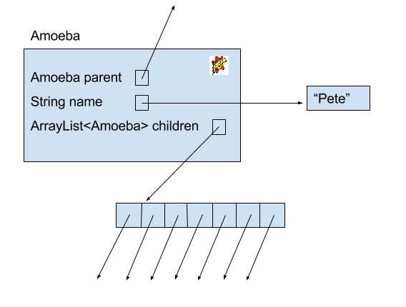
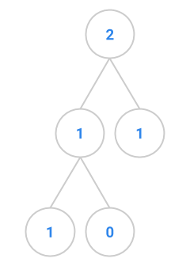
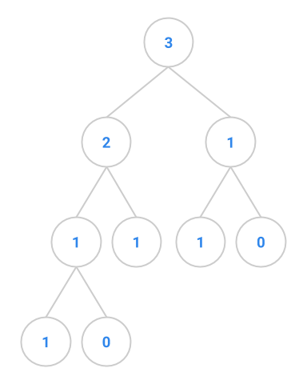
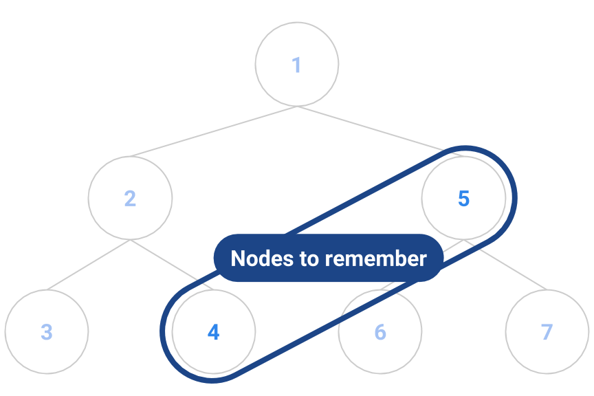
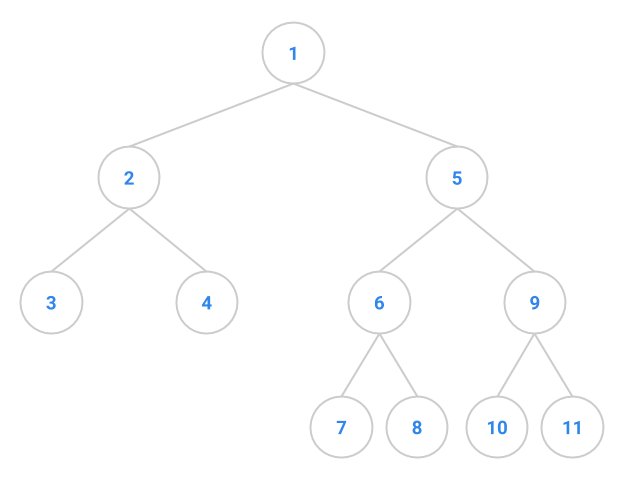

## [FAQ](faq.md)

Each assignment will have an FAQ linked at the top. You can also access it by
adding "/faq" to the end of the URL. The FAQ for Lab 10 is located
[here](faq.md).

## Introduction

As usual, pull the files from the skeleton and open the Lab 10 directory in IntelliJ.

In this lab, we will introduce another data structure called a **tree** (you might
have already seen this in CS 61A or another equivalent course). The
meaning of the tree data structure originates from the notion of a tree in real
life.

Below is a conceptual visualization of a tree. It's not really a box and pointer
diagram and should not be interpreted as a literal implementation in Java.


Note that while a tree in real life is rooted at the bottom and branches out and
upwards, trees in computer science are typically drawn such that they are rooted
at the top and branch out and downwards.

For this lab, we have not provided you with any local tests. Instead, we expect you to create your own test file and write your own tests! You can also use ad-hoc testing in the main methods to test quickly.

### Vocabulary

In order to be able to talk about trees, we first need to define some
terminology.

| Term          | Description  | Example Above |
|---------------|--------------| ------------- |
| Node          | Single element in a tree | 1, 2, 3, 4, 5, 6, and 7 are all nodes. |
| Edge          | A connection between two nodes | There is a direct edge from 1 to 2, but there is no direct edge from 1 to 7. |
| Path          | A series of one or more edges that connects two nodes without using an edge more than once | There is a path from 1 to 7, consisting of edges 1 -> 3 and 3 -> 7. |
| Leaf          | A node with no children | 4, 5, 6, and 7 are leaf nodes. |
| Root          | The topmost node, which does not have a parent | 1 is the root node. |

### Relationships

These following terms are defined with respect to a particular node.

| Term          | Description |
|---------------|-------------|
| Child         | A node directly below the current node |
| Parent        | Single node connected directly above the current node |
| Siblings      | Nodes with the same parent |
| Ancestors     | All nodes on the path from the selected node up to and including the root |
| Descendants   | All the children, children's children, and so forth of a node |
| Subtree       | The tree consisting of the node and all of its descendants |
| Height        | The length of the path from the node to its deepest descendant. By length, we mean the number of nodes traveled along a given path. Therefore, the height of a leaf node is 1. (Note: There is an alternate definition of height as the number of edges traversed. In that case, the height of a leaf would be 0.) |
| Depth         | The length of the path from the node to the root. The depth of the root node is 0. |

Sometimes we'll refer to the height and depth of a tree as a whole. In these
cases, it's usually assumed that we're referring to the height of the root node
and the depth of the deepest leaf, respectively.

### Definition

For a linked structure of nodes to be considered a tree:

- nodes must have either no parents or 1 parent
- there can be no **cycles** (paths that start and end at the same node)
- there can only be one path between any two nodes in a tree
- all nodes must be a descendant of the root (except the root itself)

## Discussion: Examples of Trees

Discuss with your partner whether the following examples would be considered
trees as we've introduced them above.

- Linked List
- Family Tree

Trees are naturally recursive structures, so you'll find that we implement a lot
the methods in this lab using recursion because it tends to be the simplest
solution. Unlike linked lists, trees can have one or more children which can make
iterative approaches more difficult (this ultimately depends on the structure /
implementation of your tree).

## Amoeba Family Tree

An amoeba family tree is an example of our above definition of a tree that you will
be working with for this lab. It is simpler than a normal family tree because amoebas
do not need partners in order to reproduce. An amoeba has one parent, zero or more 
siblings, and zero or more children. An amoeba also has a name.

Below is the skeleton code for an `Amoeba`. The full code is located in the
`AmoebaFamily.java` file.

```java
class Amoeba {
    public String name;
    public Amoeba parent;
    public ArrayList<Amoeba> children;
}
```

And below is a box and pointer diagram of our `Amoeba`.



Amoebas (or amoebae) live dull lives. All they do is reproduce, so all we need
to keep track of them are the following methods:

```java
/* Creates an AmoebaFamily, where the first Amoeba's name is NAME. */
public AmoebaFamily(String name) {
    root = new Amoeba(name, null);
}

/* Adds a new Amoeba with childName to this AmoebaFamily as the youngest
   child of the Amoeba named parentName. This AmoebaFamily must contain an
   Amoeba named parentName. */
public void addChild(String parentName, String childName) {
    if (root != null) {
        root.addChildHelper(parentName, childName);
    }
}
```

The `Amoeba` objects are the nodes of our tree, represented by the
`AmoebaFamily` object. You will find that most of the methods of this
`AmoebaFamily` will be implemented through recursive helper methods of the
`Amoeba` class.

> This organization structure should feel similar. Before for our `DLList` we had the 
> `DLList` class and within it the inner class `Node`. The `DLList` 
> encapsulated the recursive structure of the `Node`s. Now we will have our
> `AmoebaFamily` which will encapsulate the recursive structure of the 
> `Amoeba`s.

### Void Recursive Methods

In the `AmoebaFamily` class, we provide the method `addChild` to add a new
`Amoeba` to the `AmoebaFamily` tree. The method implements a general traversal
of the tree using a void recursive method in the `Amoeba` class. Read through
this method and related functionality to get an understanding of how we are 
traversing and manipulating the Object.

### Non-void Recursive Methods

So far, the methods we've seen for the `AmoebaFamily` class have not returned
anything; they have only been modifying the state of the `AmoebaFamily`. We will
be able to do cooler things if we can return values, and the next example will
take advantage of this.

## Exercise: `longestName`

Implement the `longestName` method in the `AmoebaFamily` class. Make this as
similar to `longestNameLength` as possible. You will find that these non-void
recursive methods follow a specific pattern, one that you will likely draw upon
again when solving problems that you face in the future.

You will not need to use `longestNameLength` directly in your implementation of
`longestName`.

## Binary Trees

We'll now move on from trees and explore a common, special case of the tree data
structure: the binary tree. A binary tree is a tree in which each node has at
most two children. Rather than store the children in an `ArrayList` as was done
in `Amoeba` nodes, one normally just has two separate variables `left` and
`right` for the left and right children of the binary tree.

## Exercise: `BinaryTree`

The file `BinaryTree.java` defines a `BinaryTree` class and a `TreeNode` class.
First, read over the code and then implement the following three methods.

Note: you may use the `sampleTreeX` methods to generate sample trees to test the
functions that you write. In addition, consider writing your own methods to
generate more trees to test your code.

### Exercise 1: `height`

First, if you have a partner, switch which partner is coding if you haven't recently.

Implement the `height` method in the `BinaryTree` class. The height of an empty tree is
0; the height of a one-node tree is 1; the height of any other tree is 1 + the
greater of the heights of the two children.

### Exercise 2: `isCompletelyBalanced`

Add an `isCompletelyBalanced` method for the `BinaryTree` class. A tree with no
nodes and a tree with one node are both completely balanced; any other tree is
completely balanced if and only if the height of its left child is equal to the
height of its right child, and its left and right children are also completely
balanced. Make sure you test your code with trees of height 3 or more to ensure
that your code works!

### Exercise 3: `fibTree`

This exercise deals with "Fibonacci trees", trees that represents the recursive
call structure of the Fibonacci computation. (The Fibonacci sequence is defined
as follows: $$F_0 = 0, F_1 = 1$$, and each subsequent number in the sequence is
the sum of the previous two.) The root of a Fibonacci tree should contain the
value of the `N`th Fibonacci number, the left subtree should be the tree
representing the computation of the `N-1`th Fibonacci number, and the right
subtree should be the tree representing the computation of the `N-2`th
Fibonacci number. The two exceptions to this rule are when we pass in 0 or 1 to
the `fibTree` method. The first few Fibonacci trees appear below.

| Function     | Tree                           |
|--------------|--------------------------------|
| `fibtree(0)` | |
| `fibtree(1)` | |
| `fibtree(2)` | |
| `fibtree(3)` | |
| `fibtree(4)` | |
| `fibtree(5)` | |

Write the static `fibTree` method in `BinaryTree` that takes in a non-negative
integer `N`, and returns a `BinaryTree` that stores the `N`-th Fibonacci value
using the representation above.

Remember how we've been delegating structuring all our methods so far for the
best code!

## Traversals

The remainder of this lab will cover the tools and techniques related to
traversing the notes of a tree structure.

Three processing sequences for nodes in a binary tree occur commonly enough to
have names:

- **preorder**: process the root, process the left subtree (in preorder),
  process the right subtree (in preorder)

- **postorder**: process the left subtree (in postorder), process the right
  subtree (in postorder), process the root.

- **inorder**: process the left subtree (in inorder), process the root, process
  the right subtree (in inorder).

> Note that for preorder and postorder, it can often be equally valid to process
> the right and then the left, although it depends on the application. In this 
> course we will typically assume that the processing will be done left and then 
> right unless we specify otherwise. On most exams we will be precise in what 
> order nodes will be processed.

## Exercise: Processing Sequences

With your partner, determine the *preorder*, *inorder*, and *postorder*
processing sequence for the tree below. This exercise will not be graded, 
but understanding how traversals work is a crucial part of understanding how
to operate on trees. We will rely on these for many topics in the rest
of the course.


Answers below (highlight to reveal):
<div style="color: white;">Pre Order: A B C D E</div>
<div style="color: white;">Post Order: B D E C A</div>
<div style="color: white;">In Order: B A D C E</div>

## Stacks and Queues

Before we go into more traversals, we will go over some a few more data
structures that will help us when we implement the traversals later in the lab.

One of the first true data structures we encountered was the `LinkedList` data
structure. That data structure allowed for adding and removing at any position.
However sometimes that is too powerful and we do not need all of that
functionality. Thus, we will introduce the **stack** and the **queue** data
structures, which are like lists, but have more limited, precise functionality.
As you go through this section, think about how you can implement stacks and
queues by using a `LinkedList`.

A **stack** models a stack of papers, or plates in a restaurant, or
boxes in a garage or closet. A new item is placed on the top of the stack, and
only the top item on the stack can be accessed at any particular time. Stack
operations include the following:

- **Pushing** an item onto the stack.
- Accessing the top item of the stack.
- **Popping** the top item off the stack.
- Checking if the stack is empty.

As a result, we often refer to stacks as processing in LIFO (last-in,
first-out) ordering.

A **queue** is a waiting line. As with stacks, access to a queue's elements is
restricted. Queue operations include:

- Adding an item to the **back** of the queue.
- Accessing the item at the **front** of the queue.
- Removing the front item.
- Checking if the queue is empty.

As a result, we often refer to queues as processing in FIFO (first-in,
first-out) ordering.

## Exercise: Stacks and Queues

### Exercise 1

Suppose that the following sequence of operations is executed using an initially
empty **stack**. What ends up in the stack? 

    push A
    push B
    pop
    push C
    push D
    pop
    push E
    pop

Answer below (highlight to reveal) Note the ordering is such that the bottom of the stack is to the left and the top of the stack is to the right:
<div style="color: white;">Answer: A C</div>

### Exercise 2

Suppose that the following sequence of operations is executed using an initially
empty **queue**. What ends up in the queue?

    add A
    add B
    remove
    add C
    add D
    remove
    add E
    remove

Answer below (highlight to reveal) Note the ordering is such that the front of the queue is to the left and the back of the queue is to the right:
<div style="color: white;">Answer: D E</div>

## Stacks and Queues: Building a Tree Iterator

We now consider the problem of returning the elements of a tree one by one,
using an iterator. To do this, we will implement the interface
`java.util.Iterator`. The first technique to traverse trees that we will examine
is **depth-first iteration** or **depth-first search**. The general idea is
that we walk along each branch, traveling as far down each branch as possible
before turning back and examining the next one. This depth first search traversal
should feel similar to the preorder and postorder we defined above. See if you 
can see the connection!

We will also use a nested iterator class to hide the details of the iteration
from the outer class. As with previous iterators, we need to maintain
state-saving information that lets us find the next tree element to return, and
we now must determine what that information might include. To help work this
out, we'll consider the sample tree below, with elements to be returned depth
first as indicated by the numbers.


The first element to be returned is the one labeled "1". Once that's done, we
have a choice whether to return "2" or "5".

Suppose we break ties by lowest node label. As a result, based on our
tie-breaking rule, we will pick "2" over "5". Once we return element "2", we
have a choice between return "3" or "4" next. But don't forget about "5" from
earlier!

Next, we return "3", again based on our tie-breaking rule. At this point, we
still remember that we need to return to "4" and "5" as in the diagram below.



That means that our state-saving information must include not just a single
pointer of what to return next, but a whole *collection* of "bookmarks" to nodes
we've passed along the way.

More generally, we will maintain a collection that we'll call the *fringe*,
containing all the nodes in the tree that are candidates for returning next. The
`next` method will choose one of the elements of the fringe as the one to
return, then add the returned element's children to the fringe as candidates for
the next element to return. `hasNext` returns true when the fringe isn't empty.

The iteration sequence will then depend on the order we take nodes out of the
fringe. Depth-first iteration, for example, results from storing the fringe
elements in a *stack*, a last-in first-out structure. The `java.util` class
library conveniently contains a `Stack` class with `push` and `pop` methods. We
illustrate this process on a *binary tree* in which `TreeNode`s have 0, 1, or 2
children named `left` and `right`. Here is the code:

```java
public class DepthFirstIterator implements Iterator<TreeNode> {

    /* Where we will store our bookmarks. */
    private Stack<TreeNode> fringe = new Stack<TreeNode>();

    public DepthFirstIterator(TreeNode root) {
        if (root != null) {
            fringe.push(root);
        }
    }

    /* Returns whether or not we have any more "bookmarks" to visit. */
    public boolean hasNext() {
        return !fringe.isEmpty();
    }

    /* Throws an exception if we have no more nodes to visit in our traversal.
       Otherwise, it picks the most recent entry to our stack and "explores" it.
       Exploring it requires visiting the node and adding its children to the
       fringe, since we must eventually visit them too. */
    public TreeNode next() {
        if (!hasNext()) {
            throw new NoSuchElementException("tree ran out of elements");
        }
        TreeNode node = fringe.pop();
        if (node.right != null) {
            fringe.push(node.right);
        }
        if (node.left != null) {
            fringe.push(node.left);
        }
        return node;
    }

    /* This is left unimplemented for this example. */
    public void remove() {
        throw new UnsupportedOperationException();
    }
}
```

## Exercise: Stack Contents

For the following exercises, assume that we push the right child before the left
child of a node onto the fringe.

### Exercise 1

What numbers are on the stack when element 4 in the tree below has just been
returned by `next`?



Answer below (highlight to reveal) Note the ordering is such that the front of the queue is to the left and the back of the queue is to the right:
<div style="color: white;">Answer: 5</div>

### Exercise 2

For the same image above, what numbers are on the stack when element 6 in the
tree below has just been returned by `next`?

Answer below (highlight to reveal) Note the ordering is such that the front of the queue is to the left and the back of the queue is to the right:
<div style="color: white;">Answer: 7 8 9</div>

### Exercise 3

Suppose the `next` code pushes the left child onto the stack before the right:

```java
if (node.left != null) {
    fringe.push(node.left);
}
if (node.right != null) {
    fringe.push(node.right);
}
```

In what order are the elements of the tree above returned?

Answer below (highlight to reveal):
<div style="color: white;">Answer: 1 5 9 11 10 6 8 7 2 4 3</div>

## Optional Exercise: Tree Iterators

### Optional Exercise 1: `AmoebaDFSIterator`

Switch which partner is doing the coding if you have not done so recently.

Complete the definition of the `AmoebaDFSIterator` class (within the
`AmoebaFamily` class). It should successively return names of `Amoeba`s from the
family in depth-first preorder. **You will need to add `Amoeba`s to the stack as you do
above, with the right child being pushed before the left child.** Thus, for the
family set up in the `AmoebaFamily` main method, the name "Amos McCoy" should be
returned by the first call to `next`; the second call to `next` should return
the name "mom/dad"; and so on. Do not change any of the framework code.

Organizing your code as described in the previous step will result in a process
that takes time proportional to the number of `Amoeba`s in the tree to return
them all. Moreover, the constructor and `hasNext` both run in constant time,
while `next` runs in time proportional to the number of children of the element
being returned.

Add some code at the end of the `AmoebaFamily` main method to test your
solution. We suggest using the tree examples and answers above as a starting
point for your tests.

### Optional Exercise 2: `AmoebaBFSIterator`

Now write the `AmoebaBFSIterator` class (within the `AmoebaFamily` class). This
will result in `Amoeba` names being returned in breadth-first order. That is,
the name of the root of the family will be returned first, then the names of its
children (oldest first), then the names of all their children, and so on. Another
way to think about breadth-first search is a level order traversal. All of the 
nodes at depth 0 will be processed, then at depth 1, then at depth 2, etc.

Your code for your `AmoebaBFSIterator` should be very similar to that of 
`AmoebaDFSIterator` with one big exception. In `AmoebaBFSIterator` instead of 
using a stack you should use a queue. By making this one change you will greatly
alter the behavior of your iterator. We recommend using `java.util.LinkedList`
to implement your queue.

> There is a `java.util.Queue` but it is just an interface. There are a number of 
> Java classes which implement this interface, one of which being `java.util.LinkedList`.
> Any non-abstract subclass of this interface should work for this exercise.

For the family constructed in the `AmoebaFamily` main method, your modification will
result in the following iteration sequence:

    Amos McCoy
    mom/dad
    auntie
    me
    Fred
    Wilma
    Mike
    Homer
    Marge
    Bart
    Lisa
    Bill
    Hilary

**Note: You will need to change the return value of the `iterator` method to
`AmoebaBFSIterator` to see the above output.**

Before implementing this, try working out this traversal on paper with the
prior exercises to gain intuition for it. Keep track of the state of the 
queue during the traversal and try to see how the difference between
the queue's FIFO behavior and the stack's LIFO behavior results in a different
traversal.

## Conclusion

### Extra Readings

The next lab will cover binary search trees. You may find Shewchuk's notes on
[Binary Search Trees][] helpful.

[Binary Search Trees]: http://www-inst.eecs.berkeley.edu/~cs61bl/su14/assets/readings/jrs/BSTs.txt

### Deliverables

To finish this lab, make sure to finish the following:

- Read through the lab and understand how the `AmoebaFamily` and `BinaryTree`s
  work. Make sure to also read through the section on Stacks and Queues.
- Read through and understand the conceptual exercises. Discuss your answers with
  your partner or neighbor.
- Complete the following methods in `AmoebaFamily`:
    - `public String longestName()`
- Complete the following methods in `BinaryTree`:
    - `public int height()`
    - `public boolean isCompletelyBalanced()`
    - `public static BinaryTree fibTree()`
