## [FAQ](faq.md)

Each assignment will have an FAQ linked at the top. You can also access it by
adding "/faq" to the end of the URL. The FAQ for Lab 12 is located
[here](faq.md).

## Before You Begin

As usual, pull the Lab 12 files from the skeleton and open them in in IntelliJ.

## Learning Goals

In this lab, we will:

- Describe balanced search trees and compare them to regular binary search trees;
- Describe the properties and algorithms for 2-3 trees
- Connect 2-3 tree concepts to red-black trees
- Implement a left-leaning red-black tree

## Introduction

Over the past few labs, we have analyzed the performance of algorithms for
access and insertion into binary search trees. However, our analyses often
made the assumption that the trees were *balanced*.

Informally, a tree being "balanced" means that the paths from root to every leaf
are all roughly the same length. Any algorithm that looks once at each
level of the tree -- such as searching for a value in a binary search tree --
only looks at as many elements as the number of levels in the tree. As we discovered previously,
the smallest number of levels we can have is logarithmic with respect to the number
of nodes.

Balanced trees keep our number of levels in this efficient number of levels and prevents the worst case scenarios where we have spindly, unbalanced trees, which have a number of levels which is linear with respect to the number of nodes.

We've seen how we can create these best-case and worst-case heights with an ordinary binary search tree. Now we'll explore how we can keep our tree closer to the best-case height.

There are two approaches we can take to make trees balanced:

Incremental balancing
: At each insertion or deletion we do a bit of work to keep the tree balanced.

All-at-once balancing
: We don't do anything to keep the tree balanced until it gets too lopsided,
  then we completely rebalance the tree.

We will only look at trees that perform incremental balancing.

<!--
I'm leaving a comment here for future instructors, but:

Try moving from (BST; B-Tree; RB tree) to (BST; AVL). You can spend some time
on proving the self-balancing properties, instead of handwaving them away!

More seriously, introducing and throwing away B-Trees without coding them
or describing why they justify the complexity is not ideal. Don't throw away
the main motivation, constant-factor improvements! Of course, that isn't
appropriate for an intro data structures class -- so cut it out entirely.

Then, without B-trees forcing RB trees, you can replace them with AVL trees,
which you can prove more easily. (And justify more intuitively -- AVL tree
rotations are uncolored, so you can just focus on the gravitational effects.)

Probably not possible, but could be interesting!
-Ethan

Sorry, Ethan... ended up revamping the lab to be better with llrb before reading this.
Punt to next summer.
-Laksith

Sorry, Ethan (again)... didn't see this suggestion until it was too late. Shared in slack in case any future instructors take an interest!
-Dom
-->

## 2-3 Trees

In a binary search tree, each tree node contains exactly one element. In a B-tree, instead of storing a single element per node, we will store *multiple* elements per node! A **2-3 tree** is a B-tree where a
nodes can contain up to two elements.

In a 2-3 tree each non-leaf node
has either 2 or 3 children. Additionally, any non-leaf node **must** have
one more child than element. That means that a node with 1 element must have
2 children, and a node with 2 elements must have 3 children.

We refer to a node with N children as an "N-node", so a node with
1 element and 2 children would be called a 2-node, and a node with 2 elements and 3
children would be called a 3-node.

Additionally, there are ordering invariants similar to the binary
search tree. Nodes with 1 element and 2 children have the same invariant as a
binary search tree, where elements in the left subtree must all be smaller; and
elements in the right subtree must all be greater.

We can extend this to 3-nodes as well. First, the left element inside the node must be smaller than
the right element inside the node. Nodes in the left subtree must be less
than the smaller element; nodes in the middle subtree must be between the two elements;
and nodes in the right subtree must be greater than the larger element.

As in binary search trees, these ordering invariants must recursively hold.
For this lab we won't worry about what to do with equal elements.

Here's an example of a 2-3 tree:

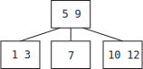{: height="200"}

### Exercise: Searching a 2-3 Tree

We can take advantage of the ordering property to construct a search algorithm
similar to the search algorithm for binary search trees. Assume that within
a node, we check elements from left to right.

Discuss the following with someone in your lab, based on the tree above:

1. What is the order in which we check elements when we search for 7 (a element in the tree)?
2. What is the order in which we check elements when we search for 13 (a element not in the tree)?

**Answers (click to view):**

1.  Check 5, see that it's greater. Check 9, see that it's smaller, explore to
    the middle child. Check 7, see that we've found the element.
2.  Check 5, see that it's greater. Check 9, see that it's greater, explore to
    the right child. Check 10, see that it's greater. Check 12, see that it's
    greater. No more children, so conclude that it's not in the tree.

### Insertion into a 2-3 Tree

Although searching in a 2-3 tree is like searching in a BST, inserting a new
item is a little different.

Similar to a BST, we *always* insert the new element in a leaf node. We must find the
correct place for the element that we insert to go by traversing down the tree,
and then insert the new element into the appropriate place in the existing leaf.
However, unlike in a BST, we can "stuff" more elements into the nodes in a 2-3
tree.

#### Basic Insertion

Suppose we have the 2-3 tree from above:

{: style="max-height: 200px;" }

If we were to insert 8 into the tree, we first traverse down the tree until
we find the proper leaf node to insert it into: the 7 node. This node only has one element in it, so we can still fit another. Since 8 is larger
than 7, we insert it to the right of the 7.

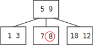{: style="max-height: 200px;" }

#### Push-Up Insertion

However, what if the leaf node we choose to insert into already has 2 elements? Even
though we'd like to put the new item there, it won't fit because nodes can have
no more than 2 elements. What should we do?

Consider the following 2-3 tree:

{: style="max-height: 200px;" }

Let's try to insert 4. We see that it needs to go into the leaf
node to the left with elements [1, 3]. We start by *temporarily* violating the
3-element limitation, and "overstuffing" this node so that it has elements [1, 3, 4].

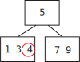{: style="max-height: 200px;" }

We need to "split" this node with 3 elements, so that all nodes continue to have
1 or 2 elements. One way to do that could be to create a subtree, by moving the
middle node "up", and splitting the remaining nodes.

{: style="max-height: 250px;" }

**However, this makes some of the leaves (1 and 4) be further from the root
than other leaves (7 and 9).** We want to keep our tree as *balanced* as
possible, so we want to keep our leaves at the same height. To fix this,
instead of keeping the middle element separate, we "push it up" to the parent node:

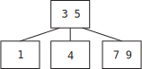{: style="max-height: 200px;" }

The tree invariants now hold, so we're done! Note that the other two elements in
the overstuffed node (1 and 4) have become separate children of the newly
expanded node with elements 3 and 5.

#### Push-Up Insertion... Again

You may have noticed a problem in the previous section. What if this push-up
causes the parent node to have too many elements? When the parent node has too many
elements, we need to push up and split again -- which may cause another
overstuffing, and so on.

Let's insert 8 into the tree we finished with last time:

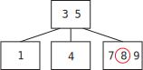{: style="max-height: 200px;" }

Since we have an overstuffed node, we need to split and push up:

{: style="max-height: 200px;" }

When we create an overstuffed node that temporarily has 3 elements, it has 4
children, since all nodes have 1 more child than element.

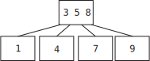{: style="max-height: 200px;" }

When we reach the root node, we don't have a parent node to push up into.
Instead, we push up the middle node (as usual), and create a new layer.
This does not cause any of the leaves to be at different heights from the root.
We're making a new root, and pushing down all leaves equally!

{: style="max-height: 250px;" }

Wait, what happened to the 4 children from the split node -- why did they go
*there*? Remember the binary search tree-like invariant. After we pull up
5 and have 3 and 8 be split into separate children, we must maintain the
ordering invariant. The subtree rooted at 4 could contain any elements "between
3 and 5". To keep that true, we put 4's subtree in the new tree where it could
still contain any elements between 3 and 5 -- to the left of 5, then to the right
of 3.

#### Push-Up Insertion Summary

Here's a summary of different cases you might encounter when performing
push-up insertion. Each of these cases can be explained by upholding the
binary search invariant.

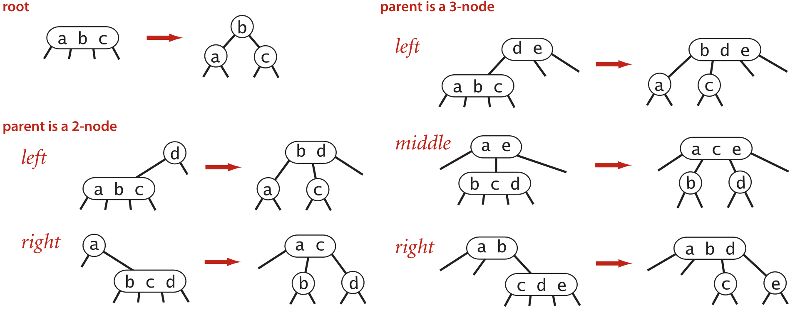{: style="max-height: 400px;" }

<cite>Diagram from Sedgewick's Algorithms, 4th ed.</cite>

### Exercise: Growing a 2-3 Tree

1.  Insert 10, 11, 12, and 13 in order into the final 2-3 tree above.
    Then, compare your answer with someone else in your lab.

2.  Suppose the elements 1, 2, 3, 4, 5, 6, 7, 8, 9, and 10 are inserted sequentially
    into an initially empty 2-3 tree. Which insertion causes the second split
    to take place?

    Try to add these elements to an empty tree, and discuss your result with your
    another person.



### Discuss: 2-3 Tree Balancing

With the insertion procedure given above, why are 2-3 trees self-balancing?
Can a leaf ever be further from the root than another? Are we guaranteed any runtimes for insertion or search?
Discuss with someone in your lab or your TA.

## Left-Leaning Red-Black Trees

We saw that 2-3 trees are balanced, guaranteeing that a path from the root to
any leaf is $$O(\log N)$$ in a tree with $$N$$ elements. However, 2-3 trees are notoriously difficult and
cumbersome to code, with numerous corner cases for common operations. They are
commonly used and have significant (out-of-scope) benefits, but they also
have drawbacks.

We turn our attention to a related data structure, the red-black tree (in fact,
the tree behind Java's `TreeSet` and `TreeMap`). A **red-black tree** at its
core is just a binary search tree, but there are a few additional invariants
related to "coloring" each node red or black. This "coloring" creates a
1-1 mapping between 2-3 trees and red-black trees! **In other words, every 2-3 tree
corresponds to exactly one red-black tree, and vice-versa.**

The consequence is quite astounding: red-black trees maintain the balance of
2-3 trees while inheriting all normal binary search tree operations (a red-black
tree *is* a binary search tree after all) with additional housekeeping. These
qualities, self-balancing combined with relative ease of binary search operations,
is why Java's `TreeMap` and `TreeSet` are implemented as red-black trees!

We will concern ourselves with a specific subset of red-black trees:
left-leaning red-black trees, or LLRB trees.

### 2-3 Trees &harr; LLRB Trees

Notice that a 2-3 tree can have 1 or 2 elements per node, with 2 or 3 children
respectively. We would like to use a standard binary tree to be able to
represent a 2-3 tree. It is straightforward to represent nodes with 1 element --
they are regular nodes, with one element and two children. However, how do we
represent nodes with two elements?

We split the two elements into two nodes, and *color* them to indicate they are connected:

{: style="max-height: 350px;" }

Note the location of the child subtrees. Here, we've colored `a`
**red**{: style="color: red;"}, to indicate that it is in the same 2-3 tree
node as its parent. We color all other nodes **black** to indicate that
they are in a different 2-3 tree node from their parent. Note that you may also
see LLRB trees represented using red links between connected nodes (rather than the
child node being colored red). 

In this way, we also see that each 2-3 tree node corresponds to exactly
one black node (and vice-versa).

Note that `a` could have been on top, with `b` being a child on the
right. This is also technically valid! However, to simplify the cases we
later consider, we always put the single red child on the left. This is what
makes these trees *left-leaning*.

Here's a full 2-3 tree translated into the corresponding LLRB tree:

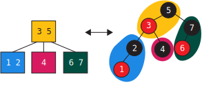{: style="max-height: 350px;" }

### LLRB Tree Properties

We can now specify some properties of LLRB trees that allow us to define
them independently. In particular, we use the one-to-one mapping between
valid LLRB trees and 2-3 trees to derive some of these properties.

The root node must be colored black.
: Our interpretation of red nodes is that they are in the same 2-3 node as
  their parent. The root node has no parent, so it cannot be red.

If a node has one red child, it must be on the left.
: This makes the tree left-leaning.

No node can have two red children.
: If a node has two red children, then both children are in the same 2-3 node
  as the parent. This means that the corresponding 2-3 node contains 3 elements,
  which is not allowed.

No red node can have a red parent; or every red node's parent is black.
: If a red node has a red parent, then both the red child and red parent are in
  the same 2-3 node as the red parent's parent. This means that the
  corresponding 2-3 node contains 3 elements, which is not allowed.

In a balanced LLRB tree, every path from the root to null goes through the same number of black nodes.
: In a balanced 2-3 tree, every leaf node is the same distance from the root.
  We also know that every black node in an LLRB tree corresponds to exactly one
  node in the equivalent 2-3 tree. Therefore, every leaf node in an LLRB tree
  is the same number of black nodes from the root, just as every leaf node
  in a 2-3 tree is the same distance from the root. This stricter invariant of Root-to-Null
  (rather than just saying Root-to-Leaf) avoids invalid trees like below: 

  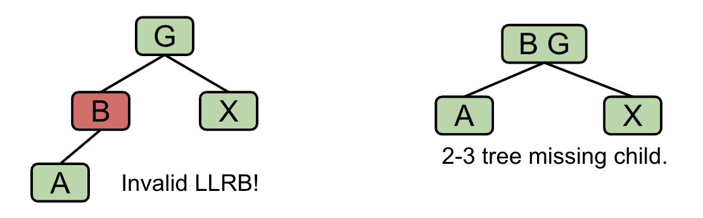{: style="max-height: 200px;" }

### Discussion: LLRB Tree Properties

Given the height of a 2-3 tree, what is the maximum height of the corresponding
LLRB tree? Discuss with your someone in your lab.

Then, discuss which of the following binary search tree
operations we can use on red-black trees without any modification.

1. Insertion
2. Deletion
3. Search (is `k` in the tree?)
4. Range Queries (return all items between `a` and `b`)

**Answers (click to view):**

The tallest LLRB tree that we can get from a 2-3 tree is by stacking 3-nodes,
which contain a black node on top of a red node. The maximum height of the LLRB tree
is therefore double the height of the corresponding 2-3 tree.

We can perform searches and range queries just like for binary search trees,
since these don't modify the tree structure. However, we must change our
insertion and deletion algorithms to uphold the invariants we just discussed.

### Exercise: Constructor

Read the code in `RedBlackTree.java` and `TwoThreeTree.java`.

Then, in `RedBlackTree.java`, implement `buildRedBlackTree` which returns the
root node of the red-black tree which has a one-to-one mapping to the given
2-3 tree. **For a 2-3 tree node with 2 elements in a node, you must create
a left-leaning red child to pass the autograder tests.** 

If you're stuck, refer to the example conversions shown above to help you write
this method!

Some further tips for writing this method if you are stuck:

- You should be filling in the two cases which correspond to a 2-node and a
  3-node. For a 2-node, you should need to make one new `RBTreeNode` object.
  For a 3-node, you should need to make two new `RBTreeNode` objects.
- You should rely on the `getItemAt` and `getChildAt` methods from the `Node` class
  which will return the appropriate items and children `Node`s.
- Your code should involve the same number of recursive calls to `buildRedBlackTree`
  as the number of children in the `Node` you are translating, e.g. two recursive
  calls for a 2-node and three recursive nodes for a 3-node.
- For both cases you should only make one of the `RBTreeNode`s be a black
  node. For the cases where you have more than one `RBTreeNode` make sure that you are
  returning the black node.

## Inserting Into LLRB Trees

Insertion into LLRB trees starts off with the regular binary search tree
insertion algorithm, where we search to find the appropriate leaf location. Then we insert the element as a red node (recall in a 2-3 tree we always insert an element by stuffing it into an existing node).
Placing the node can break the red-black tree
invariants, so we need additional operations that can "restore" the red-black
tree properties. We know that there is a one-to-one correspondence of valid
red-black trees to 2-3 trees. Let's use this correspondence to try to derive
these operations.

Throughout:

- Our newly added node will have the element `x`. We will use letters, such as `a`
  and `b` to represent the other relevant values. They are ordered among each
  other (`a < b`), but assume that `x`'s value is whatever it needs to be to be
  in the right location.
- Our newly added node will be red. When we add to a 2-3 tree, we always stuff
  leaf before splitting -- therefore, our new node is in the same 2-3 node as
  its parent LLRB node.

### Case: Only Child of a Black Node

Since a black node corresponds to a 2-node with 1 element, there are two possible
places that the new red node could end up, depending on its value:

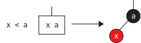{: style="max-height: 200px;" }

This case is fine, since the red child is on the left. No further action is
needed.

However, what if `x > a`? Then,

{: style="max-height: 200px;" }

This is *violation* of the invariant that a single red child is on the left.
It seems like we want these nodes to be "turned" the other way, with `x` as
the parent and `a` as the red child -- moving `a` and `x` to the left.
To do this, we use the operation "**rotate left**" on the parent node `a`.

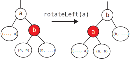{: style="max-height: 300px;" }

Here's a few things to notice about this "rotation":

- The root of the subtree has changed from `a` to `b`.
- `a` and `b` have moved to the "left".
- The two nodes swap colors so that the new root is the same color as the old root.
- The reorganized subtree still satisfies the binary search property.

Applying the rotation to the violation above by rotating left on `a`, we get:

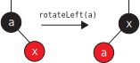{: style="max-height: 200px;" }

### Cases: Second Child of a Black Node or Child of a Red Node

Here, we have three sub-cases for when the new element is added to a 2-3 tree leaf
node that already contains two elements. This will cause a node split, which we
will have to represent somehow.

#### Case: Largest of Three

In this case, `x` is the largest of the three values in the node, so it is
placed as the right red child:

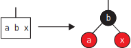{: style="max-height: 250px;" }

As there are 3 elements in the 2-3 node, we need to split it. `b` is pushed up,
and `a` and `x` become their own nodes. Since `a` and `x` become their own
nodes, we convert their colors to **black**. Additionally, since `b` may be
pushed up to become a member of another node, we convert its color to
**red**{: style="color: red;"}. This operation is called "**color flip**".

Here, we apply the color flip operation on `b`; flipping its color and its
childrens' colors.

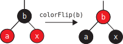{: style="max-height: 250px;" }

We will return to this configuration later.

#### Case: Smallest of Three

In this case, `x` is the smallest of the three values in the node, so it is
placed as the left red child of the existing red child:

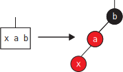{: style="max-height: 250px;" }

Since this is imbalanced to the *left*, perhaps we can rotate *right*. Let's
adjust our earlier "rotate left" operation to have the opposite
"**rotate right**" operation.

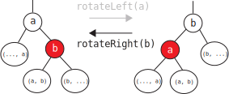{: style="max-height: 250px;" }

Rotating right is the opposite of rotating left! It will give us back the
original subtree if applied to the new root.

In this case, we rotate right on `b`:

{: style="max-height: 250px;" }

At this point, we notice that it's the same pattern as the previous case, so
we apply a color flip to `a`.

#### Case: Middle of Three

In this case, `x` is the middle of the three values in the node, so it is
placed as the right red child of the existing red child:

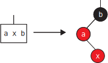{: style="max-height: 250px;" }

Rotating left on `a`, we get:

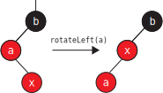{: style="max-height: 250px;" }

Here, we have the previous case again, so we know that we can rotate right on
`b` and apply a color flip to the root, `x`.

#### Upward Propagation

Hold on -- each of these three cases ended up in a color flip. What if the
subtree we modified was a *right subtree*, and the rest of the tree looked like
this:

{: style="max-height: 250px;" }

Just like how pushing up a element in a 2-3 tree may result in overstuffing
the parent node, performing these transformations may *also* violate an LLRB
invariant, giving us one of these three cases again. We resolve
these cases until we either:

- Do not have any broken invariants
- Flip the root's color

In the second case, we must remember to flip the root back to black. This is
equivalent to forming a new layer in the 2-3 tree.

### LLRB Insertion Summary

We discussed three operations that we can use to "fix" the LLRB invariants
after inserting a node.

We have two rotations, that can be used to move a right child or left child
up into their parent's position:

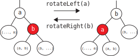{: style="max-height: 250px;" }

We also have the color flip operation:

{: style="max-height: 250px;" }

## LLRB Tree Implementation

### Exercise: Rotations

Now we have seen that we can rotate the tree to balance it without violating the
binary search tree invariants. Now, we will implement it ourselves!

In `RedBlackTree.java`, implement `rotateRight` and `rotateLeft`. For your
implementation, make the new root have the color of the old root, and color the
old root red.

*Hint*: The two operations are symmetric. Should the code significantly differ?
If you find yourself stuck, take a look at the examples that are shown above!

### Exercise: Color Flip

Now we consider the color flip operation that is essential to LLRB tree
implementation. Given a node, this operation simply flips the color of itself,
and the left and right children. However simple it may look now, we will examine
its consequences later on.

Implement the `flipColors` method in `RedBlackTree.java`.

### Exercise: `insert`

Now, we will implement `insert` in `RedBlackTree.java`. We have provided you
with most of the logic structure, so all you need to do is deal with normal
binary search tree insertion and handle the "second child" case
from the above section two. **Make sure you follow
the steps from all the cases very carefully!** The root of the `RedBlackTree`
should always be black.

Use the helper methods that have already been provided for you in the skeleton
files (`flipColors` and `isRed`) and your `rotateRight` and `rotateLeft`
methods to simplify the code writing!

If you're stuck, write a recursive helper method similar to how we've seen
`insert` implemented in previous labs!

- What should the return value be? (*Hint*: It's not `void`.)
- What should the arguments be?

In addition, think about the similarities between the cases presented above, and
think about how you can integrate those similarities to simplify your code.
Feel free to discuss all these points with other students in your lab and your TA.

### Discussion: `insert` Runtime

We have seen that even though LLRB trees guarantee that the tree will be almost
balanced, the LLRB tree `insert` operation requires many rotations and color
flips. Examine the procedure for `insert` and convince yourself
that `insert` still takes $$O(\log N)$$ as in balanced binary search trees.

*Hint:* How long is the path from root to the new leaf? For each node along the
path, are additional operations limited to some constant number? What does that
mean?

## (Optional) Other Balanced Trees

Balanced search is a very important problem in computer science which has garnered
many unique and diverse solutions. We have chose two common solutions to the
problem to explore in depth. It is also useful to know about other alternatives
but we will not expect you to understand how they work. Two other interesting
solutions to this problem are presented below. 

### AVL Trees
{: .no_toc}

**AVL trees** (named after their Russian inventors, Adelson-Velsky and
Landis) are height-balanced binary search trees, in which information about tree
height is stored in each node along with the item. Restructuring of an AVL tree
after insertion is done via a familiar process of *rotation*, but without color
changes.

### Splay Trees
{: .no_toc}

Another type of self-balancing BST is called the **splay tree**. Like other
self-balancing trees (AVL, red-black), a splay tree uses rotations to keep
itself balanced. However, for a splay tree, the notion of what it means to be
balanced is different. A splay tree doesn't care about differing heights of
subtrees, so its shape is less constrained. All a splay tree cares about is that
*recently accessed* nodes are near the top. Upon insertion or access of an item,
the tree is adjusted so that item is at the top. Upon deletion, the item is
first brought to the top and then deleted.



## Deliverables

- Complete the following methods in `RedBlackTree.java`:
    - `buildRedBlackTree`
    - `flipColors`
    - `rotateRight` and `rotateLeft`
    - `insert`
