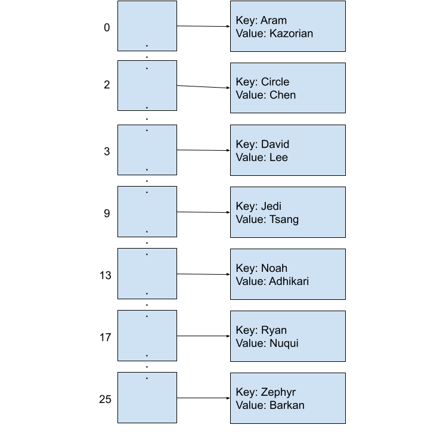

## [FAQ](faq.md)

Each assignment will have an FAQ linked at the top. You can also access it by
adding "/faq" to the end of the URL. The FAQ for Lab 13 is located
[here](faq.md).


## Introduction

As usual, pull the files from the skeleton and make a new IntelliJ project.

This lab is on the long side, so make sure to pair program!

Similarly, the provided `HashMapTest` is fairly limited. We will discuss the suggested
testing steps below, but **ensure you are creating your own tests** for all versions
of your data structure. Note, do not import `java.util.HashMap` to make the red lines
in Intellij go away. This will cause your local tests to test Java's official implementation
of a HashMap, rather than yours. As much as we love relying on tools others have made, it
is pretty important to actually be able to test our own code. :)

In today's lab, we'll learn about an *incredible* data structure that can provide
constant time insertion, removal, and containment checks. Yes, you read that
correctly: constant, $$\Theta(1)$$, runtime! In the best case scenario, the
**hash table** can provide amortized constant time access to its elements
regardless of whether we're working with 10 elements, 1,000 elements, or
1,000,000 elements.

First we will discuss the idea of an array based implementation of a `Map` interface.
Through the course of this lab, we will talk about new functionality and gradually
build up to a new, more robust, data structure. For this reason,
you should perform some simple sanity checks (in the form of small unit tests) between
every single exercise to ensure you are working in the right direction. If you get stuck at any point,
please ask your TA or an AI to clarify, as **each step in this lab will build upon the next**!
Make sure to clearly tell them which exercise you are working on. Finally, we
will analyze our `HashMap` in a few different ways to see exactly how we
get the runtime guarantee from above. Along the
way, we'll also discuss the merits and drawbacks of Java's `hashCode`, or *hash
function*, and how we can design our own hash functions.

Specifically, we will go through the following ideas:
- An array based map
- Making hashCode functions
- Collisions
- Resizing

We'll see later that all of these points above play a large role in the
runtime and efficiency of a hash table. For the remainder of this lab, we will
be figuring out how to work around each of these needs and limitations as we
create a fully-fledged `HashMap` that implements interface `Map61BL`.

This final `HashMap` will be your deliverable.

## Idea One: Array Based Map

Recall that we developed a binary search tree that acted as a `Set` back in lab
11 with the `add` and `contains` methods. It was certainly *quite* fast with
$$O(\log N)$$ `add`, `contains`, and `remove` assuming a balanced tree. But we
can do even better!

How can we design a constant time implementation of `Map`? If you're familiar
with Python, a map is like a dictionary: it provides a mapping from some key
(like a word in an English dictionary) to its value (like the definition for
that word). It's similar to a `Set` in that keys are guaranteed to be unique.

We need to design a data structure where, no matter how many elements we insert
into the `Map`, we can still retrieve any single element in $$\Theta(1)$$ time.
If we were to use a binary search tree to maintain our mapping, it can take up
to $$O(\log N)$$ time to retrieve any single element because we may need to
traverse $$\log N$$ other nodes to reach a leaf at the bottom of the tree. Our
goal, then, is to figure out how we can design a `Map` that **does not** need to
consider any significant portion of other keys.

Which data structure have we seen before in class that provides constant-time
access to any arbitrary element? Highlight to verify your answer:

<p><span style="color:white"><em>That's right, an array! </em></span></p>

We will need to make
some changes to make it work with the `Map` interface, which we will explore
throughout this lab, but note that arrays are fast. Unlike a linked list or a
tree, there’s no need to traverse any part of the collection to reach an
element: we can simply use bracket notation, `array[i]`, to jump right to the
`i`<sup>th</sup> index in constant time.

For the most part, this works great!

Consider the following implementation of a simple `Map` that maps first names
(key) to last names (value). This `Map` associates a number with each `key`, and
this number will refer to the index of the array that this key-value pair should
be placed. In this scheme, we will let the first letter in each `key` determine
its index in the final array. For example, if the key is "Aram", the letter 'A'
tells us that this key-value pair will map to `array[0]`. Listed below are our
keys and values, and what index each key corresponds to:

| Key        | Value           | Array Index |
|------------|-----------------|-------------|
| "Aram"     | "Kazorian"      | 0           |
| "Circle"   | "Chen"          | 2           |
| "David"    | "Lee"           | 3           |
| "Jedi"     | "Tsang"         | 9           |
| "Noah"     | "Adhikari"      | 13          |
| "Ryan"     | "Nuqui"         | 17          |
| "Zephyr"   | "Omaly"         | 25          |

We can define this conversion in a *hash function*, whose job, when given a key,
is to return a specific integer for that key. In this case, the hash function
uses the first character of the name to figure out the correct integer to
return. (Note: The hash function does not depend on the values at all.)

```java
public class String {
    public int hashCode() {
        return (int) (this.charAt(0) - 'A');
    }
 }
 ```

(Casting an character to an int converts the character into the "associated" number. What is this associated number?
The [ASCII table](https://en.wikipedia.org/wiki/ASCII#ASCII_printable_code_chart) provides an encoding of letters,
starting with capital letters, and `A` is encoded as value 65. We subtract `'A'` because we want our letters to start
at zero, rather than 65.)

When we are given this integer, we can then treat it as the index where the
key-value pair should go in the array!

Now, if we were to put the key-value pairs in the array, it would look as
follows:



Since we know exactly which index each `String` will map to, there's no need to
iterate across the entire array to find a single element! For example, if we put
"Ryan Nuqui" into the map (in the map, this entry will appear as ("Ryan",
"Nuqui")), we can find it later by simply indexing to `array[17]` because
Ryan's 'R' lives in the seventeenth array entry. Insertion, removal, and
retrieval of a single element in this map, no matter how full, will only ever
take constant time because we can just index based on the first character of the
key's name.

### Takeaway from Idea One

Our map above is actually implementing the foundational ideas of hash tables.
Hash tables are array-backed data structures and use the integer returned by an
object's hash function to find the array index of where that object should go.
In our map, we hash our key and use the return value to figure out where to put
our key-value pair. We'll learn more about how the hash function plays into the
hash table later on in the lab.

What are some of the down sides of our starting implementation? We have to assume
for this part of the lab that all keys will be valid names, and all keys
inserted into this map will start with a different (unique) letter. That is pretty
limiting! Let's figure out how to improve on that.

## Exercise 1: Let's Build a Map!

In order to dive into this lab, we need to set the stage. This means we should
aim to understand and set up the methods and structure specified by our interface.
In this exercise, we will make the necessary changes to the skeleton to comply with the`Map61BL`
interface.

First, we will set the class header. We want to make sure that the key and value are generic types. Make sure to
modify your instance variables and method signatures to match this change!
For example, the class header might read:

```java
public class HashMap<K, V> implements Map61BL<K, V>
```

Now we will implement an array-backed data structure based on the
details listed above. To do so, create a constructor that initially creates 26
empty spaces in the array-backed data structure, set up our state with instance
variables, and implement methods to update our data structure:

```java
public boolean containsKey(K key);
public V get(K key);
public void put(K key, V value);
public V remove(K key);
public boolean rmove(K key, V value);
```

In order to be a Map, we have to determine how to represent a key
value pair. As such, the skeleton defines an `Entry` static
nested class to represent an entry (a key-value pair) in our map.
Each index in the array will be one of these entries.

You will need to add generic type parameters to the skeleton `Entry` class as well
(replace all instances of `Entry` in your code with
`Entry<K, V>` -- or whatever generic variables you intend on using). Make sure to
modify your instance variables and method signatures to match this change!

Finally, we would have to write an implementation of the `hash(String key)`
function that works like the `String.hashCode()` example introduced above.

Then, add and implement the remaining functions of the `Map61BL` interface,
listed below:

```java
// Descriptions of what each method should do can be found in the Map61BL
// interface.
public void clear();
public boolean remove(K key, V value);
public Iterator<K> iterator();
```

**Implementing the `iterator()` method is optional**, but the skeleton and tests
have been provided for you if you want the additional practice implementing
iterators. If you choose not to implement this method, have the `iterator()`
method throw a new `UnsupportedOperationException`. The Autograder will recognize this.

If you choose to implement `iterator()`, you may find it useful to write another
inner class, as we have done in previous labs. Because `remove` of the
`Iterator` interface is an optional method, the iterator does not need to have
it implemented and you may throw an `UnsupportedOperationException` in that
case.

## Idea Two: HashCodes

What if we want to use lowercase letters or special characters as the first
letter of the name? Or any character, ever, in any language?

And, how can we use this structure with objects other than strings?

- ***Generalization***: How do we generalize the alphabet based indexing strategy in our map?
   The underlying principle behind *hashing* is that it provides a scheme for
   mapping an arbitrary object to an integer. For `String` names, we can get away
   with using the first character, but what about other objects? How can we
   *reliably* hash an object like a `Potato`?

- **Memory inefficiency**: The size of our array needs to grow with the size of
  the alphabet. For English, it's convenient that we can just use the first
  letter of each name as the array index so we only need 26 spaces in our array.
  However in other languages, that might not be true. To support any possible
  symbol, we might need an array with a length in the thousands or millions to
  ensure complete compatibility, even though we may only need to store a handful
  of names.

### Calculating Hash Values

Unfortunately not all objects can be easily
converted into a number. However, the idea underlying *hashing* is the
transformation of _any object_ into a number. If this transformation is fast and
different keys transform into different values, then we can convert that number
into an index and use that index to index into the array. This will allow us to
approximate the direct, constant-time access that an array provides, resulting
in near constant-time access to elements in our hash table.

The transforming function is called a *hash function*, and the `int` return
value is the *hash value*. In Java, hash functions are defined in the object's
class as a method called `hashCode()` with return value `int`. The built-in
`String` class, for example, might have the following code.

```java
public class String {
    public int hashCode() {
        ...
    }
}
```

This way, we can simply call `key.hashCode()` to generate an integer hash code
for a `String` instance called `key`.

### Memory Inefficiency in Hash Codes

Another issue that we discussed is memory inefficiency: for a small range of
hash values, we can get away with an array that individuates each hash value.
That is, every index in the array would represent a unique hash value.
This works well if our indices are small and close to zero.
We saw this in our alphabet based example. But remember that
Java's 32-bit integer type can support numbers anywhere between -2,147,483,648
and 2,147,483,647. Now, most of the time, our data won't use anywhere near that
many values. But even if we only wanted to support special characters, our array
would still need to be 1,112,064 elements long!

Instead, we'll slightly modify our indexing strategy. Let's say we only want to
support an array of length 10 so as to avoid allocating excessive amounts of
memory. How can we turn a number that is potentially millions or billions large
into a value between 0 and 9, inclusive?

**Wrapping**!!

The modulo operator allows us to do just that. The result of the *modulo
operator* is like a remainder. For example, `65 % 10 = 5` because, after
dividing 65 by 10, we are left with a remainder of 5. Note that you can read the
expression as "65 mod 10". Thus, `3 % 10 = 3`, `20 % 10 = 0`, and `19 % 10 = 9`.
For an intuitive understanding of this, think about how we used the modulo operator
in Project One to ensure you avoided IndexOutOfBounds Exceptions and could accurately
index into your deque.
Returning to our original problem, we want to be able to convert any arbitrary
number to a value between 0 and 9, inclusive. Given our discussion on the modulo
operator, we can see that any number mod 10 will return an integer value between
0 and 9. This is exactly what we need to index into an array of size 10!

More generally, we can locate the correct index for any `key` with the
following,

```java
Math.floorMod(key.hashCode(), array.length)
```

where `array` is the underlying array representing our hash table.

In Java, the `floorMod` function will perform the modulus operation while
correctly accounting for negative integers, whereas `%` does not.

## Exercise 2: `hashCode()`

First, switch which partner is coding for this part of the lab. Then, ensure
our map's hashCode method invokes the `key`'s `hashCode()` method.

Now, let us establish the default size of our backing array. For this HashMap implementation, **please have your default size be 16** (not 26).

Make changes to the following functions to support using a `key`'s `hashCode()`.

```java
public boolean containsKey(K key);
public V get(K key);
public void put(K key, V value);
public V remove(K key);
public boolean remove(K key, V value);
```

Note that, to use `hashCode()`'s results as an index, we must convert the
returned hash value to a valid index. Because `hashCode()` can return negative
values, use the `floorMod` operation discussed above!

## Idea Three: Collisions

Now that we've completed a basic implementation of our map, can you spot
any problems with the design? Consider what happens if we try to add a few more
of the current staff members to the map. Below, we have a table of the name to
array index mapping.

| Key        | Value           | Array Index |
|------------|-----------------|-------------|
| "Aram"     | "Kazorian"      | 0           |
| "Adit"     | "Shah"          | 0           |
| "Circle"   | "Chen"          | 2           |
| "David"    | "Lee"           | 3           |
| "Jasmine"  | "Lin"           | 9           |
| "Jedi"     | "Tsang"         | 9           |
| "Noah"     | "Adhikari"      | 13          |
| "Ryan"     | "Nuqui"         | 17          |
| "Zephyr"   | "Omaly"         | 25          |

If we simply try to add all the elements in the table above to the map, what
will happen?

We will get collisions. A collision is when we have multiple elements that have the
same index in our map. Turn to your partner and decide which elements in the table
above will cause a ***collision***?

<details markdown="block">
  <summary markdown="block">
Collisions
  </summary>
Aram and Adit share index 0 while Jedi and
Jasmine share index 9. What happens if we need to include multiple A-names or
J-names in our initial implementation?
</details>

### Dealing with Collisions

In the previous example, the keys had mostly different values, but there were
still several *collisions* caused by distinct keys sharing the same hash value.
"Aram" and "Adit" are both distinct keys but they happen to map to the same
array index, 0, just as "Jedi" and "Jasmine" share the index 9.
Other hash functions, like one depending on the length of the first name, could
produce even more collisions depending on the particular data set.

There are two common methods of dealing with collisions in hash tables, which
are listed below:

1. **Linear Probing**: Store the colliding keys elsewhere in the array,
   potentially in the next open array space. This method can be seen with
   distributed hash tables, which you will see in later computer science courses
   that you may take.

2. **External Chaining**: A simpler solution is to store all the keys with the
   same hash value together in a collection of their own, such as a *linked
   list*.  This collection of entries sharing a single index is called a
   *bucket*.

We primarily discuss external chaining implemented using linked lists in
this course. Here are the example entries from the previous step, hashed into a
26-element map of linked lists using the function based on the first letter of
the string as defined earlier (the `hashCode` function is duplicated below for
your convenience).

```java
    public class String {
        public int hashCode() {
            return (int) (this.charAt(0) - 'A');
        }
    }
```


Inserting `("Adit", "Shah")` into this map after previously inserting
`("Aram", "Kazorian")` appends Adit's entry to the end of the
linked list at that index.

*Hint*: Ensure you are using `.equals()` rather than `==` to test the equality of two Objects!

## Exercise 3: External Chaining

First, switch which partner is coding for this part of the lab. Then, let's add
external chaining to our initial implementation!

Then, let's take the tests you wrote for the first exercise and ensure we add some additional
tests that test for collision and external chaining! (Wooooo TDD!!!)

To implement external chaining, we can use [Java's `LinkedList`](https://docs.oracle.com/javase/7/docs/api/java/util/LinkedList.html) class. You'll
need to put in a little work to get it working with Java arrays, so see
[this StackOverflow post](https://stackoverflow.com/questions/529085/how-to-create-a-generic-array-in-java)
and [this one as well](https://stackoverflow.com/questions/18581002/how-to-create-a-generic-array)
for workarounds.

In addition, make changes to the following functions to support external
chaining:

```java
public boolean containsKey(K key);
public V get(K key);
public void put(K key, V value);
public V remove(K key);
public boolean remove(K key, V value);
```

Remember that any class that implements `Map` **cannot contain duplicate keys**.

*Hint*: ensure you are **initializing** your LinkedLists at instantiation.

<details markdown="block">
  <summary markdown="block">
### Discussion: Hash Function Properties
  </summary>
We just learned that collisions are troublesome: exactly how many collisions
occur makes the difference between a pretty good runtime and a not so good
runtime. We need a hash function that distributes our keys as evenly as possible
throughout the map in order to reduce the number of collisions so we can
guarantee a close to constant time runtime for all of our operations.

But first off, what hash functions can we choose from? Are all functions that
return a number for each object a valid hash function? What makes a hash
function good?

A hash function is **valid** if:

- The hash function of two objects A and B (who are equal to each other
  according to their `.equals()` method) are the same value. We call this requirement
  `determinism`. This means the hash function cannot rely on attributes of the object
  that are not reflected in the `.equals()` method.
- The hash function returns the same integer every time it is called on the same
  object. We call this requirement `consistency`. This means the hash function
  must be independent from time and methods that do not change the intrinsic state
  of the object.

Note that there are no requirements that state that unequal items should have
different hash function values.

As an aside, I argue that these two requirements are in fact the same requirement.
We can restate the requirement of consistency. Imagine I make a pointer named `A`
to an object `O` at noon and a
pointer named `B` to this same object `O` at 1pm. We know that the hash code should return
the same integer for both objects, due to the consistency requirement. However, how do we
formally define our statement "this same object `O`" above? Technically, the only reason
we consider `B` to be pointing to the same thing as `A` is because of the `.equals()` method!
This is starting to sound an awful lot like the determinism requirement, huh!

The properties of a **good** hash function are less defined, but here are some
properties that are important for a good hash function (this is a non-exhaustive
list):

- The hash function should be valid.
- Hash function values should be spread as
  uniformly as possible over the set of all integers.
- The hash function should be "relatively quick" to compute.

Now let's think more specifically about the impact of the hashing function. In general,
we assume most hash functions will be "relatively quick". Why do we make this assumption?
Given how intrinsic the hashing function is to our data structure, the runtime of this function
will have a huge effect on the overall runtime of our data structure. This means we want our
hash code to be "easily" computable (ideally constant time). But what if our hash function
took in a string of length $$k$$ and summed the ASCII value of every letter. How long would
that take with respect to $$k$$? What would be the overall complexity of a sequence of
insertions and deletions if this was our hash function?

If you have any other ideas about what makes a good hash function, be sure to
check in with your TA!
</details>

## Idea Four: Resizing

No matter what, if the underlying array of our hash table is small and we add a
lot of keys to it, then we will start getting more and more collisions. Because
of this, a hash table should expand its underlying array once it starts to fill
up (much like how an `ArrayList` expands once it fills up).

To keep track of how full our hash table is, we define the term **load factor**,
which is the ratio of the number of entries over the total physical length of
the array.

$$\text{load factor} = \frac{\texttt{size()}}{\texttt{array.length}}$$

For our hash table, we will define the maximum load factor that we will allow.
**If, you have just inserted an element into the hash map, and the load factor is exceeded, then you should resize. In other words, you should be checking for the resize at the end of the hash map.** This is
usually by doubling the underlying array length. Java's default maximum load
factor is 0.75 which provides a good balance between a reasonably-sized array
and reducing collisions.

Note that if we are trying to add a key-value pair and the key already exists in
the hash map, the corresponding value should be updated but no resizing should
occur.

As an example, let's see what happens if our hash table has an array length of
10 and currently contains 7 elements. Each of these 7 elements are hashed modulo
10 because we want to get an index within the range of 0 through 9. The current
load factor is $$\frac{7}{10}$$, or $$0.7$$, just under the threshold.

If we try to insert one more element, we would have a total of 8 elements in our
hash table and a load factor of $$0.8$$. Because this would cause the load factor to
exceed the maximum load factor, we must resize the underlying array to length 20
before we insert the element. Remember that since our procedure for locating an
entry in the hash table is to take the `hashCode() % array.length` and since our
array's length has changed from 10 to 20, all the elements in the hash table
need to be relocated. Once all the elements have been relocated and our new
element has been added, we will have a load factor of $$\frac{8}{20}$$, or $$0.4$$,
which is below the maximum load factor.

## Exercise 4: Load Factor and Resizing

Update your map to include the automatic resizing feature described
above. For the purposes of this assignment, only implement resizing upwards from
smaller arrays to larger arrays. (Java's `HashMap` also resizes downward if
enough entries are removed from the map.) **Note that the default load factor for this implemntation should be 0.75.**

To do this, you will need add a method to keep track of the size of your
map (size is the number of items inside the map, not the length of
the underlying array) and store what the maximum load factor is for this map
(use `double`s to represent your load factors). The signature for the `size()`
method is given below.

```java
public int size();
```

In addition, make changes to the `put` function to support resizing. The
signature for the `put` method is given below.

```java
public void put(K key, V value);
```

A couple notes:

- It might help to write a `resize` helper method instead of trying to cram all
  the details into `put`!
- Remember that you should only resize if the addition introduces a new key
  (updating old key-value pairs do not count) and you should check if you need
  to resize **before** adding the new element.
- Dividing an integer by another integer will round your result down to the
  nearest integer.

## Testing

To speed up testing, we've provided the full test suite in the skeleton. Our
tests expect a couple of extra constructors and methods (listed below) so make
sure to implement these in your `HashMap` as well.

```java
/* Creates a new hash map with a default array of size 16 and a maximum load factor of 0.75. */
HashMap();

/* Creates a new hash map with an array of size INITIALCAPACITY and a maximum load factor of 0.75. */
HashMap(int initialCapacity);

/* Creates a new hash map with INITIALCAPACITY and LOADFACTOR. */
HashMap(int initialCapacity, double loadFactor);

/* Returns the length of this HashMap's internal array. */
public int capacity();
```

## Runtime Discussion

Now for a bit of runtime analysis!

For the following two scenarios, determine with your partner the worst case
runtime of getting a key with respect to the total number of keys, $$N$$, in the
map and explain your answer to each other. Assume our hash map implements
external chaining.

1. All of the keys in the map have different hash codes and get added to
   **different indices** in the array. An example input might look like:
   `("Eli", "Lipsitz"), ("Max", "Ye"), ("Eddy", "Byun"),
   ("Grace", "Jung")`.

2. All the keys in the map have the same hash code (despite being different
   keys), and they get added to the **same bucket**. An example input might look
   like: `("Sadia", "Qureshi"), ("Sav", "Bowerfind"), and ("Shirley", "Chen").`

If you have any questions, double check with your TA before moving on!

## Discussion: Wrap Up

We have now finished the main part of the lab, though here are a few
miscellaneous questions that you may have come up with throughout the course of
the lab.

1. We've learned that external chaining is one method for resolving collisions
   in our hash table. But why use a linked list? Why not use an array instead?
   What are the benefits and drawbacks of each?

2. How does the load factor play a part in this? Assuming that the keys are
   perfectly distributed, how many entries should be in each bucket and how does
   this affect the runtime?

3. Additionally, we forgot to put two staff members, "Ethan Ordentlich" and "Ethan
   Pang", into our map! However, if we tried to put both of them into our
   map, they would override each other's entries since keys must be unique. Is
   it possible to modify our data structure so that both people can be in the
   map? If not, what other data structures can we use so we can store all the
   staff members?

Discuss all these questions with your partner, and make sure to ask the lab
staff if you have any questions.

## Conclusion

### A Discussion of Amortized Runtime

So now you've implemented your HashMap (or at least read the spec) and (hopefully) satisfied the runtime constraints.
We have seen other data structures in this class which rarely have such good runtime.
How can we store so many elements efficiently with such good runtime?
How do our decisions about when and how to resize affect this?

For an intuitive metaphor for this, check out [Amortized Analysis (Grigometh's Urn)](https://joshhug.gitbooks.io/hug61b/content/chap8/chap84.html).

If you are more visually inclined, here is one way to visualize the runtime in the form of a graph.
We'll assume here that our hashcode is very good and we don't get very many collisions (a powerful assumption).
When we first create our HashMap, let's say we decide to start with an outer array of size 4. This means we
can have constant runtime for our first four insertions.
Each operation will only take one unit of time.


When we reach our load factor and have to resize, let's say we decide to make an array of size 8 and
copy over our four current items—which takes four constant time lookups.


That is a big spike! How can we say this is constant? Well, we will now have eight fast inserts! Wow!


A pattern starts to emerge. Once we have again reached our load factor there will be a spike,
followed by a sequence of "inexpensive" inserts. These spikes, however, are growing rapidly!


If we imagine this continuing, each spike will get bigger and bigger! Perhaps counter intuitively,
this runtime, viewed over a long time, is actually constant if the work is "amortized" over all of our inserts.
Here amortized means that we are spreading the cost of an expensive operation over all our operations.
This gives us a constant runtime overall for a large sequence of inserts and resizes.
To convince yourself of this visually, imagine "tipping" the size four spike so that it adds one
operation to each of the four fast inserts before it. Now each insert operation is taking about 2 units of work,
which is constant! We can see this pattern will continue. We can "tip" our size eight resize across the eight previous
fast operations! Try drawing a few more resizes out and convince yourself that the spike will always fit.

We have now gotten to the heart of the efficacy of HashMaps.
Would we get this behavior if we picked a resizing scheme which was additive and not multiplicative?
Discuss with your partner and then highlight to verify your answer:
<p><span style="color:white"><em>No! It must be a multiplicative resize scheme. Try drawing the same graphs with an additive scheme.
Do the spikes match the valleys? Nope! </em></span>.</p>

### Summary

In this lab, we learned about *hashing*, a powerful technique for turning a
complex object like a `String` into a smaller, discrete value like a Java `int`.
The *hash table* is a data structure which combines this *hash function* with
the fact that arrays can be indexed in constant time. Using the hash table and
the map abstract data type, we can build a `HashMap` which allows for amortized
constant time access to any key-value pair so long as we know which bucket the
key falls into.

However, we quickly demonstrated that this naive implementation has several
drawbacks: the ability to represent all different kinds of objects, memory
efficiency, and collisions. To workaround each of these challenges, we introduced three different
features:

- We designed and used different `hashCode()` functions to see how
  different hash functions distributed keys and how it affects the runtime of
  the hash table.

- To allow for smaller array sizes, we used the **modulo** operator to shrink
  hash values down to within a specified range.

- We added **external chaining** to solve collisions by allowing multiple
  entries to live in a single bucket.

- Finally, we added upwards resizing and the Map61BL interface!

### Deliverables

Complete the implementation of `HashMap.java` with:
- miscellaneous methods of the `Map61BL` interface,
- use of the `hashCode` method,
- the modulus operator,
- external chaining,
- upwards resizing, and
- testing constructors and methods.

A working implementation of these should be passing all of the local tests.
