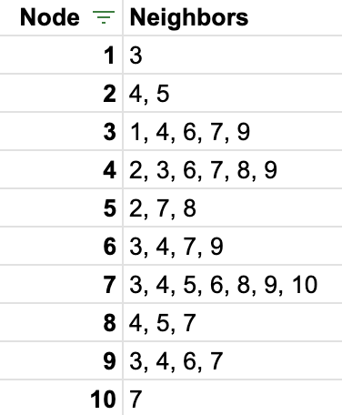

## [FAQ](faq)

Each assignment will have an FAQ linked at the top. You can also access it by
adding "/faq" to the end of the URL. The FAQ for Lab 17 is located
[here](faq).

## Introduction

As usual, pull the files from the skeleton and make a new IntelliJ project.

## Linked lists $$\subseteq$$ Trees $$\subseteq$$ Graphs

One of the first data structures we studied in this course was the linked list,
which consisted of a set of nodes connected in sequence. Then, we looked at
trees, which were a generalized version of linked lists. We can consider a tree
as a linked list *if* we relaxed the constraint that a node could only have one
child. Now, we'll look at a generalization of a tree, called a *graph*. We can
consider a graph as a tree *if* we relaxed the constraint that we can't have
cycles.

In a **graph**, we still have a collection of nodes, but each node in a graph can be
connected to any other node *without limitation*. This means that there isn't
necessarily a hierarchical structure, like we get in a tree. For example, here's a tree, where every node is descended from one another:


<!--  -->

Now suppose we add an edge back *up* the tree, like this:


<!--  -->

Notice the hierarchical structure is broken. Is $$C$$ descended from $$A$$ or is $$A$$ descended from $$C$$??? This is no longer a tree, but it is still a
graph!

There are other edges that are not allowed in a tree, but are allowed in a
graph. Let's take a look at the following:


<!--  -->

Now, node $$E$$ looks like it is descended from *two* nodes. Again, this is no longer
a tree (in trees, every node must only have one parent, except the root), but it is a graph.

In general, a graph can have any possible connections between nodes, as shown
below:


<!--  -->

{: .info}
>In CS61BL, we generally only consider *simple* graphs, which are graphs that do not have **self loops** (i.e. edges that point to itself, like how node $$B$$ does in the above image).

## Graphs

Graphs are a good way to represent relationships between objects. First, let's
go over some terminology. A node in a graph is called a **vertex**. Vertices
usually represent the objects in our graph (the things that have the
relationships such as people, places, or things). A relationship between two
vertices is represented by an **edge** (arrow or line connecting two vertices).

Here are a few examples of graphs in the everyday world:

- **Road maps**: Each city is a vertex, and the
  edges that connect these vertices are the roads and freeways that connect the
  cities. An example of what such a graph would look like can be found
  [here](http://inst.eecs.berkeley.edu/~cs61b/fa05/diagrams/freeway-graph.png).
  For a more local example, each building on the Berkeley campus can be thought
  of as a vertex, and the paths that connect those buildings would be the edges.

- **Computer networks**: Computers and other
  network machinery (like routers and switches) are the vertices, and the edges
  are the network cables. For a wireless network, an edge is an established
  connection between a single computer and a single wireless router.

### Directed vs. Undirected Graphs

If all edges in a graph are showing a relationship between two vertices that
works in *both directions*, then it is called an **undirected graph**. A picture of
an undirected graph looks like this:


Other times, we may want the relationships between
two vertices only go in *one direction*. Such a relationship can be represented
with a **directed** graph. An example of this could be a city map, where the edges
are sometimes one-way streets between locations. A two-way street would have to
be represented as two edges, one of them going from location $$A$$ to location
$$B$$, and the other from location $$B$$ to location $$A$$.

An example of
a directed graph appears below.


{: .info}
>Visually, an undirected graph will not have arrow heads on its edges because the edge connects the vertices in both directions. On the other hand, a directed graph will have arrow heads on its edges that point in the direction the edge is going. 
>
>Any undirected edge can be represented with 2 directed edges. This means every undirected graph is a directed graph, but the converse is not true. 

### Graph Definitions

Now that we have the basics of what a graph is, here are a few more terms that
might come in handy while discussing graphs.

| Term                | Definition                                                                                      |
|---------------------|-------------------------------------------------------------------------------------------------|
| Adjacent            | For an *undirected* graph, vertices `u` and `v` are *adjacent* if they are connected by an edge. The definition for *adjacent* is more ambiguous for *directed* graphs; in this lab, our `isAdjacent(u, v)` method for our directed graph will return `true` if there is an edge *from `u` to `v`*.               |
| Path                | A *path* is a sequence of edges from one vertex to another *where no edge or vertex is repeated*. Note that this definition may vary from other sources; this is the definition we use in CS61BL unless otherwise specified.|
| Connected           | A graph is *connected* if every vertex has a path to all other vertices.                        |
| Neighbor            | A vertex `u` is a *neighbor* of a vertex `v` if they are adjacent.                              |
| Indegree            | A vertex `v`'s *indegree* is the number of vertices `u` where a directed edge from `u` to `v` exists (aka the number of edges pointing *in* to `v`).             |
| Outdegree            | A vertex `v`'s *outdegree* is the number of vertices `u` where a directed edge from `v` to `u` exists (aka the number of edges pointing *out* of `v`).        |
| Degree            | A vertex `v`'s *degree* is the number of vertices adjacent to it. Note the we calculate the degree of a vertex for undirected graphs, and indegree/outdegree for directed graphs.             |
| Cycle               | A *cycle* is a path that ends at the same vertex where it originally started.                   |

## Exercise: Edge vs. Vertex Count

{: .task}
>For the following questions, think about what the answer may be, then check it with the solution.

### Exercise 1

Suppose that $$G$$ is a *directed* graph with $$N$$ vertices. What's the
maximum number of edges that $$G$$ can have? Assume that a vertex cannot have
an edge pointing to itself, and that for each vertex $$u$$ and $$v$$, there is
at most one edge $$(u, v)$$.

Options:

$$N, N^2, N(N-1), \frac{N(N-1)}{2}$$

<details markdown="block">
  <summary markdown="block">
**Solution**
{: .no_toc}
  </summary>
$$N(N-1)$$. There are $$N$$ vertices, and each one can have an edge to up to $$N-1$$ other vertices.
</details>

### Exercise 2

Now suppose the same graph $$G$$ in the above question is an *undirected*
graph.  Again assume that no vertex is adjacent to itself, and at most one edge
connects any pair of vertices. What's the maximum number of edges that $$G$$
can have compared to the directed graph of $$G$$?

Options:

- Half as many edges
- The same number of edges
- Twice as many edges

<details markdown="block">
  <summary markdown="block">
**Solution**
{: .no_toc}
  </summary>
Half as many edges. Every *pair* of *directed* edges u->v, v->u can be represented with a *single* *undirected* edge.
</details>

### Exercise 3

What's the *minimum* number of edges that a *connected* undirected graph with N
vertices can have?

Options:

$$N - 1, N, N^2, N(N-1), \frac{N(N-1)}{2}$$

<details markdown="block">
  <summary markdown="block">
**Solution**
{: .no_toc}
  </summary>
$$N-1$$. A graph with $$1$$ vertex needs $$0$$ edges to be connected. Every time you add a new vertex, you need at least one new edge to connect it. Notice that this question can also be interpreted as asking for the number of edges in a tree, which is connected and has no cycles (i.e. "extra" edges) by definition.
</details>

## Graph Representation

Now that we know how to draw a graph on paper and understand the basic concepts
and definitions, we can now consider how a graph should be represented inside of
a computer. We want to be able to get quick answers for the following questions
about a graph:

- Are given vertices `u` and `v` neighbors?
- What vertices are adjacent to `v`?

{: .info}
The next portion of today's lab will involve thinking about how fast and how efficient each
of these operations is using different representations of a graph.

Imagine that we want to represent a graph that looks like this:


### Adjacency Lists

One data structure we could use to implement this graph is called an array of
**adjacency lists**. In such a data structure, an array is created that has the
same size as the number of vertices in the graph. Each position in the array
represents one of the vertices in the graph. Each of these positions point to a
list, called an **adjacency list**, where every element in the list
represents a neighbor of the vertex for that position.

The array of adjacency lists (using linked lists) that represents the above graph looks like this:


### Adjacency Matrix

Another data structure we could use to represent the edges in a graph is called
an **adjacency matrix**. In this data structure, we have a two dimensional array
of size $$N \times N$$ (where $$N$$ is the number of vertices), which contains
boolean values (usually). The entry $$(i, j)$$ in this matrix is `true` when there is an
edge from $$i$$ to $$j$$, and `false` when no such edge exists. Thus, each vertex has a row
and a column in the matrix, and the boolean values in that row/column represent the existence of outgoing/incoming
edges to/from each other vertex.

The adjacency matrix that represents the above graph looks like this:


If our above graph was *undirected* (i.e. for every edge between two vertices, there is another edge pointing the other way), what will this matrix will look like? Considering drawing out the matrix to look for patterns.

## Discussion: Representation

A third data structure we could use to represent a graph is simply an extension
of the linked nodes idea. We can create a `Vertex` object for each vertex in
the graph, and each of `Vertex` will contain pointers to the `Vertex` objects of
their neighbors. This may seem like the most straightforward approach: aren't the adjacency list and adjacency matrix roundabout in comparison? Think about the following questions - feel free to consult with the students or TA in your lab!

1. Why might the adjacency list or adjacency matrix
might be preferred for a graph? Consider the runtime of our desired graph operations.
2. Additionally, we could also represent a tree using an adjacency matrix or list. Why might an adjacency list or adjacency matrix not be preferred for a tree?
3. Now, which is generally more efficient: an adjacency matrix or an array of adjacency
lists?

## Exercise: `Graph.java`

We have given you framework code for a class `Graph`. It implements a graph of
integers using adjacency lists.

{: .task}
>Understand the provided code for the nested `Edge` class, then implement the following methods:

```java
public void addEdge(int v1, int v2, int weight);
public void addUndirectedEdge(int v1, int v2, int weight);
public boolean isAdjacent(int from, int to);
public List<Integer> neighbors(int v);
public int inDegree(int v);
```

## Graph Traversals

Earlier in the course, we used the general traversal algorithm to process all
elements of a *tree*:

```java
Stack<TreeNode> fringe = new Stack<>();
fringe.push(root);

while (!fringe.isEmpty()) {
    TreeNode node = fringe.pop();
    process(node);
    fringe.push(node.right);
    fringe.push(node.left);
}
```

The code above processes the tree's values in depth-first order (DFS, specifically pre-order). If we wanted a
breadth-first traversal of a tree, we'd replace the `Stack` with a queue (such as a `LinkedList`).

Now, how would we modify this algorithm to traverse a *graph*?

Analogous code to process every vertex in a connected graph may look something
like:

```java
Stack<Vertex> fringe = new Stack<>();
fringe.push(startVertex);

while (!fringe.isEmpty()) {
    Vertex v = fringe.pop();
    process(v);
    for (Vertex neighbor: v.neighbors) {
        fringe.push(neighbor);
    }
}
```

However, this doesn't quite work. Unlike trees, a graph may contain a *cycle* of
vertices and as a result, the code may loop infinitely.

We don't want to process the same vertex *more than once*, so the fix is to *keep track of vertices that we've
visited already*. Here is the correct pseudocode for graph traversal:

```java
Stack<Vertex> fringe = new Stack<>();
HashSet<Vertex> visited = new HashSet<>();
fringe.push(startVertex);

while (!fringe.isEmpty()) {
    Vertex v = fringe.pop();
    if (!visited.contains(v)) { // prevents us from revisiting a node
        process(v);
        visited.add(v);
        for (Vertex neighbor: v.neighbors) {
            fringe.push(neighbor);
        }
    }
}
```
### Discussion: A Graph Traversal Modification
Instead of checking that the popped vertex `v` is
not yet visited, suppose we do this check *before* adding some neighbor to the
fringe. The body of the `while` loop would then look like the below:
```java
Vertex v = fringe.pop();
process(v);
for (Vertex neighbor: v.neighbors) {
    if (!visited.contains(neighbor)) {
        fringe.push(neighbor);
        visited.add(neighbor);
    }  
}
```
Would this change work?

<details markdown="block">
  <summary markdown="block">
#### Answer:
{: .no_toc}
  </summary>
Yes, this would work (although it is convention to check that the popped vertex is not yet visited).
</details>

## Exercise: Practice Graph Traversal

Suppose we are using the graph traversal code from the last example, copied below:
```java
Stack<Vertex> fringe = new Stack<>();
HashSet<Vertex> visited = new HashSet<>();
fringe.push(startVertex);

while (!fringe.isEmpty()) {
    Vertex v = fringe.pop();
    if (!visited.contains(v)) {
        process(v);
        visited.add(v);
        for (Vertex neighbor: v.neighbors) {
            fringe.push(neighbor);
        }
    }
}
```

<table>
  <tr>
    <td></td>
    <td></td>
  </tr>
 </table>

{: .task}
>Given the above graph, determine the order in which the nodes
are visited if you start at vertices 1 through 5. Break ties by defaulting
to the smaller vertex number first (ie. if a node has multiple neighbors, visit its 
lowest number neighbor first). In other words, fill in the table below:

| Starting vertex | Order of visiting remaining vertices |
|-----------------|--------------------------------------|
| 1               |                                      |
| 2               |                                      |
| 3               |                                      |
| 4               |                                      |
| 5               |                                      |


<details markdown="block">
  <summary markdown="block">
**Answers for Practicing Graph Traversal:**
  </summary>

| Starting vertex | Order of visiting remaining vertices |
|-----------------|--------------------------------------|
| 1               | 3, 4, 2, 5, 7, 6, 9, 8, 10           |
| 2               | 4, 3, 1, 6, 7, 5, 8, 9, 10           |
| 3               | 1, 4, 2, 5, 7, 6, 9, 8, 10           |
| 4               | 2, 5, 7, 3, 1, 6, 9, 8, 10           |
| 5               | 2, 4, 3, 1, 6, 7, 8, 9, 10           |

</details>

## Read the code: `DFSIterator`

{: .task}
>Read through the `DFSIterator` inner class and understand the code. As its name suggests, it iterates
through all of the vertices in the graph in DFS order, starting from a vertex
that is passed in as an argument.

{: .info}
>This iterator may not print out all the vertices in the graph if they are *unreachable from the starting vertex*.

## Exercise: `pathExists`

Complete the method `pathExists` in `Graph.java`, which returns whether or not
any path exists that goes from `start` to `stop`. Remember that a path is any
set of edges that exists which you can follow that such you travel from one
vertex to another by only using valid edges. **You may use
the `generateGX` methods to generate some sample `Graph`s to test your
implementation for this method (and the following methods)!**

In addition, paths may not visit an edge or a vertex more
than once. You may find it helpful for your method to call the `dfs` method,
which uses the `DFSIterator` class.

{: .task}
>Implement `pathExists` in `Graph.java`.

## Exercise: `path`

Now, you will actually find a path from one vertex to another, if it exists. Write
code in the body of the method named `path` that, given a `start` vertex and a
`stop` vertex, returns a list of the vertices that lie on the path from `start`
to `stop`. If no such path exists, you should return an empty list.

{: .task}
>Implement the `path` method.

<details markdown="block">
  <summary markdown="block">
**Hints:**
  </summary>
Base your method on `dfs`, with the following differences:
- First, add code to stop calling `next` when you encounter the finish vertex. 
- Then, trace *backwards* from the finish vertex to the start, by first finding a visited vertex u for which (u, finish) is an edge, then a vertex v visited earlier than u for which (v, u) is an edge, and so on. Finally, you'll find a vertex w for which (start,
w) is an edge (`isAdjacent` may be useful here!). Collecting all these vertices
in the correct sequence produces the desired path.
- We recommend that you try
this by hand with a graph or two to understand the logic!
</details>

## Topological Sort

A **topological sort** (sometimes also called a *linearization*) of a graph is a
ordering of the vertices such that if there was a directed path from vertex `v`
to vertex `w` in the graph, then `v` precedes `w` in the ordering. For instance, looking at the graph below, let **`A`** be `v` and **`F`** be `w`. Notice that there is a directed path from `A` to `F`, so `A` *must precede* `F` in the topological ordering.

This only works on **directed, acyclic graphs**, and they are commonly referred to
by their acronym: **DAG**.

Here is an example of a DAG:


In the above DAG, a few of the possible topological sorts could be:

    A B C D E F G H
    A C B E G D F H
    B E G A D C F H

{: .info}
>Notice that the topological sort for the above DAG has to start with either A or
B, and must end with H. (For this reason, A and B are called **sources**, and H is
called a **sink**.)

### Topo Sort Analogy

Another way to think about topo sort is to think of vertices in a DAG as representing a bunch of
tasks you need to complete on a to-do list. Some of those tasks cannot be
completed until others are done; i.e. some tasks must be completed before others. For example, when getting dressed in the
morning, you may need to put on shoes and socks, but you can't just do them in
any order. The socks must be put on before the shoes. Thus, a topological sort
of your morning routine must have socks appear before shoes.

The edges in the DAG represent dependencies between the tasks. In the DAG image above, that would mean that task A must be completed before tasks C and D, task
B must be completed before tasks D and E, E before G, C and D before F, and F and G before H. A topological sort gives you an order in which you can
do the tasks (it puts the tasks in a linear order). Informally, a topological sort
returns a sequence of the vertices in the graph that doesn't violate the dependencies between any two vertices.

### Discussion: Topological Sorts and DAG's

Why can we only perform topological sorts on DAGs? Think about the two
properties of DAGs and how that relates with our "to-do list" analogy.

### The Topological Sort Algorithm

One algorithm for taking a graph and finding a topological sort is to use an array (we'll call it `currentInDegree`) with one element per vertex. `currentInDegree[v]` is
initialized with the in-degree of each vertex `v`.

The algorithm also uses a fringe, which is initialized with all vertices
whose in-degree is 0. When a vertex is popped off the fringe and added to a
results list, the `currentInDegree` value of its neighbors are reduced by 1.
Then the fringe is updated again with vertices whose in-degree is now 0.

{: .task}
>Convince yourself why the above algorithm works! You will be implementing it in the next subpart.

{: .info}
>Another algorithm for finding the topological sort of a DAG is to run DFS post-order on the DAG, then reverse the order of which vertices are visited/processed.

## Exercise: `TopologicalIterator`

Implement the `TopologicalIterator` class so that it successively returns
vertices in topological order as described above. The `TopologicalIterator`
class will slightly resemble the `DFSIterator` class, except that it will use a
`currentInDegree` array as described above, and instead of pushing unvisited
vertices onto the stack, it will push only vertices whose in-degree is 0. Try to
walk through this algorithm, where you successively process vertices with
in-degrees of 0, on our DAG example above.

If you're having trouble passing the autograder tests for the topological traversals, try constructing a complete graph, and testing your `TopologicalIterator` on that!

{: .task}
>Implement the `TopologicalIterator` class.

## Deliverables

- Complete the following methods of the `Graph` class:
  - `addEdge`
  - `addUndirectedEdge`
  - `isAdjacent`
  - `neighbors`
  - `inDegree`
  - `pathExists`
  - `path`
- Complete the implementation of the following nested iterator:
  - `TopologicalIterator`
