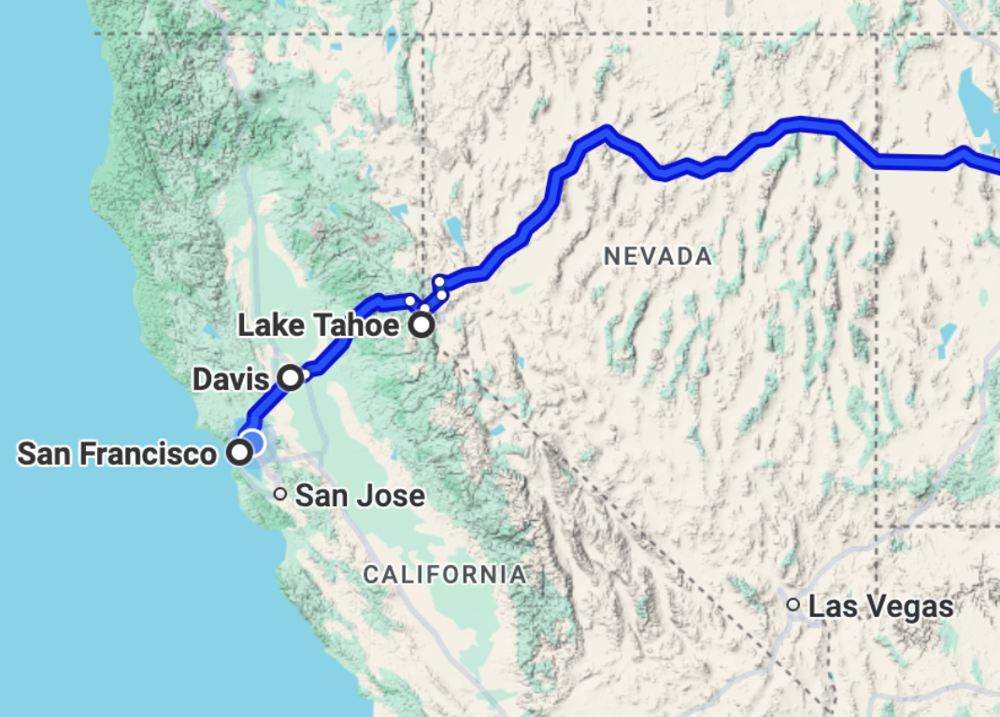

## [FAQ](faq)

Each assignment will have an FAQ linked at the top. You can also access it by
adding "/faq" to the end of the URL. The FAQ for Lab 19 is located
[here](faq).

{: .warning}
> **Warning:** this assignment is not officially released yet. This spec is subject to change until this warning disappears.

## Introduction

Pull the skeleton, as usual. 

{: .task}
>Copy your implementation of the following methods of `Graph.java` file from [Lab 17](../lab17) into `src/Graph.java`:
- `addEdge`
- `addUndirectedEdge`
- `isAdjacent`
- `neighbors`
- `inDegree`

## More Graph Algorithms

In [Lab 17](../lab17), we introduced graphs and their representations, and then we moved to
basic graph iteration. A variety of algorithms for processing graphs are based
on this kind of iteration, and we've already seen the following algorithms:

- Determining if a path exists between two different vertices
- Finding a path between two different vertices
- Topological sorting

None of these algorithms depended on the fringe representation. Either
depth-first traversal (using a stack) or breadth-first traversal (using a queue)
would have worked.

We're now going to investigate an algorithm where the ordering of the fringe
*does* matter. But first...

### Storing Extra Information

Recall the [exercise from Lab 17](../lab17/#exercise-path) where you determined the path from a `start`
vertex to a `stop` vertex. A solution to this exercise involved building a
traversal, and then filtering the vertices that were not on the path.

Instead of searching for the previous vertex along the path in all of the visited nodes like we did last lab, we can create *predecessor links*. If each fringe element contains a vertex and its predecessor along the traversed path, we can make the construction of the path more efficient. This is an example where it is useful to store *extra information* in the fringe along with a vertex.

### Associating Distances with Edges

In graph applications we've dealt with so far, edges were used only to connect
vertices. A given pair of vertices were either connected by an edge or they
were not. Other applications, however, process edges with **weights**, which are
numeric values associated with each edge. Remember that in an application, an
edge just represents some kind of relationship between two vertices, so the
weight of the edge could represent something like the strength, weakness, or
cost of that relationship.

{: .info}
>In today's exercises, the weight associated with an edge will represent the
*distance* between the vertices connected by the edge. In other algorithms, a
weight might represent the cost of traversing an edge or the time needed to
process the edge.

A (directed) graph with *weighted edges* is shown below.


- Observe the weights on the edges (the small numbers in the diagram). **Note that in a directed graph, the weight of an edge `(v, w)` doesn't have to be equal to the weight of
the edge `(w, v)`, its reverse.**

{: .task}
>Make sure you understand the idea of predecessor links and edge weights described above!

## Shortest Paths

A common problem involving a graph with weighted edges is to find the **shortest path** between two vertices. This means to find the sequence of edges from one
vertex to the other such that the *sum of weights along the path* is smallest. Note that though Breadth First Search might be able to find a path with the least *number* of edges, it's not capable of finding a shortest path based off the total *edge weight*.

{: .info}
>This is a core problem found in real life mapping applications. Say you want
directions from one location to another. Your mapping software will try to find
the shortest path from your location (a vertex), to another location (another
vertex). Different paths in the graph may have different lengths and different
amounts of traffic, which could be the weights of the paths. You would want
your software to find the shortest, or fastest, path for you.

### Discussion: Shortest Path

For the (directed) graph pictured above, what is the shortest path that connects vertex 0 with vertex 2?

<details>
<summary>Click to reveal answer!</summary>
0 4 1 2
</details>

For the graph pictured above, what is the shortest path that connects vertex 2
with vertex 1?

<details>
<summary>Click to reveal answer!</summary>
2 3 0 4 1
</details>

For the graph pictured above, what is the shortest path that connects vertex 1
with vertex 0?

<details>
<summary>Click to reveal answer!</summary>
1 4 3 0
</details>

## Dijkstra's Algorithm

How did you do on the shortest path questions above? It's pretty tricky, right?
Luckily, there is an algorithm devised by Edsger Dijkstra (usually referred to
as **Dijkstra's Algorithm**), which can find the shortest paths on a graph *with non-negative edge weights*. Dijkstra's Algorithm finds the shortest path for not just for a pair of vertices $$(0, 2)$$, but all the shortest paths from a
start vertex `s` to *every other vertex reachable from `s`*. The algorithm is
somewhat tedious for humans to do by hand, but it isn't too inefficient for
computers.

{: .info}
>Dijkstra's Algorithm finds the
shortest paths from a *given starting vertex* to *all other nodes in a graph with non-negative edge weights*, also known
as a **shortest paths tree**. To just find the shortest path between two
specified vertices `s` and `t`, simply terminate the algorithm after `t` has
been visited. Below is an overview of Dijkstra's Algorithm.

We will use a priority queue for our fringe. Here, we're using a min priority queue, because we want to prioritize visiting nodes with *smaller* total distance from the start point.

**Initialization:**

  1. Maintain a mapping from *vertices* to their *distance from the start vertex*.
     This will be used by the fringe to determine the next vertex to visit.
     We will use a priority queue to implement this fringe. Here, an item's priority value is its distance from the start vertex.
  2. Add the given start vertex to the fringe with distance / priority value zero.
  3. All other nodes can be left out of the fringe. **If a node is not in the
     fringe, assume it has distance infinity (aka we haven't analyzed any paths to that node *yet*).**
  4. For each vertex, keep track of which other node is the *predecessor* for the
     node *along the shortest path found*. For example, for the path `b` -> `r` -> `u`, `b` is the predecessor of `r`, and `r` is the precessor of `u`.

**While Loop: Loop until the fringe is empty.**

  1. Let `v` be the vertex in the fringe with the shortest distance to the start (or the highest priority).  Remove and hold onto `v`.
     * Dijkstra's visits vertices that are closest to the start first, thanks to our priority queue. **Thus, if we have just popped `v` off the queue, it must have been the next closest vertex from the start.** This means that there is no possible shorter path to get to  `v` through any vertices still on the queue, because they're all farther from the start than `v`! **So, whenever we visit a vertex, we know we've found the shortest possible path to that vertex.** You can find more in depth proofs of this [online](https://web.cs.ucdavis.edu/~amenta/w10/dijkstra.pdf).

  2. If `v` is the destination vertex, terminate now (this is optional and depends
     on whether you want to find a path to one goal, or find a path to all vertices). Otherwise,
     mark it as visited. Any visited vertices should not be visited again.

  3. Then, for each neighbor `w` of `v`, do the following:

     1. As an optimization, if `w` has been visited already, skip it (**Dijkstra's Algorithm visits vertices in distance-order from the root, so if we are *revisiting* a node, we have already found a shorter path that gets us there**).

     2. If `w` is not in the fringe (or another way to think of it - it's
        distance is infinity or undefined in our distance mapping), add it to the fringe (with the appropriate distance and previous pointers).

     3. Otherwise, if the path through `v`
        to `w` is a shorter path than what we've seen so far, we need to update `w`'s distance. If that is the case, replace the distance for `w`'s fringe entry with the distance from `start` to `v` plus the weight of the edge `(v, w)`, and replace its predecessor with `v`.
        * If you are using a `java.util.PriorityQueue`, you will need to call `add` or `offer` again so that the priority updates correctly. **Do not call `remove` as this takes linear time.**

{: .info}
>**Every time a vertex is dequeued from the fringe, that vertex's shortest path has
been found and it is finalized.** The algorithm ends when the stop vertex is
returned by `next`. Follow the predecessors to reconstruct the path.

{: .warning}
>**We can't guarantee the correctness of Dijkstra's algorithm on graphs with *negative edge weights*!** Consider why this is the case. In CS 170, you'll learn about the Bellman-Ford algorithm, which solves the same single-source shortest paths problem for graphs with negative edge weights too.

### Dijkstra's Algorithm Animation

{: .info}
>Dijkstra's algorithm is pretty complicated to explain in text, so it might help
you to see **[an animation of it](http://youtu.be/8Ls1RqHCOPw)**. 
>
>Also, here is a **[demo](https://docs.google.com/presentation/d/1g0XbwrdNxrDmFXXP6pPf-_mtpIrzSdP4W71VyvbfITc/edit?slide=id.g99cc41691_0_115#slide=id.g99cc41691_0_115)** from a previous semester's lecture slides.

As you watch the video, think about the following questions:

- How can you tell what vertices were
  currently in the fringe for a given step?
- After the algorithm has been run through,
  how can you look at the chart and figure out what the shortest path from
$$A$$ to $$H$$ is?

{: .info}
>Note that in this video, the fringe is initialized by putting all the vertices
into it at the beginning with their distance set to infinity. While this is also
a valid way to run Dijkstra's algorithm for finding shortest paths (and one of
the original ways it was defined), this is inefficient for large graphs.
Semantically, it is the same to think of any vertex not in the fringe as having
infinite distance, as a path to it has not yet been found.

### Runtime

Implemented properly using a priority queue backed by a binary heap, Dijkstra's
algorithm should run in $$O((|V| + |E|) log |V|)$$ time, where $$|V|$$ represents the number of vertices, and $$|E|$$ represents the number of edges. This is because for our heap, we make at most $$|V|$$ inserts/removals and $$|E|$$ updates requiring heap operations, which take $$log|V|$$ time (as discussed in [Lab 15](../lab15/#runtimes)).

For connected graphs, the runtime can be simplified to `O(|E| log |V|)`, as the
number of edges must be at least `|V| - 1`. Using alternative implementations of
the priority queue can lead to increased or decreased runtimes.

## Exercise: Dijkstra's Algorithm

{: .task}
>For practice, run Dijkstra's algorithm by hand on the pictured graph below,
finding the shortest path from vertex 0 to vertex 4. Keep track of what the
fringe contains at every step.


We recommend keeping track of a table like in the animation. Also, make
sure you know what the fringe contains at each step!

<details markdown="block">
  <summary markdown="block">
**Click to reveal answer:**
{: .no_toc}
  </summary>

Each of the entries is listed as "`dist` (`from`)". For example, if there was a listing for vertex 2 that was "3 (4)", it means that, for this iteration,
the distance to vertex 2 is 3, and vertex 4 is its predecessor along the path. Asterisks
denote vertices which have been removed from the fringe and should no longer be
considered.

<table style="max-width: 500px; width: 100%">
  <tr>
    <th>Iteration</th>
    <th>0</th>
    <th>1</th>
    <th>2</th>
    <th>3</th>
    <th>4</th>
  </tr>
  <tr>
    <td>0</td>
    <td>0 (0)</td>
    <td><script type="math/tex">\infty</script> (-)</td>
    <td><script type="math/tex">\infty</script> (-)</td>
    <td><script type="math/tex">\infty</script> (-)</td>
    <td><script type="math/tex">\infty</script> (-)</td>
  </tr>
  <tr>
    <td>1</td>
    <td>0 (0)*</td>
    <td>10 (0)</td>
    <td><script type="math/tex">\infty</script> (-)</td>
    <td>30 (0)</td>
    <td>100 (0)</td>
  </tr>
  <tr>
    <td>2</td>
    <td>0 (0)*</td>
    <td>10 (0)*</td>
    <td>60 (1)</td>
    <td>30 (0)</td>
    <td>100 (0)</td>
  </tr>
  <tr>
    <td>3</td>
    <td>0 (0)*</td>
    <td>10 (0)*</td>
    <td>50 (3)</td>
    <td>30 (0)*</td>
    <td>90 (3)</td>
  </tr>
  <tr>
    <td>4</td>
    <td>0 (0)*</td>
    <td>10 (0)*</td>
    <td>50 (3)*</td>
    <td>30 (0)*</td>
    <td>60 (2)</td>
  </tr>
  <tr>
    <td>5</td>
    <td>0 (0)*</td>
    <td>10 (0)*</td>
    <td>50 (3)*</td>
    <td>30 (0)*</td>
    <td>60 (2)*</td>
  </tr>
</table>
</details>

## Exercise: `shortestPath`

Add Dijkstra's algorithm to `Graph.java` from yesterday. Here's the method
header:

```java
public List<Integer> shortestPath(int start, int stop) {
    // TODO: YOUR CODE HERE
    return null;
}
```

For this method, you will need to refer to each `Edge` object's `weight` field.
Additionally, it may be useful to write a `getEdge` method, that will return the
`Edge` object corresponding to the input variables. Here's the header:

```java
private Edge getEdge(int v1, int v2) {
    // TODO: YOUR CODE HERE
    return null;
}
```

Additionally, adding the vertices to our `PriorityQueue` fringe directly won't
be enough. Our vertices are integers, so the `PriorityQueue` will order them by
their *natural ordering*. **Write a comparator to change the ordering of the vertices.** You may find [this constructor](https://docs.oracle.com/javase/7/docs/api/java/util/PriorityQueue.html#PriorityQueue(int,%20java.util.Comparator)) of Java's `PriorityQueue` helpful.

<details markdown="block">
  <summary markdown="block">
**Hint:**
{: .no_toc}
  </summary>
At a certain point in Dijkstra's algorithm, you have to change the value
of nodes in the fringe. Java's [`PriorityQueue`](https://docs.oracle.com/javase/7/docs/api/java/util/PriorityQueue.html)
does not support this operation directly, but **we can add a new entry into the `PriorityQueue` that contains the updated value (and will always be dequeued before any previous entries).** Then,
by tracking which nodes have been visited already, you can simply ignore any
copies after the first copy dequeued.
</details>

{: .task}
>Implement the `shortestPath` method in `Graph.java`, and write a comparator for the vertices. We also recommend implementing the `getEdge` helper method, though it is not required. **All tests have been provided locally (yayyy) to help you debug!**

{: .info}
>**Tie-breaking scheme**: if two vertices are the *same* distance away from the source, you may tiebreak arbitrarily.

## A* search
Sometimes, we know more about a graph than just the edge weights. If we're looking for the shortest path from `s` to `t` (aka we have a particular destination in mind), we might have an *estimate* of how far any other vertex is to `t`. We'll see how to solve this problem using an algorithm called **A\*** ("A star"), which is like Dijkstra's with an additional factor.

As an example, imagine you're in Davis, and you want to know the shortest path to New York. Let's say that in our graph, the two nearest vertices to Davis are San Francisco (west of Davis) and Lake Tahoe (east of Davis). San Francisco is a little closer to your starting point (Davis), but you can estimate that Lake Tahoe is *ultimately closer to the goal* (New York). If we were using Dijkstra's, we'd visit San Francisco first, since Dijkstra's only considers how close something is to the start. With A* though, we can take into account our estimate, and go to Lake Tahoe first, which will bring us closer to New York!



This estimate is found by using a **heuristic**. In A*, our **heuristic function** is some way to calculate an approximate distance of any given vertex to a particular goal. 

{: .info}
>**Notation**: If $$h$$ is our heuristic function with node $$x$$ being the goal, $$h(a) =$$ the heuristic value corresponding to node $$a$$ when node $$x$$ is the goal.

A* runs extremely similar to Dijkstra's. The primary difference is that for a vertex `v`, its priority value is the *sum* of the *known distance from `s` to `v`* and the *estimated distance from `v` to the goal `t`*. By doing so, each node is prioritized by what we believe (according to our heuristic) the total path will be if we go through that node. This makes sense when considering that the path lengths should add up: `dist(s, v)` $$+$$ `dist(v, t)` $$=$$ `dist(s, t)`.

By looking at the priority queue this way, we are first looking at paths we think will have the lowest *total* distance (according to our heuristic), not just the lowest distance so far. 

{: .warning}
>**If our heuristic is completely misguided (a very bad heuristic), then our judgements will likely be wrong.** In the earlier Davis -> New York example, consider if the heuristic for Lake Tahoe was 5000 (i.e. Lake Tahoe is estimated to be 5000 units away from Davis), and the heuristic for San Francisco was 5 (i.e. San Francisco is estimated to be 5 units away from Davis). These estimations for the Davis-SF and Davis-Tahoe distances are way off, which will throw off our calculations when performing A* from Davis to New York and cause us to output the wrong shortest path!

{: .info}
>CS61BL doesn't cover how good heuristics are calculated/chosen; take CS188 if you'd like to learn more about it!

<!-- commented out since admissible + consistent are oos for Su25 -->

<!-- **We say that an A\* is only guaranteed to find the correct shortest path if the heuristic is *admissive* and *consistent*.** -->
<!-- * *Admissive* means that the heuristic never OVERestimates the real distance to the goal. Consider that if our heuristic was not admissive, we might be deterred from visiting a vertex that was actually involved in the correct shortest path.
* *Consistent* means the the heuristic never has huge logical gaps between any neighboring vertices. Consider if I told you Berkeley was an estimated 500 miles from Daly City, and San Francisco was an estimated 5 miles away from Daly City. Similarly to how we know edge weights in a graph, we also know that the distance from Berkeley to San Francisco is 13 miles. But then our estimations for the distances to Daly City make no sense, and are completely *inconsistent*! -->

## Optional Applications

Graphs have very real applications! For example, some approaches to BYOW that we've seen in the past have used graph algorithms. We can also use graphs to solve other problems in
computer science such as:

- [Garbage Collection][], the problem of managing memory in Java.
- Search engines utilize algorithms (most famously, Google's [PageRank][]) to
  sovle the problem of organizing information on the internet and making
efficient queries on the data to return the best results.

[Garbage Collection]: https://inst.eecs.berkeley.edu/~cs61b/fa17/materials/lectures/lect37.pdf
[PageRank]: https://en.wikipedia.org/wiki/PageRank

## Deliverables

- Complete the `shortestPath` method in `Graph.java`.
