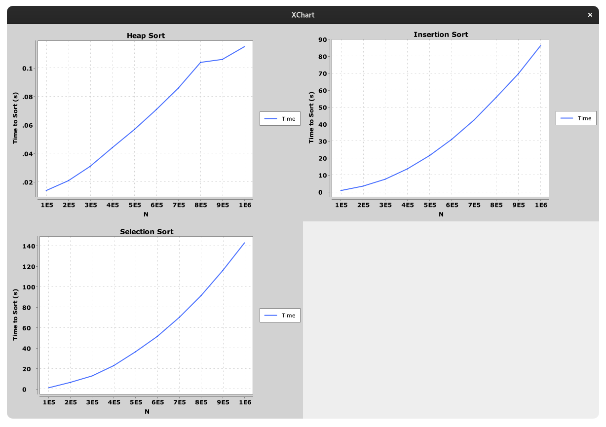

## [FAQ](faq.md)

Each assignment will have an FAQ linked at the top. You can also access it by
adding "/faq" to the end of the URL. The FAQ for Lab 20 is located
[here](faq.md).

## Introduction

As usual, pull the files from the skeleton and make a new IntelliJ project.

In today's lab, we'll be discussing **sorting**, algorithms for rearranging elements
in a collection to be in a specific order. There are many problems you can more easily solve with a sorted collection, including performing binary search in $$O(\log N)$$ time,
efficiently identifying adjacent pairs within a list, finding the $$k^{th}$$
largest element, and so forth.

There are several kinds of sorting algorithms, each of which is appropriate for
different situations. At the highest level, we will distinguish between two
types of sorting algorithms:

- **Comparison-based sorts**, which rely on making pairwise comparisons between
  elements.
- **Counting-based sorts**, which group elements based on their individual
  digits before sorting and combining each group. Counting sorts do not need to
  compare individual elements to each other.

In this lab and the following lab, we will discuss several **comparison-based sorts** including
*insertion sort*, *selection sort*, *heap sort*, *merge sort* and *quick sort*. Why all the
different sorts? Each sort has a different set of advantages and disadvantages:
under certain conditions, one sort may be faster than the other, or one sort may
take less memory than the other, and so forth. When working with large datasets
(or even medium and small datasets), choosing the right sorting algorithm can
make a big difference. Along the way, we'll develop an intuition for how each
sort works by exploring examples and writing our own implementations of each
sort.

[Here](https://www.cs.usfca.edu/~galles/visualization/ComparisonSort.html) is a nice
visualizer for some of the sorts we are going to cover today and tomorrow. 

## Order and Stability

To put elements in order implies that we can enforce an ordering between any two
elements. Given any two elements in a list, according to **total order**, we
should be able to decide which of the two elements is *larger* or *smaller* than
the other.

However, it's also possible that neither element is necessarily larger or
smaller than the other. For instance, if we wish to determine the ordering
between two strings, `["sorting", "example"]`, and we want to order by the
*length of the string*, it's not clear which one should come first because both
strings are of the same length 7.

In this case, we can defer to the notion of **stability**: if a sort is stable,
then it will preserve the relative orderings between elements in the list. In
the above example then, the resultant array will be `["sorting", "example"]` in
a *stable sort* rather than `["example", "sorting"]` as is possible in an
*unstable sort*. Remember that, according to our total order by the *length of the strings*, the second list is still considered correctly sorted even though
the relative order of equivalent elements is not preserved.

What is the benefit of stable sorting? It allows us to **sort values based off multiple attributes.** For example, we could stably sort a library catalog by
alphabetical order, then by genre, author, etc. Without stable sorting, we are not guaranteed that the relative ordering of the previous sorts
would persist so it is possible that the catalog would only be sorted by our
last sort.

Consider the following example where we sort a list of animals by alphabetical
order and then length of string.

Original collection:

    cow
    giraffe
    octopus
    cheetah
    bat
    ant

Sort by alphabetical order:

    ant
    bat
    cheetah
    cow
    giraffe
    octopus

**Stable** sort by length of string:

    ant
    bat
    cow
    cheetah
    giraffe
    octopus

Now the collection is sorted by length and elements with the same length are in
alphabetical order with each other. If our sorting algorithm was not stable,
then we would potentially lose the alphabetical information we achieved in the
previous sort.

## Space Complexity

Thus far, in this class, we've mostly talked about time complexity. Similarly to how we can do asymptotic analysis for runtime, we can also analyze how much *space* (i.e. memory) a given algorithm uses. For sorting algorithms, one common trait we look for is if the algorithm is **in-place**.

Any sorting algorithm that takes in an input of size N is going to have to work with some amount of memory proportional to N to store the size of the input itself. An in-place algorithm is one that doesn't use a significant amount of *additional* memory. In this class, this means that the algorithm must use a constant amount of additional memory (for example, a few variables to keep track of your current index or something). Another way to think about it is if we can do the entire algorithm within the original given list, without creating an additional data structure. All the algorithms we discuss today are in-place and do not need to create another data structure. 

Note that the definition of in-place can vary–though in our class we say only a constant amount of space counts, some measures say using a logarithmic amount is okay. If you see other articles online, just be wary!

## Discussion: Sorting by Hand

With your partner, discuss how you would sort a hand of 13 playing cards if you
are dealt the cards one-by-one. Your hand should end up sorted first by suit,
and then by rank within each suit.

Then discuss how you would sort a pile of 300 CS 61BL exams by student ID. If
it's different than your card-sorting algorithm of the previous step, explain
why.

Afterwards, discuss with your partner and roughly describe an algorithm to formalize your sort.
Can you tell if one is faster than the other? How so?

## Insertion Sort

The first comparison-based sort we'll learn is called an *insertion sort*. The
basic idea for insertion sort can be formally summed up by this pseudocode: 

    for each element in the collection:
        while the previous element is smaller than the element:
            swap the two elements

You might have intuitively come up with insertion sort when we asked you how to sort cards. This is like when you sort cards by continually putting the next card in the right spot in a group of sorted cards that you're holding.

Note that insertion sort is stable. We never swap elements if they are equal so
the relative order of equal elements is preserved.

Now that you've read the above explanation, we recommend watching this [video](https://youtu.be/JtS5yGftYZ8) to solidify your understanding.

### Discussion: Runtime

For the following questions, discuss with your peers and verify your
answers.

Assume we have an array of $$N$$ integers. What would the array have to look
like before we ran insertion sort that would make insertion sort run the
fastest, i.e. minimizing the number of steps needed?

 Click to reveal answer! 

Sorted List

What is the runtime of running insertion sort on this array?

 Click to reveal answer! 

Theta(N)

What type of initial ordering of a list would maximize the number of comparisons and result in the slowest runtime?

 Click to reveal answer! 

Reverse Sorted Array

What is the runtime of running insertion sort on the type of array you identified above?

 Click to reveal answer! 

Theta(N^2)

### Exercise: `InsertionSort`

Complete `sort()` in `InsertionSort.java` using the provided helper methods.

## Selection Sort

Selection sort on a collection of $$N$$ elements can be described by the
following pseudocode:

    for each element in the collection:
        find the smallest remaining element, E, in the *unsorted* part of the array
        remove E and add E to the end of the *sorted* part of the array
        repeat unsorted collection's original length number of times (or repeat until unsorted collection has no more elements)

In selection sort we swap the minimum element in the unsorted
collection with the element at the beginning of the unsorted collection. This can
rearrange the relative ordering of equal elements. Thus, selection sort is
unstable.

After reading the above, we recommend watching this [video](https://youtu.be/yZtvSYeTQi4) on selection sort!

### Disussion: Runtime

Now, let's determine the asymptotic runtime of selection sort. One may observe
that, in the first iteration of the loop, we will look through all $$N$$
elements of the array to find the minimum element. On the next iteration, we
will look through $$N - 1$$ elements to find the minimum. On the next, we'll
look through  $$N - 2$$ elements, and so on.  Thus, the total amount of work
will be the $$N + (N - 1) + ... + 1$$, no matter what the ordering of elements
in the array or linked list prior to sorting.

Hence, we have an $$\Theta(N^2)$$ algorithm, equivalent to insertion sort's
normal case. But notice that selection sort *doesn't* have a better case, while
insertion sort does.

### Exercise: `SelectionSort`

Complete `sort()` and suggested helper methods in `SelectionSort.java`.

## HeapSort

Recall the basic structure for selection sort

    for each element in the collection:
        find the smallest remaining element, E, in the unsorted collection
        remove E and add E to the end of the sorted collection

Adding something to the end of a sorted array or linked list can be done in
constant time. What hurt our runtime was finding the smallest element in the
collection, which always took linear time in an array.

Is there a data structure we can use that allows us to find and remove the
smallest element quickly? A heap will! 

We'll modify our approach to make it better suited for a heap by removing the 
largest element and placing it at the end of the array. Here's the pseudocode for 
HeapSort:
   
    construct a max heap from the given collection by bubbling down every
    element from the end of the collection 
    while there are elements remaining in the heap (unsorted part of the collection)
        swap the root of the heap with the last element
        bubble down the new root till the end of the heap

HeapSort is not stable because the heap operations (recall `bubbleUp` and
`bubbleDown`) can change the relative order of equal elements.

Once again, wrap up learning about HeapSort with this helpful [video](https://youtu.be/WuuQqsDftGU).

### Disussion: Runtime

Now, let's determine the runtime of heap sort. Removal of the largest element from a
heap of $$N$$ elements can be done in time proportional to $$\log N$$, allowing
us to sort our elements in $$O(N \log N)$$ time. 
We can also build a heap in $$O(N \log N)$$ time by calling bubble down on every element. 
This step is only done once, so it doesn't make our overall runtime worse than $$O(N \log N)$$
that we previously established. So, once the heap is created, sorting can be
done in $$O(N \log N)$$.

 Out of scope note:

The tighter runtime for building the heap is actually O(N) but it doesn't affect the 
overall runtime. The actual calculation for the run time of heap sort is complicated and out
of scope for this class. You can take a look at this <u><a href="https://stackoverflow.com/a/18742428">stackoverflow answer</a></u> for more a formal calculation of this runtime.

### Exercise: `HeapSort`

Complete `sort()` and suggested helper methods in `HeapSort.java`. The heap in this lab is rooted at index 0 instead of 1 as we're using it to sort through a pre-existing array. 
We've provided the appropriate `getLeftChild` and `getRightChild` methods as part of the skeleton, so you don't have to worry about this in your implementation. 

### Timing

So far we've measured the speed and efficiency of our algorithms by theoretically
performing asymptotic analysis on them. Another (less formal) way of determining 
the speed of a given program is to test it on a variety of inputs and measure 
the time it takes for each one. This is called a timing experiment, and we 
refer to this process as finding the efficiency of a program empirically. 
In this lab, we will be doing some timing experiments to see how the different sorting 
classes you implemented in this lab perform.

Open `TimingTest.java` and run it's `main` method. This class will sort random arrays of
different sizes using the sorting algorithms you implemented and plot the results. 

Here's the result of running the test on one of our computers:

Notice how by the time we reach an array size of 1000000, Selection Sort and Insertion Sort 
take more than a minute to run while Heap Sort manages to sort the same array in just over
one-tenth of a second!  

If the tests are taking too long on your computer, try lowering the bounds
provided in the class.

### Summary

Here are several online resources for visualizing sorting algorithms. If you're
having trouble understanding these sorts, use these resources as tools to help
build intuition about how each sort works.

- [VisuAlgo][]
- [Sorting Algorithms Animations][]
- [USF Comparison of Sorting Algorithms](http://www.cs.usfca.edu/~galles/visualization/ComparisonSort.html)
- [AlgoRhythmics][]: sorting demos through folk dance including
  [insertion sort][] and [selection sort][]

[VisuAlgo]: http://visualgo.net/sorting
[Sorting Algorithms Animations]: http://www.sorting-algorithms.com/
[USF Comparison of Sorting Algorithms]: http://www.cs.usfca.edu/~galles/visualization/ComparisonSort.html
[AlgoRhythmics]: https://www.youtube.com/user/AlgoRythmics/videos
[insertion sort]: https://www.youtube.com/watch?v=ROalU379l3U
[selection sort]: https://www.youtube.com/watch?v=Ns4TPTC8whw

To summarize the sorts that we've learned, take a look at the following table:

|                | Best Case Runtime    | Worst Case Runtime   | Stable  | In Place | Notes |
|----------------|----------------------|----------------------|---------|----------|-------|
| [Insertion Sort](https://youtu.be/JtS5yGftYZ8) | $$\Theta(N)$$        | $$\Theta(N^2)$$      | Yes     | Yes | |
| [Selection Sort](https://youtu.be/yZtvSYeTQi4) | $$\Theta(N^2)$$      | $$\Theta(N^2)$$      | No      | Yes | Can be made stable under certain conditions. |
| [Heap Sort](https://youtu.be/WuuQqsDftGU)      | $$\Theta(N)$$ | $$\Theta(N \log N)$$ | No      | Yes | If all elements are equal then runtime is $$\Theta(N)$$. In all other cases the runtime is $$\Theta(N \log N)$$. Hard to make stable. |

### Deliverables

To get credit for this lab:
- Complete the following classes:
    - `InsertionSort.java`
    - `SelectionSort.java`
    - `HeapSort.java`
