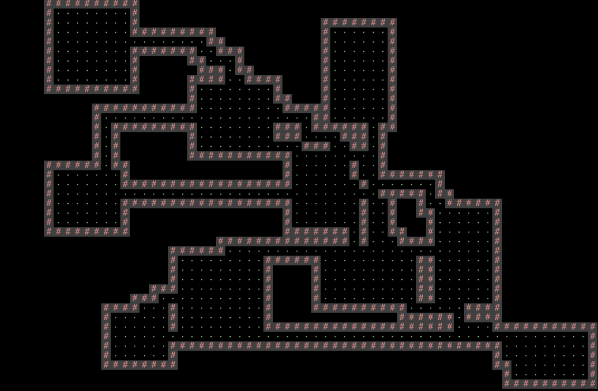

## [FAQ](faq.md)

Each assignment will have an FAQ linked at the top. You can also access it by
adding "/faq" to the end of the URL. The FAQ for Build your Own World
[here](faq.md).

## Introduction ##

In Project 3, you will create an engine for generating explorable worlds. This is a large design project that will require you and one partner (highly recommended) to work through every stage of development from ideation to presentation. The goal of this project is to teach you how to handle a larger piece of code with little starter code in the hopes of emulating something like a product development cycle. In accordance with this, the grading of this project will be different from other projects. Since there is no notion of "the correct answer" when it comes to world design and implementation, you will be assessed much like a performance review you might receive at an internship or job in addition to a very general autograder.  While this means you will be graded slightly subjectively, we promise to be pretty nice bosses and will respect you as any boss should respect their hard working employees. *Please* talk to us if you feel the grading scheme feels unfair.

This project will require you a great deal of exploration and experimentation. Searching the web for
answers (**not solutions from past semesters**) should be a regular activity throughout this process. Please know that there
are no right and wrong answers, as this is a very open-ended project. However, there are some implementations and ideas that
are better than others. It is ok and expected that you will go through several iterations before settling on something that you deem "good".
That is, this project is about **software engineering**.

You're not required to use any of the fancy data structures or concepts from class (A\*, MSTs, Disjoint Sets, etc). This project is about software engineering, not about data structures or algorithms. The data structures and algorithms we've learned about in class will make your code significantly simpler and more efficient, but please don't use things *just* because we learned about them in class. Only use these tools if you feel comfortable using them in your implementation.

A video playlist (from Spring 2018) discussing tips for working on this project can be found [at this link](https://www.youtube.com/playlist?list=PL8FaHk7qbOD6REWjsJd5jz9fpXO5_3ebY&disable_polymer=true). Note that the API has changed slightly, but the basic ideas are all still true. Slides for these videos can be found [at this link](https://docs.google.com/presentation/d/1XIu1L0k18A2QUlZuFYlJqjrQqSRNQp05qr1OmoBQkFE/edit?usp=sharing).

There are several key deadlines for this assignment:
 - Phase 0 - Read and understand the [partnership guidelines](../../guides/partnership-guide.md) before starting the assignment. Make a plan for routinely swapping navigator and driver!
 - Phase 1 - World Generation: Due on Gradescope by 07/31 at 11:59pm pacific time.
 - Phase 2 - Interactivity: Due on Gradescope by 08/07 at 11:59pm pacific time.

You cannot submit Phase 2 of the project late, as it will be
graded during a lab checkoffs with a TA.
While in theory you could submit Phase 1 and the supporting lab (Lab 16) late, Phase 2 of the project
builds upon these assignments, so it is unlikely that you will be able to submit these assignments late and still
complete Phase 2 on time.

If you find yourself falling behind, please do **not** hesitate to reach out to the instructors for resources and suggestions.

Now on to the assignment spec!

## Overview ##

Your task for the next 2 weeks is to design and implement a 2D tile-based world exploration engine. By "tile-based", we mean the worlds you generate will consist of a 2D grid of tiles. By "world exploration engine" we mean that your software will build a world, which the user will be able to explore by walking around and interacting with objects in that world. Your world will have an overhead perspective. As an example of a much more sophisticated system than you will build, the NES game "Zelda II" is (sometimes) a tile based world exploration engine that happens to be a video game:

The system you build can either use graphical tiles (as shown above), or it can use text based tiles, like the [game shown below](https://sites.google.com/site/broguegame/). Note that the world below is NOT a valid BYOW project (it doesn't have rooms or hallways), it's just an interesting example of a text-based game:

We will provide a tile renderer, a small set of starter tiles, and the headers for a few required methods that must be implemented for your world engine and that will be used by the autograder. The project will have two major deadlines. By the first deadline, you should be able to generate random worlds that meet the criteria below. By the second deadline, a user should be able to explore and interact with the world.

The major goal of this project is to give you a chance to attempt to manage the enormous complexity that comes with building a large system. Be warned: The system you build probably isn't going to be that fun for users! Two weeks is simply not enough time, particularly for novice programmers. However, we do hope you will find it to be a fulfilling project, and the worlds you generate might even be beautiful.

### Skeleton Code Structure ###

First, copy the resources you created in Lab 16 into your proj3 directory.

The skeleton code contains two key packages that you'll be using: `byow.TileEngine` and `byow.Core`. `byow.TileEngine` provides some basic methods for rendering, as well as basic code structure for tiles, and contains:
 - `TERenderer.java` - contains rendering-related methods.
 - `TETile.java` - the type used for representing tiles in the world.
 - `Tileset.java` - a library of provided tiles.

 **IMPORTANT NOTE: Do NOT change TETile.java's `character` field or `character()` method as it may lead to bad autograder results.**

The other package `byow.Core` contains everything unrelated to tiles. We **recommend** that you put all of your code for this project in the `byow.Core` package, though this not *required*. The `byow.Core` package comes with the following classes:

- `RandomUtils.java` - Handy utility methods for doing randomness related things.
- `Main.java` - How the user starts the entire system. Reads command line arguments and calls the appropriate function in `Engine.java`.
- `Engine.java` - Contains the two methods that allow interacting with your system.

`byow.Core.Engine` provides two methods for interacting with your system. The first is `public TETile[][] interactWithInputString(String input)`. This method takes as input a series of keyboard inputs, and returns a 2D `TETile` array representing the state of the universe after processing all the key presses provided in input (described below). The second is `public void interactWithKeyboard()`. This method takes input from the keyboard, and draws the result of each keypress to the screen. Lab 16 covers how to render tiles and how to get user input.

This project makes heavy use of `StdDraw`, which is a package that has basic graphics rendering capabilities. Additionally, it supports user interaction with keyboard and mouse clicks. You will likely need to consult the API specification for `StdDraw` at some points in the project, which can be found [here](https://introcs.cs.princeton.edu/java/stdlib/javadoc/StdDraw.html).

Your project should only use standard java libraries (imported from java.\*) or any libraries we provided with your repo.

**IMPORTANT NOTE: Do NOT use static variables unless they have the final keyword! In 2018, many students ran into major debugging issues by trying to use static variables. Static non-final variables add a huge amount of complexity to a system. Additionally, do not call `System.exit()` as this will cause the autograder to exit and fail.**

## Phase 1: World Generation ##

As mentioned above, the first goal of the project will be to write a world generator. The requirements for your world are listed below:
 - The world must be a 2D grid, drawn using our tile engine. The tile engine is described in lab 16.
 - The world must be pseudorandomly generated. Pseudorandomness is discussed in lab 16. We strongly suggest you rely on the provided randomness utility.
 - The generated world must include distinct rooms and hallways, though it may also include outdoor spaces.
 - At least some rooms must be rectangular, though you may support other shapes as well. When we say that "at least some rooms must be rectangular", it is expected that this means you have more than 1 identifiable rectangular room. A rectangular room must have 4 clear walls–it is not acceptable for the room to be overriden with hallways or undistinguishable from the rooms/hallways surrounding it. Note that having two intersecting rooms that are each rectangular does **not** count has having a fancy rectangular room. Instead, it means your world generation algorithm just allows you to build rooms on top of each other.
 - Your world generator must be capable of generating hallways that include turns (or equivalently, straight hallways that intersect).
 - The world must contain a random number of rooms and hallways.
 - The locations of the rooms and hallways must be random.
 - The width and height of rooms must be random.
 - Hallways should have a width of 1 or 2 tiles and must have a random length.  
 - Rooms and hallways must have walls that are visually distinct from floors. Walls and floors should be visually distinct from unused spaces.
 - Rooms and hallways must be connected, i.e. there should not be gaps in the floor between adjacent rooms or hallways.
 - All rooms must be reachable, i.e. the user can enter every room via some path.
 - The world must be substantially different each time, i.e. you should not have the same basic layout with easily predictable features.

As an example of a world that meets all of these requirements (click for higher resolution), see the image below. In this image, # represents a wall tile, a dot represents a floor tile, and there is also one golden colored wall segment that represents a locked door. All unused spaces are left blank.

Once you've completed lab 16, you can start working on your world generation algorithm.

**It is very likely that you will end up throwing away your first world generation algorithm.** This is normal! In real world systems, it is common to build several completely new versions before getting something you're happy with. The room generation algorithm above was Hug's 3rd one, and was ultimately much simpler than either of his first two.

You're welcome to search the web for cool world generation algorithms. You must not copy and paste code from existing games or graphical demos online, but you're welcome to draw inspiration from code on the web. **As always, make sure to cite your sources using @source tags.** You can also try playing existing 2D tile based games for inspiration. [Brogue](https://sites.google.com/site/broguegame/) is an example of a particularly elegant, beautiful game. [Dwarf Fortress](http://www.bay12games.com/dwarves/) is an example of an incredibly byzantine, absurdly complex world generation engine.

#### The Default Tileset and Tile Rendering Engine

The tile rendering engine we provide takes in a 2D array of `TETile` objects and draws it to the screen. Let's call this `TETile[][] world` for now. `world[0][0]` corresponds to the bottom left tile of the world. The first coordinate is the x coordinate, e.g. `world[9][0]` refers to the tile 9 spaces over to the right from the bottom left tile. The second coordinate is the y coordinate, and the value increases as we move upwards, e.g. `world[0][5]` is 5 tiles up from the bottom left tile. All values should be non-null, i.e. make sure to fill them all in before calling `renderFrame`. **Make sure you understand the orientation of the world grid!** If you're unsure, write short sample programs that draw to the grid to deepen your understanding. **If you mix up x vs. y or up vs. down, you're going to have an incredibly confusing time debugging.**

We have provided a small set of default tiles in `Tileset.java` and these should serve as a good example of how to create `TETile` objects. We strongly recommend adding your own tiles as well.

The tile engine also supports graphical tiles! To use graphical tiles, simply provide the filename of the tile as the fifth argument to the `TETile` constructor. Images must be 16 x 16, and should ideally be in PNG format. There is a large number of open source tilesets available online for tile based games. Feel free to use these.

Note: Your Github accounts are set up to reject files other than `.txt` or `.java` files. We will not have access to your tiles when running your code. Make sure to keep your own copy of your project somewhere else other than Github if you want to keep a copy of your project with graphics for archival purposes. Graphical tiles are not required. If you are curious about this, look up `.gitignore` files!

Any `TETile` object you create should be given a unique character that other tiles do not use. Even if you are using your own images for rendering the tile, each `TETile` should still have its own character representation.

If you do not supply a filename, or the file cannot be opened, then the tile engine will use the unicode character provided instead. This means that if someone else does not have the image file locally in the same location you specified, your world will still be displayed, but using unicode characters instead of textures you chose.

The tile rendering engine relies on `StdDraw`. We recommend against using `StdDraw` commands like `setXScale` or `setYScale` unless you **really** know what you're doing, as you may considerably alter or damage the *a e s t h e t i c* of the system otherwise.

#### Starting Your Program

Your program will be started by running the `main` method of the `Main` class. You will see that this  method calls one of two possible methods, based on the way a user wants to interact with your program. Users can provide the program a command line argument, describing how they want to generate the random world and what exploration they wish to complete, in which case, `Main.main` calls the `Core.Engine.interactWithInputSting(String s)` method. **When running `Core.Main.main` with an input string, the format of the command argument should be `-s inputString`, where `inputString` is the input of `interactWithInputString()`.**  If no command line argument was provided, the user wants to interact with the program using a GUI menu and exploring the world using the keyboard, in which case `Main.main` calls the `Core.Engine.interactWithKeyboard()` method.

For phase 1, your project does not need to support `interactWithKeyboard()` but it must support `interactWithInputString()`. Specifically, you should be able to handle an input of the format `"N#######S"` where each # is a digit and there can be an arbitrary number of `#`s. This corresponds to requesting a new world (`N`), providing a seed (`#`s), and then pressing `S` to indicate that the seed has been completely entered.

We recommend that you do not implement `Core.Engine.interactWithKeyboard()` until you get to phase 2 of the project (interactivity), though you're welcome to do so at anytime. It will be easier to test drive and debug your world generator by using `interactWithInputString` instead.

We also recommend not using `Core.Main.main` until you get to phase 2. It's easier to do phase 1 by writing your own `main` method in the class you interact with the most, that creates a renderer, calls `interactWithInputString`, then draws the result. If you write your own `main` method, you can ignore the `-s` flag and make the input string your only program argument. To provide a `main` method command line argument through IntelliJ, if you've already tried to run the `main` method, go to Run > Edit Configurations, and you can edit the Program Arguments box to input your string, as shown below.

If you haven't run the `main` method yet, right click the green arrow next to your main method like shown below, and click "Modify Run Configurations" to access the same window as above.

Finally, we recommend that you make minimal modifications to the `Core.Main` class. It is a **much** better idea to delegate all the work of the program to other classes you will create.

When your `Core.Engine.interactWithKeyboard()` method is run, your program must display a Main Menu that provides at LEAST the options to start a new world, load a previously saved world, and quit. The Main Menu should be fully navigable via the keyboard, using N for "new world", L for "load world", and Q for quit. You may include additional options or methods of navigation if you so choose.

After pressing N on the keyboard for "new world", the user should be prompted to enter a "random seed", which is a long value of their choosing. This long data type will be used to generate the world randomly (as described later and in lab 16).
The UI should show the seed value that the user has entered so far.
After the user has pressed the final number in their seed, they should press S to tell the system that they've entered the entire seed that they want. Your world generator should be able to handle any positive seed up to 9,223,372,036,854,775,807. There is no defined behavior for seeds larger than this (meaning you do not have to worry about it specifically.

The behavior of the "Load" command is described later in this specification.

If the system is instead started with `Core.Engine.interactWithInputString()`, no menu should be displayed and nothing should be drawn to the screen. The system should otherwise process the given String as if a human user was pressing the given keys using the `Core.Engine.interactWithKeyboard()` method. For example, if we call `Core.Engine.interactWithInputString("N3412S")`, your program should generate a world with seed 3412 and return the generated 2D tile array. **Note that letters in the input string can be upper or lower case and your engine should be able to accept either keypress (ie. "N" and "n" should both initiate the process of world generation).** You should **NOT** render any tiles or play any sound when using `interactWithInputString()`.

If you want to allow the user to have additional options, e.g. the ability to pick attributes of their character, specify world generation parameters, etc., you should create additional options. For example, you might add a fourth option "S" to the main menu for "select creature and create new world" if you want the user to be able to pick what sort of creature to play as. These additional options may have arbitrary behavior of your choosing, however, the behavior of N, L, and Q **must be exactly as described in the spec**!

#### Phase 1 Summary

For Phase 1, you should be able to run `Main.main` by providing an input String, and have your program create a world, that adhere to the requirements mentioned above. Note that you should render the world to check your code by writing your own `main` method, but for the autograder, `interactWithInputString()` should not render the world, only returning the row as a `TETile` array.
Worlds should be visibly different for different seeds provided to the program. To get help in Office Hours, Lab, and Gitbugs you **must** also have an up-to-date design document (described in the next section).

### Design Document

Since we did not provide you with any significant skeleton code for Project 3, and since the project is very open ended, we expect that BYOW implementations will vary a fair amount between students. In order for the course staff to provide you with support for this project, we request that you have a design document that reflects the current state of your project. We will not be able to process your Gitbugs, if you do not provide us with an up-to-date design document. We will also not be able to provide sufficient help in office hours or lab for questions that are specific to your implementation if you don't have an up-to-date design document. It is not feasible for us to try to understand your design remotely otherwise. So, before you submit a Gitbug, make sure that the design document in your `proj3` folder reflects the current state of your project.

Note that this is an exercise that is meant to help you, and to help us give you the best support possible. We highly encourage you to keep an up-to-date design document while working on this project. Having access to a design document in office hours or lab for example, may save you time explaining your implementation to an instructor or TA.
Design documents are important tools for software engineers. In a nutshell, these are documents that describe the structure of a program: the conceptual modules it comprises, the abstractions (classes in an object-oriented program) it uses, the implementation strategies (data structures and algorithms) each class uses, and how these modules and abstractions interact with each other.

Writing down a design for a program helps us plan out a project, organize ideas, and notice strategic design flaws before writing any code. Additionally, while working on a large-scale project like BYOW, having access to a design document may help you during the development process, as you will often need to reason about how multiple components of your program interact with each other.

**Before you begin writing any code**, use the guidelines listed here to create a plan for every feature of your BYOW program, and convince yourself that your design is correct.  Writing a design document is an iterative process. After coming up with your initial design, you may find some flaws in it, requiring you to revisit your design and update its description according to your new findings.

**Note:** Your design document will NOT be graded ever. We will not be able to help you with Gitbugs and in Office Hours / Lab if you don't have a handy design document.

#### Design Document Guidelines

Please use the following format for your BYOW design document. Your design document should be written in markdown, a language that allows you to nicely format and style a text file. Organize your design document in a way that will make it easy for you or a course-staff member to read. You should complete your design document in the `README.md` file in your `proj3` folder. If you open this file in IntelliJ, it will automatically render into a nicely formatted document on the right.

#### Design Document Sections

##### 1. Classes and Data Structures

Include here any class definitions. For each class, list the instance variables (if any). Include a brief description of each variable and its purpose in the class. Your explanations in this section should be as concise as possible. Leave the full explanation to the following sections. You may cut this section short if you find your document is too wordy.

##### 2. Algorithms

This is where you tell us how your code works. For each class, include a high-level description of the methods in that class. That is, do not include a line-by-line breakdown of your code, but something you would write in a javadoc comment above a method, including any edge cases you are accounting for. We have read the project spec too, so make sure you do not repeat or rephrase what is stated there. This should be a description of *how* your code accomplishes what is stated in the spec. This is also a place where you can describe how different classes interact with each other (via their methods).

The length of this section depends on the complexity of the task and the complexity of your design. However, simple explanations are preferred. Here are some formatting tips:

- For complex tasks, like adding rooms of random sizes at random locations, we recommend that you split your task into parts. Describe your algorithm for each part in a separate section. Start with the simplest component and build up your design, one piece at a time. Different sub-tasks may belong to different classes. If an algorithm uses a method (a subtask) from a different class be sure to mention it.
- Try to clearly mark titles or names of classes with white space or some other symbols.

##### 3. Persistence

You should only tackle this section after you are done with phase 1. This section should describe how you are going to save the state of a world, and load it again, following the requirements in the spec. Again, try to keep your explanations clear and short. Include all the components your program interacts with - classes, specific methods, and files you may create.

#### Example

To illustrate all this, we've created [a sample design document](https://cs61bl.org/su23/projects/byow/capers-example) for the Capers Lab. You should remember all of this from Project 2!

## Phase 2: Interactivity

In the second phase of the project, you'll add the ability for the user to actually interact with the world, and will also add user interface (UI) elements to your world to make it feel more immersive and informative.

The requirements for interactivity are as follows:
 - The user must be able to control some sort of "avatar" that can moved around using the W, A, S, and D keys. Lab 16 covers how to include interactivity. By "avatar", we just mean some sort of on screen representation controlled by the user. For example, in my project, I used an "@" that could be moved around.
 - The avatar must be able to interact with the world in some way.
 - Your system must be deterministic in that the same sequence of keypresses from the same seed must result in exactly the same behavior every time. Note that a `Random` object with a specific seed is guaranteed to output the same random numbers every time.
 - In order to support saving and loading, your program will need to create some files in your `proj3` directory (more details later in the spec and in the skeleton code). The only files you may create must have the suffix ".txt" (for example "savefile.txt"). You will get autograder issues if you do not do this.

Optionally, you may also include game mechanics that allow the user to win or lose (see extra credit points below). Aside from these feature requirements, there will be a few technical requirements for your system, described in more detail below.

#### UI (User Interface) Appearance

After the user has entered a seed and pressed S, the world should be displayed with a user interface. The user interface of your project must include:
 - A 2D grid of tiles showing the current state of the world.
 - A "Heads Up Display" (HUD) that provides additional information that maybe useful to the user. At the bare minimum, this should include Text that describes the tile currently under the mouse pointer.

As an example of the bare minimum, the simple interface below displays a grid of tiles and a HUD that displays the description of the tile under the mouse pointer (click image for higher resolution):

You may include additional features if you choose. In the example below (click image for higher resolution), as with the previous example, the mouse cursor is currently over a wall, so the HUD displays the text "wall" in the top right. However, this HUD also provides the user with 5 hearts representing the avatar’s "health". Note that this world does not meet the requirements of the spec above, as it is a large erratic cavernous space, as opposed to rooms connected by hallways.

As an example, the game below (click image for higher resolution) uses the GUI to list additional valid key presses, and provides more verbose information when the user mouses-over a tile ("You see grass-like fungus."). The image shown below is a professional game, so we do not expect your project to have this level of detail (but we encourage you to try for some interesting visuals).

For information about how to specify the location of the HUD, see the `initialize(int width, int height, int xOffset, int yOffset)` method of `TERenderer` or see lab 16.

#### UI Behavior

After the world has been generated, the user must be in control of some sort of avatar that is displayed in the world. The user must be able to move up, left, down, and right using the W, A, S, and D keys, respectively. These keys may also do additional things, e.g. pushing objects. You may include additional keys in your engine, but W, A, S, and D must function as described. The avatar should not move when attempting to move into a wall and the program must not error.

Again, the system must behave pseudorandomly. That is, given a certain seed, the same set of key presses must yield the exact same results!

In addition to movement keys, if the user enters ":Q" (note the colon), the program should quit and save. The description of the saving (and loading) function is described in the next section. **This command must immediately quit and save**, and should require no further keypresses to complete, e.g. do not ask them if they are sure before quitting. We will call this single action of quitting and saving at the same time "quit/saving". This command is case insensitive, so ":q" should work as well. Additionally, ":" followed by any other letter should not do anything.

This project uses `StdDraw` to handle user input. This results in a couple of important limitations:
 - `StdDraw` does not support key combinations. When we say ":Q", we mean ":" followed by "Q".
 - It can only register key presses that result in a char. This means any unicode character will be fine but keys such as the arrow keys and escape will not work.
 - On some computers, it may not support holding down of keys without some significant modifications; i.e. you can't hold down the e key and keep moving east. If you can figure out how to support holding down of keys in a way that is compatible with `interactWithInputString`, you're welcome to do so.

Because of the requirement that your system must handle String input (via `interactWithInputString`), your engine cannot make use of real time, i.e. your system cannot have any mechanic which depends on a certain amount of time passing in real life, since that would not be captured in an input string and would not lead to deterministic behavior when using that string vs. providing input with the keyboard. Keeping track of the number of turns that have elapsed is a perfectly reasonable mechanic, and might be an interesting thing to include in your world, e.g. maybe the world grows steadily darker in color with each step. You’re welcome to include other key presses like allowing the user to press space bar in order to wait one turn.

If you're having trouble getting started on how to implement user interaction, check out `InputDemo.java` for inspiration.

#### Saving and Loading

Sometimes, you’ll be exploring your world, and you suddenly notice that it’s time to go to watch a CS 61BL lecture. For times like these, being able to save your progress and load it later, is very handy. Your system must have the ability to save the state of the world while exploring, as well as to subsequently load the world into the exact state it was in when last saved.

Within a running Java program, we use variables to store and load values. Keep in mind that when your program ends, *all the variables will go out of scope*. Thus, you will need to persist the state of your program on some files that your program should create.

When the user restarts `byow.Core.Main` and presses L, the world should be in **exactly the same state as it was before the project was terminated**. This state includes the state of the random number generator! More on this in the next section. In the case that a user attempts to load but there is no previous save, your system should simply quit and the UI interface should close with no errors produced.

In the base requirements, the command ":Q" should save and completely terminate the program. This means an input string that contains ":Q" should not have any more characters after it and loading a world would require the program to be run again with an input string starting with "L".

#### Interacting With Input Strings and Phase 2

Your `Core.Engine.interactWithInputString(String s)` must be able to handle input strings that include movement

For example, the string "N543SWWWWAA" corresponds to the user creating a world with the seed 543, then moving up four times, then left twice. If we called `Core.Engine.interactWithInputString("N543SWWWWAA")`, your system would return a `TETile[][]` representing the world EXACTLY as it would be if we'd used `interactWithKeyboard` and typed these keys in manually. Since the system must be deterministic given a seed and a string of inputs, this will allow users to replay exactly what happened for a given sequence of inputs. This will also be handy for testing out your code locally, as well as for our autograder.

`Core.Engine.interactWithInputString(String s)` must also be able to handle saving and loading in a replay string, e.g. "N25SDDWD:Q" would correspond to starting a new world with seed 25, then moving right, right, up, right, then quit/saving. The method would then return the 2D `TETile[][]` array at the time of save. If we then started the engine with the replay string "LDDDD", we’d reload the world we just saved, move right four times, then return the 2D `TETile[][]` array after the fourth move.

**Your world should not change in any way between saves**, i.e. the same exact `TETile[][]` should be returned by the last call to `interactWithInputString` for all of the following scenarios:
 - `interactWithInputString(N999SDDDWWWDDD)`
 - `interactWithInputString(N999SDDD:Q)`, then `interactWithInputString(LWWWDDD)`
 - `interactWithInputString(N999SDDD:Q)`, then `interactWithInputString(LWWW:Q)`, then `interactWithInputString(LDDD:Q)`
 - `interactWithInputString(N999SDDD:Q)`, then `interactWithInputString(L:Q)`, then `interactWithInputString(L:Q)` then `interactWithInputString(LWWWDDD)`

we then called `interactWithInputString` with input "L:Q", we'd expect the exact same world state to be saved and returned as `TETile[][]` as with the previous call where we provided "LDDDD".

You do not need to worry about replay strings that contain multiple saves, i.e. "N5SDD:QD:QDD:Q" is not considered a valid replay string, since the program should have terminated before the second :Q. You do not need to worry about invalid replay strings, i.e. you can assume that every replay string provided by the autograder starts with either "N#S" or "L", where # represents the user entered seed.

The return value of the `interactWithInputString` method should not depend on whether the input string ends with `:Q` or not. The only difference is whether the world state is saved or not as a side effect of the method.

#### Ambition Score

12 points of your project score will be based on features of your choosing, which we call your "ambition score". The big idea is that beyond the base requirements of this project, we want you to try to polish your product a bit more and add some cool features. Below is a list of features worth either 6 points (primary feature) or 2 points (secondary feature). From these two categories, you are required to implement at least one primary feature in order to get full credit. You can get half credit on an ambition feature. This "ambition" category is only worth 12 points. If you do 14 points worth, you do not get extra credit. However, feel free to add as many features as you'd like if you have the time and inclination.

**Your project must still meet the basic requirements described above!** For example, if you allow the user to use mouse clicks, the project should still allow keyboard based movement!

Under the description of some primary features, we’ve provided some GIFS that would score full points on their respective ambition point items to help clear any confusions. Yours do not need to look exactly like the examples given.

##### 6 Point Primary Features

- Create a system so that the tile renderer only displays tiles on the screen that are within the line of sight of the avatar. The line of sight must be able to be toggled on and off with a keypress. (The line of sight GIF below is a more complex version that involves bending around corners. We have also seen versions where it is just a square of light around the avatar.)

- Add the ability for light sources to affect how the world is rendered, with at least one light source that can be turned on and off with a keypress

- Add entities which chase the avatar/other entities by use of a search algorithm from class, with a toggle to display their projected path

- Create a system for “encounters”, where a new interface appears when the avatar interacts with entities in the world, returning the avatar to the original interface when the encounter ends (e.g. Pokémon)

- Add the ability for the user to "replay" their most recent save, visually displaying all of the actions taken since the last time a new world was created. This must result in the same final state as would occur if the user had loaded the most recent save.

- Add the ability for the user to change the perspective of their view (first-person, 2.5D, etc.) (As far as the instructors are aware, only one student has attempted this before! The Nintendo 64 game '[Kirby 64 - The Crystal Shards](https://www.youtube.com/watch?v=5uu2TWli-_M)' is an example of what a 2.5D world looks like)

##### 2 Point Secondary Features

- Add multiple save slots that can be accessed with a new menu option, and a new keyboard shortcut to save to slots other than slot 1. You should be careful to still support the default behavior of saving and loading in order to be consistent with the replay string requirements
- Add the ability to create a new world without closing and reopening the project, either as a special option you can press while exploring, or when you reach a "game over" state if you've turned your world into a game
- Add a menu option to change your avatar's appearance
- Add a menu option to give your avatar a name which is displayed on the HUD.
- Add a menu option or randomly determine what the environment/theme of the world will be.
- Add a menu option to change all text in the interface to a different language. English should be the default and there should be a way to switch it back to English.
- Add support for mouse clicks on the main menu for anything that can be done with a keypress on the main menu
- Make your engine render images instead of unicode characters
- Add cool music to your menu and/or exploration interface. Also add sound effects for interactions the avatar makes with the world
- Add a minimap somewhere which shows the entire map and the current avatar location. This feature is a lot more interesting if you also implement a map which is larger than the screen so that you are unable to see the entire map normally.
- Add ability to rotate the world, i.e. turn the board 90 degrees and adjust movement keys accordingly
- Add a display of real date and time in the Heads Up Display
- Add support for movement with mouse clicks on any visible square. You'll need to implement some sort of algorithm for pathfinding
- Add support for 2 users to interact at the same time. This will require that you have two avatars on screen which can move around and they should have separate control schemes
- Add support for undoing a movement (even moves that occurred in a previous save before the current one was loaded). Undoing a movement should reset the world back to before the most recent keypress but should add to the replay string instead of removing a character (ie. undo command should be logged in the replay string)

This list is by no means comphrehensive of all the things you could do to satisfy Ambition points! If you have another idea for how you want to make your project really cool, fill out [this form](https://forms.gle/hCp4yvb5fqjCWMfL6) to submit your idea and whether you believe this is a primary or secondary feature. You will get confirmation if your idea is approved and it may be added to the Ambition list above as well. If you have multiple ideas, please fill out the form once per addition. We will link a list of approved ideas below this line as we approve them. You're welcome to use these approved ideas as well.

### Requirements Summary

Here is a list of the requirements and restrictions on your project. Please note that this section does not substitute reading the entire spec since there are a lot of details which are not captured here.
 - When using `interactWithKeyboard`, your program must have a menu screen that has New World (N), Load (L), and Quit (Q) options, navigable by the keyboard, which are all case insensitive.
 - When entering New World, the user should enter an integer seed followed by the S key. Upon pressing S, the world should be generated and displayed.
 - The UI should show the numbers entered so far when the user is giving the seed.
 - Must have pseudorandomly generated worlds/variety in worlds, i.e. the world should be different for every seed.
 - All generated worlds must include all the visual features described in phase 1 above.
 - All random events should be pseudorandom. That is, your program gives deterministic behavior given a seed.
 - Users must be able to move around in the world using W, A, S, and D keys.
 - Users must be able to press ":Q" to quit, and after starting the program up again, the L option on the main menu should load the world state **exactly as it was before**.
 - Users must be able to interact using `interactWithInputString`, and behavior other than accepting input and drawing to the screen should be identical to `interactWithKeyboard`.
 - `interactWithInputString` must return a `TETile[][]` array of the world at the time after the last character in the string is processed.
 - `interactWithInputString` must be able to handle saving and loading, just like `interactWithKeyboard`.
 - Your program must use our `TileEngine` and `StdDraw` for displaying graphics.
 - Your program must have a HUD, which displays relevant information somewhere outside of the area displaying the world/tiles.
 - HUD must display a description of tile upon hovering over the tile.
 - Your program must not use real time. Nothing should be moving if no input is being received.
 - Your program must include features that make up 12 points from the Ambition categories, **with at least one primary feature**.

## Extra Credit ##

There are two sources of potential extra credit in this project. 

### Creative Features
For the first source, two extra credit points can be earned. For the extra credit points, you should make it possible to win or lose in your world, effectively turning it into a game. Along the way, you should also introduce 3 "creative mechanics". Mechanics refer to the underlying ways the game is controlled and how outcomes are calculated. The mechanics of a game make up the rulebook for the game and determine what can and cannot happen. Interesting games often have interesting mechanics and interactions that lead to a large variety of game states. For extra credit points, we are requiring at least 3 "creative mechanics". The extra
credit is "all or nothing", meaning you must implement win/loss features **and** at least
three creative mechanics to get extra credit.

We leave it up to you to define creative mechanics. We aren’t going to monitor this closely, so creative mechanics will be on the honor system.

After adding your mechanics as well as your win/loss conditions, create a public youtube showcasing your game, including its creative mechanics and win/loss conditions, and submit a link using [this form](https://forms.gle/73SrSLkPFtMzwURH8). Only one partner should submit the form. It is not necessary for you to able to actually win your own game when playing. That is, it’s OK if your game is really hard.

Here are some ideas for potential "creative mechanics". However, we require that at least 2 out of the required three mechanics are ones which you come up with yourself. This doesn't mean you cannot include more than one of the following, just that only one from this list can count towards your total:

- Add some lore which is accessible from menu describing the background for your game and the story in your game
- Add flavor text for each tile which is also displayed next to the tile's name when a mouse hovers over it. Flavor text is just a brief description which adds more of an explanation to each tile or makes a funny joke/reference
- Add some neat easter eggs or cheat codes to your game which do something fun. Maybe add the [Konami Code](https://en.wikipedia.org/wiki/Konami_Code)
- Add entities which wander the world and destroy tiles
- Modify your game so that the world map consists of more than 1 screen. This is commonly done by either having stairs which lead to a different floor and a different layout, or by having a scrolling world map which moves as the avatar moves to the edge of the screen
- Add NPCs (Non-Player Characters) which interact with the avatar. For example, adding 4 ghosts which chase the avatar and end the game if they are caught
- Add portals to your world which teleport the avatar.
- Add some kind of leaderboard or high score list to your game. Requires there to be an objective to your game and some notion of score. Should allow you to choose a name to be entered and should display at least the top ten scores with the associated names
- Add animations.
- Items which provide points or alter the abilities of the avatar when collected.
- Add an inventory to your game to store items which the avatar can use or equip.
- Add a health mechanic to your game to make it more interactive.

### Exceptional Submissions
In the past, students have made some extraordinary submissions (2.5D graphics for example). If you can create a submission that wows us, we will give you one extra credit point, and a fun prize! Please only attempt this if you truly desire it, and not for the extra credit, as it will not be worth the effort.

## Submission and Grading

As usual, we'll have a grader for this project on Gradescope. **Remember to add
your partner as a group member to your Gradescope submission.**

Details regarding the synchronous checkoff are TBD.

n addition,
you'll also submit [this form](https://forms.gle/eD3WmxwGpTxErhAp9) by **your demo time slot** when you've
completed the project and [sign up](https://docs.google.com/spreadsheets/d/1n98-Q_qVAMXWE9o3guiJ2vsLqh4zjQQj3jKNA8JQ7sc/edit?usp=sharing) for a checkoff time slot with your TA by **Thursday 8/7 by 11:59 pm pacific time**. Note that this is the same
time as your autograder submission for Phase 2 is due. **If
you do not submit this form and sign up for a checkoff then you will receive a 0 on the checkoff portion of
the project.** Only one of your partners needs to submit the form, but you should
write the responses together. 

Autograder points: 4 points.
 - Phase 1: 2.5 points.
 - Phase 2: 1.5 points.

Checkoff demo (submitting [this form](https://forms.gle/eD3WmxwGpTxErhAp9) and then attending a checkoff with your TA): 32 points.
 - 12 points: Ambition points.
 - 20 points: Obeying base spec for phase 1 and phase 2.

Extra credit points: 2 points.
- You should submit this [form](https://forms.gle/nuC4UgdebWq7j2Ko7) with a link to your video.
- You will be scored by staff to determine if you correctly earned the extra credit points. If so, it will be present in Beacon by the time final grades are processed. 

**You'll also need identify a commit** that you want graded, for our records. You should:

1. Identify the SHA of the commit that you'd like us to grade for the demo.
   It does not need to be the same commit you submitted to Gradescope, as long as it's before the deadline)
   This is for your convenience to ensure that your code compiles and runs the
   way you'd expect it to. You can use `git log` to help you here.  Copy this
   SHA and save it somewhere.
2. Ensure that this commit is before the deadline, and run your code from this
   commit to double check that it is indeed the commit you'd like graded. If
   your commit was from after the deadline, you'll receive a 50% penalty.
3. Paste it carefully into the form submission.
4. **Do not ignore step 3**. If you paste the incorrect SHA, we'll grade an
   incorrect version of your code, and if you paste an invalid SHA we'll by
   default grade the `origin/HEAD` commit (which is likely to incur lateness
   penalties).

### Checkoff Script and Form

In the hopes of keeping this process as transparent as possible, click
[here](proj3checkoff) for the exact script the instructor will use when checking
your project. Though checkoffs are synchronous, we want to have a record of everyones
project on file in case there are technical difficulties during the checkoff or we
need to look at your project for whatever reason. **Please be clear and concise**
so the grader knows exactly how to use your feature. If you find that explaining how
to use your feature is too complicated, then consider simplifying the work the user
must do to use it. If there are any known quirks in using the ambition feature, let
us know that here: e.g. "After you turn the lights on, you need to press T to change
the brightness".

It's also extremely important you read over the specifications again and ensure
your project fits them exactly. It's easy to miss a specification since there
are so many of them, and so we ask that you read through them again right before
you submit what ambition points they've attempted as well as how to use those
features. **Please be clear and concise** so the grader knows exactly how to use
your feature. If you find that explaining how to use your feature is too
complicated, then consider simplifying the work the user must do to use it.

Once you've ensured that you have:
1. Completed the project
2. Read through all the specifications again to ensure you didn't miss any
3. Decided on the commit you want graded (see previous section)

then you are ready to submit the [Project 3 Checkoff Form](https://forms.gle/cfcsoCSVDLUiEA7q8).

## Autograder Details ##

We have two graders for BYOW: the Phase 1 grader and the Phase 2 grader.

### Phase 1 Grader

Due 7/31 at 11:59 PM for 2.5 points.

It will test:

* `interactWithInputString` returns a world

* `interactWithInputString` recreates the same world given the same seed multiple times

* `interactWithInputString` creates different worlds given different seeds

There will be **no** movement in these tests.

### Phase 2 Grader

Due 08/07 at 11:59 PM for 1.5 points.

It will test:

* `interactWithInputString` recreates the same world given the same seed and same movements multiple times

* `interactWithInputString` creates different worlds given different seeds and different movement

* `interactWithInputString` creates the same world even with saving and loading throughout the input string

**Remember to add your partner as a group member when submitting
to the autograder.**

## Getting Help ##

Due to the open-ended nature of this project, it will be hard for the course staff to help
you debug your project in the same way that they can for other projects. As a result, we
will be implementing the following procedure regarding receiving help during lab and office hours in order to be able to allot an adequate enough time for those that attend.

 - Course staff will spend at most ~10 minutes per student.

 - Your design document must reflect the current state of your program.

 - Your code must be well documented, including all methods you write, according to the [style guide](https://cs61bl.org/su22/guides/style-guide#comments). This is to minimize time spent verbally explaining what each method does.

 - When we do provide debugging help, it may be at a high level, where we suggest ways to
 reorganize your code in order to make clarity and debugging easier. It is not a good use of your time or the TAs' time to try to find bugs in something that is disorganized and brittle.
