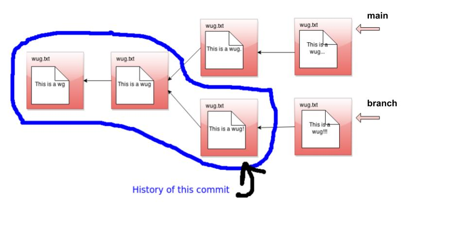
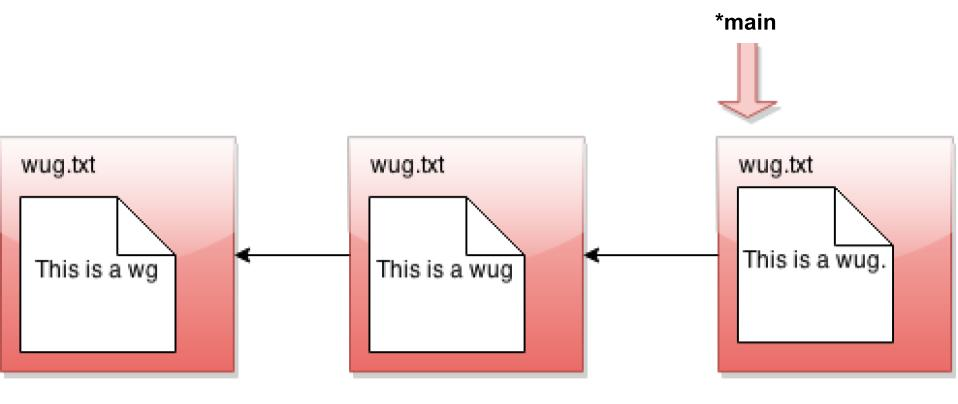
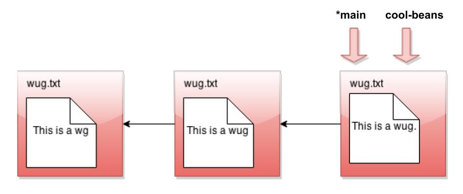
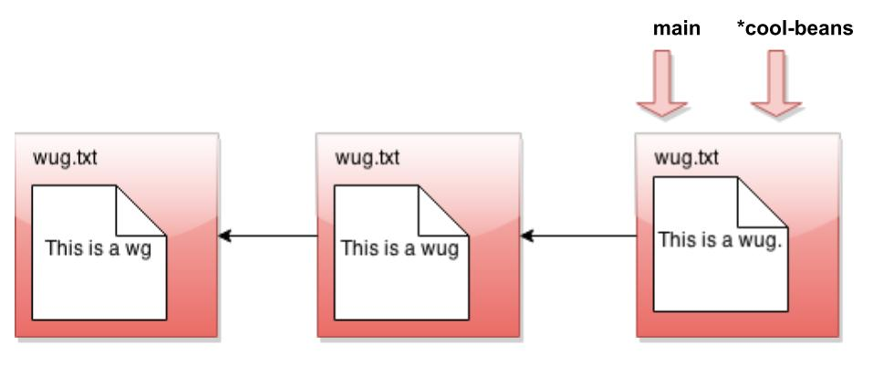
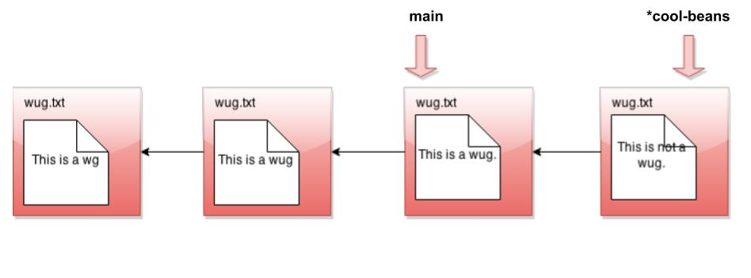
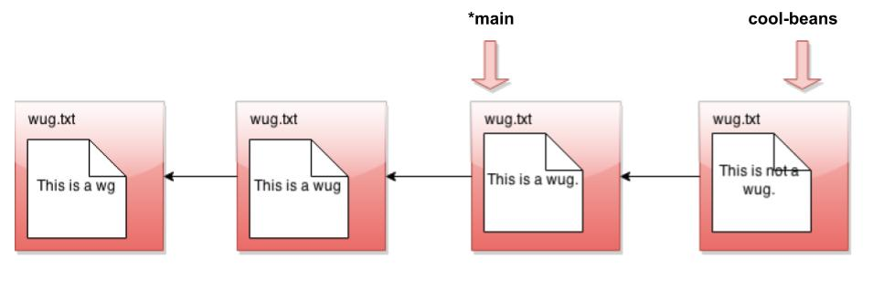
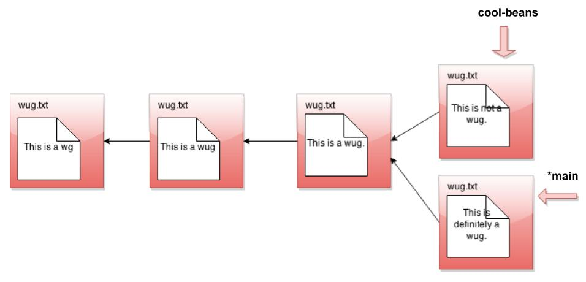
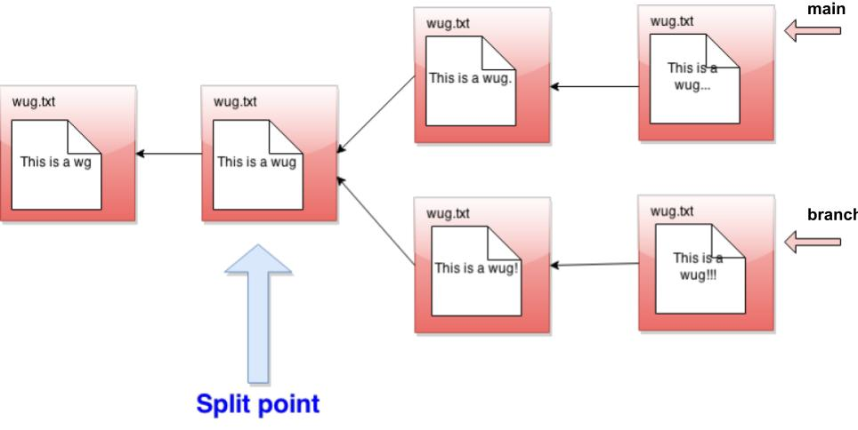

## [FAQ](faq.md)

Each assignment will have an FAQ linked at the top. You can also access it by
adding "/faq" to the end of the URL. The FAQ for Gitlet is located
[here](faq.md).

## Advice and Resources

**We encourage you all to read the spec and watch the intro videos before starting.** This spec
is fairly long. The first half is a verbose and detailed description
of every command you'll support, and the other half is the testing details and
some words of advice. To help you digest this, we (SU24 staff and the amazing staff
from throughout history) have prepared many high quality
videos describing portions of the spec and giving advice on how and where to
begin. All videos are linked throughout this spec in the relevant location, but
we'll also list them right here for your convenience.



- [Git intro - Part 1](https://www.youtube.com/watch?v=yWBzCAY_5UI)
- [Git intro - Part 2](https://www.youtube.com/watch?v=CnMpARAOhFg)
- [Live lecture 12](https://youtu.be/fvhqn5PeU_Q)
- Gitlet intro playlist
    - [Part 1](https://www.youtube.com/watch?v=-1gE2cNFhPA)
    - [Part 2](https://www.youtube.com/watch?v=GfmH9_8tM5w)
    - [Part 3](https://www.youtube.com/watch?v=dv5VdbIZKF8)
    - [Part 4](https://www.youtube.com/watch?v=k8jwbG8bE7Y)
    - [Slides used](https://cdn-uploads.piazza.com/attach/k5eevxebzpj25b/jqr7jm9igtc7l5/k97ipfmgmb3n/Gitlet_Slides.pdf)
- [Merge overview and example](https://www.youtube.com/watch?v=JR3OYCMv9b4&t=929s)
- [Designing Persistence (written notes)](https://paper.dropbox.com/doc/Gitlet-Persistence--AyM0lOEaezWrTi7gG_Pt~bXcAg-zEnTGJhtUMtGr8ILYhoab)

As more resources are created, we'll add them here, so refresh often! Shout out to all
of the absolutely amazing CS61B(L) staff who created these wonderful resources throughout the years!

## Gitlet Summary

### Deadlines

Project 2 is worth 36 points. It consists of the following tasks:

- Design Document (0 points, required to receive assistance from staff)
- Checkpoint Grader due **July 7, 11:59 PM** (1 point)
- Full Grader due **July 21, 11:59 PM** (35 points)

This is a very difficult project. **You should start early to stay on track with the course.**

### Overview

**Note:** We _highly_ recommend completing
[Lab 8: Persistence](../../labs/lab08/index.md)
before this project. Lab 8 is intended to be an introduction to this project and
will be very helpful in getting you started and ensure you're all set up. If
you are eager to start this project before the release of this lab, you
definitely can, but it will be easier to complete the lab first.

In this project you'll be implementing a version-control system that mimics some
of the basic features of the popular system Git. Ours is smaller and simpler,
however, so we have named it Gitlet.

A version-control system is essentially a backup system for related collections
of files. The main functionality that Gitlet supports is:

1. Saving the contents of entire directories of files.
   In Gitlet, this is called _committing_, and the saved contents themselves are
   called _commits_.

2. Restoring a version of one or more files.
   In Gitlet, this is called _restoring_ those files.

3. Viewing the history of your backups. In Gitlet, you view this
   history in something called the _log_.

4. Maintaining related sequences of commits, called _branches_.

5. Merging changes made in one branch into another.

The point of a version-control system is to help you when creating
complicated (or even not-so-complicated) projects, or when collaborating
with others on a project.
You save versions of the project periodically.
If at some later point in time you
accidentally mess up your code, then you can restore your source to
a previously committed version (without losing any of the changes
you made since then).  If your collaborators make changes embodied in a commit,
you can incorporate (_merge_) these changes into your own version.

In Gitlet, you don't just commit individual files at a time. Instead,
you can commit a coherent set of files at the same time. We like to think of
each commit as a _snapshot_ of your entire project at one point
in time. However, for simplicity, many of the examples in the
remainder of this document involve changes to just one file at a time.
Just keep in mind you could change multiple files in each commit.

In this project, it will be helpful for us to visualize the commits we
make over time. Suppose we have a project consisting just of the
file wug.txt, we add some text to
it, and commit it. Then we modify the file and commit these changes.
Then we modify the file again, and commit the changes again. Now we
have saved three total versions of this file, each one later
in time than the previous. We can visualize these commits like so:


Here we've drawn an arrow indicating that each commit contains some
kind of reference to the commit that came before it. We call the
commit that came before it the _parent commit_--this will be important
later. But for now, does this drawing look familiar? That's right;
it's a linked list!

The big idea behind Gitlet is that we can visualize the history of the
different versions of our files in a list like this. Then it's easy
for us to restore old versions of files. You can imagine making a
command like: "Gitlet, please revert to the state of the files at
commit #2", and it would go to the second node in the linked list and
restore the copies of files found there, while removing any files that are in the
first node, but not the second.

If we tell Gitlet to revert to an old commit, the front of the linked
list will no longer reflect the current state of your files, which
might be a little misleading. In order to fix this problem, we
introduce something called the _head_ pointer (also called the HEAD pointer).
The head pointer keeps track of where in the linked list we currently are.
Normally, as we make commits, the head pointer will stay at the front of the
linked list, indicating that the latest commit reflects the current state of the
files:


However, let's say we revert to the state of the files at commit #2
(technically, this is the _reset_ command, which you'll see later in
the spec). We move the head pointer back to show this:


All right, now, if this were all Gitlet could do, it would be a pretty
simple system. But Gitlet has one more trick up its sleeve: it doesn't
just maintain older and newer versions of files, it can maintain
_differing_ versions. Imagine you're coding a project, and you have
two ideas about how to proceed: let's call one Plan A, and the other
Plan B. Gitlet allows you to save both versions, and switch between
them at will. Here's what this might look like, in our pictures:


It's not really a linked list anymore. It's more like a tree. We'll
call this thing the _commit tree_. Keeping with this metaphor, each of
the separate versions is called a _branch_ of the tree. You can
develop each version separately:


There are two pointers into the tree, representing the furthest
point of each branch. At any given time, only one of these is the
currently active pointer, and this is what's called the head pointer. The
head pointer is the pointer at the front of the current branch.

That's it for our brief overview of the Gitlet system! Don't worry if
you don't fully understand it yet; the section above was just to give
you a high level picture of what its meant to do. A detailed spec of
what you're supposed to do for this project follows this section.

But a last word here: commit trees are
_immutable_: once a commit node has been created, it can
never be destroyed (or changed at all). We can only add new things to
the commit tree, not modify existing things. This is an important
feature of Gitlet! One of Gitlet's
goals is to allow us to save things so we don't delete
them accidentally.

### Internal Structures

Real Git distinguishes several different kinds of _objects_.  For
our purposes, the important ones are

- _**blobs**_: The saved contents of files. Since Gitlet saves many versions of
        files, a single file might correspond to multiple blobs: each being
        tracked in a different commit.
- _**trees**_: Directory structures mapping names to references to blobs and
  other trees (subdirectories).
- _**commits**_: Combinations of log messages,
  other metadata (commit date, author,
  etc.), a reference to a tree, and references to
  parent commits.

The repository also maintains a mapping from _branch heads_ to references to
commits, so that certain important commits have symbolic names.

Gitlet simplifies from Git still further by:

- Incorporating trees into commits and not dealing with subdirectories (so
  there will be one
  "flat" directory of plain files for each repository).
- Limiting ourselves to merges that reference two parents (in real Git, there
  can be any number of parents.)
- Having our metadata consist only of a timestamp and log message.
A commit, therefore, will consist of a log message,
timestamp, a mapping of file names to blob references, a parent
reference, and (for merges) a second parent reference.

Every object--every blob and every commit in our case--has a unique
integer id that serves as a reference to the object. An interesting feature of
Git is that these ids are _universal_:  unlike a typical Java implementation,
two objects with exactly the same content will have the same id on all systems
(i.e. my computer, your computer, and anyone else's computer will compute this
same exact id).  In the case of blobs, "same content" means the same file
contents.  In the case of commits, it means the same metadata, the same mapping
of names to references, and the same parent reference.  The objects in a
repository are thus said to be _content addressable_.

Both Git and Gitlet accomplish this the same way: by using a _cryptographic
hash function_ called SHA-1 (Secure Hash 1), which produces a 160-bit integer
hash from any sequence of bytes. Cryptographic hash functions have the property
that it is extremely difficult to find two different byte streams with the
same hash value (or indeed to find _any_ byte stream given just its hash value),
so that essentially, we may assume that the probability
that any two objects with different contents have the same SHA-1 hash value is
2<sup>-160</sup> or about 10<sup>-48</sup>.  Basically, we simply ignore the
possibility of a hashing collision, so that the system has, in principle,
a fundamental bug that in practice never occurs!

Fortunately, there are library classes for computing SHA-1 values, so you won't
have to deal with the actual algorithm.
All you have to do is to make sure that you
correctly label all your objects.  In particular, this involves

- Including all metadata and references when hashing a commit.
- Distinguishing somehow between hashes for commits and hashes for blobs.  A
    good way of doing this involves a well-thought out directory structure
    within the `.gitlet` directory. Another way to do so is to hash in an extra
    word for each object that has one value for blobs and another for commits.

By the way, the SHA-1 hash value, rendered as a 40-character
hexadecimal string, makes
a convenient file name for storing your data in your `.gitlet`
directory (more on that below).  It also gives you a convenient way to
compare two files (blobs) to see if they have the same contents: if their
SHA-1s are the same, we simply assume the files are the same.

Reading and writing your internal objects from and to files is actually pretty
easy, thanks to Java's _serialization_ facilities.  The interface
`java.io.Serializable` has no methods,
but if a class implements it, then the Java
runtime will automatically provide a way to convert to and from a stream of
bytes, which you can then write to a file using the I/O class
`java.io.ObjectOutputStream` and read back (and deserialize) with
`java.io.ObjectInputStream`.
The term "serialization" refers to the conversion from some arbitrary structure
(array, tree, graph, etc.) to a serial sequence of bytes. You should have seen
and gotten practice with serialization in [Lab 8](../../labs/lab08/index.md).
You'll be using a very similar
approach here, so do use your lab as a resource when it comes to persistence
and serialization.

Here is a summary example of the structures discussed in this section.
As you can see, each commit (rectangle) points to some blobs (circles), which
contain file contents.  The commits contain the file names and references to
these blobs, as well as a parent link.  These references, depicted as arrows,
are represented in the `.gitlet` directory using their SHA-1 hash values (the
small hexadecimal numerals above the commits and below the blobs).  The newer
commit contains an updated version of `wug1.txt`, but shares the same version
of `wug2.txt` as the older commit. Your commit class will somehow store all of
the information that this diagram shows: a careful selection of internal data
structures will make the implementation easier or harder, so it behooves you to
spend time planning and thinking about the best way to store everything.


## Detailed Spec of Behavior

### Overall Spec

The only structure requirement we're giving you is that you have a
class named `gitlet.Main` and that it has a main method.

We are also giving you some utility methods for performing a number of
mostly file-system-related tasks, so that you can concentrate on the logic
of the project rather than the peculiarities of dealing with the OS.

We have also added two suggested classes: `Commit`, and `Repository`
to get you started.  You may, of course, write additional Java classes to
support your project or remove our suggested classes if you'd like. But don't
use any external code (aside from JUnit), and don't use any programming language
other than Java.  You can use all of the Java Standard Library that you wish,
plus utilities we provide.

The majority of this spec will describe how `gitlet.Main`'s main
method must react when it receives various gitlet commands as
command-line arguments. But before we break down command-by-command,
here are some overall guidelines the whole project should
satisfy:

- In order for Gitlet to work, it will need a place to store old
  copies of files and other
  metadata. All of this stuff **must** be stored in a directory called
  `.gitlet`, just as this information is stored in directory `.git` for the
  real git system (files with a `.` in front are hidden files. You will
  not be able to see them by default on most operating systems.  On Unix,
  the command `ls -a` will show them.) A
  Gitlet system is considered "initialized" in a particular location if
  it has a `.gitlet` directory there. Most Gitlet commands (except for the
  `init`  command) only need to work when used from a directory where a
  Gitlet system has been initialized--i.e. a directory that has a
  `.gitlet` directory. The files that _aren't_ in your `.gitlet`
  directory (which are copies of files from the repository that you are
  using and editing, as well as files you plan to add to the repository) are
  referred to as the files in your _working directory_.

- Most commands have runtime or memory usage requirements. You must
  follow these. We will discuss runtime in Lab 9. Some of the runtimes are
  described as constant
  "relative to any significant measure". The significant measures are:
  any measure of number or size of files, any measure of number of
  commits. You can ignore time required to serialize or deserialize,
  _with the one caveat that your serialization time cannot depend in
  any way on the total size of files that have been added, committed,
  etc_ (what is serialization? Revisit [Lab 8](../../labs/lab08/index.md)
  if you don't know!). You can
  also pretend that getting from a hash table is constant time.

- Some commands have failure cases with a specified error message. The
  exact formats of these are specified later in the spec. All error
  message end with a period; since our autograding is literal, be
  sure to include it. If your
  program ever encounters one of these failure cases, it must print
  the error message and not change anything else. _You don't need to
  handle any other error cases except the ones listed as failure
  cases_.

- There are some failure cases you need to handle that don't apply to
  a particular command. Here they are:

    - If a user doesn't input any arguments, print the message
      `Please enter a command.` and exit.

    - If a user inputs a command that doesn't exist, print the
      message `No command with that name exists.` and exit.

    - If a user inputs a command with the wrong number or format of
      operands, print the message `Incorrect operands.` and exit.

    - If a user inputs a command that requires being in an initialized
      Gitlet working directory (i.e., one containing a `.gitlet` subdirectory),
      but is not in such a directory, print the message `Not in an initialized
      Gitlet directory.`

- Always exit with exit code 0, even in the presence of errors.  This allows
  us to use other exit codes as an indication that something blew up. This means
  do not let your code throw any errors, as your program will automatically exit
  with code 0 if it ran with no errors.

- One clean strategy for handling exceptions in this project is with a 
  [`try-catch` block](https://www.w3schools.com/java/java_try_catch.asp). 
  Normally, Java would stop the program and generate an error message if an exception is thrown. 
  If an excpetion is thrown within a `try` block, however, a `catch` block allows you to
  execute some code in response. We have provided a class for exceptions
  called `GitletException` in the skeleton files. If you would like to throw an exception with
  a particular message, you can use `throw new GitletException("message here")`. To print the
  message associated with an exception `e`, use `System.out.println(e.getMessage())`.

- Some of the commands have their differences from real Git
  listed. The spec is not exhaustive in listing _all_ differences from
  Git, but it does list some of the bigger or potentially confusing
  and misleading ones.

- Do **NOT** print out anything except for what the spec says. Some of
  our autograder tests will break if you print anything more than
  necessary. Yes, this includes spaces and extra newlines.

- The spec classifies some commands as "dangerous". Dangerous commands
  are ones that potentially overwrite files (that aren't just
  metadata) -- for example, if a user tells Gitlet to restore files to
  older versions, Gitlet may overwrite the current versions of the
  files.

### The Commands

We now go through each command you must support in detail. Remember that good
programmers always care about their data structures: as you read these commands,
you should think first about how you should store your data to easily support
these commands and second about if there is any opportunity to reuse commands
that you've already implemented (hint: there is ample opportunity in this
project to reuse code you've already written). We have listed lectures in some
methods that we have found useful, but you are not required to use concepts from
these lectures. There are conceptual quizzes on some of the more confusing
commands that you should definitely use to check your understanding. **The
quizzes are not for a grade**, they are only there to help you check your
understanding before trying to implement the command.

- [init](#init)
- [add](#add)
- [commit](#commit)
- [rm](#rm)
- [log](#log)
- [global-log](#global-log)
- [find](#find)
- [status](#status)
- [restore](#restore)
- [branch](#branch)
- [switch](#switch)
- [rm-branch](#rm-branch)
- [reset](#reset)
- [merge](#merge)

----------------------------------------

#### init

- **Usage**: `java gitlet.Main init`

- **Description**: Creates a new Gitlet version-control system in the
  current directory. This system will automatically start with one
  commit: a commit that contains no files and has the commit message
  `initial commit` (just like that, with no punctuation).
It will have a single branch: `main`, which
  initially points to this initial commit, and `main` will be the
  current branch.  The timestamp for this initial commit will be
  00:00:00 UTC, Thursday, 1 January 1970 in whatever format you
  choose for dates (this is
  called "The (Unix) Epoch", represented internally by the time 0).
  Since the initial commit in all repositories
  created by Gitlet will have exactly the same content,
  it follows that all repositories will automatically share
  this commit (they will all have the same UID)
  and all commits in all repositories will trace back to it.

- **Runtime**: Should be constant relative to any significant measure.

- **Failure cases**: If there is already a Gitlet version-control
  system in the current directory, it should abort. It should NOT
  overwrite the existing system with a new one. Should print the error
  message `A Gitlet version-control system already exists in the
  current directory.`

- **Dangerous?**: No

- **Our line count**: ~25

----------------------------------------

#### add

- **Usage**: `java gitlet.Main add [file name]`

- **Description**: Adds a copy of the file as it currently exists to
  the _staging area_ (see the description of the `commit`
  command).  For this reason, adding a file is also
  called _staging_ the file _for addition_.
  Staging an already-staged file overwrites the previous entry
  in the staging area with the new contents.
  The staging area should be somewhere in
  `.gitlet`. If the current working version of the file is identical to
  the version in the current commit, do not stage it to be added, and remove it
  from the staging area if it is already there (as can happen when a file is
  changed, added, and then changed back to it's original version).  The file
  will no longer be staged for removal (see `gitlet rm`), if it
  was at the time of the command.

- **Runtime**: In the worst case, should run in linear time relative
  to the size of the file being added and $$\lg N$$, for $$N$$ the
  number of files in the commit.

- **Failure cases**: If the file does not exist, print the error
  message `File does not exist.` and exit without changing
  anything.

- **Dangerous?**: No

- **Our line count**: ~20

- **Suggested Lecture(s)**: Lecture 8 (Gitlet Introduction)

----------------------------------------

#### commit

- **Usage**: `java gitlet.Main commit [message]`

- **Description**: Saves a snapshot of tracked files in the current commit
  and staging area so they can be
  restored at a later time, creating a new commit.
  The commit is said to be _tracking_ the saved files. By default,
  each commit's snapshot of files will be exactly the same as its
  parent commit's snapshot of files; it will keep versions of files
  exactly as they are, and not update them. A commit will only update
  the contents of files it is tracking that have been staged
  for addition at
  the time of commit, in which case the commit will now include the
  version of the file that was staged instead of the version it got
  from its parent. A commit will save and start tracking any files
  that were staged for addition but weren't tracked by its parent.  Finally, files tracked
  in the current commit may be untracked in the new commit as a result
  being _staged for removal_ by the
  `rm` command (below).

  The bottom line: By default a commit has the same file contents as its parent.
  Files staged for addition and removal are the updates to the commit. Of
  course, the date (and likely the mesage) will also different from the parent.

  Some additional points about commit:

    - The staging area is cleared after a commit.

    - The commit command never adds, changes, or removes files in the
      working directory (other than those in the `.gitlet` directory).  The
      `rm` command _will_ remove such files, as well as staging them for
      removal, so that they will be untracked after a `commit`.

    - Any changes made to files after staging for addition or removal
      are ignored by the
      `commit` command, which _only_ modifies the contents of the `.gitlet`
      directory.  For example, if you remove a tracked file using the Unix
      `rm` command (rather than Gitlet's command of the same name), it has no
      effect on the next commit, which will still contain the (now deleted)
      version of the file.

    - After the commit command, the new commit is added as a new node
      in the commit tree.

    - The commit just made becomes the "current commit", and the head
      pointer now points to it. The previous head commit is this
      commit's parent commit.

    - Each commit should contain the date and time it was made.

    - Each commit has a log message associated with it that describes the
      changes to the files in the commit. This is specified by the
      user. The entire message should take up only one entry in
      the array `args` that is passed to `main`. To include multiword
      messages, you'll have to surround them in quotes.

    - Each commit is identified by its SHA-1 id, which must include the
      file (blob) references of its files,
      parent reference, log message, and commit time.

- **Runtime**: Runtime should be constant with respect to the number of commits. 
  Runtime must be no worse than linear with
  respect to the total size of files the commit is tracking.
  Additionally, this command has a memory requirement: Committing must
  increase the size of the `.gitlet` directory by no more than the total
  size of the files staged for addition at the time of commit, not including
  additional metadata. This means don't store redundant copies of
  versions of files that a commit receives from its parent (hint: remember that
  blobs are content addressable and use the SHA1 to your advantage).
  You _are_ allowed to save whole additional copies of files;
  don't worry about only saving diffs, or anything like that.

- **Failure cases**: If no files have been staged, abort. Print the message `No
  changes added to the commit.` Every commit must have a non-blank
  message. If it doesn't, print the error message `Please enter
  a commit message.` It is _not_ a failure for tracked files to be
  missing from the working directory or changed in the working directory.
  Just ignore everything outside the `.gitlet` directory entirely.

- **Dangerous?**: No

- **Differences from real git**: In real git, commits may have multiple
  parents (due to merging) and also have considerably more metadata.

- **Our line count**: ~35

- **Suggested Lecture(s)**: Lecture 8 (Gitlet Introduction)

Here's a picture of before-and-after commit:


----------------------------------------

#### rm

- **Usage**: `java gitlet.Main rm [file name]`

- **Description**: Unstage the file if it is currently staged for addition.
  If the file is tracked in the current commit, stage it for removal and
  remove the file from the working directory if the user has not already done so
  (do _not_ remove it unless it is tracked in the current commit).

- **Runtime**: Should run in constant time relative to any significant measure.

- **Failure cases**: If the file is not staged for addition and not tracked by the
  head commit, print the error message `No reason to remove the file.`

- **Dangerous?**: Yes (although if you use our utility methods, you will only
  hurt your repository files, and not all the other files in your
  directory.)

- **Our line count**: ~20

----------------------------------------

#### log

- **Usage**: `java gitlet.Main log`

- **Description**: Starting at the current head commit, display
  information about each commit backwards along the commit tree until
  the initial commit, following the first parent commit links, ignoring any
  second parents found in merge commits.
  This set of commit nodes is called the commit's
  _history_. For every node in this history, the information it should
  display is the commit id, the time the commit was made, and the
  commit message. Here is an example of the _exact_ format it should
  follow:

  ```text
  ===
  commit a0da1ea5a15ab613bf9961fd86f010cf74c7ee48
  Date: Thu Nov 9 20:00:05 2017 -0800
  A commit message.

  ===
  commit 3e8bf1d794ca2e9ef8a4007275acf3751c7170ff
  Date: Thu Nov 9 17:01:33 2017 -0800
  Another commit message.

  ===
  commit e881c9575d180a215d1a636545b8fd9abfb1d2bb
  Date: Wed Dec 31 16:00:00 1969 -0800
  initial commit

  ```

  There is a `===` before each commit and an empty line after it.
  As in real Git, each entry displays the unique SHA-1 id of the commit
  object. The timestamps displayed in the commits reflect
  the current timezone, not UTC; as a result, the timestamp for the initial
  commit does not read Thursday, January 1st, 1970, 00:00:00, but rather the
  equivalent Pacific Standard Time (or Pacific Daylight Time, which is -0700).
  Display commits with the most recent at the top. By the way, you'll find
  that the Java classes
  [`java.util.Date`](https://docs.oracle.com/en/java/javase/17/docs/api/java.base/java/util/Date.html),
  [`java.util.Formatter`](https://docs.oracle.com/en/java/javase/17/docs/api/java.base/java/util/Formatter.html) or
  [`java.text.SimpleDateFormat`](https://docs.oracle.com/en/java/javase/17/docs/api/java.base/java/text/SimpleDateFormat.html)
  are useful for getting and formatting times.
  Look into them instead of trying to construct
  it manually yourself!

  Of course, the SHA1 identifiers are going to be different, so don't worry
  about those. Our tests will ensure that you have something that "looks like" a
  SHA1 identifier (more on that in the testing section below).

  For merge commits (those that have two parent commits),
  add a line just below the first, as in

  ```text
  ===
  commit 3e8bf1d794ca2e9ef8a4007275acf3751c7170ff
  Merge: 4975af1 2c1ead1
  Date: Sat Nov 11 12:30:00 2017 -0800
  Merged development into main.

  ```

  where the two hexadecimal numerals following "Merge:" consist of the first seven
  digits of the first and second parents' commit ids, in that order.  The first
  parent is the branch you were on when you did the merge; the second is that of
  the merged-in branch. This is as in regular Git.

- **Runtime**: Should be linear with respect to the number of nodes in
  head's history.

- **Failure cases**: None

- **Dangerous?**: No

- **Our line count**: ~20

Here's a picture of the history of a particular commit. If the current
branch's head pointer happened to be pointing to that commit, log
would print out information about the circled commits:



The history ignores other branches and the future. Now that we have
the concept of history, let's refine what we said earlier about the
commit tree being immutable. It is immutable precisely in the sense
that _the history of a commit with a particular id may never change,
ever_. If you think of the commit tree as nothing more than a
collection of histories, then what we're really saying is that each
history is immutable.

----------------------------------------

#### global-log

- **Usage**: `java gitlet.Main global-log`

- **Description**: Like log, except displays information about all
  commits ever made. The order of the commits does not matter. Hint: there is a
  useful method in `gitlet.Utils` that will help you iterate over files within
  a directory.

- **Runtime**: Linear with respect to the number of commits ever made.

- **Failure cases**: None

- **Dangerous?**: No

- **Our line count**: ~10

----------------------------------------

#### find

- **Usage**: `java gitlet.Main find [commit message]`

- **Description**: Prints out the ids of all commits that have the given
  commit message, one per line.
  If there are multiple such commits, it prints the
  ids out on separate lines.  The commit message is a single operand; to
  indicate a multiword message, put the operand in quotation marks, as for
  the `commit` command below. Hint: the hint for this command is the same as the
  one for `global-log`.

- **Runtime**: Should be linear relative to the number of commits.

- **Failure cases**: If no such commit exists, prints the error
  message `Found no commit with that message.`

- **Dangerous?**: No

- **Differences from real git**: Doesn't exist in real git. Similar
  effects can be achieved by grepping the output of log.

- **Our line count**: ~15

----------------------------------------

#### status

- **Usage**: `java gitlet.Main status`

- **Description**: Displays what branches currently exist, and marks
  the current branch with a `*`. Also displays what files have been
  staged for addition or removal. An example of the _exact_ format it
  should follow is as follows.

  ```text
  === Branches ===
  *main
  other-branch

  === Staged Files ===
  wug.txt
  wug2.txt

  === Removed Files ===
  goodbye.txt

  === Modifications Not Staged For Commit ===
  junk.txt (deleted)
  wug3.txt (modified)

  === Untracked Files ===
  random.stuff

  ```

  There is an empty line between sections, and the entire status ends in an
  empty line as well. Entries should be listed in lexicographic order, using the
  Java string-comparison order (the asterisk doesn't count).

  A file in the working directory is "modified but not staged" if it is:

  - Tracked in the current commit, changed in the working directory,
    but not staged; or
  - Staged for addition, but with different contents than in the working
    directory; or
  - Staged for addition, but deleted in the working directory; or
  - Not staged for removal, but tracked in the current commit and deleted from
    the working directory.

  The final category ("Untracked Files") is for files present in the working
  directory but neither staged for addition nor tracked. This includes files
  that have been staged for removal, but then re-created without Gitlet's
  knowledge. Ignore any subdirectories that may have been
  introduced, since Gitlet does not deal with them.

  Note that "Untracked Files" does not include untracked files that are staged
  for addition. This is _distinct_ from our definition
  of "untracked" elsewhere. In all other usages of "untracked" outside of this
  status category, we mean files that are not tracked in the current commit,
  regardless of whether they are staged.

  **The last two sections (modifications not staged and untracked files) are optional**.
  Feel free to leave them blank (leaving just the headers). The headers,
  however, are required.

- **Runtime**: Make sure this depends only on the amount of data in the
  working directory plus the number of files staged to be added or deleted
  plus the number of branches.

- **Failure cases**: None

- **Dangerous?**: No

- **Our line count**: ~45

- [**Conceptual Quiz (without branching)**](https://docs.google.com/forms/d/e/1FAIpQLScxlML11jB0hlSMnN5DdClZLsAZdbtml9BWOaq2YVdMjIxo0Q/viewform?usp=sf_link)

- [**Conceptual Quiz (with branching)**](https://docs.google.com/forms/d/e/1FAIpQLSeDH6Y95UNyDmbyU-RmvyW_tE6AFCex41EsGFzSjd3NPzIUZA/viewform?usp=sf_link)

----------------------------------------

#### Restore

Restore is used to revert files back to their previous versions. Depending on the arguments, there's 2 different usages of restore.

- **Usages**:

    1. `java gitlet.Main restore -- [file name]`

    2. `java gitlet.Main restore [commit id] -- [file name]`


- **Descriptions**:

    1. Takes the version of the file as it exists in the head commit and puts it
       in the working directory, overwriting the version of the file that's
       already there if there is one.  The new version of the file is not
       staged.

    2. Takes the version of the file as it exists in the commit with
      the given id, and puts it in the working directory, overwriting
      the version of the file that's already there if there is one.
      The new version of the file is not staged.


- **Runtimes**:

    1. Should be linear relative to the size of the file being checked out.

    2. Should be linear with respect to the total size of the files in
      the commit's snapshot. Should be constant with respect to the number of commits. 
      Should be constant with respect to the number of branches.

- **Failure cases**:

    1. If the file does not exist in the previous commit, abort,
      printing the error message `File does not exist in that commit.`
      Do not change the CWD.

    2. If no commit with the given id exists, print 
      `No commit with that id exists.` 
      Otherwise, if the file does not exist in the given
      commit, print the same message as for failure case 1. Do not change the
      CWD.


- **Differences from real git**: Real git does not clear the staging area
  and stages the file that is restored.
  Also, it won't do a restore that would overwrite or undo changes (additions
  or removals) that you have staged. The syntax for real git is also different. 
  To restore a file from the head commit, you would use `git restore [file name]`.
  To restore a file from a previous commit, you would use `git restore --source=[commit id] [file name]`.

A `[commit id]` is, as described earlier, a hexadecimal numeral.  A convenient
feature of real Git is that one can abbreviate commits with a unique
prefix.  For example, one can abbreviate

```text
a0da1ea5a15ab613bf9961fd86f010cf74c7ee48
```

as

```text
a0da1e
```

in the (likely) event that no other object exists with a SHA-1 identifier that
starts with the same six digits.  You should arrange for the same thing to
happen for commit ids that contain fewer than 40 characters.  Unfortunately,
using shortened ids might slow down the finding of objects if implemented
naively (making the time to find a file linear in the number of objects), so
we won't worry about timing for commands that use shortened ids.  We suggest,
however, that you poke around in a `.git` directory (specifically,
`.git/objects`) and see how it manages to speed up its search. You will perhaps
recognize a familiar data structure implemented with the file system rather
than pointers.


- **Dangerous?**: Yes!

- **Our line counts**:
    - ~15
    - ~5
    - ~15

- [**Conceptual Quiz (without branching)**](https://docs.google.com/forms/d/e/1FAIpQLSd-btCCp_K-aXlmCMbZVfqfS9_mL_ISGP0Yb0BhomljF-8xeg/viewform?usp=sf_link)


----------------------------------------

#### branch

- **Usage**: `java gitlet.Main branch [branch name]`

- **Description**: Creates a new branch with the given name, and
  points it at the current head commit. A branch is nothing more than a
  name for a reference (a SHA-1 identifier)
  to a commit node. This command does NOT immediately switch to the newly
  created branch (just as in real Git).
  Before you
  ever call branch, your code should be running with a default branch
  called "main".

- **Runtime**: Should be constant relative to any significant measure.

- **Failure cases**: If a branch with the given name already exists,
  print the error message `A branch with that name already exists.`

- **Dangerous?**: No

- **Our line count**: ~10

All right, let's see what branch does in detail. Suppose our state
looks like this:



Now we call `java gitlet.Main branch cool-beans`. Then we get this:



Hmm... nothing much happened. Let's switch to the branch with `java gitlet.Main
switch cool-beans`:



Nothing much happened again?! Okay, say we make a commit now. Modify
some files, then `java gitlet.Main add...` then `java gitlet.Main commit...`



I was told there would be branching. But all I see is a straight line.
What's going on? Maybe I should go back to my other branch with
`java gitlet.Main switch main`:



Now I make a commit...



Phew! So that's the whole idea of branching. Did you catch what's
going on? All that creating a branch does is to give us a new pointer. At any
given time, one of these pointers is considered the currently active
pointer, also called the HEAD pointer (indicated by \*). We can switch the
currently active head pointer with `switch [branch name]`. Whenever
we commit, it means we add a child commit to the currently active HEAD commit
even if there is already a child commit. This naturally creates branching
behavior as a commit can now have multiple children.

Make _sure_ that the behavior of your `branch`, `switch`, and
`commit` match what we've described above. This is pretty core
functionality of Gitlet that many other commands will depend upon. If
any of this core functionality is broken, very many of our autograder
tests won't work!

----------------------------------------

#### switch

- **Usage**: `java gitlet.Main switch [branch name]`

- **Description**: Switches to the branch with the given name. Takes all files in the commit at the head of the given branch, 
and puts them in the working directory, overwriting the versions of the files that are already there if they exist. Also, 
at the end of this command, the given branch will now be considered the current branch (HEAD). Any files that are tracked 
in the current branch but are not present in the checked-out branch are deleted. The staging area is cleared, unless the checked-out 
branch is the current branch (see Failure cases below).

- **Runtime**: Should be constant relative to any significant measure.

- **Failure cases**: If no branch with that name exists, print `No such branch exists.` If that branch is the current branch,
print `No need to switch to the current branch.` If a working file is untracked in the current branch and would be overwritten 
by the switch, print `There is an untracked file in the way; delete it, or add and commit it first.` and exit; perform this 
check before doing anything else. Do not change the CWD.

- **Dangerous?**: No

- **Our line count**: ~15

- [**Conceptual Quiz (with branching)**](https://docs.google.com/forms/d/e/1FAIpQLSdW027NI7Pwhkpysyvm-Xg_XyYrhXp-JhWfXo_VNXY-cvVUaw/viewform?usp=sf_link)

----------------------------------------

#### rm-branch

- **Usage**: `java gitlet.Main rm-branch [branch name]`

- **Description**: Deletes the branch with the given name. This only
  means to delete the pointer associated with the branch; it does not
  mean to delete all commits that were created under the branch, or
  anything like that.

- **Runtime**: Should be constant relative to any significant measure.

- **Failure cases**: If a branch with the given name does not exist,
  aborts. Print the error message `A branch with that name does not
  exist.` If you try to remove the branch you're currently on, aborts,
  printing the error message `Cannot remove the current branch.`

- **Differences from real git**: This command is equal to calling 
  `git branch` with the `-d` option, as in 
  `git branch -d [remote name] [branch name]`. 

- **Dangerous?**: No

- **Our line count**: ~15

----------------------------------------

#### reset

- **Usage**: `java gitlet.Main reset [commit id]`

- **Description**: Restores all the files tracked by the given
  commit. Removes tracked files that are not present in that commit.
  Also moves the current branch's head to that commit node.
  See the intro for an example of what happens to the head pointer
  after using reset.  The `[commit id]` may be abbreviated as for
  `restore`.  The staging area is cleared. 

- **Runtime**: Should be linear with respect to the total size of
  files tracked by the given commit's snapshot. Should be constant
  with respect to the number of commits.

- **Failure case**: If no commit with the given id exists, print `No
  commit with that id exists.`  If a working file is untracked in the current
  branch and would be overwritten by the reset, print
  `There is an untracked file in the way; delete it, or add and commit it first.` and exit;
  perform this check before doing anything else.

- **Dangerous?**: Yes!

- **Differences from real git**: This command is
  closest to using the `--hard` option, as in `git reset --hard [commit
  hash]`.

- **Our line count**: ~10 (How did we get such a small line count? Recall that
    you should reuse your code :) )

----------------------------------------
#### merge

**Depending on how flexibly you have designed the rest of the project,
the  \~3.5 points ( roughly 10% of the final submission points)
may not be worth the amount of effort it takes to do this section.**
We're certainly not expecting everyone to do it.
Our priority will be in helping students complete the main project;
if you're doing this last section, we expect you to be able to stand on your own a little
bit more than most students.

**NOTE: `merge` is NOT extra credit. It is part of the 35 points of the full project.**

- **Usage**: `java gitlet.Main merge [branch name]`

- **Description**: Merges files from the given branch into the current
  branch. This method is a bit complicated, so here's a more detailed
  description:

    - First consider what we call the **split point** of the
      current branch and the given branch.
      For example, if `main` is the current branch and `branch` is the given
      branch:

      

      The split point is a _latest common ancestor_ of the current and given
      branch heads:

        - A _common ancestor_ is a commit to which there is a path
          (of 0 or more parent pointers) from both branch heads.
        - A _latest_ common ancestor is a common ancestor that is not an
          ancestor of any other common ancestor.

      For example, although the leftmost commit in the diagram above is a
      common ancestor of `main` and `branch`, it is also an ancestor of the
      commit immediately to its right, so it is not a latest common
      ancestor.
      If the split point _is_ the same commit as the given branch, then
      we do nothing; the merge is complete, and the operation ends with the
      message `Given branch is an ancestor of the current branch.`
      If the split point is the current branch, then the effect is to
      switch to the given branch, and the operation
      ends after printing the message `Current branch fast-forwarded.`
      Otherwise, we continue
      with the steps below.

    1. Any files that have been _modified_ in the given branch since
      the split point, but not modified in the current branch since
      the split point should be changed to their versions in the given
      branch (checked out from the commit at the front of the given
      branch). These files should then all be automatically staged.
      To clarify, if a file is "modified in the given branch since the
      split point" this means the version of the file as it exists in
      the commit at the front of the given branch has different
      content from the version of the file at the split point. Remember: blobs
      are content addressable!

    2. Any files that have been modified in the current branch but not
      in the given branch since the split point should stay as they
      are.

    3. Any files that have been modified in both the current and
      given branch in the same way (i.e., both files now have the same
      content or were both removed) are left unchanged by the merge.
      If a file was removed from both the current and given branch, but a file
      of the same name is present in the working directory, it is left alone and
      continues to be absent (not tracked nor staged) in the merge.

    4. Any files that were not present at the split point and are
      present only in the current branch should remain as they are.

    5. Any files that were not present at the split point and are
      present only in the given branch should be checked out and
      staged.

    6. Any files present at the split point, unmodified in the current
      branch, and absent in the given branch should be removed (and untracked).

    7. Any files present at the split point, unmodified in the given branch,
      and absent in the current branch should remain absent.

    8.  Any files modified in different ways
        in the current and given branches are _in conflict_.  "Modified in
        different ways" can mean that the contents of both are changed and
        different from other, or the contents of one are changed and the other
        file is deleted, or the file was absent at the split point
        and has different
        contents in the given and current branches.  In this case, replace
        the contents of the conflicted file with

        ```text
        <<<<<<< HEAD
        contents of file in current branch
        =======
        contents of file in given branch
        >>>>>>>
        ```

        (replacing "contents of..." with the indicated file's contents)
        and stage the result.
        Treat a deleted file in a branch
        as an empty file.  Use straight concatenation here.  In the case
        of a file with no newline at the end, you might well end up with
        something like this:

        ```text
        <<<<<<< HEAD
        contents of file in current branch=======
        contents of file in given branch>>>>>>>
        ```

        This is fine.

    - Once files have been updated according to the above, and the split
      point was not the current branch or the given branch,
      merge automatically commits with the log message
      `Merged [given branch name] into [current branch name].`
      Then, if the merge
      encountered a conflict,
      print the message `Encountered a merge conflict.` on the terminal (not
      the log).
      Merge commits differ from other commits: they record as parents
      both the head of the current branch (called the _first parent_)
      and the head of the branch given on the command line to be merged in.

  A video walkthrough of this command can be found [here](https://www.youtube.com/watch?v=JR3OYCMv9b4&t=929s).

  By the way, we hope you've noticed that the set of commits has progressed
  from a simple sequence to a tree and now, finally, to a full
  directed acyclic graph.

- **Runtime**: $$O(N\lg N + D)$$, where $$N$$ is the total number
  of ancestor commits for the two branches and $$D$$ is the total amount of
  data in all the files under these commits.

- **Failure cases**: If there are staged additions or removals present,
  print the error message `You have uncommitted changes.` and exit.
  If a branch with the given name does not exist,
  print the error message `A branch with that name does not exist.` If
  attempting to merge a branch with itself, print the error message
  `Cannot merge a branch with itself.` If merge would generate an
  error because the commit that it does has no changes in it, just let
  the normal commit error message for this go through.
  If an untracked file in the current commit would be overwritten or deleted by the merge, print
  `There is an untracked file in the way; delete it, or add and commit it first.` and
  exit; perform this check before doing anything else.

- **Dangerous?**: Yes!

- **Differences from real git**:
  Real Git does a more subtle job of merging files, displaying conflicts only
  in places where both files have changed since the split point.

  Real Git has a different way to decide which of multiple possible split
  points to use.

  Real Git will force the user to resolve the merge
  conflicts before committing to complete the merge. Gitlet just
  commits the merge, conflicts and all, so that you must use a separate
  commit to resolve problems.

  Real Git will complain if there are unstaged changes to a file that
  would be changed by a merge.  You may do so as well if you want, but we
  will not test that case.

- **Our line count**: ~70

- [**Conceptual Quiz**](https://docs.google.com/forms/d/e/1FAIpQLSdQGh-bzc306Eu3LKJDzoKY-fKKno2FDxqqe24kU8sv-xUQCg/viewform?usp=sf_link)

----------------------------------------

## Skeleton

The skeleton is fairly bare bones with mostly empty classes. We've provided
helpful javadoc comments hinting at what you might want to include in each file.
**You should follow a similar approach to Capers** where your `Main` class
doesn't do a whole lot of work by itself, but rather simply calls other methods
depending on the `args`. You're absolutely welcome to delete the other classes
or add your own, **but the `Main` class should remain** otherwise our tests
won't be able to find your code.

If you're confused on where to start, we suggest looking over
[Lab 8: Persistence and Gitlet](../../labs/lab08/index.md).

## Design Document



It is not graded, but you must have an up-to-date and completed
design document before we help you in lab, office hours, or in help tickets. If you do not
have one or it's not up-to-date / not complete, we cannot help you. This is for
both of our sake: by having a design doc, you have written out a road map for
how you will tackle the assignment. If you need help creating a design document,
we can definitely help with that :) Here are [some guidelines](./design.md),
as well as an [example from the Capers lab](./capers-example.md).

## Grader Details

We have two graders for Gitlet: the **checkpoint grader** and the
**full grader**. Out of the 36 total points available, 1 will come from the
checkpoint grader and 35 will come from the full grader.

### Checkpoint Grader

**Due Sunday, July 7th at 11:59 PM for 1 point.**

Like previous checkpoints, submission to the checkpoint autograder is a hard deadline.

Submit to the `Project 2: Checkpoint` autograder on Gradescope.

It will test:

- Your program compiles.
- You pass tests `test01_init`, `test02_basicRestore`, `test03_basicLog`,
  and `test04_prevRestore`. These require you to implement:
  - `init`
  - `add`
  - `commit`
  - `restore -- [file name]`
  - `restore [commit id] --  [file name]`
  - `log`

In addition, it will comment on (but not score):

- Whether there are compiler warning messages.

We _**will**_ score these in your final submission.

You'll have a maximum capacity of 3 tokens which will refresh every hour.
You will not get full logs on these failures (i.e. you will be told what test
you failed but not any additional message), though since you have the tests
themselves you can simply debug them locally.

### Full Grader

**Due Friday, July 21st at 11:59 PM for 35 points.**

The full grader is a more substantial and comprehensive test suite. Like the
checkpoint, you'll have a maximum capacity of 3 tokens which will refresh every hour.

You'll see that, like Project 1, there is limited access to the grader. Please
be kind to yourself and write tests along the way so you do not become too
reliant on the autograder for checking your work.

Similar to the checkpoint, the full grader will have English hints on what each
test does but not the specifics of the test; though since you have the tests
themselves you can simply debug them locally.

The full grader will consider style and compiler warnings.

## First Half Closing Note

The rest of this spec is filled with resources for you that you should read to
get you started. **The section on testing / debugging will be extremely helpful
to you**.

## Miscellaneous Things

Phew! That was a lot of commands to go over just now. But don't worry, not all
commands are of the same difficulty. You can see for each command the
approximate number of lines we took to do each part (this only counts code
specific to that command -- it doesn't double-count code reused in multiple
commands). You shouldn't worry about matching our solution exactly, but
hopefully it gives you an idea about the relative time consumed by each command.

This is an ambitious project, and it would not be surprising for you
to feel lost as to where to begin.  Therefore, feel free to collaborate with
others by discussing your approach _**at a high level**_.

By now this spec has given you enough information to get
working on the project. But to help you out some more, there are a
couple of things you should be aware of:

### Common Sources of Bugs

There are few practices that experience has shown will cause you endless grief
in the form of programs that don't work and bugs that are very hard to find
and sometimes not repeatable ("Heisenbugs").

1. Since you are likely to keep various information in files (such as commits),
   you might be tempted to use apparently convenient file-system operations
   (such as listing a directory) to sequence through all of them.  Be
   careful. Methods such as `File.list` and `File.listFiles` produce file
   names in an undefined order.  If you use them to implement the `log`
   command, in particular, you can get random results.

2. Windows users especially should beware that the file separator character is
   `/` on Unix (or MacOS) and '\\' on Windows.  So if you form file names in
   your program by concatenating some directory names and a file name together
   with explicit `/`s or `\`s, you can be sure that it won't work on one
   system or the other.  Java provides a system-dependent file separator
   character (`System.getProperty("file.separator")`), or you can use
   the multi-argument constructors to `File`.

### Dealing with Files

This project requires reading and writing of files. In order to do
these operations, you might find the classes
[`java.io.File`](https://docs.oracle.com/en/java/javase/17/docs/api/java.base/java/io/File.html),
[`java.nio.file.Files`](https://docs.oracle.com/en/java/javase/17/docs/api/java.base/java/nio/file/Files.html), and
[`java.nio.file.Path`](https://docs.oracle.com/en/java/javase/17/docs/api/java.base/java/nio/file/Path.html).
Actually, you may find various things
in the `java.io` and `java.nio` packages helpful. **Be sure to read the
`gitlet.Utils` package for other things we've written for you.**
If you do a little
digging through all of these, you might find a couple of methods that will
make the io portion of this project _much_ easier! One warning: If
you find yourself using readers, writers, scanners, or streams,
you're making things more complicated than need be.

### Serialization Details

If you think about Gitlet, you'll notice that you can only run one
command every time you run the program. In order to successfully
complete your version-control system, you'll need to remember the
commit tree across commands. This means you'll have to design not just a
set of classes to represent internal Gitlet structures during execution,
but you'll need an analogous representation as files within your `.gitlet`
directories, which will carry across multiple runs of your program.

As indicated earlier, the convenient way to do this is to serialize
the runtime objects that you will need to store permanently in files.
The Java runtime does all the work of figuring out what fields need to be
converted to bytes and how to do so.

You've already done serialization in Lab 8 and so we will not repeat the
information here. If you are still confused on some aspect of serialization,
re-read the relevant portion of the
[Lab 8 spec](../../labs/lab08/index.md#serializable)
and also look over your code.

There is, however, one annoying subtlety to watch out for: Java serialization
follows pointers. That is, not only is the object you pass into `writeObject`
serialized and written, but any object it points to as well.  If your internal
representation of commits, for example, represents the parent commits as
pointers to other commit objects, then writing the head of a branch will
write all the commits (and blobs) in the entire subgraph of commits
into one file, which is generally not what you want. To avoid this,
don't use Java pointers to
refer to commits and blobs in your runtime objects, but instead use
SHA-1 hash strings.  Maintain a runtime map between these strings
and the runtime objects they refer to.  You create and fill in this map
while Gitlet is running, but never read or write it to a file.

You might find
it convenient to have (redundant) pointers commits as well as SHA-1 strings
to avoid the bother and execution time required to look them up each time.
You can store such pointers in your objects while still avoiding having them
written out by declaring them "transient", as in

```java
private transient MyCommitType parent1;
```

Such fields will not be serialized, and when back in and deserialized, will be
set to their default values (null for reference types).
You must be careful when reading the
objects that contain transient fields back in to set the transient fields to
appropriate values.

Unfortunately, looking at the serialized files your program has produced with
a text editor (for debugging purposes) would be rather unrevealing;
the contents are encoded in Java's
private serialization encoding.  We have therefore provided a simple debugging
utility program you might find useful: `gitlet.DumpObj`. See the Javadoc
comment on `gitlet/DumpObj.java` for details.

## Testing

As usual, testing is part of the project.  Be sure to provide
your own tests for each of the commands, covering all the specified
functionality.

### Command-Line Testing

As in Lab 8, there are two ways to test your program: simply running the
program with different arguments or using our JUnit tests!

You can test your program yourself by running it in the command line. This is
the method that the Gradescope autograder will use. Remember to (re)compile
with `javac gitlet/*.java`! Then, you can use `java gitlet.Main` to run
commands manually:

```shell
$ java gitlet.Main init
$ echo "Hello world!" > a.txt
$ java gitlet.Main add a.txt
$ java gitlet.Main commit "Commit a.txt"
```

### JUnit Testing

In this project, you will be utilizing
JUnit tests to assess the correctness of your code. You should read
through the provided tests **before** settling in to write
code in any of the other files.

IntelliJ recognizes test methods automatically if you utilize the `@Test`
annotation. This will cause a small green play triangle to appear to the left
of the method header. You can use this to run a specific test, rather than the
entire suite of tests! This will become useful as you work
on specific elements of the spec.

There are two possible failure outputs that you might see that aren't the usual
test failures:

1.  Tests fail with "This test is not being run in the `testing` directory.
    Please see the spec for information on how to fix this."
    -   To fix: Your JUnit configs are probably messed up. Delete all your
        existing run configurations by clicking "Run > Edit Configurations", and
        clicking the minus. Then, ensure that `.idea/runConfigurations` contains
        a file named `_template__of_JUnit.xml`, with contents:

        ```xml
        <component name="ProjectRunConfigurationManager">
          <configuration default="true" type="JUnit" factoryName="JUnit">
            <option name="MAIN_CLASS_NAME" value="" />
            <option name="METHOD_NAME" value="" />
            <option name="TEST_OBJECT" value="class" />
            <option name="VM_PARAMETERS" value="-ea -Djava.security.manager=allow" />
            <option name="WORKING_DIRECTORY" value="$ProjectFileDir$/testing" />
            <method v="2">
                <option name="Make" enabled="true" />
            </method>
          </configuration>
        </component>
        ```

        Finally, close and reopen IntelliJ, then try running the test again.

2.  IntelliJ pops up a little red error bubble: `"Error running <Test>: Cannot
    start process, the working directory .../testing does not exist"`
    -   To fix: make the directory inside the project folder, i.e.
        `lab08/testing` or `proj2/testing`.

### Understanding Integration Tests

The first thing we'll ask for in help tickets and when you come to receive help in
lab is a test that you're failing, so it's paramount that you learn to
write and run tests in this project. Testing is really important, because it
tells us the incorrect output your program is producing, tells us where your
prgram probably **isn't** broken, and helps you figure out where your bug might
be.

The JUnit integration tests are of similar format to those from Capers.

Unlike Capers, we'll need to deal with the _contents_ of files in our working
directory. So in a `test_files` folder, we store many pre-filled `.txt`
files that have particular contents we need. We'll come back to this later, but
for now just know that `test_files` stores actual file contents.

When you create your own tests, you should write the methods in
`GitletTests.java` file, using the utility methods provided.

### Example Test

Let's walk through a test to see what happens from start to finish. Let's
examine `test02_basicRestore`:

```java
@Test
public void test02_basicRestore() {
    gitletCommand(new String[]{"init"}, "");
    writeFile(WUG, "wug.txt");
    gitletCommand(new String[]{"add", "wug.txt"}, "");
    gitletCommand(new String[]{"commit", "added wug"}, "");
    writeFile(NOTWUG, "wug.txt");
    gitletCommand(new String[]{"restore", "--", "wug.txt"}, "");
    assertFileEquals(WUG, "wug.txt");
}
```

Every test runs inside the `testing` directory mentioned above. A test deletes
everything inside this directory before and after each run, so don't worry
tests interfering with each other.

First, we have the `@Test` annotation and the method definition.

Then, we have:

```java
gitletCommand(new String[]{"init"}, "");
```

This shouldn't have any output as we can tell by this method passing an empty
string to `gitletCommand`. But, as we know,
this should create a `.gitlet` folder. So our directory structure is now:

```text
.
├── ...
├── testing
│   ├── .gitlet                    <==== Just created
├── test_files
│   ├── ...
│   ├── notwug.txt
│   ├── wug.txt
│   └── ...
└── ...
```

The next command is:

```java
writeFile(WUG, "wug.txt");
```

This will take the file on the left-hand side from the `testing_files`
directory (`WUG`, defined in the test class' instance variables as `"wug.txt"`)
and copy its contents to the file on the right-hand side in the `testing`
directory (creating it if it doesn't exist). They happen to have the same name,
but that doesn't matter since they're in different directories. After this
command, our directory structure is now:

```text
.
├── ...
├── testing
│   ├── .gitlet
│   └── wug.txt                    <==== Just created
├── test_files
│   ├── ...
│   ├── notwug.txt
│   ├── wug.txt
│   └── ...
└── ...
```

Now we see what the `testing_files` directory is used for: it contains file
contents that the tests can use to set up the Gitlet repository however you
want. If you want to add special contents to a file, you should add those
contents to an appropriately named file in `testing_files` and then use the
same `writeFile` method as we have here. It's easy to get confused with the
order of arguments, so make sure the left-hand side is referencing the file in
the `testing_files` directory, and the right-hand side is referencing the file
in the `testing` directory.

The next command is:

```java
gitletCommand(new String[]{"add", "wug.txt"}, "");
```

Since we're passing `args` directly to `main`, we make an array with 2 elements.
This is equivalent to entering `java gitlet.Main add wug.txt` on the command line.
The `gitletCommand` method will print the equivalent command.

As you can see, there should be no output. The `wug.txt` file is now staged for
addition in the `testing` directory. At this point, your directory structure
will likely change within the `testing/.gitlet` directory since
you'll need to somehow persist the fact that `wug.txt` is staged for addition.

The next command is:

```java
gitletCommand(new String[]{"commit", "added wug"}, "");
```

And, again, there is no output, and, again, your directory structure within
`.gitlet` might change.

The next command is:

```java
writeFile(NORWUG, "wug.txt");
```

Since `wug.txt` already exists in our `testing` directory, its contents changes
to be whatever was in `testing_files/notwug.txt`.

The next command is:

```java
gitletCommand(new String[]{"restore", "--", "wug.txt"}, "");
```

Which, again, has no output. However, it should change the contents of `wug.txt`
in our `testing` directory back to its original contents which is exactly the
contents of `testing_files/wug.txt`. The next command is what asserts that:

```java
assertFileEquals(WUG, "wug.txt");
```

This is an assertion (or, more specifically, calls a method that uses an
assertion): if the file on the left-hand side (from the `testing_files`
directory) doesn't have the exact contents of the file on the
right-hand side (in the `testing` directory), the test will
fail and say your file contents are not correct.

That happened to be the last line of the test, so the test finishes. After the
test finishes, the `testing` directory is cleared.

There are two other assertion methods available to you:

```java
assertFileExists(NAME);
```

will assert that there exists a file / folder named `NAME` in the temporary
directory. It doesn't check the contents, only that it exists. If no file /
folder with that name exists, the assertion will fail.

```java
assertFileDoesNotExist(NAME);
```

will assert that there does NOT exist a file / folder named `NAME` in the
temporary directory. If there does exist a file / folder with that name, the test
will fail.

### Reusing Setup

As you'll soon discover, there can be a lot of repeated setup to test a
particular command: for example, if you're testing the `restore` command you
need to:

1. Initialize a Gitlet Repository
2. Create a commit with a file in some version (v1)
3. Create another commit with that file in some other version (v2)
4. Restore that file to v1

And perhaps even more if you want to test with files that were untracked in the
second commit but tracked in the first.

So the way you can save yourself time is by adding all that setup in its own
method, and calling that method. For example:

```java
/**
 * Initializes, adds, and commits one file.
 */
public static void setupA() {
    gitletCommand(new String[]{"init"}, "");
    writeFile(WUG, "a.txt");
    gitletCommand(new String[]{"add", "a.txt"}, "");
    gitletCommand(new String[]{"commit", "a is a wug"}, "");
}
```

We can place this method anywhere inside our testing file. Since it's not a
test itself, we don't annotate it with `@Test`. Whenever we want to use this
series of commands, we simply call the method:

```java
setupA();
```

This helps keep your tests short and easier to read.

### Pattern-Matching Output

The trickiest part of testing is something like `log`. There are a few reasons
why:

1. The data that goes into your SHA may change as you modify your classes.
1. The date used every time will change, because of the constant forward progression of time.

We don't really care about the exact hash -- just that there's something that
looks like a SHA, something that looks like a date in the right format.
Therefore, our tests use "pattern matching".

This is not a concept you will need to understand, but at a high level we
define a pattern for some text (i.e. a commit SHA) and then just check that the
output has that pattern (without caring about the actual letters and numbers).

Here is how you'd do that for the output of `log` and check that it matches
a pattern:

```java
// You would run your gitlet commands here that create commits with
// the specified messages. We'll omit them for this example.
gitletCommandP(new String[]{"log"}, """
                ===
                ${HEADER}
                ${DATE}
                added wug

                ===
                ${HEADER}
                ${DATE}
                initial commit

                """
                .replace("${HEADER}", "commit [a-f0-9]+")
                .replace("${DATE}", DATE));
```

The method is `gitletCommandP`, with "P" for "pattern". The pattern is provided
as the second argument. All the patterns are defined as static constants in
`GitletTests`, and used as string replacements. Again, you don't need to
understand the actual pattern; just the thing it matches.

For example, here, `${HEADER}` matches the header of a commit, which looks
something like

```text
commit aaaaaaaaaaaaaaaaaaaaaaaaaaaaaaaaaaaaaaaa
```

That is 40 "a"'s, which is some random commit's SHA.

When writing this test, even though we didn't need to know the commit hash or
dates, we still had to know how many commits there were, and what the
commit messages are.

You can do similar things for the `status` command:

```java
gitletCommandP(new String[]{"status"}, """
        === Branches ===
        \\*main

        === Staged Files ===
        g.txt

        === Removed Files ===

        === Modifications Not Staged For Commit ===

        === Untracked Files ===
        ${ARBLINES}

        """.replace("${ARBLINES}", ARBLINES));
```

The pattern we used here is `ARBLINES` which is arbitrary lines. If you
care what is untracked, then you can add that here without the pattern, but
perhaps we’re more interested in seeing `g.txt` staged for addition.

Notice the `\*` on the branch master. Recall that in the status command, you
should prefix the HEAD branch with a `*`. If you use a pattern, you’ll need to
replace this `*` with a `\*` in the expected output. The reason is out of the
scope of the class, but it is called “escaping” the asterisk. If you don’t use
a pattern (i.e. calling `gitletCommand` instead of `gitletCommandP`), then you
should use the `*` without the `\`).

#### Extracting Information from Patterns

The final thing you can do with these patterns is “save” a matched portion.
Warning: this seems like magic and we don’t care at all if you understand how
this works, just know that it does and it is available to you. You can copy and
paste the relevant part from our provided tests so you don’t need to worry too
much about making these from scratch. With that out of the way, let’s see what
this is.

If you’re doing a `restore` command, you need to use the SHA identifier to
specify which commit to restore to. But remember we used patterns, so we
don’t actually know the SHA identifier at the time of creating the test. That
is problematic. We’ll use `test04_prevRestore` to see how you can "capture"
or "save" the SHA:

```java
Matcher logMatch = gitletCommandP(new String[]{"log"}, """
        ===
        ${HEADER}
        ${DATE}
        version 2 of wug.txt

        ===
        ${HEADER}
        ${DATE}
        version 1 of wug.txt

        ===
        ${HEADER}
        ${DATE}
        initial commit

        """
        .replace("${HEADER}", "commit ([a-f0-9]+)")
        .replace("${DATE}", DATE));
```

This will set up the UID (SHA) to be captured after the log command. So right
after this command runs, we can extract the UIDs that we care about:

```java
String uid2 = logMatch.group(1);
String uid1 = logMatch.group(2);
```

Notice how the numbering is backwards: the numbering begins at 1 and starts at
the top of the log. That is why the current version (i.e. second version) is
defined as `logMatch.group(1)`. We don’t care about the initial commit, so we
don’t bother capturing its UID.

Now we can use these variables to restore to the captured SHAs:

```java
gitletCommand(new String[]{"restore", uid1, "--", "wug.txt"}, "");
```

And now you can make your assertions to ensure the restore was successful.

### Testing Conclusion

You should use our provided tests as an
example to get started, and also feel free to discuss high level ideas of
how to test things with your peers.

Eventually, you'll find the bug. If you cannot, then that is when you can come
to Lab, instructor OH, or make a help ticket. Be warned: we can only read what you commit,
so be sure to update your Design Document and comments _**frequently**_. The more information
you provide us about your implementation and thinking, the better/faster your response from
staff will be. Remember we will reject help ticket requests
that do not have an up-to-date or complete design document.

### Deliverables

Project 2 is worth 36 points. It is broken down into the following tasks:

- Design Document (0 points, required to receive assistance from staff)
- Checkpoint Grader due **July 7, 11:59 PM** (1 point)
- Full Grader due **July 21, 11:59 PM** (35 points)

Please check the [Grader Details](#grader-details) section for a complete
description of the autograders.

## Acknowledgments

Thanks to Alicia Luengo, Josh Hug, Sarah Kim, Austin Chen, Andrew
Huang, Yan Zhao, Matthew Chow, especially Alan Yao, Daniel Nguyen, and
Armani Ferrante for providing feedback on this project. Thanks to git
for being awesome.

This project was largely inspired by an excellent article from Philip Nilsson.

This project was created by Joseph Moghadam.  Modifications in later semesters have been made
by associated Professors and course staffs. Summer 2021 modification credits go to
Allyson Park, Sohum Hulyalkar, and Zephyr Omaly. Summer 2024 modification credits go to Erik Kizior, Ryan Yang, Lawrence Wu, and Codey Ma. The testing framework using JUnit was designed and implemented by Ethan Ordentlich.
