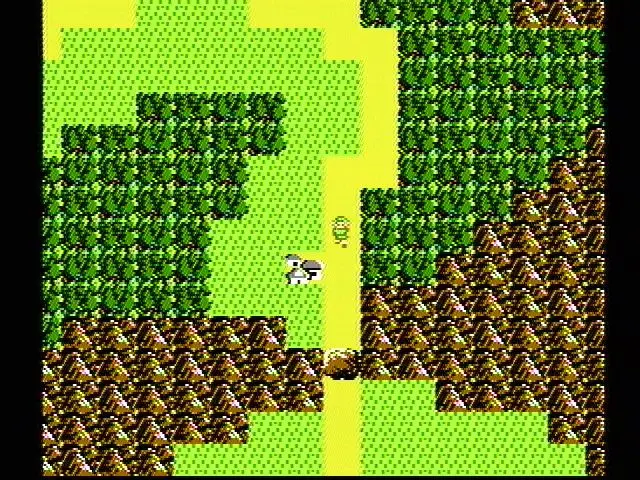
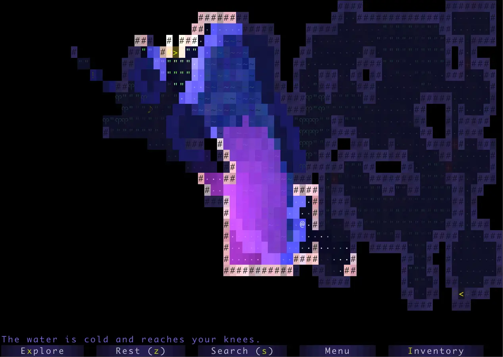

## Deadlines


{{ deadlines | markdownify }}

## Welcome

In Project 3, you will create an engine for generating explorable worlds. This is a large design project that will require you (and up to one partner) to work through every stage of development from ideation to presentation. The goal of this project is to teach you how to handle a larger piece of code with little starter code in the hopes of emulating something like a product development cycle. In accordance with this, the grading of this project will be different from other projects. Since there is no notion of "the correct answer" when it comes to world design and implementation, you will be assessed much like a performance review you might receive at an internship or job in addition to a very general autograder. While this means you will be graded slightly subjectively, we promise to be pretty nice bosses and will respect you as any boss should respect their hardworking employees. Please talk to us if you feel the grading scheme feels unfair.

Another goal of this project is to learn how to recognize and mitigate code complexity. Inevitably, whenever a team builds a large software system, they'll make some bad design decisions and they'll engage in corner cutting to get things working.

This results in what is often called "technical debt". Your code becomes complicated to understand and modify, which in the real world translates to software that becomes stale and expensive to maintain. It is *very likely* that your code will feel sort of hacked together by the end of this project. This is a good thing. As you grow as a programmer over the course of your career, arguably the main skill you'll be building is to avoid such hacks, The only way to know and defeat complexity is to suffer from it.

This project will require you a great deal of exploration and experimentation. Searching the web for answers (not solutions from past semesters) should be a regular activity throughout this process. Please know that there are no right and wrong answers, as this is a very open-ended project. However, there are some implementations and ideas that are better than others. It is ok and expected that you will go through several iterations before settling on something that you deem good. That is, this project is about software engineering.

You're not required to use any of the fancy data structures or concepts from class (A*, MSTs, Disjoint Sets, etc.), but they may come in handy. This project is about software engineering, not about data structures or algorithms. The data structures and algorithms we've learned about in class will make your code significantly simpler and more efficient, but please don't use things just because we learned about them in class. Only use these tools if you feel comfortable using them in your implementation.

[A video playlist (from Spring 2018) discussing tips for working on this project can be found at this link](https://www.youtube.com/playlist?list=PL8FaHk7qbOD6REWjsJd5jz9fpXO5_3ebY&disable_polymer=true) Note: The tour through the skeleton code is a bit out of date, for example, the `playWithKeyboard` and `playWithInputString` methods are gone. 

## Overview

Your task for the next two weeks is to design and implement a 2D tile-based world exploration engine. By "tile-based", we mean the worlds you generate will consist of a 2D grid of tiles. By "world exploration engine" we mean that your software will build a world, which the user will be able to explore by walking around and interacting with objects in that world. Your world will have an overhead perspective. As an example of a much more sophisticated system than you will build, the NES game "Zelda II" is (sometimes) a tile based world exploration engine that happens to be a video game:

The system you build can either use graphical tiles (as shown above), or it can use text based tiles, like the game shown below:

We will provide a tile renderer and a small set of starter tiles for you to use.

Your roadmap for this project:

1. First, you'll implement code to generate random worlds.
2. Then, you'll add a main menu for the user to start the game from.
3. Then, you'll add support for saving a game and loading it back.
4. Finally, you'll get a chance to add any extra fun features to your project.

This is our suggested order for working on the project, but since it's a design project with no starter code, you can work on these features in any order you'd like!

The major goal of this project is to give you a chance to attempt to manage the complexity that comes with building a large system. Be warned: The system you build probably isn't going to be that fun for users! Two weeks is simply not enough time, particularly for novice programmers. However, we do hope you will find it to be a fulfilling project, and the worlds you generate might even be beautiful.